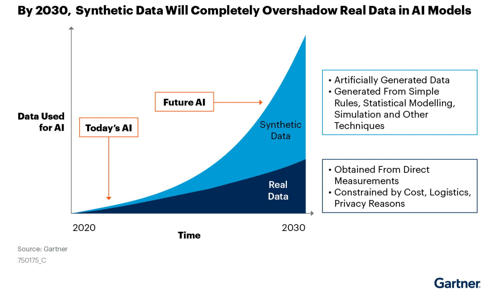

## Table of Contents

## What is synthetic data?

Synthetic data is made-up data that is created to look like real data. It is used when real data is not available or cannot be used because of privacy rules. For example, if a company wants to test a new app but doesn't want to use real customer information, they can use synthetic data instead.

This type of data is helpful in many areas, like training computer programs or testing new systems. It can be made to match the patterns and rules of real data, so it works well for these purposes. By using synthetic data, companies can keep their customers' information safe while still being able to do important work.

## Why is synthetic data used?

Synthetic data is used because it helps solve problems when real data can't be used. Sometimes, real data is hard to get or it's not allowed to be used because of privacy laws. For example, if a hospital wants to study a disease but can't share patient information, they can use synthetic data instead. This way, they can still do their research without breaking any rules.

Another reason to use synthetic data is for testing new systems or training computer programs. Real data might be too sensitive or valuable to use for these purposes. Synthetic data can be created to look just like real data, so it's perfect for testing and training. This helps companies and researchers improve their work without risking real information.

Overall, synthetic data is a smart solution. It lets people do important work while keeping real data safe and private. Whether it's for research, testing, or training, synthetic data makes it possible to move forward without worrying about privacy issues.

## How is synthetic data generated?

Synthetic data is made using computer programs that follow certain rules to create fake information. These programs use math and special methods to make the data look real. For example, if you need fake names and addresses, the program can use patterns from real names and addresses to make new ones that seem real but are actually made up.

There are different ways to make synthetic data. One way is to use a model of real data. This model learns how real data looks and then makes new data that follows the same patterns. Another way is to use rules and formulas to create data from scratch. This can be good for making data that fits specific needs, like testing a new app or training a computer program. Both ways help make data that is useful and safe to use.

## What are the main types of synthetic data?

There are two main types of synthetic data: fully synthetic data and partially synthetic data. Fully synthetic data is completely made up. It is created from scratch using computer programs that follow certain rules to make new data that looks like real data. This type of data is useful when you need a lot of data that is similar to real data but does not include any real information. For example, if you want to test a new app, you can use fully synthetic data to see how it works without using real customer information.

Partially synthetic data, on the other hand, mixes real data with made-up data. This type is used when you have some real data but need to protect sensitive information. For example, if you have a list of people with their ages and incomes, you might keep the ages real but change the incomes to fake numbers. This way, you can still use the data for research or testing, but you protect the privacy of the people in the list. Both types of synthetic data help solve problems when real data can't be used or needs to be kept private.

## What are the benefits of using synthetic data?

Using synthetic data has many benefits. One big benefit is that it helps keep real data private. When companies or researchers need data but can't use real information because of privacy laws, they can use synthetic data instead. This way, they can do their work without breaking any rules or putting people's information at risk. For example, a hospital can study a disease using fake patient data, so they don't have to share real patient information.

Another benefit is that synthetic data is great for testing and training. Real data can be hard to get or too valuable to use for these purposes. Synthetic data can be made to look just like real data, so it's perfect for testing new systems or training computer programs. This helps companies and researchers improve their work without using up their real data. By using synthetic data, they can make sure their new systems or programs work well before using them with real information.

## What are the potential drawbacks of synthetic data?

One potential drawback of synthetic data is that it might not be as accurate as real data. Even though synthetic data is made to look like real data, it can miss some important details or patterns that are in the real world. This can lead to mistakes when using the data for research or testing. For example, if a company uses synthetic data to test a new app, the app might work well with the fake data but not as well with real data because the synthetic data didn't include all the real-world situations.

Another issue is that creating good synthetic data can be hard and take a lot of time. It needs special computer programs and people who know how to use them. If the synthetic data is not made well, it might not be useful for the work it's needed for. This can slow down projects and make them more expensive. For example, if a researcher needs synthetic data for a study, they might have to spend a lot of time and money to make sure the data is good enough to use.

## How does synthetic data compare to real data?

Synthetic data is made-up data that is created to look like real data. It is used when real data can't be used because of privacy rules or when real data is hard to get. Synthetic data can be made to match the patterns and rules of real data, so it can be used for things like testing new systems or training computer programs. But, synthetic data might not be as accurate as real data because it can miss some important details or patterns that are in the real world. This means that while synthetic data can be helpful, it might not always work as well as real data for some tasks.

Creating good synthetic data can be hard and take a lot of time. It needs special computer programs and people who know how to use them. If the synthetic data is not made well, it might not be useful for the work it's needed for. This can slow down projects and make them more expensive. On the other hand, real data is information that comes from the real world, like customer information or medical records. Real data is often more accurate and detailed than synthetic data, but it can be hard to use because of privacy laws or because it's hard to get. So, while real data is better in some ways, synthetic data can be a good solution when real data can't be used.

## In what industries is synthetic data most commonly used?

Synthetic data is most commonly used in the healthcare industry. Hospitals and researchers use it to study diseases and test new treatments without using real patient information. This helps them keep patient data private while still doing important work. For example, a hospital might use synthetic data to see how a new medicine works on different groups of people without sharing any real patient details.

Another industry that uses synthetic data a lot is finance. Banks and financial companies use it to test new systems and train computer programs without using real customer data. This helps them keep their customers' information safe while still being able to improve their services. For example, a bank might use synthetic data to test a new app that helps people manage their money, making sure it works well before using it with real customers.

Synthetic data is also used in the technology industry. Tech companies use it to train [artificial intelligence](/wiki/ai-artificial-intelligence) (AI) and [machine learning](/wiki/machine-learning) models. This helps them develop new products and services without needing real data, which can be hard to get or use because of privacy rules. For example, a tech company might use synthetic data to train an AI that can understand and respond to human speech, making sure it works well before using it in real products.

## What are the ethical considerations when using synthetic data?

When using synthetic data, it's important to think about ethical issues. One big issue is making sure the synthetic data does not harm or unfairly treat any groups of people. Even though the data is made up, it can still be based on real data that might have biases. If these biases are not fixed, the synthetic data could make these problems worse. For example, if a company uses synthetic data to train a computer program, they need to check that the data does not unfairly treat certain groups of people, like people of different races or genders.

Another ethical issue is being open about using synthetic data. People who use the data, like researchers or companies, should tell others that they are using made-up data. This helps keep things honest and clear. If people know that synthetic data is being used, they can understand the results better and trust the work more. For example, if a hospital uses synthetic data for a study, they should say so in their report, so everyone knows the data is not real.

## How can synthetic data be used to improve machine learning models?

Synthetic data can help make machine learning models better by giving them more data to learn from. Sometimes, real data is hard to get or not allowed to be used because of privacy rules. Synthetic data can be made to look just like real data, so it can be used to train machine learning models without using up real data. This means the models can learn from a lot more examples, which can make them work better. For example, if a company wants to train a model to understand pictures, they can use synthetic data to make more pictures for the model to learn from, so it can get better at understanding real pictures.

Another way synthetic data helps is by making sure the machine learning models are fair and work well for everyone. Real data can sometimes have biases, like treating certain groups of people unfairly. Synthetic data can be made to fix these biases, so the models learn in a fair way. This can make the models more accurate and fair when they are used in the real world. For example, if a company is training a model to predict if someone will like a product, they can use synthetic data to make sure the model does not treat people unfairly based on things like their age or where they live.

## What are the latest advancements in synthetic data generation techniques?

The latest advancements in synthetic data generation include better ways to make data that looks more like real data. One big advancement is using something called Generative Adversarial Networks, or GANs. GANs use two computer programs that work together to make better synthetic data. One program makes the data, and the other program checks it to see if it looks real. They keep working together until the data is very hard to tell apart from real data. This helps make synthetic data that is more useful for things like training machine learning models or testing new systems.

Another advancement is using something called Differential Privacy. This is a way to make synthetic data that keeps real data private. It adds a little bit of randomness to the data, so it's hard to figure out the real information from the fake data. This is really helpful for industries like healthcare and finance, where keeping data private is very important. By using Differential Privacy, companies can make synthetic data that is safe to use and still good enough for their work.

## How can the quality of synthetic data be evaluated and ensured?

The quality of synthetic data can be checked by seeing how well it matches real data. One way to do this is by using something called statistical tests. These tests look at things like the average values, how spread out the data is, and other patterns to see if the synthetic data looks like the real data. If the synthetic data passes these tests, it means it is good enough to use for things like training computer programs or testing new systems. Another way to check the quality is by using the synthetic data in a real-world situation and seeing if it works well. For example, if a company uses synthetic data to test a new app, they can see if the app works as expected when they use real data later.

Making sure the synthetic data is good also means fixing any problems it might have. Sometimes, synthetic data can have mistakes or not include all the important details from real data. To fix this, people who make synthetic data can use special computer programs to check and improve the data. They can also ask experts to look at the data and make sure it is right. By doing these things, they can make the synthetic data better and more useful. This helps make sure that when the synthetic data is used, it will work well and give good results.

## References & Further Reading

[1]: ["Advances in Financial Machine Learning"](https://www.amazon.com/Advances-Financial-Machine-Learning-Marcos/dp/1119482089) by Marcos Lopez de Prado

[2]: ["Machine Learning for Algorithmic Trading"](https://github.com/stefan-jansen/machine-learning-for-trading) by Stefan Jansen

[3]: ["Quantitative Trading: How to Build Your Own Algorithmic Trading Business"](https://books.google.com/books/about/Quantitative_Trading.html?id=j70yEAAAQBAJ) by Ernest P. Chan

[4]: Li, S., Tao, C., Fan, Y., & Zhang, L. (2020). ["Data Augmentation for Deep Learning Models: Challenges and Opportunities."](https://onlinelibrary.wiley.com/doi/10.1002/adfm.202003619)

[5]: Goodfellow, I., Pouget-Abadie, J., Mirza, M., Xu, B., Warde-Farley, D., Ozair, S., ... & Bengio, Y. (2014). ["Generative Adversarial Nets."](https://arxiv.org/abs/1406.2661) Advances in Neural Information Processing Systems 27.

[6]: Yoon, J., Jarrett, D., & van der Schaar, M. (2019). ["Time-series Generative Adversarial Networks."](https://dl.acm.org/doi/abs/10.5555/3454287.3454781) Advances in Neural Information Processing Systems 32.