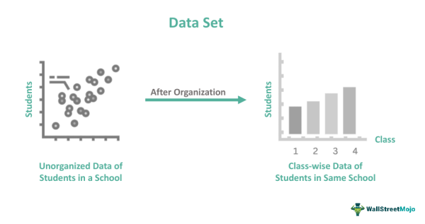

Synthetic data refers to artificially generated information that mimics the statistical properties of real-world data. In algorithmic trading, synthetic data holds significant importance as it enables the development and refinement of trading models without the constraints of accessing comprehensive real market data. The utilization of synthetic data allows traders and researchers to simulate a wide range of market conditions, which is crucial for creating robust trading algorithms that perform well under various scenarios.

One of the primary advantages of synthetic data in algorithmic trading is its ability to facilitate the development of effective trading models. By providing diverse and extensive datasets, synthetic data enhances model training processes, allowing for the exploration of trading strategies that might not be feasible using limited real data. These datasets can exhibit a broader range of market behaviors, offering insights into potential trading opportunities and risks.

The necessity for synthetic data in testing and enhancing trading strategies cannot be overstated. Algorithmic trading strategies require rigorous testing to ensure their effectiveness and reliability. Synthetic data provides a controlled environment where strategies can be evaluated under simulated market conditions, including scenarios of extreme volatility or atypical market movements. This is especially beneficial for stress testing algorithms, as it enables the assessment of strategies' resiliency without the financial risks associated with real trading losses.

Challenges in obtaining real market data are numerous, including issues related to data availability, cost, and privacy concerns. Market data is often proprietary and may be subject to restrictive licensing agreements, making it difficult for traders to access comprehensive datasets. Furthermore, historical data might not encompass rare market events, limiting the scope of backtesting. Synthetic data offers a viable solution by circumventing these challenges, providing unrestricted access to extensive and customizable datasets while respecting confidentiality and privacy concerns.

In summary, synthetic data serves as a powerful tool in algorithmic trading by enabling the development and testing of models with greater flexibility and creativity. It addresses the challenges associated with sourcing real market data, ensuring that trading strategies can be evaluated and optimized to achieve superior performance in diverse market conditions.

## Table of Contents

## Understanding Synthetic Data

Synthetic data refers to data that is artificially generated rather than being directly obtained from real-world events. In the context of [algorithmic trading](/wiki/algorithmic-trading), synthetic data is created through various techniques, which can include simulations, mathematical models, and [machine learning](/wiki/machine-learning) algorithms. This form of data generation helps overcome the limitations posed by access restrictions, data privacy issues, and the high costs associated with procuring real market data.

Creating synthetic data involves several methodologies. For financial markets, one common approach is the use of generative models, such as Monte Carlo simulations or Generative Adversarial Networks (GANs). These models simulate various market conditions, asset price movements, and trading volumes by relying on underlying statistical properties observed in real data. The objective is to produce datasets that mimic the characteristics and behavior of real market data without requiring direct extraction from existing databases.

A key comparison between synthetic and real data in algorithmic trading lies in their application and reliability. While real data provides a historical and factual basis for developing and testing trading algorithms, it often falls short when it comes to covering rare or extreme market events due to its limited historical scope. On the other hand, synthetic data can be used to simulate a wide range of hypothetical scenarios, offering a broader spectrum of conditions under which algorithms can be tested and optimized. However, the fidelity of synthetic data is contingent upon the quality of the generative model used; inaccuracies in the model can lead to synthetic data that does not adequately reflect real market dynamics.

The role of machine learning in generating synthetic data is significant. Machine learning techniques, particularly [deep learning](/wiki/deep-learning) models, are employed to capture complex patterns and dependencies in financial data to create more realistic synthetic datasets. For instance, GANs consist of two neural networks—a generator and a discriminator—that work adversarially to produce data that closely mimics real market data. The generator creates synthetic instances, while the discriminator evaluates them against real data. This iterative process continues until the generator produces data that the discriminator cannot distinguish from real data, thus achieving a form of realism in synthetic data creation.

The benefits of using synthetic data in financial markets are manifold. It provides a controlled environment to test trading strategies across diverse market scenarios, enhancing the development and refinement of algorithmic models. Synthetic data facilitates [backtesting](/wiki/backtesting) by allowing traders to evaluate algorithmic strategies without the risk of financial loss or market impact. Furthermore, it is instrumental in stress testing, helping identify potential weaknesses in trading models by simulating extreme market conditions.

In summary, synthetic data serves as a vital tool for algorithmic traders, providing a viable alternative to real data by offering flexibility, scalability, and the ability to simulate a wide array of market scenarios. It empowers the development of robust trading algorithms capable of adapting to diverse and unforeseen market conditions.

## Applications of Synthetic Data in Algorithmic Trading

Synthetic data is transforming the landscape of algorithmic trading by offering novel applications that enhance various facets of model development and testing. One of the primary advantages it provides is in augmenting backtesting processes. By generating representative data sets, traders can simulate historical market conditions to evaluate the performance of trading strategies. These datasets are essential for validating the effectiveness of models without relying solely on the limited historical data available, thus creating robust frameworks for outcome prediction and strategy optimization ([Li et al., 2020](https://arxiv.org/abs/2003.12126)).

Another crucial application of synthetic data is in stress testing trading algorithms under diverse market scenarios. Traditional data might not cover every possible market condition, particularly in periods of extreme [volatility](/wiki/volatility-trading-strategies) or rare events. Synthetic scenarios can replicate these rare occurrences, allowing traders to assess the resilience and adaptability of their models when faced with unconventional market movements. Such testing is integral to understanding potential weaknesses and enhancing the risk management aspects of trading strategies.

Moreover, synthetic data facilitates the training of models with diversified datasets, which is a key component in developing algorithms capable of making informed trading decisions. Diversification in data inputs ensures that models are exposed to a broad array of market conditions and nuances, leading to improved generalization capabilities. This exposure is particularly important in machine learning applications within trading, where model efficacy can be significantly boosted by training on heterogeneous datasets.

The role of synthetic data in improving model robustness and reliability cannot be overstated. As trading models and strategies evolve, the ability to test them against virtually endless permutations of market conditions provides a significant advantage. Synthetic datasets contribute to minimizing overfitting and enhancing the models’ predictive power in real-world trading environments. They help create an iterative loop of strategy refinement and testing, ultimately leading to more stable and reliable trading systems.

Through these applications, synthetic data underscores its significance in the progression of algorithmic trading. By improving testing frameworks, offering diverse training datasets, and enhancing algorithmic resilience, it paves the way for developing innovative strategies that can thrive in complex and dynamic financial markets.

## Challenges and Considerations

Potential inaccuracies in synthetic data can significantly impact the performance of algorithmic trading models. Synthetic data might not perfectly capture the nuances of the real markets due to limitations in the models used for its generation. As a result, trading algorithms trained solely on synthetic data could face challenges when applied to live market conditions, leading to potential discrepancies in predictions and decisions. Ensuring the synthetic data closely represents real-world scenarios involves utilizing advanced generative models and thorough validation processes. However, even the most sophisticated models may overlook rare market events, thereby introducing bias and variance that can affect model robustness.

Balancing synthetic and real data is essential to optimize model training. Combining both data types leverages synthetic data for large-scale experimentation while using real data to ground models in actuality. This hybrid approach can be managed by weighting synthetic and real data differently during training, where real data serves as a corrective measure alongside comprehensive synthetic datasets. A balanced dataset helps in improving generalization and preventing overfitting to the artificial scenarios defined by synthetic data. Researchers often employ techniques like transfer learning, where models pre-trained on synthetic data are fine-tuned with real data to enhance accuracy.

Ethical and regulatory considerations are paramount when using synthetic financial data. The authenticity and security of synthetic datasets must be guaranteed to avoid creating misleading insights. Financial regulations, such as GDPR in Europe and CCPA in California, mandate strict controls on data privacy. While synthetic data circumvents some privacy issues inherent in real datasets, it must be generated in ways that do not reverse-engineer sensitive information inadvertently. Moreover, ethical concerns regarding the misuse of synthetic data, its transparency, and accountability in trading strategies are ongoing discussions in financial circles.

Methodologies for validating synthetic data quality are critical to ensure its effectiveness and relevance. Quantitative metrics such as statistical similarity measures, including mean, variance, and higher-order moments, help compare synthetic data to real-world benchmarks. Machine learning techniques like adversarial training with Generative Adversarial Networks (GANs) further refine data quality by iteratively improving the generation process. Additionally, scenario-based validation, where synthetic data is used to backtest trading strategies across different market conditions, can assess whether the synthesized data provides meaningful insights. The effective validation of synthetic data reinforces its value in algorithm development, fostering improvements in predictive accuracy and trading model reliability.

## Case Studies and Real-world Applications

Several organizations have successfully incorporated synthetic data into their trading processes, illustrating the transformative potential of these datasets. For instance, JPMorgan Chase has been known to utilize synthetic data to enhance their backtesting procedures. By generating varied market conditions through synthetic data, they can simulate trades and assess the impact of different strategies without the risks associated with real market data exposure.

In another case, AI-driven hedge funds, such as Man Group, employ synthetic data to enrich their modeling frameworks. By integrating synthetic datasets into their machine learning models, they are able to diversify input conditions, leading to more robust trading strategies that can adapt to unforeseen market dynamics. Synthetic data assists in overcoming the limitations associated with limited historical data, affording these models the capacity to extrapolate future market trends and behaviors.

Research studies also support the utility of synthetic data in financial modeling. A prominent study conducted by the Massachusetts Institute of Technology (MIT) demonstrated how synthetic data could replicate the statistical properties of actual market data while introducing novel scenarios that traditional datasets might never include. This capability not only enhances risk assessment models but also provides comprehensive insights into market behaviors under extreme or unexpected conditions. As evidenced in these studies, the mathematical modeling of synthetic data offers improved generalizability and predictive power across various financial forecasting contexts.

Regarding specific algorithmic strategies, synthetic data has proven useful in stress testing trading algorithms against rare market events, such as flash crashes or rapid market recoveries. By employing synthetic scenarios, developers can test their algorithms under conditions that are scarcely found in historical datasets. This not only improves the algorithm's resilience but also prepares traders for potential real-world crises.

Moreover, synthetic data plays a crucial role in improving algorithmic strategies based on [reinforcement learning](/wiki/reinforcement-learning). By simulating various market conditions, reinforcement learning models can be trained more effectively, allowing these algorithms to optimize their decision-making processes by learning from a broader set of trading environments. This iterative learning process can lead to significantly improved strategies that are able to exploit market inefficiencies more accurately.

In conclusion, the application of synthetic data in algorithmic trading presents a multifaceted approach to improving model performance and decision-making reliability. By facilitating enhanced backtesting, diversified training, and robust stress testing, synthetic data serves as an invaluable tool in the continuous evolution of trading models and strategies.

## Conclusion

Synthetic data in algorithmic trading presents considerable advantages that are progressively shaping the landscape of financial modeling. Primarily, synthetic data allows traders and researchers to bypass the limitations and costs associated with acquiring real market data. With privacy concerns and vendor expenses continuously rising, synthetic data provides an accessible and efficient alternative. By simulating a wide range of market conditions, this data enables thorough testing and optimization of trading algorithms, thereby enhancing the precision and effectiveness of trading models.

Moreover, synthetic data facilitates an expansive approach to model training and validation. The use of diversified synthetic datasets contributes to the robustness and reliability of trading algorithms, preparing them for scenarios that might not have been present or frequent in historical data. This capability is critical in mitigating risks and improving decision-making processes in financial trading.

Looking forward, the advent of sophisticated technologies and advanced machine learning algorithms is poised to further amplify the utility of synthetic data in financial markets. Integrating techniques such as Generative Adversarial Networks (GANs) and reinforcement learning will likely produce increasingly realistic and complex datasets, enabling the development of models that are not only more accurate but also adaptive to unforeseen market shifts.

Encouraging innovation and ongoing experimentation with synthetic data is vital for the progression of algorithmic trading. As more financial institutions adopt these methods, a collective understanding and refinement of synthetic data utilization will emerge, leading to enhanced model precision and the establishment of best practices. This dynamic field offers ample opportunities for creative solutions and breakthroughs that can fundamentally alter the trajectory of financial trading. Thus, leveraging synthetic data is not merely a temporary solution; it is an enduring advancement poised to redefine the future of algorithmic trading.

## References & Further Reading

[1]: ["Advances in Financial Machine Learning"](https://www.amazon.com/Advances-Financial-Machine-Learning-Marcos/dp/1119482089) by Marcos Lopez de Prado

[2]: ["Machine Learning for Algorithmic Trading"](https://github.com/stefan-jansen/machine-learning-for-trading) by Stefan Jansen

[3]: ["Quantitative Trading: How to Build Your Own Algorithmic Trading Business"](https://books.google.com/books/about/Quantitative_Trading.html?id=j70yEAAAQBAJ) by Ernest P. Chan

[4]: Li, S., Tao, C., Fan, Y., & Zhang, L. (2020). ["Data Augmentation for Deep Learning Models: Challenges and Opportunities."](https://onlinelibrary.wiley.com/doi/10.1002/adfm.202003619)

[5]: Goodfellow, I., Pouget-Abadie, J., Mirza, M., Xu, B., Warde-Farley, D., Ozair, S., ... & Bengio, Y. (2014). ["Generative Adversarial Nets."](https://arxiv.org/abs/1406.2661) Advances in Neural Information Processing Systems 27.

[6]: Yoon, J., Jarrett, D., & van der Schaar, M. (2019). ["Time-series Generative Adversarial Networks."](https://dl.acm.org/doi/abs/10.5555/3454287.3454781) Advances in Neural Information Processing Systems 32.