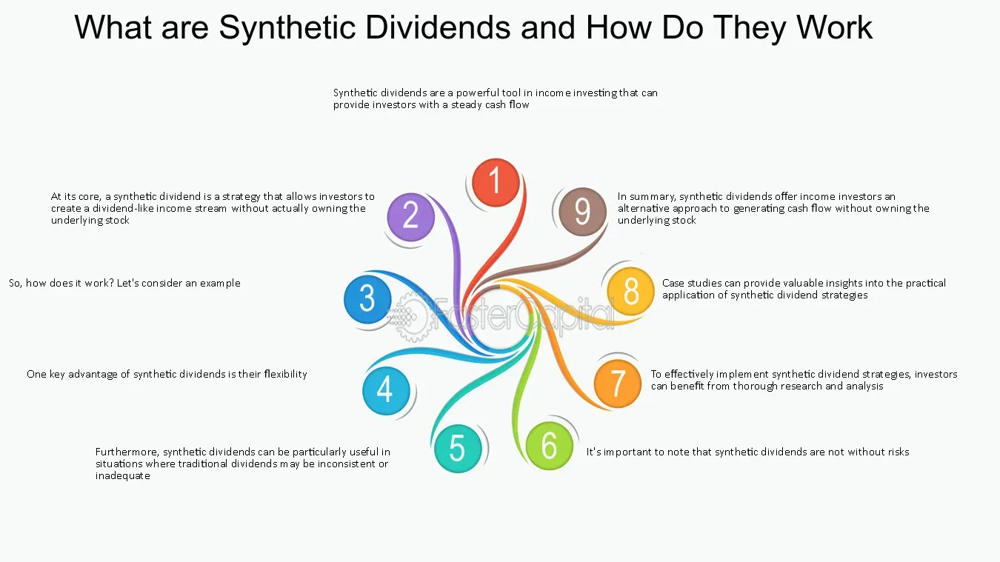

## Table of Contents

## What are synthetic dividends?

Synthetic dividends are a way for investors to get payments that act like regular dividends, but they come from financial tools other than stocks. These tools can be options, futures, or other derivatives. When an investor uses these tools to create a dividend-like payment, it's called a synthetic dividend. This can be useful for people who want to earn money regularly from their investments but don't want to own the actual stocks.

The main reason people use synthetic dividends is to get around some rules or taxes that apply to regular dividends. For example, in some countries, dividends from stocks are taxed more than other types of income. By using synthetic dividends, investors can sometimes pay less tax. However, creating synthetic dividends can be complicated and risky, so it's usually something that more experienced investors do. It's important for anyone thinking about using synthetic dividends to understand the risks and possibly talk to a financial advisor.

## How do synthetic dividends differ from regular dividends?

Synthetic dividends and regular dividends are different in how they are made and where they come from. Regular dividends are payments that companies give to their shareholders from the company's profits. If you own a stock, you might get a dividend every few months if the company decides to share its earnings with shareholders. On the other hand, synthetic dividends are not paid by companies. Instead, they are created by investors using financial tools like options or futures. These tools let investors make their own payments that look and feel like dividends, but they don't come directly from a company's profits.

The main reason people use synthetic dividends is to get around some rules or taxes that apply to regular dividends. In some places, the tax on regular dividends can be higher than on other types of income. By using synthetic dividends, investors might be able to pay less tax. However, making synthetic dividends can be tricky and risky. It's usually something that more experienced investors do because it involves understanding complex financial products. If you're thinking about using synthetic dividends, it's a good idea to talk to a financial advisor to understand the risks and make sure it's the right choice for you.

## What is the basic mechanism behind synthetic dividends?

Synthetic dividends are made by investors using financial tools like options and futures. These tools let investors create payments that work like regular dividends but don't come from a company's profits. For example, an investor might buy a stock and also sell a call option on that stock. If the stock's price doesn't go up too much, the investor keeps the money from selling the option, which acts like a dividend.

The main reason people use synthetic dividends is to avoid some taxes or rules that apply to regular dividends. In some places, the tax on regular dividends can be higher than on other types of income. By using synthetic dividends, investors might pay less tax. However, creating synthetic dividends can be complicated and risky. It's usually something that more experienced investors do because it involves understanding complex financial products. If you're thinking about using synthetic dividends, it's a good idea to talk to a financial advisor to understand the risks and make sure it's the right choice for you.

## Who typically uses synthetic dividends and why?

Synthetic dividends are mostly used by experienced investors and big financial firms. These investors know a lot about how the stock market works and understand complex financial tools. They use synthetic dividends to make money in a different way than just buying stocks and waiting for regular dividends. By creating their own dividend-like payments, they can sometimes avoid some taxes or rules that come with regular dividends.

The main reason these investors use synthetic dividends is to save money on taxes. In some places, the tax on regular dividends can be higher than on other types of income. By using synthetic dividends, investors might pay less tax. However, making synthetic dividends can be tricky and risky. It's not something that beginners should try without understanding the risks and possibly talking to a financial advisor first.

## What are the advantages of synthetic dividends for investors?

Synthetic dividends can help investors save money on taxes. In some places, the tax on regular dividends is higher than on other types of income. By using synthetic dividends, investors might pay less tax. This can be a big advantage for people who want to keep more of their investment earnings. Also, synthetic dividends give investors more control over when and how they get their money. Instead of waiting for a company to pay out dividends, investors can create their own payments whenever they want.

Another advantage is that synthetic dividends can be used to make money in different ways. Experienced investors can use options and futures to create payments that act like dividends, but without owning the actual stocks. This can be useful for investors who want to earn money regularly but don't want to hold onto stocks all the time. However, using synthetic dividends can be risky and complicated, so it's usually something that more experienced investors do.

## What are the potential risks or disadvantages of synthetic dividends?

Using synthetic dividends can be risky because they involve complex financial tools like options and futures. These tools can be hard to understand and use correctly. If something goes wrong, investors might lose money instead of making it. For example, if the stock price moves in an unexpected way, the investor might not get the payment they were expecting. This can be especially dangerous for people who don't have a lot of experience with these kinds of investments.

Another disadvantage is that creating synthetic dividends takes a lot of time and effort. Investors need to keep a close eye on the market and make sure they're using the right tools at the right time. This can be stressful and might not be worth it for everyone. Also, while synthetic dividends can sometimes help with taxes, the rules can change. If the tax laws change, what was once a good way to save money might not work anymore. So, it's important for investors to stay informed and be ready to change their plans if needed.

## How are synthetic dividends taxed compared to regular dividends?

Synthetic dividends can sometimes help investors pay less tax than they would with regular dividends. In some places, the tax on regular dividends is higher than on other types of income. When investors use options and futures to create synthetic dividends, the money they get might be taxed as capital gains instead of dividends. Capital gains tax rates can be lower than dividend tax rates, so this can save investors money.

However, the tax rules for synthetic dividends can be tricky and might change. What works to save on taxes one year might not work the next if the laws change. Investors need to stay up to date with the tax laws in their country to make sure they're following the rules and getting the best tax treatment. Talking to a tax advisor can help make sure everything is done right.

## Can synthetic dividends be created for any stock, or are there limitations?

Synthetic dividends can be created for many stocks, but there are some limitations. The main thing is that the stock needs to have options or futures available. These are special contracts that let investors make deals about buying or selling the stock in the future. If a stock doesn't have these options or futures, it's hard to create synthetic dividends for it. Also, the stock should be popular enough so that there are enough people trading it. If not many people are trading the stock, it might be too hard to use the options and futures to make synthetic dividends.

Another thing to think about is the rules from the stock exchange or the government. Some places might have special rules about using options and futures to create synthetic dividends. These rules can limit what investors can do. For example, some countries might not let investors use synthetic dividends to avoid taxes. So, investors need to know the rules where they live and make sure they're following them. If they don't, they could get in trouble or lose money.

## What role do derivatives play in the creation of synthetic dividends?

Derivatives, like options and futures, are really important for making synthetic dividends. They are special contracts that let investors make deals about buying or selling a stock at a certain price in the future. For example, an investor might buy a stock and then sell a call option on that stock. If the stock's price doesn't go up too much, the investor keeps the money from selling the option, which acts like a dividend. This way, the investor can make their own payments that look like dividends but don't come from the company's profits.

However, using derivatives to create synthetic dividends can be tricky and risky. These financial tools are complex and need a lot of understanding to use right. If the stock price moves in an unexpected way, the investor might not get the payment they were hoping for. Also, the rules about using derivatives can change, and investors need to make sure they're following the law. That's why synthetic dividends are usually something that more experienced investors do, and it's a good idea to talk to a financial advisor before trying it.

## How do regulatory environments affect the use of synthetic dividends?

The rules and laws in different places can make a big difference in how investors use synthetic dividends. Some countries have strict rules about using options and futures to create these payments. For example, if a government wants to stop people from avoiding taxes, they might make it harder to use synthetic dividends. This means investors need to know the rules where they live and follow them carefully. If they don't, they could get in trouble or lose money.

Changes in the law can also affect how useful synthetic dividends are. If a country changes its tax rules, what was once a good way to save money might not work anymore. Investors need to stay up to date with these changes and be ready to change their plans if needed. Talking to a tax advisor can help make sure everything is done right and that investors are getting the best tax treatment possible.

## What are some real-world examples of synthetic dividends being used effectively?

One real-world example of synthetic dividends being used effectively is by hedge funds. These big investment groups often use options and futures to create their own payments that act like dividends. For example, a hedge fund might buy a stock and then sell call options on that stock. If the stock price stays the same or goes down a little, the hedge fund keeps the money from selling the options, which works like a dividend. This way, they can get regular payments without having to wait for the company to pay out dividends.

Another example is when individual investors use synthetic dividends to save on taxes. In some places, the tax on regular dividends is higher than on other types of income. So, smart investors might use options to create their own payments and pay less tax. For instance, an investor might buy a stock and sell a covered call option. If the stock price doesn't go up too much, the money from the option sale can be taxed at a lower rate than regular dividends. This can help the investor keep more of their earnings.

## What advanced strategies can be employed with synthetic dividends for portfolio management?

Advanced investors can use synthetic dividends to make their investment portfolios better and more flexible. One way to do this is by using options to create regular income without selling their stocks. For example, an investor might own a stock and sell call options on it. If the stock price stays the same or goes down a little, the investor keeps the money from selling the options, which works like a dividend. This can help the investor get a steady income while still holding onto their stocks. It's like getting paid without having to wait for the company to give out dividends.

Another strategy is to use synthetic dividends to manage risk in a portfolio. By selling options, investors can make money that helps cover any losses they might have if the stock price goes down. This can make their investments safer. For example, if an investor is worried about a stock going down, they can sell put options. If the stock price stays above a certain level, the investor keeps the money from selling the options. This extra money can help cushion any drops in the stock's value. Using synthetic dividends this way can help investors keep their portfolios balanced and protect their money.

## What are the key aspects of understanding investment strategies?

Investment strategies are foundational to the pursuit of financial goals, providing a structured approach to optimizing returns while managing potential risks. At their core, these strategies are designed to align with an investor's objectives, which can range from wealth accumulation and income generation to capital preservation and speculation.

Traditional investment strategies often involve straightforward principles such as the buy-and-hold approach. This strategy centers on purchasing securities with the intention of holding them for an extended period, irrespective of market fluctuations. The fundamental belief here is that, despite short-term volatility, financial markets tend to rise over the long term, thus delivering substantial returns. Historical examples, such as long-term investments in blue-chip stocks, underline the efficacy of this approach.

Emerging alongside these traditional methods are advanced investment strategies, which employ sophisticated financial mechanisms to navigate complex market environments. Synthetic dividends and [algorithmic trading](/wiki/algorithmic-trading) exemplify such modern approaches. Synthetic dividends involve creating income from non-dividend-paying stocks through financial instruments like covered call options. This method allows investors to potentially replicate the dividend experience from stocks that do not traditionally offer them.

Algorithmic trading, a testament to the fusion of finance and technology, utilizes computer algorithms to execute trades based on predefined criteria. The precision and speed offered by technology can enable investors to capitalize on fleeting market opportunities and reduce the impact of human error.

The common denominator of successful investment strategies is their capacity to balance risk and reward. This balancing act is crucial for ensuring long-term wealth accumulation, as it helps mitigate the impact of potential losses while capturing gains. Investors often rely on diversification, a principle where investments are spread across different asset classes, industries, or geographical regions, to manage and distribute risk. 

In mathematics, this can be expressed through the optimization of a portfolio's expected return against its [volatility](/wiki/volatility-trading-strategies), which is often represented by the Sharpe ratio:

$$
\text{Sharpe Ratio} = \frac{E[R_p] - R_f}{\sigma_p}
$$

where $E[R_p]$ is the expected return of the portfolio, $R_f$ is the risk-free rate, and $\sigma_p$ is the standard deviation of the portfolio's excess return. Maximizing this ratio can guide investors in fine-tuning their strategies to achieve the best possible risk-adjusted returns.

Understanding and implementing these investment strategies fosters a disciplined approach to market participation, equipping investors with the tools needed to pursue their financial aspirations effectively.

## References & Further Reading

[1]: ["Advances in Financial Machine Learning"](https://www.amazon.com/Advances-Financial-Machine-Learning-Marcos/dp/1119482089) by Marcos Lopez de Prado

[2]: ["Evidence-Based Technical Analysis: Applying the Scientific Method and Statistical Inference to Trading Signals"](https://www.amazon.com/Evidence-Based-Technical-Analysis-Scientific-Statistical/dp/0470008741) by David Aronson

[3]: ["Machine Learning for Algorithmic Trading, 2nd Edition"](https://www.amazon.com/Machine-Learning-Algorithmic-Trading-alternative/dp/1839217715) by Stefan Jansen

[4]: ["Quantitative Trading: How to Build Your Own Algorithmic Trading Business"](https://www.amazon.com/Quantitative-Trading-Build-Algorithmic-Business/dp/1119800064) by Ernest P. Chan

[5]: Bergstra, J., Bardenet, R., Bengio, Y., & Kégl, B. (2011). ["Algorithms for Hyper-Parameter Optimization."](https://dl.acm.org/doi/10.5555/2986459.2986743) Advances in Neural Information Processing Systems 24.