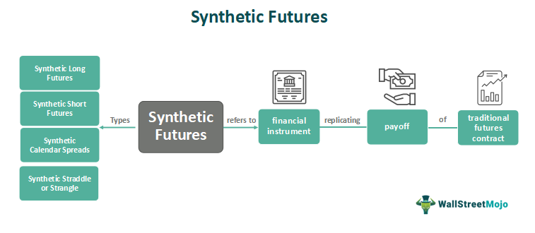

In today's dynamic financial markets, investors are continually seeking innovative strategies to enhance their portfolio returns. With the rapid evolution of technology and the increasing complexity of financial instruments, traditional investment approaches often fall short of meeting modern demands. This article focuses on exploring cutting-edge investment strategies, particularly through the use of sophisticated financial mechanisms such as synthetic dividends and algorithmic trading.

Synthetic dividends offer investors an alternative method of generating income from non-dividend-paying stocks. This mechanism utilizes financial instruments to replicate the income flow achieved through standard dividends, providing investors with a means to optimize their income without depending on a company's traditional dividend policy. For instance, covered call options can be used to create a regular income stream akin to dividends, thereby enhancing portfolio performance.



Algorithmic trading represents another advanced strategy that significantly enhances trading efficiency and reduces human error by employing computer programs to execute trades based on predefined criteria. This method allows investors to swiftly capitalize on market opportunities, thus optimizing overall investment strategies. Algorithmic trading can also be customized to adapt to market fluctuations, ensuring that buy and sell decisions are made based on real-time data analysis and not emotional impulse.

As financial markets become increasingly volatile and unpredictable, understanding these sophisticated strategies becomes crucial for investors aiming to navigate and thrive amidst market fluctuations. By harnessing the potential of synthetic dividends and algorithmic trading, investors are empowered to make informed decisions, thus optimizing their income generation and ensuring long-term financial success in their investment endeavors. This article provides an insightful examination of these strategies, contributing to a more comprehensive understanding of the intricate world of contemporary investment mechanisms.

## Table of Contents

## Understanding Investment Strategies

Investment strategies are foundational to the pursuit of financial goals, providing a structured approach to optimizing returns while managing potential risks. At their core, these strategies are designed to align with an investor's objectives, which can range from wealth accumulation and income generation to capital preservation and speculation.

Traditional investment strategies often involve straightforward principles such as the buy-and-hold approach. This strategy centers on purchasing securities with the intention of holding them for an extended period, irrespective of market fluctuations. The fundamental belief here is that, despite short-term volatility, financial markets tend to rise over the long term, thus delivering substantial returns. Historical examples, such as long-term investments in blue-chip stocks, underline the efficacy of this approach.

Emerging alongside these traditional methods are advanced investment strategies, which employ sophisticated financial mechanisms to navigate complex market environments. Synthetic dividends and [algorithmic trading](/wiki/algorithmic-trading) exemplify such modern approaches. Synthetic dividends involve creating income from non-dividend-paying stocks through financial instruments like covered call options. This method allows investors to potentially replicate the dividend experience from stocks that do not traditionally offer them.

Algorithmic trading, a testament to the fusion of finance and technology, utilizes computer algorithms to execute trades based on predefined criteria. The precision and speed offered by technology can enable investors to capitalize on fleeting market opportunities and reduce the impact of human error.

The common denominator of successful investment strategies is their capacity to balance risk and reward. This balancing act is crucial for ensuring long-term wealth accumulation, as it helps mitigate the impact of potential losses while capturing gains. Investors often rely on diversification, a principle where investments are spread across different asset classes, industries, or geographical regions, to manage and distribute risk. 

In mathematics, this can be expressed through the optimization of a portfolio's expected return against its [volatility](/wiki/volatility-trading-strategies), which is often represented by the Sharpe ratio:

$$
\text{Sharpe Ratio} = \frac{E[R_p] - R_f}{\sigma_p}
$$

where $E[R_p]$ is the expected return of the portfolio, $R_f$ is the risk-free rate, and $\sigma_p$ is the standard deviation of the portfolio's excess return. Maximizing this ratio can guide investors in fine-tuning their strategies to achieve the best possible risk-adjusted returns.

Understanding and implementing these investment strategies fosters a disciplined approach to market participation, equipping investors with the tools needed to pursue their financial aspirations effectively.

## Financial Mechanisms: The Role of Synthetic Dividends

Synthetic dividends provide investors with a means to derive income from non-dividend-paying stocks, enhancing portfolio flexibility and cash flow. They are primarily created using financial derivatives such as covered call options, which simulate the cash payout feature of traditional dividends. By strategically selling call options on stocks, investors can collect premiums that mimic the income derived from dividend-paying stocks.

### Implementation of Synthetic Dividends

The most common approach to generating synthetic dividends is through a strategy known as the covered call. In this technique, an investor holds a long position in a stock and sells call options on that same stock. The premium received from the option sale acts as a substitute for dividends. Here's how it works:

1. **Holding the Underlying Stock:** The investor must own the stock on which they wish to write call options. This ownership is a prerequisite to avoid the substantial risks associated with writing naked options.

2. **Selling Call Options:** The investor sells call options with a strike price typically above the current market price. This strike price selection is crucial because it determines the income potential and the risk of the stock being called away.

3. **Collecting Premiums:** The option holder pays a premium to the investor, providing an immediate cash inflow. These premiums serve as the synthetic dividend, offering a steady stream of income akin to traditional dividends.

### Benefits of Synthetic Dividends

The primary advantage of synthetic dividends is the potential for enhanced income. By writing call options, investors gain greater control over their cash flow from stocks that do not naturally provide dividends. This strategy can be particularly useful in low-interest-rate environments where traditional dividend yields are unsatisfactory.

Furthermore, synthetic dividends can serve as a tool to mitigate downside risk. The premium collected provides a buffer against potential declines in the stock price. For instance, if the underlying stock decreases in value, the option premium can offset some of the losses.

### Risks Associated with Synthetic Dividends

While synthetic dividend strategies offer appealing income-generating opportunities, they come with inherent risks. One significant risk is the possibility of the stock being called away. If the stock price surpasses the option's strike price, the option holder may exercise the option, requiring the investor to sell their stock at the strike price, potentially missing out on further capital gains.

Another risk is volatility. In volatile markets, option premiums might not fully offset stock price fluctuations, leading to potential losses. Investors need to consider the volatility of the stock and the broader market environment when implementing this strategy.

### Effective Implementation

For effective implementation of synthetic dividends, investors should adhere to disciplined risk management practices. This includes:

- **Selecting Appropriate Strike Prices:** Choosing a strike price that balances income generation and potential for stock retention.
- **Diversifying Across Stocks:** Avoid concentrating synthetic dividends on a single stock, which can raise exposure to idiosyncratic risk.
- **Continuous Monitoring:** Regularly review and adjust the positions based on market developments and portfolio objectives.

Synthetic dividends, when used judiciously, can significantly enhance an investor's ability to generate income from non-dividend stocks. Proper implementation and risk management are essential to monetize these strategies effectively and mitigate their inherent risks.

## Algorithmic Trading: Enhancing Investment Efficiency

Algorithmic trading has revolutionized the financial markets by employing computer programs to execute trades based on pre-defined criteria. This approach alleviates the limitations of human involvement, enhancing trading speed and accuracy. The strategic implementation of algorithms allows traders to capitalize on fleeting market opportunities with precision and efficiency.

The premise of algorithmic trading lies in its ability to systematically process vast amounts of market data, identifying patterns, and executing trades at an optimal pace. Algorithms are designed to analyze various market indicators and execute trades based on conditions such as price movements, [volume](/wiki/volume-trading-strategy) shifts, or deterministic signals. For instance, a simple moving average crossover strategy might trigger a buy order when a short-term moving average crosses above a long-term moving average, indicating a bullish trend.

Python has emerged as a popular language for developing algorithmic trading strategies, owing to its extensive libraries and ease of use. Libraries such as NumPy and pandas facilitate data manipulation and analysis, while platforms like QuantConnect provide a comprehensive environment for [backtesting](/wiki/backtesting) and deploying trading algorithms.

```python
import numpy as np
import pandas as pd

# Example of a simple moving average crossover strategy
def moving_average_crossover(data, short_window, long_window):
    signals = pd.DataFrame(index=data.index)
    signals['price'] = data['price']
    signals['short_mavg'] = data['price'].rolling(window=short_window, min_periods=1).mean()
    signals['long_mavg'] = data['price'].rolling(window=long_window, min_periods=1).mean()
    signals['signal'] = 0
    signals['signal'][short_window:] = np.where(
        signals['short_mavg'][short_window:] > signals['long_mavg'][short_window:], 1, 0
    )
    signals['positions'] = signals['signal'].diff()
    return signals

# Sample usage
# data = pd.read_csv('market_data.csv', parse_dates=True, index_col='date')
# signals = moving_average_crossover(data, short_window=40, long_window=100)
```

The advantages of algorithmic trading extend beyond efficiency. It reduces emotional decision-making, which is often influenced by fear or greed, and minimizes human errors associated with manual trading. By consistently applying the same criteria, algorithmic trading ensures disciplined execution of the trading strategy.

However, algorithmic trading is not without its challenges. One major concern is the potential for unforeseen market dynamics that can render an algorithm ineffective. Algorithms are typically constructed based on historical data, and they may not account for unprecedented market events that deviate from past patterns. Furthermore, technical issues such as software bugs or connectivity problems can also pose significant risks.

Another challenge involves the over-optimization of trading strategies, which may result in curve-fitting to historical data but perform poorly on unseen data. Traders must rigorously backtest and validate their algorithms using a diverse range of market conditions to ensure robustness.

Incorporating meaningful risk management practices is essential when leveraging algorithmic trading. Stop-loss orders, position sizing, and diversification are common techniques used to mitigate potential losses. Additionally, continuous monitoring and refinement of algorithms are paramount to adapting to market changes and enhancing overall strategy performance.

In conclusion, algorithmic trading offers a potent means to enhance investment efficiency through its capacity to process information rapidly and execute trades precisely. While it presents both opportunities and challenges, thoughtful implementation and ongoing evaluation can optimize the benefits of algorithmic strategies in investment portfolios.

## Combining Advanced Strategies for Maximum Returns

Investors aiming to amplify their returns might find significant advantages in integrating synthetic dividends with algorithmic trading. This strategic combination offers a dual benefit: consistent income generation and the ability to execute adaptive trading strategies that are responsive to real-time market changes.

### Synthetic Dividends and Algorithmic Trading Synergy

Synthetic dividends provide a method of income generation by using instruments like covered call options, which enable investors to earn premium payments similar to dividend distributions. Algorithmic trading, on the other hand, uses computer programs to execute trades based on predefined strategies, which can rapidly react to market conditions. By merging these approaches, investors leverage the predictability of income and the agility of automated trading.

For instance, an investor might use an algorithm to identify optimal times to write covered calls on a non-dividend-paying stock. The algorithm can assess variables such as the stock's current volatility, market trends, and investor sentiment to time these trades effectively. This strategy ensures that the investor can capture premium income efficiently while minimizing risk through strategic timing.

### Case Studies and Real-World Examples

Consider a portfolio manager who integrates synthetic dividends with algorithmic trading. By deploying an algorithm that writes covered calls during periods of low implied volatility, the manager can maximize premium collection while maintaining downside protection. This dual approach was demonstrated by a case where the manager achieved a 12% annualized return across a volatile year, outperforming traditional equity income strategies which typically yield between 3% and 5%.

Moreover, quantitative hedge funds extensively employ such strategies. These funds often code complex algorithms that take advantage of price inefficiencies in option markets, thus optimizing their synthetic dividend approach. In a reported case, a [hedge fund](/wiki/hedge-fund-trading-strategies) utilized [machine learning](/wiki/machine-learning) algorithms to dynamically adjust positions based on predictive analytics, resulting in enhanced returns and reduced drawdowns compared to static strategies.

### Python Implementation Example

To illustrate, a simplified Python code snippet demonstrates how an investor might automate the process of writing covered calls:

```python
import numpy as np
import yfinance as yf
from datetime import datetime, timedelta
from scipy.stats import norm

def covered_call(stock_symbol, expiration_date, strike_price):
    stock = yf.Ticker(stock_symbol)
    current_price = stock.history(period="1d")['Close'].iloc[-1]
    days_until_expiration = (expiration_date - datetime.now()).days
    volatility = stock.history(period="1mo")['Close'].pct_change().std() * np.sqrt(252)  # annualized volatility
    risk_free_rate = 0.01  # assumed risk-free rate for simplicity

    d1 = (np.log(current_price / strike_price) + (risk_free_rate + 0.5 * volatility**2) * days_until_expiration / 365) / (volatility * np.sqrt(days_until_expiration / 365))
    d2 = d1 - volatility * np.sqrt(days_until_expiration / 365)

    call_premium = current_price * norm.cdf(d1) - strike_price * np.exp(-risk_free_rate * days_until_expiration / 365) * norm.cdf(d2)
    return call_premium

stock_symbol = 'AAPL'
expiration_date = datetime.now() + timedelta(days=30)
strike_price = 150

premium = covered_call(stock_symbol, expiration_date, strike_price)
print(f"Estimated Call Premium: ${premium:.2f}")
```

This code estimates the premium for writing a covered call using the Black-Scholes model, a common practice in financial engineering.

### Conclusion

The integration of synthetic dividends and algorithmic trading represents a forward-thinking approach to investment strategy. By consistently generating income through synthetic dividends and enhancing trading efficiency via algorithmic models, investors can substantially increase their potential for maximum returns while navigating the complexities of financial markets. Such strategic combinations underscore the importance of adaptable, technology-driven solutions in achieving superior investment outcomes.

## Risks and Considerations

While synthetic dividends and algorithmic trading present numerous advantages for income generation and trading efficiency, they are not without their respective risks and challenges. Investors should develop a comprehensive understanding of these risks and implement strategies to mitigate them effectively.

One of the primary risks associated with both synthetic dividends and algorithmic trading is market volatility. Synthetic dividend strategies often involve options trading, which is highly sensitive to fluctuations in market prices. Sudden market movements can significantly affect the value of the options, potentially leading to substantial losses. For algorithmic trading, volatility can cause rapid price changes, which may lead to the execution of numerous unintended trades, resulting in financial losses. Therefore, robust risk management techniques, such as setting strict stop losses and utilizing volatility forecasting models, are essential for investors.

Counterparty risk is another critical [factor](/wiki/factor-investing), particularly in synthetic dividend strategies where options contracts are involved. This risk refers to the possibility that the other party in a financial transaction, such as an options issuer, may default on their obligations. Investors should assess the creditworthiness of the counterparties and consider using clearinghouses or exchanges that offer protections against counterparty default.

Investors must also be wary of the potential for loss in leveraged positions, which is especially prevalent in both synthetic dividends and algorithmic trading. Leverage can magnify gains but also exacerbates losses. As a risk mitigation measure, investors should carefully determine their risk tolerance and limit the amount of leverage used in any given strategy. One approach is to calculate the maximum potential loss and ensure it does not exceed a predetermined percentage of the investor's capital.

Algorithmic trading introduces unique challenges, including technical risks and the need for constant monitoring. Technical failures, such as software bugs or hardware malfunctions, can result in erroneous trades or missed opportunities. Moreover, algorithmic strategies require continuous adaptation to changing market conditions, necessitating ongoing research and development. To address these issues, investors should perform extensive testing and debugging of their algorithms, invest in reliable technological infrastructure, and regularly update their strategies based on backtesting results.

Another consideration is regulatory compliance. Both synthetic dividend strategies and algorithmic trading are subject to various financial regulations, which can differ significantly across jurisdictions. Investors must remain informed about these regulations to avoid penalties or legal issues. Employing legal advisors knowledgeable in securities law can help ensure compliance.

In conclusion, while synthetic dividends and algorithmic trading can significantly enhance investment returns, the associated risks require careful consideration and management. By employing comprehensive risk assessment tools, maintaining technological and regulatory awareness, and implementing prudent risk management strategies, investors can better position themselves to harness the benefits of these advanced investment techniques effectively.

## Conclusion

The exploration of synthetic dividends and algorithmic trading underscores the transformative nature of investment strategies in modern financial markets. By integrating synthetic dividends, investors can derive income from assets traditionally regarded as non-dividend paying. This approach enhances income generation, offering more flexibility in portfolio management. Similarly, algorithmic trading empowers investors by automating trade execution based on predefined rules and data analytics. This not only improves efficiency but also mitigates human biases and errors. These strategies exemplify the growing complexity and sophistication required to succeed in today’s markets.

Investors who understand and utilize these advanced strategies are better positioned to navigate the intricacies of today's dynamic financial landscape. The rapid pace of technological advancement and market evolution demands a thorough understanding of emerging financial tools and techniques. Moreover, continuous learning and adaptation to new market trends are crucial. Knowledge dissemination, technology integration, and a proactive learning mindset are essential for leveraging synthetic dividends and algorithmic trading effectively. Investors who commit to this approach are more likely to achieve sustainable financial success in an increasingly competitive environment.

## References & Further Reading

[1]: ["Advances in Financial Machine Learning"](https://www.amazon.com/Advances-Financial-Machine-Learning-Marcos/dp/1119482089) by Marcos Lopez de Prado

[2]: ["Evidence-Based Technical Analysis: Applying the Scientific Method and Statistical Inference to Trading Signals"](https://www.amazon.com/Evidence-Based-Technical-Analysis-Scientific-Statistical/dp/0470008741) by David Aronson

[3]: ["Machine Learning for Algorithmic Trading, 2nd Edition"](https://www.amazon.com/Machine-Learning-Algorithmic-Trading-alternative/dp/1839217715) by Stefan Jansen

[4]: ["Quantitative Trading: How to Build Your Own Algorithmic Trading Business"](https://www.amazon.com/Quantitative-Trading-Build-Algorithmic-Business/dp/1119800064) by Ernest P. Chan

[5]: Bergstra, J., Bardenet, R., Bengio, Y., & Kégl, B. (2011). ["Algorithms for Hyper-Parameter Optimization."](https://dl.acm.org/doi/10.5555/2986459.2986743) Advances in Neural Information Processing Systems 24.