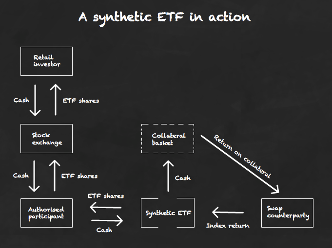

## Table of Contents

## What is a Synthetic Exchange-Traded Fund (ETF)?

A Synthetic Exchange-Traded Fund (ETF) is a type of investment fund that tracks the performance of an index or a basket of assets, but instead of holding the actual assets, it uses financial instruments like derivatives to mimic the performance. These derivatives, such as swaps, options, and futures, allow the ETF to achieve the same returns as if it owned the underlying assets directly, but often at a lower cost and with greater flexibility.

Synthetic ETFs can be useful for investors who want exposure to certain markets or assets that might be difficult or expensive to invest in directly. For example, if an investor wants to invest in a foreign stock market but faces high transaction costs or regulatory barriers, a synthetic ETF can provide a more accessible way to gain that exposure. However, these ETFs also come with additional risks, such as counterparty risk, where the other party in the derivative contract might fail to fulfill their obligations. Therefore, it's important for investors to understand these risks before investing in synthetic ETFs.

## How does a Synthetic ETF differ from a traditional ETF?

A Synthetic ETF and a traditional ETF both aim to track the performance of an index or a basket of assets, but they do so in different ways. A traditional ETF holds the actual assets it is tracking. For example, if it's tracking the S&P 500, it will own the stocks that make up the S&P 500. This direct ownership means that the ETF's performance closely mirrors the performance of the underlying assets.

On the other hand, a Synthetic [ETF](/wiki/etf-trading-strategies) uses financial instruments like derivatives to replicate the performance of the assets it's tracking. Instead of owning the stocks, bonds, or commodities directly, it enters into agreements with other financial institutions to exchange the returns of these assets. This method can be more cost-effective and allow for exposure to markets that might be hard to access directly, but it also introduces additional risks, such as the risk that the other party in the derivative contract might not fulfill their obligations.

## What are the main components of a Synthetic ETF?

A Synthetic ETF is made up of two main parts: the underlying assets it wants to track and the financial instruments it uses to do that. The underlying assets could be stocks, bonds, commodities, or any other type of investment. Instead of buying these assets directly, the Synthetic ETF uses derivatives like swaps, options, and futures to mimic their performance.

The financial instruments are the key to how a Synthetic ETF works. For example, the ETF might enter into a swap agreement with a bank. The bank agrees to pay the ETF the returns of the underlying assets, and in return, the ETF pays the bank a fee or another type of payment. This allows the ETF to achieve the same returns as if it owned the assets directly, but without actually holding them.

These components work together to help the Synthetic ETF track the performance of the assets it's interested in. However, using derivatives also means there are extra risks involved, like the risk that the bank or other financial institution might not be able to make the payments they promised. This is called counterparty risk, and it's something investors need to think about when considering Synthetic ETFs.

## What are the benefits of investing in Synthetic ETFs?

Investing in Synthetic ETFs can be a good choice for people who want to put their money into certain markets or assets that might be hard or expensive to buy directly. For example, if you want to invest in a foreign stock market but it's too costly or there are too many rules to follow, a Synthetic ETF can help you get that exposure more easily. They can also be cheaper to manage because they use financial tools like swaps and futures instead of buying the actual assets.

However, there are also some risks to think about. One big risk is called counterparty risk, which means the other party in the financial agreement might not be able to pay what they owe. This can be a problem if the bank or institution the ETF is working with runs into financial trouble. So, while Synthetic ETFs can offer more flexibility and lower costs, it's important to understand these risks before deciding to invest in them.

## What are the risks associated with Synthetic ETFs?

One big risk with Synthetic ETFs is called counterparty risk. This means that the other party in the financial agreement, like a bank, might not be able to pay what they owe. If the bank runs into financial trouble, it could affect the ETF's performance and your investment. This is a bigger worry with Synthetic ETFs than with traditional ETFs because they rely on these agreements to work.

Another risk is something called tracking error. This happens when the Synthetic ETF doesn't match the performance of the assets it's supposed to track as closely as it should. Because Synthetic ETFs use financial tools like swaps and futures, there can be times when they don't follow the market exactly, which can lead to unexpected results for investors.

Lastly, Synthetic ETFs can be more complex and harder to understand than traditional ETFs. This complexity can make it tougher for investors to know exactly what they're getting into. It's important to do your homework and maybe talk to a financial advisor to make sure you understand all the risks before you invest in a Synthetic ETF.

## How are Synthetic ETFs structured?

Synthetic ETFs are set up using two main parts: the assets they want to track and the financial tools they use to do that. The assets could be stocks, bonds, or commodities, but instead of buying them directly, the ETF uses things like swaps, options, and futures. These financial tools help the ETF copy the performance of the assets without actually owning them.

The way it works is that the Synthetic ETF makes a deal with a bank or another financial institution. The bank agrees to give the ETF the returns of the assets it's tracking, and in return, the ETF pays the bank a fee or another type of payment. This setup lets the ETF get the same returns as if it owned the assets directly, but it can be cheaper and easier to manage.

However, using these financial tools also means there are extra risks. One big risk is called counterparty risk, which means the bank might not be able to pay what they promised. There's also the chance that the ETF might not track the assets perfectly, which is called tracking error. Because Synthetic ETFs can be more complicated, it's important for investors to understand these risks before they decide to invest.

## What is the role of a swap counterparty in Synthetic ETFs?

The swap counterparty is really important for Synthetic ETFs. They are usually big banks or financial institutions that make a deal with the ETF. The deal is called a swap agreement. In this agreement, the swap counterparty agrees to give the ETF the returns of the assets it wants to track, like stocks or bonds. In return, the ETF pays the swap counterparty a fee or another type of payment. This helps the ETF copy the performance of the assets without actually owning them.

However, there's a risk with this setup. It's called counterparty risk. This means that if the bank or financial institution runs into money problems, they might not be able to pay what they promised to the ETF. If that happens, it could affect the ETF's performance and the value of your investment. So, it's important for investors to think about this risk when they're looking at Synthetic ETFs.

## How do Synthetic ETFs replicate the performance of an index?

Synthetic ETFs use financial tools like swaps, options, and futures to copy the performance of an index without actually owning the assets in that index. For example, if a Synthetic ETF wants to track the S&P 500, it doesn't buy all the stocks in the S&P 500. Instead, it makes a deal with a bank or another financial institution. The bank agrees to give the ETF the same returns as the S&P 500, and in return, the ETF pays the bank a fee. This way, the ETF can achieve the same results as if it owned the stocks directly, but it can be cheaper and easier to manage.

However, using these financial tools also means there are extra risks. One big risk is called counterparty risk. This means that if the bank runs into financial trouble, it might not be able to pay what it promised to the ETF. If that happens, it could affect the ETF's performance and the value of your investment. Another risk is tracking error, which happens when the Synthetic ETF doesn't match the performance of the index as closely as it should. Because Synthetic ETFs can be more complicated, it's important for investors to understand these risks before they decide to invest.

## What regulatory considerations should be noted for Synthetic ETFs?

When it comes to Synthetic ETFs, there are some important rules and regulations that investors should know about. Different countries have their own rules, but many places have strict guidelines to make sure these ETFs are safe and fair. For example, in the European Union, there are rules that say Synthetic ETFs need to have enough money set aside to cover any risks from the financial tools they use. This is to help protect investors if something goes wrong with the bank or institution they're working with.

In the United States, the Securities and Exchange Commission (SEC) keeps a close eye on Synthetic ETFs. They make sure these ETFs follow the rules and tell investors about any risks. The SEC wants to make sure that investors have all the information they need to make good choices. So, if you're thinking about investing in a Synthetic ETF, it's a good idea to check the rules in your country and understand how they might affect your investment.

## How do Synthetic ETFs impact market efficiency and liquidity?

Synthetic ETFs can help make markets work better and be more liquid. They do this by giving investors an easy way to put their money into different markets without buying the actual assets. For example, if someone wants to invest in a foreign stock market but it's hard to do directly, a Synthetic ETF can help. This can bring more money into the market, which can make it easier for people to buy and sell things. More trading can make the market more efficient because prices can adjust more quickly to new information.

However, Synthetic ETFs can also make things more complicated. Because they use financial tools like swaps and futures, they can add more risk to the market. If a lot of people are using Synthetic ETFs and something goes wrong with the banks or institutions they're working with, it could cause problems. This might make the market less stable and affect how easily people can buy and sell. So, while Synthetic ETFs can help with market efficiency and [liquidity](/wiki/liquidity-risk-premium), they also need to be managed carefully to avoid causing trouble.

## What are some examples of Synthetic ETFs available in the market?

There are a few well-known Synthetic ETFs that you might come across. One example is the Lyxor UCITS ETF S&P 500, which is managed by Lyxor Asset Management. This ETF uses swaps to track the performance of the S&P 500 index without actually owning the stocks in the index. Another example is the db x-trackers MSCI World Swap UCITS ETF, managed by Deutsche Bank. This ETF aims to replicate the performance of the MSCI World Index using swaps, giving investors exposure to a broad range of global stocks.

These Synthetic ETFs are popular because they can be cheaper to manage and offer easy access to markets that might be hard to invest in directly. However, they also come with risks, like the chance that the bank they're working with might not be able to pay what they promised. So, it's important for investors to understand these risks before deciding to invest in Synthetic ETFs.

## How can investors evaluate the performance and risk of Synthetic ETFs?

Investors can evaluate the performance of Synthetic ETFs by looking at how well they track the index or assets they're supposed to follow. They can check the ETF's returns over time and compare them to the returns of the index. If the ETF's returns are close to the index's returns, it's doing a good job. Investors can also look at the ETF's expense ratio, which is how much it costs to manage the ETF. A lower expense ratio means more of the returns go to the investor.

When it comes to risk, investors need to think about counterparty risk, which is the chance that the bank or institution the ETF is working with might not be able to pay what they promised. They can check the credit rating of the counterparty to see how likely this is to happen. Another risk to consider is tracking error, which is when the ETF doesn't match the index's performance as closely as it should. Investors can look at past data to see how big the tracking error has been. Understanding these risks can help investors decide if a Synthetic ETF is right for them.

## References & Further Reading

[1]: Bergstra, J., Bardenet, R., Bengio, Y., & Kégl, B. (2011). ["Algorithms for Hyper-Parameter Optimization."](https://dl.acm.org/doi/10.5555/2986459.2986743) Advances in Neural Information Processing Systems 24.

[2]: ["Advances in Financial Machine Learning"](https://www.amazon.com/Advances-Financial-Machine-Learning-Marcos/dp/1119482089) by Marcos Lopez de Prado

[3]: ["Evidence-Based Technical Analysis: Applying the Scientific Method and Statistical Inference to Trading Signals"](https://www.amazon.com/Evidence-Based-Technical-Analysis-Scientific-Statistical/dp/0470008741) by David Aronson

[4]: ["Machine Learning for Algorithmic Trading"](https://github.com/stefan-jansen/machine-learning-for-trading) by Stefan Jansen

[5]: ["Quantitative Trading: How to Build Your Own Algorithmic Trading Business"](https://www.amazon.com/Quantitative-Trading-Build-Algorithmic-Business/dp/1119800064) by Ernest P. Chan