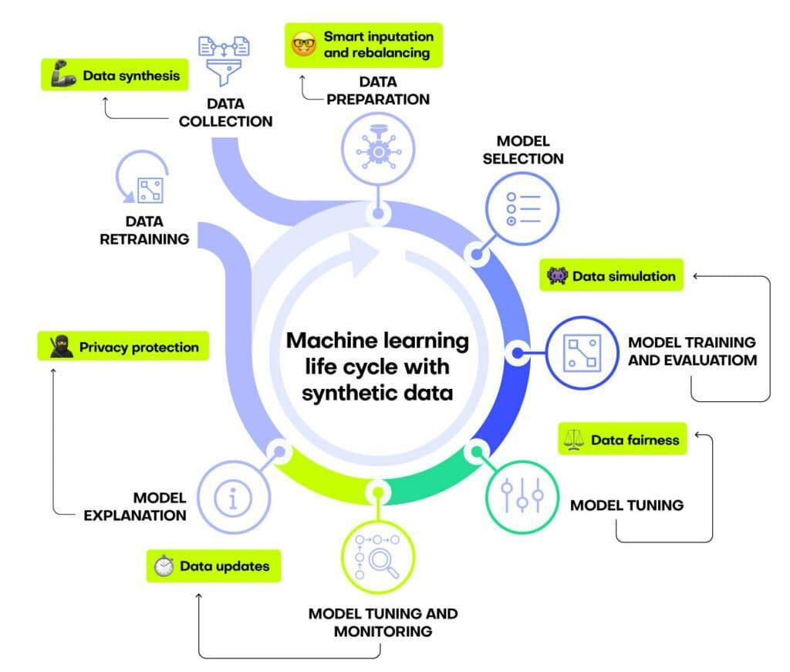

## Table of Contents

## What is a synthetic feature in machine learning?

A synthetic feature in machine learning is a new feature that you create from existing data. It's like making a new ingredient from the ones you already have in your kitchen. For example, if you have data about a person's height and weight, you can create a synthetic feature called Body Mass Index (BMI) by using the formula $$ \text{BMI} = \frac{\text{weight in kg}}{(\text{height in m})^2} $$. This new feature can help your machine learning model understand the data better and make more accurate predictions.

Synthetic features are useful because they can capture relationships between different pieces of data that might not be obvious at first. By combining or transforming existing data, you can create features that are more relevant to the problem you're trying to solve. For instance, in a dataset about houses, you might create a synthetic feature that represents the age of the house by subtracting the year it was built from the current year. This can give your model a better way to understand how the age of a house affects its price.

Creating synthetic features requires some creativity and understanding of the data. It's important to think about what new information you can extract from the existing data that could help your model. Sometimes, you might need to experiment with different combinations and transformations to find the ones that work best. By doing this, you can improve the performance of your machine learning model and make it more effective at solving the problem at hand.

## Why are synthetic features used in machine learning models?

Synthetic features are used in [machine learning](/wiki/machine-learning) models because they help the model understand the data better. When you create a new feature from existing data, you're making something that can show relationships or patterns that weren't clear before. For example, if you have data about a person's height and weight, you can create a synthetic feature called Body Mass Index (BMI) using the formula $$ \text{BMI} = \frac{\text{weight in kg}}{(\text{height in m})^2} $$. This new feature can help the model see how height and weight together affect something like health risk.

These features can also make the model more accurate. By combining or changing existing data, you can create something that's more relevant to what you're trying to predict. For instance, if you're trying to predict house prices, you might create a synthetic feature that shows the age of the house by subtracting the year it was built from the current year. This can give the model a better way to understand how the age of a house impacts its price. By experimenting with different synthetic features, you can find the ones that help your model work better and make more accurate predictions.

## How do synthetic features differ from original features?

Synthetic features are created from existing data, while original features are the raw data you start with. For example, if you have data about a person's height and weight, those are original features. But if you use that data to create a new feature like Body Mass Index (BMI) with the formula $$ \text{BMI} = \frac{\text{weight in kg}}{(\text{height in m})^2} $$, that's a synthetic feature. Synthetic features help the machine learning model understand the data better by showing relationships or patterns that might not be clear from the original features alone.

Original features are what you collect or measure directly, like the temperature outside or the number of hours someone works. They are the basic building blocks of your dataset. Synthetic features, on the other hand, are made by combining or transforming these original features in some way. This can make the data more useful for the model, helping it to make better predictions or understand the problem more deeply. For instance, if you're trying to predict house prices, the year a house was built is an original feature, but the age of the house, calculated by subtracting the year built from the current year, is a synthetic feature that might be more helpful for the model.

## What are some common methods to create synthetic features?

Creating synthetic features involves using the data you already have to make new, useful information. One common way to do this is by combining two or more original features. For example, if you have data about a person's height and weight, you can create a new feature called Body Mass Index (BMI) using the formula $$ \text{BMI} = \frac{\text{weight in kg}}{(\text{height in m})^2} $$. This new feature helps the model see how height and weight together affect health. Another way to combine features is by adding or subtracting them, like calculating the age of a house by subtracting the year it was built from the current year.

Another method to create synthetic features is by transforming original features. This can be done by applying mathematical functions like logarithms or square roots to the data. For example, if you're working with income data, you might use the logarithm of income to create a new feature that helps the model understand the data better. You can also use polynomial transformations, like creating a new feature that is the square of an original feature, to capture non-linear relationships in the data. 

Lastly, you can create synthetic features by using categorical data. If you have a feature like the type of house, you can turn it into multiple binary features using a technique called one-hot encoding. This means creating a new feature for each category, where the feature is 1 if the house matches that category and 0 otherwise. This can help the model understand different types of houses better. By experimenting with these methods, you can find the synthetic features that help your model make the best predictions.

## Can you provide an example of a simple synthetic feature?

A simple example of a synthetic feature is calculating the Body Mass Index (BMI) from a person's height and weight. If you have data about someone's height in meters and weight in kilograms, you can create a new feature called BMI using the formula $$ \text{BMI} = \frac{\text{weight in kg}}{(\text{height in m})^2} $$. This new feature helps a machine learning model understand how height and weight together affect a person's health.

For example, if you have a dataset with a person's height of 1.75 meters and weight of 70 kilograms, you can calculate their BMI as follows: $$ \text{BMI} = \frac{70}{(1.75)^2} \approx 22.86 $$. This new BMI value can be used as a synthetic feature in the model to predict health risks or other outcomes related to body composition.

## How do synthetic features impact model performance?

Synthetic features can make a machine learning model work better by helping it understand the data in new ways. When you create a synthetic feature, like calculating Body Mass Index (BMI) from height and weight using the formula $$ \text{BMI} = \frac{\text{weight in kg}}{(\text{height in m})^2} $$, you're giving the model a new piece of information that can show relationships between different pieces of data. This can help the model see patterns it might have missed before, making its predictions more accurate. For example, if you're trying to predict house prices, creating a synthetic feature for the age of the house by subtracting the year it was built from the current year can help the model understand how age affects price better than just using the year built alone.

However, using synthetic features doesn't always make the model better. Sometimes, adding too many synthetic features can make the model too complicated and cause it to overfit, which means it works well on the data it was trained on but not on new data. It's important to test different synthetic features and see which ones really help the model. By trying out different combinations and transformations, you can find the ones that make the model work best without making it too complex.

## What are the potential risks of using synthetic features?

Using synthetic features can sometimes make a machine learning model too complicated. When you add too many new features, like calculating Body Mass Index (BMI) from height and weight using the formula $$ \text{BMI} = \frac{\text{weight in kg}}{(\text{height in m})^2} $$, the model might start to fit the training data too closely. This is called overfitting. When a model overfits, it works really well on the data it was trained on but not so well on new data it hasn't seen before. This can make the model's predictions less accurate and less useful in real situations.

Another risk is that synthetic features might not always help the model understand the data better. Sometimes, the new features you create can be misleading or irrelevant to what you're trying to predict. For example, if you're trying to predict house prices, creating a synthetic feature like the ratio of the number of bedrooms to the number of bathrooms might not be useful if it doesn't relate well to the price. It's important to test different synthetic features and see which ones really help the model without adding unnecessary complexity.

## How can synthetic features help in dealing with missing data?

Synthetic features can help with missing data by filling in the gaps with information that's created from the data you do have. For example, if you're missing the weight of some people in a dataset but you have their height and BMI, you can use the formula $$ \text{weight in kg} = \text{BMI} \times (\text{height in m})^2 $$ to estimate their weight. This way, you can still use the data for those people in your model, even though some information was missing.

However, using synthetic features to deal with missing data can also have risks. If the synthetic feature you create isn't a good match for the missing data, it might make your model less accurate. It's important to check if the new features you make from the data you have are really helpful and not just adding noise. By testing different ways to create synthetic features, you can find the best way to handle missing data without making your model too complicated.

## What techniques are used to validate the effectiveness of synthetic features?

To validate the effectiveness of synthetic features, you can use a method called cross-validation. This involves splitting your data into different parts, training your model on some of the data, and then testing it on the rest. By doing this several times with different parts of the data, you can see if the synthetic features help the model make better predictions. For example, if you create a new feature like Body Mass Index (BMI) using the formula $$ \text{BMI} = \frac{\text{weight in kg}}{(\text{height in m})^2} $$, you can see if adding BMI to your model makes it more accurate.

Another way to check if synthetic features are helping is by comparing the performance of your model with and without the new features. You can use metrics like accuracy, precision, recall, or the area under the ROC curve to see if the model works better with the synthetic features. If the model's performance improves when you add the new feature, it's a good sign that the synthetic feature is useful. But if the performance doesn't get better or even gets worse, you might need to try a different synthetic feature or leave it out.

## How do synthetic features contribute to feature engineering?

Synthetic features are a big part of feature engineering, which is all about making your data better for machine learning models. When you create a synthetic feature, like calculating Body Mass Index (BMI) from height and weight using the formula $$ \text{BMI} = \frac{\text{weight in kg}}{(\text{height in m})^2} $$, you're taking the data you already have and turning it into something new and useful. This helps the model see relationships and patterns that might not be obvious from the original data alone. For example, if you're trying to predict house prices, creating a synthetic feature for the age of the house by subtracting the year it was built from the current year can give the model a clearer picture of how age affects price.

Using synthetic features in feature engineering can make your model more accurate and effective. But it's important to test different synthetic features to see which ones really help. Sometimes, adding too many new features can make the model too complicated and cause it to overfit, which means it works well on the data it was trained on but not on new data. By trying out different combinations and transformations, you can find the synthetic features that make the model work best without making it too complex.

## What advanced methods exist for generating complex synthetic features?

Advanced methods for generating complex synthetic features often involve using machine learning techniques themselves to create new features. One popular method is using autoencoders, which are neural networks that can learn how to efficiently compress and encode data, then decode it to reproduce the original input as closely as possible. By training an autoencoder on your data, you can use the encoded features as synthetic features that capture the most important aspects of your data in a lower-dimensional space. For example, if you have a dataset with many features, an autoencoder can help you create new features that summarize the information in a way that's easier for your model to use.

Another advanced technique is using Principal Component Analysis (PCA) to generate synthetic features. PCA is a statistical method that transforms a set of correlated variables into a smaller set of uncorrelated variables called principal components. These principal components can be used as synthetic features that capture the most variance in your data. For instance, if you have data about different aspects of a house like its size, number of rooms, and age, PCA can help you create new features that represent the main patterns in this data. This can help your model understand the data better and make more accurate predictions.

## How can synthetic features be integrated into existing machine learning pipelines?

Synthetic features can be integrated into existing machine learning pipelines by adding them to the data preprocessing step. This means you create the new features from your original data before you train your model. For example, if you have data about a person's height and weight, you can create a new feature called Body Mass Index (BMI) using the formula $$ \text{BMI} = \frac{\text{weight in kg}}{(\text{height in m})^2} $$. Once you have calculated BMI for all your data points, you can add it to your dataset. Then, when you train your model, it can use this new feature along with the original ones to make better predictions.

To make sure the synthetic features work well, you should test them in your pipeline. You can do this by running your model with and without the new features and comparing the results. If the model performs better with the synthetic features, you know they are helping. But if the model gets worse or stays the same, you might need to try different synthetic features or leave them out. By experimenting with different ways to create and use synthetic features, you can find the best way to improve your model's performance without making it too complicated.

## References & Further Reading

[1]: Bishop, C. M. (2006). ["Pattern Recognition and Machine Learning."](https://www.cs.uoi.gr/~arly/courses/ml/tmp/Bishop_book.pdf) Springer.

[2]: Géron, A. (2019). ["Hands-On Machine Learning with Scikit-Learn, Keras, and TensorFlow: Concepts, Tools, and Techniques to Build Intelligent Systems."](https://books.google.com/books/about/Hands_On_Machine_Learning_with_Scikit_Le.html?id=HHetDwAAQBAJ) O'Reilly Media.

[3]: Hastie, T., Tibshirani, R., & Friedman, J. (2009). ["The Elements of Statistical Learning: Data Mining, Inference, and Prediction."](https://link.springer.com/book/10.1007/978-0-387-84858-7) Springer Series in Statistics.

[4]: Kuhn, M., & Johnson, K. (2013). ["Applied Predictive Modeling."](https://link.springer.com/book/10.1007/978-1-4614-6849-3) Springer.

[5]: Raj, B. M., & Zhai, C. (2021). ["Feature Engineering for Machine Learning and Data Analytics."](https://www.taylorfrancis.com/books/edit/10.1201/9781315181080/feature-engineering-machine-learning-data-analytics-guozhu-dong-huan-liu) CRC Press.

[6]: Zhang, Y., & Yang, Q. (2014). ["A Survey on Multi-Task Learning."](https://ieeexplore.ieee.org/document/9392366) IEEE Transactions on Knowledge and Data Engineering.