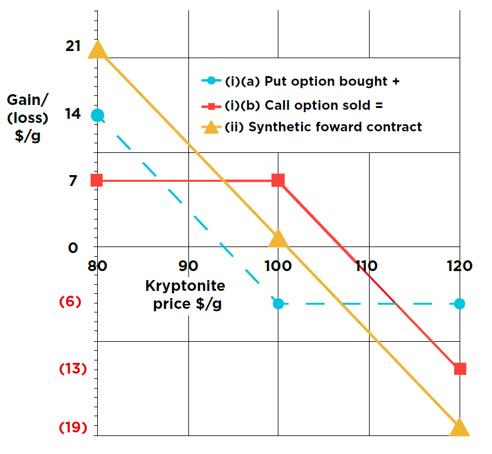

## Table of Contents

## What is a Synthetic Forward Contract?

A synthetic forward contract is a way to mimic the results of a regular forward contract without actually using one. Instead of directly agreeing to buy or sell something at a future date, you use a combination of other financial tools to achieve the same goal. These tools are usually options, which give you the right to buy or sell at a certain price.

For example, if you want to buy a stock at a future date, you can buy a call option and sell a put option at the same time. The call option lets you buy the stock at a set price, and the put option makes you sell it at that price if it falls below it. By doing this, you can create a situation where you end up buying the stock at the future date, just like with a forward contract. This method can be useful if you want more flexibility or if forward contracts are not available for what you want to trade.

## How does a Synthetic Forward Contract differ from a traditional forward contract?

A synthetic forward contract and a traditional forward contract both aim to lock in a price for buying or selling an asset at a future date, but they do so in different ways. A traditional forward contract is a direct agreement between two parties where one agrees to buy and the other agrees to sell the asset at a set price on a specific future date. It's straightforward and often used in commodities markets or currency exchanges.

In contrast, a synthetic forward contract uses a combination of other financial instruments, typically options, to achieve the same result without a direct agreement. For example, to create a synthetic forward, you might buy a call option and sell a put option at the same strike price and expiration date. This combination mimics the payoff of a traditional forward contract but offers more flexibility because options can be bought and sold separately. Synthetic forwards are useful when traditional forwards are not available or when traders want to manage their risk in different ways.

## What are the basic components of a Synthetic Forward Contract?

A synthetic forward contract is made up of two main parts: a call option and a put option. A call option gives you the right to buy something at a set price in the future. A put option gives you the right to sell something at a set price in the future. To create a synthetic forward, you buy the call option and sell the put option at the same price and date. This combination works together to make sure you end up buying the asset at the future date, just like with a regular forward contract.

The key thing about these options is that they have the same strike price and expiration date. The strike price is the set price at which you can buy or sell the asset. The expiration date is when the options stop working. By using options with the same strike price and expiration date, the synthetic forward contract can mimic the payoff of a traditional forward contract. This setup gives you the same result as a forward contract but with more flexibility because you can change or cancel the options if you need to.

## Can you explain the mechanics of creating a Synthetic Forward Contract?

To create a synthetic forward contract, you need to use two options: a call option and a put option. A call option gives you the right to buy something at a set price in the future, while a put option gives you the right to sell something at a set price in the future. To make a synthetic forward, you buy the call option and sell the put option at the same price and date. This means the call option's strike price and expiration date should match the put option's strike price and expiration date. By doing this, you set up a situation where you will end up buying the asset at the future date, just like with a regular forward contract.

The mechanics work like this: if the price of the asset goes above the strike price by the expiration date, the call option you bought will be worth something, and you can use it to buy the asset at the strike price. At the same time, the put option you sold will not be worth anything because no one would want to sell the asset below the market price. If the price of the asset goes below the strike price, the put option you sold will be used by someone else to sell the asset to you at the strike price, while the call option you bought will not be worth anything. Either way, you end up buying the asset at the strike price on the expiration date, which is the same result as a traditional forward contract but with more flexibility because you can change or cancel the options if you need to.

## What are the advantages of using Synthetic Forward Contracts over traditional forward contracts?

Synthetic forward contracts offer more flexibility than traditional forward contracts. With a synthetic forward, you use options that you can buy or sell separately. This means you can change your mind or adjust your position if the market changes. If you want to get out of the deal early, you can just sell the options you bought and buy back the ones you sold. With a traditional forward contract, it's not as easy to get out of the deal once you've agreed to it.

Another advantage is that synthetic forwards can be used when traditional forwards are not available. Some markets or assets might not have forward contracts, but you can still use options to create a synthetic forward. This lets you lock in a price for the future even if a direct forward contract isn't possible. Plus, using options can help you manage your risk better because you can choose options that fit your needs more closely than a standard forward contract might.

## What are the potential risks associated with Synthetic Forward Contracts?

Using synthetic forward contracts can be riskier than using traditional forward contracts because they involve options. Options can be more complex, and if you don't understand them well, you might make mistakes. For example, if the price of the asset moves a lot, you could lose more money than you expected. Also, options have costs like premiums, which you have to pay upfront. If the market doesn't move in the way you hoped, you could lose the money you spent on the options without getting anything back.

Another risk is that synthetic forwards might not work exactly like traditional forwards. If the options you use don't match perfectly, you might not end up with the same result as a traditional forward contract. This can happen if the options expire at different times or if the strike prices are not the same. Also, because synthetic forwards use options, they can be affected by changes in the options market, like changes in volatility or interest rates, which can make them more unpredictable than traditional forwards.

## How can Synthetic Forward Contracts be used for hedging purposes?

Synthetic forward contracts can be a great way to hedge, which means protecting yourself from price changes. Imagine you're a farmer who grows wheat, and you want to make sure you get a good price for your crop in the future. Instead of using a traditional forward contract, you can use a synthetic forward by buying a call option and selling a put option on wheat at the same price and date. This way, no matter what the price of wheat does, you'll be able to sell it at the price you set with your options. This helps you plan your finances better because you know what you'll get for your wheat.

Using synthetic forwards for hedging can also be useful if you want to be more flexible. Let's say you're a company that needs to buy oil in six months. You can create a synthetic forward to lock in the price of oil, but if the price of oil drops a lot before then, you can change your options to take advantage of the lower price. This flexibility can save you money and help you manage risk better. Synthetic forwards give you the same protection as traditional forwards but with the added benefit of being able to adjust your strategy as the market changes.

## What are the key considerations for pricing a Synthetic Forward Contract?

When you want to figure out the price of a synthetic forward contract, you need to look at the prices of the call and put options you're using. The cost of the call option you buy, called the premium, and the money you get from selling the put option, also called the premium, are important. You also need to think about how much the price of the asset might change, which is called volatility. If the price of the asset could change a lot, the options will cost more because they're riskier. The time until the options expire matters too. The longer you have until the options expire, the more they will cost because there's more time for the price of the asset to move.

Another thing to consider is the interest rate. If interest rates are high, the cost of the options might be different because money today is worth more than money in the future. You should also think about any dividends or costs related to the asset, like storage costs for commodities. All these things together help you figure out the price of a synthetic forward contract. It's like putting together a puzzle to make sure you end up with the right price to match what you'd get from a traditional forward contract.

## Can you provide an example of a Synthetic Forward Contract in a real-world scenario?

Imagine you're a coffee shop owner who wants to buy coffee beans at a set price in six months. You're worried that the price of coffee might go up, so you decide to use a synthetic forward contract to lock in a price. To do this, you buy a call option that lets you buy coffee beans at $2 per pound in six months, and you sell a put option that makes you buy coffee beans at $2 per pound if the price falls below that. Both options expire in six months. This way, no matter what happens to the price of coffee, you'll end up buying the beans at $2 per pound, just like you would with a traditional forward contract.

Using a synthetic forward gives you more flexibility than a traditional forward contract. If the price of coffee drops a lot before the six months are up, you can sell your call option and buy back your put option to take advantage of the lower price. This means you can change your mind if the market changes, which you can't do as easily with a traditional forward contract. By using options to create a synthetic forward, you protect yourself from price changes while keeping your options open.

## How do regulatory environments affect the use of Synthetic Forward Contracts?

Regulatory environments can have a big impact on how people use synthetic forward contracts. Different countries have different rules about what you can do with options and other financial tools. Some places might make it hard to use synthetic forwards because they want to keep the market safe and fair. For example, they might need you to have a lot of money or special permission to use options. This can make it trickier to set up a synthetic forward contract because you have to follow all the rules.

On the other hand, some places might have rules that make it easier to use synthetic forwards. They might see these contracts as a good way for people to manage risk and might not have as many strict rules. But even in these places, you still have to be careful. You need to know the rules well because if you don't follow them, you could get into trouble. So, understanding the regulatory environment is really important when deciding if synthetic forward contracts are right for you.

## What advanced strategies can be implemented using Synthetic Forward Contracts?

Advanced strategies with synthetic forward contracts can help you manage risk and take advantage of market changes in more ways than just simple hedging. One strategy is called a "delta hedge." This means you keep adjusting the number of options you have to make sure your synthetic forward stays close to the price you want. If the price of the asset changes a lot, you can buy or sell more options to keep your position balanced. This can help you make money if the market moves in your favor, but it needs a lot of watching and quick changes.

Another strategy is using synthetic forwards in a "spread" trade. This means you set up two synthetic forwards at different prices or times. For example, you might create one synthetic forward to buy something at a low price in the future and another to sell it at a higher price later on. If the price goes up as you expect, you can make a profit from the difference between the two prices. This can be a smart way to bet on the direction of the market, but it's more complicated and riskier because you have to predict how the market will move over time.

## How do Synthetic Forward Contracts fit into a broader financial strategy for institutions?

Synthetic forward contracts can be a useful tool for big companies and financial institutions as part of their overall money management plan. These contracts help them lock in prices for things they need to buy or sell in the future, which can protect them from big price changes. For example, an airline might use synthetic forwards to make sure they can buy jet fuel at a set price, even if the price of oil goes up. This kind of planning helps them know their costs ahead of time and manage their money better.

Institutions can also use synthetic forwards to take advantage of market changes in a smart way. By using options to create these contracts, they can change their plans if the market moves differently than they expected. This flexibility can help them make more money or lose less if prices go up or down a lot. Overall, synthetic forwards are a key part of a bigger strategy that helps big organizations manage risk and plan for the future.

## What are Synthetic Forward Contracts: An In-depth Look?

Synthetic forward contracts are financial instruments that allow market participants to simulate the economic outcomes of traditional forward contracts using options. These are constructed by combining options in a specific manner. Specifically, a synthetic forward contract is created by purchasing a call option and simultaneously selling a put option with the same strike price and expiration date. This setup replicates the payoff structure of a forward contract. The concept is rooted in the principle of put-call parity, which describes the relationship between the prices of European call and put options with the same strike price and expiry.

**Construction of Synthetic Forward Contracts**

To construct a synthetic forward contract, an investor can follow these steps:

1. **Call Option Purchase**: Buy a call option on an asset with a specific strike price (K) and expiry (T).
2. **Put Option Sale**: Sell a put option on the same asset with the same strike price (K) and expiry (T).

The synthetic forward contract's payoff can be expressed as: 

$$

\text{Synthetic Forward Payoff} = C - P
$$

where $C$ is the payoff from the call option, and $P$ is the payoff from selling the put option. In essence, the net position mimics the payoff of a forward contract, which is:

$$

S_T - K 
$$

where $S_T$ is the price of the underlying asset at expiration, and $K$ is the strike price.

**Practical Applications and Benefits**

Synthetic forward contracts offer several benefits to traders and investors. They provide flexibility, as creating synthetic positions using options can be useful in markets where actual forward contracts might not be available or are less liquid. They also allow for more precise tailoring of risk and return profiles, especially in volatile markets.

For instance, in stock markets, synthetic forwards enable investors to lock in future buy or sell prices without holding the actual stock or commodity. This can be advantageous in hedging operations, where price certainty is crucial.

**Differences from Traditional Forward Contracts**

The primary difference between synthetic forwards and traditional forward contracts lies in the instrument's construction and usage. Traditional forward contracts are agreements between two parties to buy or sell an asset at a predetermined price on a future date. These are direct obligations and typically involve counterparty risk. In contrast, synthetic forwards, being composed of market-traded options, do not hold a direct counterparty agreement, thereby offering a more flexible risk profile.

**Example of Usage**

Consider a trader who anticipates an increase in stock price but prefers not to incur the upfront cost associated with holding the stock. By creating a synthetic forward, the trader can gain similar exposure using the limited upfront investment typical of options. For example, buying a call option and selling a put option with the same strike and expiry creates a synthetic position that mimics owning the stock.

**Risks and Challenges**

Despite their advantages, synthetic forwards come with specific risks and challenges. One significant risk is related to the [volatility](/wiki/volatility-trading-strategies) of options prices, which can lead to significant swings in the synthetic position's value. Additionally, without appropriate risk strategies, traders face the potential for substantial losses, especially if the market moves unfavorably. Liquidity can also be a concern, as the availability of options with specific strikes and expiries can be limited.

Moreover, changes in implied volatility can affect the options' premiums used in the synthetic setup, introducing additional layers of complexity. Effective management of these instruments requires thorough understanding and monitoring of market conditions and options pricing dynamics.

In summary, synthetic forward contracts are powerful tools for achieving financial objectives that mirror traditional forward engagements. They allow for innovative strategy development in hedging and speculative scenarios while presenting unique risk management challenges that necessitate careful consideration.

## References & Further Reading

[1]: Black, F., & Scholes, M. (1973). ["The Pricing of Options and Corporate Liabilities."](https://www.cs.princeton.edu/courses/archive/fall09/cos323/papers/black_scholes73.pdf) Journal of Political Economy, 81(3), 637-654.

[2]: Hull, J. C. (2009). ["Options, Futures, and Other Derivatives."](https://www.amazon.com/Options-Futures-Other-Derivatives-9th/dp/0133456315) Pearson Education.

[3]: Chance, D. M., & Brooks, R. (2015). ["An Introduction to Derivatives and Risk Management."](https://books.google.com/books/about/Introduction_to_Derivatives_and_Risk_Man.html?id=b8PgBQAAQBAJ) Cengage Learning.

[4]: Aldridge, I. (2013). ["High-Frequency Trading: A Practical Guide to Algorithmic Strategies and Trading Systems."](https://www.amazon.com/High-Frequency-Trading-Practical-Algorithmic-Strategies/dp/1118343506) Wiley.

[5]: Murphy, J. J. (1999). ["Technical Analysis of the Financial Markets: A Comprehensive Guide to Trading Methods and Applications."](https://archive.org/details/technicalanalysi0000murp) New York Institute of Finance.