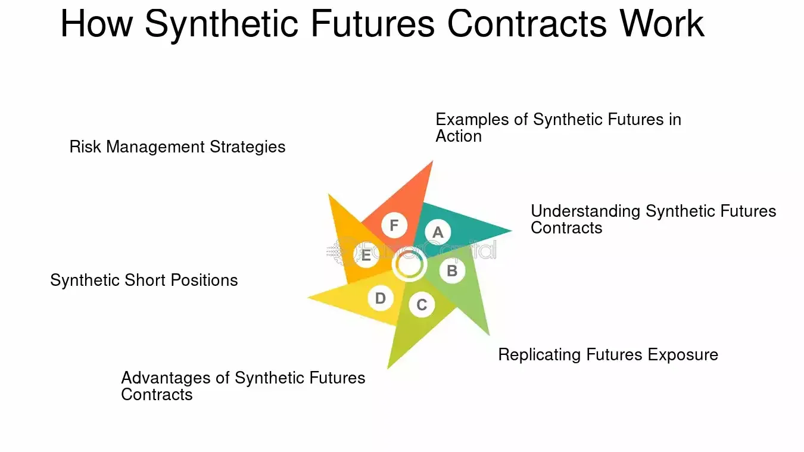

## Table of Contents

## What are synthetic futures contracts?

Synthetic futures contracts are financial instruments that mimic the behavior of traditional futures contracts but are created using a combination of other financial instruments, like options and stocks. Instead of directly buying a futures contract, which is an agreement to buy or sell an asset at a future date at a set price, investors use synthetic futures to achieve similar results. This method allows for more flexibility and can be tailored to specific investment strategies or risk management needs.

For example, to create a synthetic long futures position, an investor might buy a call option and sell a put option with the same strike price and expiration date. This combination gives the investor a similar payoff to owning the actual futures contract. Synthetic futures can be useful because they allow investors to gain exposure to price movements in an asset without having to deal with the complexities and margin requirements of traditional futures markets. They are popular among sophisticated investors looking to customize their investment approaches.

## How do synthetic futures contracts differ from traditional futures contracts?

Synthetic futures contracts are different from traditional futures contracts because they are not actual agreements to buy or sell an asset at a future date. Instead, synthetic futures are made up of other financial tools, like options and stocks, that work together to copy the results of a real futures contract. This means that with synthetic futures, you can get the same kind of payoff as a traditional futures contract without actually trading the futures market directly.

The main difference is flexibility. Traditional futures contracts come with set terms and conditions, like the asset, the quantity, and the delivery date. Synthetic futures, on the other hand, let you change things to fit your own plan. You can pick different options and stocks to make the synthetic futures work the way you want. This can be helpful for managing risk or trying out different investment ideas without being stuck with the rules of a regular futures contract.

## What are the basic components needed to create a synthetic futures contract?

To make a synthetic futures contract, you need two main parts: options and stocks. The options part usually includes buying a call option and selling a put option. Both options should have the same strike price and expiration date. The call option gives you the right to buy the stock at a set price, while the put option makes you sell the stock at that price if it's exercised. By doing this, you get a payoff that acts like a futures contract.

The stock part is also important. You need to own the stock that the options are based on. This stock and the options together make the synthetic futures work. If you don't own the stock, you can use other ways to get the same result, but having the stock makes it simpler. So, with the right mix of options and the stock, you can create a synthetic futures contract that follows the price of the real futures contract.

## Can you provide a simple example of a synthetic futures contract?

Let's say you want to mimic a futures contract on XYZ stock. You can create a synthetic futures contract using options and the stock itself. To do this, you would buy a call option on XYZ stock with a strike price of $50 and an expiration date three months from now. At the same time, you would sell a put option on XYZ stock with the same $50 strike price and the same three-month expiration date.

Now, you also need to own the XYZ stock. If you already have 100 shares of XYZ stock, you're all set. The combination of owning the stock, buying the call option, and selling the put option will give you a payoff that acts just like a futures contract on XYZ stock. If the price of XYZ stock goes up, your call option will increase in value, and if the price goes down, your put option will be exercised, making you sell the stock at $50. This setup lets you track the price of XYZ stock without actually trading a futures contract.

## What are the advantages of using synthetic futures contracts over traditional futures?

Using synthetic futures contracts can be better than traditional futures because they give you more freedom to change things. With traditional futures, you have to follow the rules about what you're buying, how much, and when. But with synthetic futures, you can pick the options and stocks you want to use. This means you can make the contract fit your own plan better. If you want to try something different or manage risk in a special way, synthetic futures can help you do that.

Another good thing about synthetic futures is that they can be easier to get into for some people. Traditional futures can be hard to deal with because they have strict rules and need a lot of money to start. Synthetic futures let you use options and stocks you might already have, so you don't need to learn a whole new market. This can make it simpler and less scary to try to follow the price of something without jumping straight into the futures market.

## What are the potential risks associated with synthetic futures contracts?

Using synthetic futures contracts can be risky because they are made up of options and stocks, which can be hard to handle. If you don't know a lot about options, you might make mistakes that cost you money. For example, if the price of the stock goes down a lot, the put option you sold could be used against you, making you sell the stock at a loss. Also, options can lose value quickly if the stock price doesn't move the way you thought it would, which can make your synthetic futures contract worth less than you expected.

Another risk is that synthetic futures can be more complicated than regular futures. You have to keep track of more things, like the options and the stock, and make sure they all work together right. If you mess up even a little bit, it can mess up your whole plan. Plus, because synthetic futures are not as common as regular futures, it might be harder to find someone to trade with if you need to get out of your position quickly. This can make it harder to manage your risks and could lead to bigger losses if things go wrong.

## How can synthetic futures be used for hedging purposes?

Synthetic futures can be used for hedging by helping you protect against price changes in a stock or other asset. Let's say you own a lot of shares in a company, and you're worried the price might go down. You can create a synthetic futures contract to lock in the current price. To do this, you would buy a call option and sell a put option on the stock, both with the same strike price and expiration date. This setup means that if the stock price falls, the put option will be used, and you'll sell the stock at the strike price, which limits your loss. If the stock price goes up, your call option will make money, so you're protected either way.

Using synthetic futures for hedging can be a good way to manage risk without having to deal with the complexities of traditional futures markets. Since synthetic futures are made up of options and stocks you might already own, it can be easier to set up. Plus, you have more freedom to change things to fit your needs. For example, if you want to hedge against a specific amount of stock or for a certain time, you can pick the options and stocks that work best for you. This flexibility can make it easier to protect your investments from big price swings.

## What strategies can be employed using synthetic futures contracts for speculative trading?

Synthetic futures contracts can be used for speculative trading by trying to make money from price changes in a stock or other asset. For example, if you think the price of XYZ stock will go up, you can create a synthetic long futures position by buying a call option and selling a put option on XYZ stock with the same strike price and expiration date. If the stock price goes up as you expected, the call option will gain value, and you can make a profit. This way, you can bet on the stock price going up without actually owning the stock or trading a traditional futures contract.

On the other hand, if you think the price of XYZ stock will go down, you can create a synthetic short futures position by selling a call option and buying a put option on XYZ stock with the same strike price and expiration date. If the stock price falls as you predicted, the put option will increase in value, allowing you to make money from the price drop. This approach lets you speculate on the stock going down without short selling the stock or using a traditional futures contract. Both strategies give you a way to take advantage of your predictions about future price movements using the flexibility of synthetic futures.

## How do regulatory considerations affect the use of synthetic futures contracts?

Regulatory rules can make a big difference when you use synthetic futures contracts. Different countries have different laws about trading options and stocks, which are the main parts of synthetic futures. Some places might have strict rules about who can trade options or how much money you need to start. This can make it harder to set up synthetic futures if you don't meet these rules. Also, since synthetic futures can be complicated, regulators might want to make sure you know what you're doing to avoid big risks. So, it's important to know the rules in your area before you start using synthetic futures.

Even though synthetic futures can give you more freedom than regular futures, you still have to follow the rules about reporting and keeping records. Regulators want to keep an eye on the market to make sure everything is fair and safe. If you use synthetic futures for big trades or in a way that could affect the market a lot, you might have to tell the regulators what you're doing. Not following these rules can lead to fines or other problems. So, it's a good idea to talk to a financial expert or lawyer to make sure you're doing everything right when you use synthetic futures.

## What are some advanced strategies for combining synthetic futures with other derivatives?

You can use synthetic futures with other derivatives to make more complex trading plans. For example, you might use synthetic futures with options spreads to manage risk better. An options spread is when you buy and sell options at different strike prices or expiration dates. If you think the price of a stock will move a lot but you're not sure which way, you can use a synthetic futures contract to bet on the price moving, and then use an options spread to limit your risk if the price doesn't move as much as you thought. This way, you can still make money if the price moves a lot, but you won't lose as much if it stays the same.

Another way to use synthetic futures with other derivatives is to combine them with swaps. A swap is an agreement to exchange cash flows based on different things, like interest rates or stock prices. If you want to bet on the price of a stock but also want to manage the risk from changes in interest rates, you can use a synthetic futures contract to follow the stock price and a swap to manage the [interest rate](/wiki/interest-rate-trading-strategies) risk. This can be a good way to make a plan that fits your needs better and helps you manage different kinds of risks at the same time.

## How can synthetic futures contracts be used to manage portfolio risk?

Synthetic futures contracts can help you manage the risk in your investment portfolio by letting you protect against big price changes in the stocks you own. If you have a lot of money in one stock and you're worried the price might go down, you can use a synthetic futures contract to lock in the current price. You do this by buying a call option and selling a put option on the stock, both with the same price and expiration date. This way, if the stock price falls, the put option will be used, and you'll sell the stock at the locked-in price, which limits your loss. If the stock price goes up, your call option will make money, so you're protected either way.

Using synthetic futures for managing risk can be easier than using regular futures because you can change things to fit your needs. You can pick the options and stocks that work best for you, so you can protect against price changes for a certain amount of stock or for a specific time. This flexibility can make it easier to keep your investments safe from big price swings. Plus, since synthetic futures are made up of options and stocks you might already own, it can be simpler to set up without having to learn a whole new market.

## What are the latest trends and innovations in the use of synthetic futures contracts?

One of the latest trends in using synthetic futures contracts is the growing use of technology to make them easier to set up and trade. More and more trading platforms are adding tools that help people create synthetic futures without having to do all the work themselves. These tools can automatically pick the right options and stocks to use, which makes it simpler for people who don't know a lot about options to try synthetic futures. This can help more people use synthetic futures to manage risk or try new investment ideas.

Another innovation is combining synthetic futures with other new financial products, like cryptocurrencies. Some traders are now using synthetic futures to bet on the price of cryptocurrencies without actually owning them. This can be a good way to try to make money from the big price changes in cryptocurrencies while managing the risk. By using synthetic futures with cryptocurrencies, traders can create plans that fit their needs better and take advantage of new opportunities in the market.

## What are Synthetic Futures Contracts?

Synthetic futures contracts represent an innovative financial instrument designed to replicate the payoff of traditional futures using a combination of options. Essentially, these contracts are constructed through strategic combinations of call and put options that mimic the payoff profile of a futures contract. This section elucidates the structure and advantages of synthetic futures, differentiates them from traditional futures, and illustrates their practical applications.

### Composition of Synthetic Futures Contracts

Synthetic futures contracts are primarily created using options. To construct a synthetic long futures position, an investor typically buys a call option and sells a put option with the same strike price and expiration date on the same underlying asset. The reasoning behind this is based on the principle of put-call parity, which states:

$$
C(K, T) - P(K, T) = S - K e^{-rT}
$$

Where:
- $C(K, T)$ is the price of the call option with strike price $K$ and expiration $T$.
- $P(K, T)$ is the price of the put option with the same $K$ and $T$.
- $S$ is the current stock price.
- $r$ is the risk-free interest rate.
- $e^{-rT}$ is the discount factor for $T$.

The relationship shows that by holding a call and selling a put at the same strike, the net payoff replicates that of a futures contract, thereby creating a synthetic long futures position. Similarly, a synthetic short futures position can be constructed by selling a call and buying a put of the same strike price and expiration. 

### Advantages of Synthetic Futures

Synthetic futures provide several benefits:

1. **Risk Mitigation**: By using options to create synthetic futures, investors can explicitly define the level of exposure and risk. This can be advantageous in managing downside risk relative to traditional futures, which may require large margin accounts and can lead to unlimited losses.

2. **Strategic Flexibility**: Synthetic futures allow for more intricate hedging and speculative strategies. Traders can fine-tune their exposure based on market conditions and adjust positions more easily than with physical futures contracts.

3. **Cost Efficiency**: Options can sometimes offer more cost-effective solutions depending on market volatility and pricing structures. This efficiency can be crucial in markets with limited liquidity or high transaction costs associated with traditional futures.

### Comparison to Traditional Futures

Traditional futures contracts obligate the holder to buy or sell an asset at a specified future date at a predetermined price. While they are potent instruments for hedging and speculation, they come with margin requirements and potential for significant financial exposure.

In contrast, synthetic futures provide a more controlled exposure since the maximum loss is typically limited to the premium paid for options. This risk profile makes synthetic futures appealing, especially in volatile markets where the cost of margin calls in futures could be substantial.

### Practical Examples

- **Equity Markets**: An investor anticipating a rise in a stock may utilize synthetic futures by purchasing a call and selling a put with an identical strike to mimic taking a long position without purchasing the stock outright.

- **Currency Markets**: Corporations that wish to hedge against currency fluctuations might use synthetic futures to protect against adverse currency movements without locking capital in futures contracts.

- **Commodity Trading**: Traders in commodity markets can leverage synthetic futures to gain exposure to price movements of commodities like oil or gold without maintaining large inventory positions.

Overall, synthetic futures are integral tools in modern financial strategies, offering bespoke solutions for risk management and speculative ventures while maintaining flexibility and potentially reducing costs.

## What are the risks, management strategies, and challenges associated with them?

Financial derivatives trading, while lucrative, involves significant risks that necessitate effective risk management strategies. The inherent leverage and complexity of derivatives amplify both potential gains and potential losses, underscoring the importance of robust risk management practices.

Risk management in derivatives trading typically involves strategies such as stop-loss orders and position sizing. Stop-loss orders are crucial as they limit potential losses by automatically selling a security when it reaches a predetermined price. For example, if a trader purchases an option for $50, a stop-loss order might be set at $45 to prevent excessive loss should the market move unfavorably.

Position sizing also plays a critical role in risk management. By determining the appropriate size of a trade relative to the total capital, traders can control the level of risk exposure. A common approach to position sizing is the fixed percentage model, where traders risk a fixed percentage of their portfolio on any single trade. This approach is quantitatively defined by:

$$
\text{Position Size} = \frac{\text{Risk per Trade}}{\text{Trade Risk}}
$$

Where Risk per Trade is typically a percentage of the total portfolio and Trade Risk is the difference between the entry price and the stop-loss price.

Traders face numerous challenges in the derivatives market, such as market [volatility](/wiki/volatility-trading-strategies) and counterparty risk. Market volatility refers to the rate at which the price of a derivative can increase or decrease for a given set of returns. High volatility can lead to significant price swings that can adversely affect trading positions, often necessitating the use of volatility measures, such as the standard deviation or the more complex Black-Scholes volatility model, to assess potential price movements.

Counterparty risk is the possibility that the other party in a derivatives contract will default on their obligations. This risk can be managed by scrutinizing the creditworthiness of counterparties and utilizing centralized clearinghouses, which act as intermediaries to ensure the fulfillment of swap agreements.

Effective risk mitigation strategies often include diversification, hedging, and using risk management tools like value-at-risk (VaR) models. Diversification reduces risk by spreading investments across various financial instruments, industries, or markets to reduce exposure to any single asset or risk. Hedging involves taking offsetting positions in derivatives to mitigate potential losses in a portfolio. VaR models provide a statistical measure of the potential loss in value of a portfolio over a defined period for a given confidence interval.

Regulatory compliance is vital in managing trading risks in derivatives markets. Regulatory bodies worldwide impose rules to protect investors and ensure fair trading practices, requiring adherence to standards such as reporting obligations and capital requirements. These regulations aim to improve transparency and reduce systemic risk, which can be significant given the interconnectedness of global financial markets.

Ultimately, staying informed about market conditions, leveraging technology for risk assessment, and continuously refining risk management practices are essential for traders to navigate the challenges of derivatives trading successfully. Building a comprehensive risk management framework that encompasses these strategies can help traders protect their portfolios against unforeseen adverse events in the financial markets.

## References & Further Reading

[1]: Hull, J. C. (2017). ["Options, Futures, and Other Derivatives."](https://www.semanticscholar.org/paper/Options%2C-Futures%2C-and-Other-Derivatives-Hull/89bdee500c8623864fc9eb7a471546aa713acc44) Pearson.

[2]: Black, F., & Scholes, M. (1973). ["The Pricing of Options and Corporate Liabilities,"](https://www.cs.princeton.edu/courses/archive/fall09/cos323/papers/black_scholes73.pdf) Journal of Political Economy, 81(3), 637-654.

[3]: de Prado, M. L. (2018). ["Advances in Financial Machine Learning."](https://www.amazon.com/Advances-Financial-Machine-Learning-Marcos/dp/1119482089) Wiley.

[4]: Chan, E. P. (2008). ["Quantitative Trading: How to Build Your Own Algorithmic Trading Business."](https://github.com/egorpe/EPChan-QuantitativeTrading/blob/master/example7_6.m) Wiley.

[5]: Jansen, S. (2020). ["Machine Learning for Algorithmic Trading: Predictive Models."](https://www.amazon.com/Machine-Learning-Algorithmic-Trading-alternative/dp/1839217715) Packt Publishing.

[6]: Aronson, D. (2007). ["Evidence-Based Technical Analysis: Applying the Scientific Method and Statistical Inference to Trading Signals."](https://www.amazon.com/Evidence-Based-Technical-Analysis-Scientific-Statistical/dp/0470008741) Wiley.

[7]: Bank for International Settlements. (2016). ["OTC Derivatives Market Activity."](https://www.bis.org/publ/rpfx16.htm) 

[8]: Goodfellow, I., Bengio, Y., & Courville, A. (2016). ["Deep Learning."](https://link.springer.com/article/10.1007/s10710-017-9314-z) MIT Press.