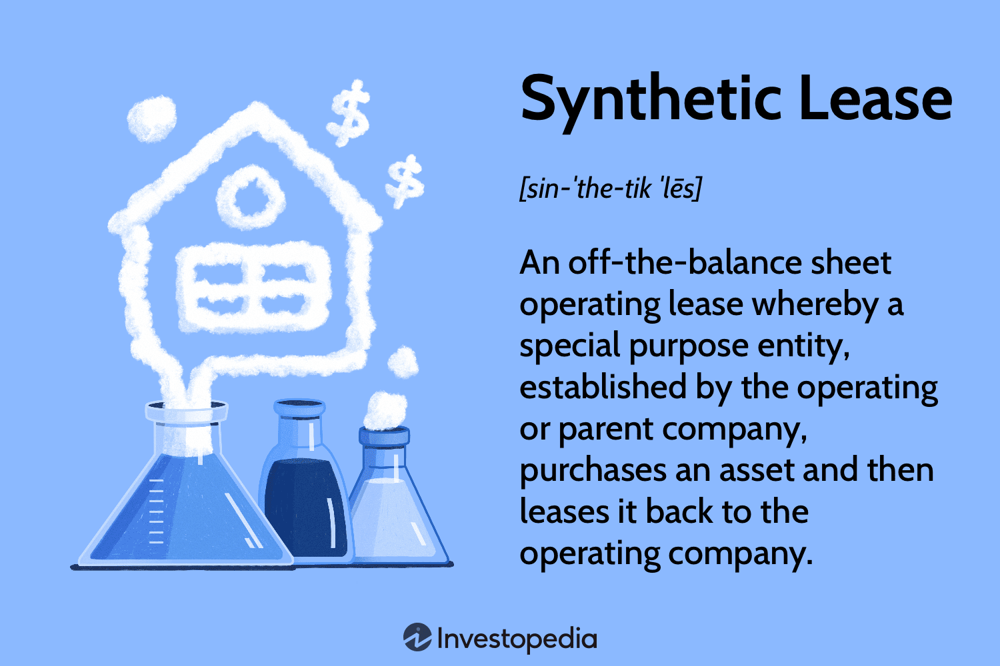

## Table of Contents

## What is a synthetic lease?

A synthetic lease is a type of lease that lets a company use a building or property without showing it as an asset on their financial statements. This kind of lease is often used by big companies to keep their debt levels looking low. It works by setting up a special company, called a special purpose entity (SPE), to own the property. The company then leases the property from the SPE, which helps them avoid showing the property as a big purchase on their books.

Synthetic leases can be tricky because they can hide how much a company really owes. If not managed carefully, they can lead to financial problems. However, when used correctly, they can help a company manage its finances better by keeping its balance sheet clean and its debt levels low. This can make the company look more financially stable to investors and lenders.

## What is a traditional lease?

A traditional lease is a simple agreement where a person or a company rents a property from the owner for a certain amount of time. The person renting, called the tenant, pays the owner, called the landlord, a regular rent. This type of lease is common for homes, apartments, and office spaces. The lease agreement usually includes details like how long the lease lasts, how much rent is due, and what rules the tenant must follow.

Traditional leases are straightforward and easy to understand. They show up clearly on a company's financial statements as a regular expense. This means that if a company is renting an office, the rent they pay each month will be listed as a cost. Unlike synthetic leases, traditional leases don't involve setting up special companies or hiding the cost of the property. They are a clear and honest way to use a property without buying it.

## How do the basic structures of synthetic and traditional leases differ?

A synthetic lease involves setting up a special company, called a special purpose entity (SPE), to own the property. The company that wants to use the property then leases it from the SPE. This setup helps the company keep the property off its balance sheet, making it look like they have less debt. Synthetic leases are often used by big companies to manage how their finances look to others. They can be complicated because they involve extra steps and can hide the true cost of the property.

On the other hand, a traditional lease is much simpler. It's just an agreement between a tenant and a landlord where the tenant pays rent to use the property for a set time. The rent payments are shown clearly on the company's financial statements as an expense. Traditional leases don't involve any special companies or tricky financial arrangements. They are straightforward and easy to understand, making them a common choice for renting homes, apartments, and office spaces.

## What are the primary financial benefits of a synthetic lease?

The main financial benefit of a synthetic lease is that it helps a company keep its balance sheet looking good. When a company uses a synthetic lease, the property it's using doesn't show up as an asset on its [books](/wiki/algo-trading-books). This means the company can keep its debt levels looking low, which can make it seem more financially stable to investors and lenders. This can be really helpful for big companies that want to manage how their finances look to others.

Another benefit is that synthetic leases can give a company more flexibility. Since the property is owned by a special purpose entity (SPE), the company can decide at the end of the lease whether to buy the property or just walk away. This can be useful if the company isn't sure about its long-term plans for the property. It's like renting with an option to buy, but without the property showing up as a big purchase on the company's financial statements.

## What are the potential risks associated with a synthetic lease?

One big risk with synthetic leases is that they can hide how much a company really owes. Because the property is owned by a special purpose entity (SPE) and not shown on the company's balance sheet, it can make the company look less in debt than it really is. If something goes wrong, like the company can't pay the lease, it could lead to big financial problems. This is because the company might have to suddenly show a lot of debt on its books, which could scare away investors and lenders.

Another risk is that synthetic leases can be very complicated. Setting up an SPE and managing a synthetic lease takes a lot of work and can be hard to understand. If the company makes a mistake or doesn't follow the rules, it could get in trouble with financial regulators. This could lead to fines or other penalties, which would hurt the company's finances even more. So, while synthetic leases can help a company's balance sheet look good, they come with a lot of risks that need to be carefully managed.

## How does a traditional lease impact a company's balance sheet?

A traditional lease shows up clearly on a company's balance sheet as a regular expense. When a company rents a property, the rent they pay each month is listed as a cost. This means that anyone looking at the company's financial statements can see exactly how much the company is spending on rent. It's a straightforward way to show the cost of using a property without buying it.

Because traditional leases are shown as expenses, they don't hide any debt. The company's balance sheet will reflect the true financial situation, showing all the money going out for rent. This can make the company look less financially stable if the rent is high, but it's honest and clear. It helps investors and lenders understand the company's real financial health.

## In what scenarios might a synthetic lease be more advantageous than a traditional lease?

A synthetic lease might be more advantageous for a big company that wants to keep its balance sheet looking good. When a company uses a synthetic lease, the property it's using doesn't show up as an asset on its books. This means the company can make its debt levels look lower, which can make it seem more financially stable to investors and lenders. This can be really helpful if the company is trying to get more investment or loans, because it looks like they have less debt than they really do.

Another scenario where a synthetic lease might be better is when a company isn't sure about its long-term plans for a property. With a synthetic lease, the property is owned by a special purpose entity (SPE), so at the end of the lease, the company can decide whether to buy the property or just walk away. This gives the company more flexibility than a traditional lease, where they're locked into paying rent for the whole lease term. So, if the company's plans might change, a synthetic lease can be a smarter choice.

## How do tax implications differ between synthetic and traditional leases?

With a traditional lease, the tax implications are pretty straightforward. The company can usually deduct the rent they pay as a business expense on their taxes. This means they can lower their taxable income by the amount they pay in rent each year. It's a simple way to save on taxes because the rent is treated just like any other cost of doing business.

Synthetic leases can be more complicated when it comes to taxes. Because the property is owned by a special purpose entity (SPE), the company might not be able to deduct the lease payments as easily. Instead, they might have to deal with different tax rules that apply to the SPE. This can make things trickier and might require the company to work with tax experts to make sure they're doing everything right. The goal is often to find ways to save on taxes, but it's not as simple as with a traditional lease.

## What are the accounting treatments for synthetic versus traditional leases under current standards?

Under current accounting standards, traditional leases are treated as operating leases. This means the company records the rent payments as an expense on its income statement each month. The property itself doesn't show up on the company's balance sheet as an asset or a liability. It's a simple way to account for the cost of renting a property, and it's easy for anyone looking at the company's financial statements to see exactly how much they're spending on rent.

Synthetic leases, on the other hand, are more complicated. They are often set up to be treated as operating leases too, but they involve a special purpose entity (SPE) that owns the property. The company leasing the property from the SPE doesn't have to show the property as an asset on its balance sheet, which can make its debt levels look lower. However, if the lease doesn't meet certain criteria, it might have to be treated as a capital lease, which means the company would have to show the property as an asset and the lease obligation as a liability on its balance sheet. This can make things trickier and requires careful management to make sure the lease is accounted for correctly.

## How do synthetic leases affect a company's debt covenants compared to traditional leases?

Synthetic leases can help a company look like it has less debt on its balance sheet, which can be good for meeting debt covenants. Debt covenants are rules set by lenders that say how much debt a company can have. If a company uses a synthetic lease, the property it's using doesn't show up as an asset or a liability on its books. This means the company can keep its debt levels looking low, which can help it stay within the limits set by its debt covenants. This can be really helpful for big companies that want to make sure they're following the rules set by their lenders.

On the other hand, traditional leases are shown as regular expenses on the company's financial statements. This means the rent the company pays each month is clearly listed as a cost, and it doesn't hide any debt. Because traditional leases don't help a company's balance sheet look better, they might make it harder for the company to meet its debt covenants if the rent is high. So, if a company is worried about staying within its debt limits, a synthetic lease might be a better choice than a traditional lease.

## What are the regulatory considerations for companies opting for synthetic leases?

When a company chooses a synthetic lease, it needs to think about the rules set by financial regulators. Synthetic leases can be tricky because they involve setting up a special company, called a special purpose entity (SPE), to own the property. Regulators want to make sure companies aren't hiding their true financial situation. So, companies need to follow strict rules to make sure their synthetic leases are set up correctly and reported honestly. If they don't, they could face fines or other penalties, which could hurt their finances.

Another thing to consider is how synthetic leases are treated under accounting rules. Companies need to make sure their synthetic leases meet the criteria to be treated as operating leases, which means the property doesn't show up on their balance sheet. If they don't meet these criteria, the lease might have to be treated as a capital lease, which would show the property as an asset and the lease as a liability. This can make things more complicated and requires careful management to make sure everything is done right.

## How have recent changes in lease accounting standards impacted the use of synthetic leases?

Recent changes in lease accounting standards, like the ones in the new rules called ASC 842 and IFRS 16, have made it harder for companies to use synthetic leases to keep their balance sheets looking good. Before these changes, companies could use synthetic leases to hide the cost of a property and make their debt levels look lower. But now, under the new rules, most leases have to be shown on the balance sheet as both an asset and a liability. This means that even if a company uses a synthetic lease, it might still have to show the property on its books, which takes away one of the main benefits of using a synthetic lease.

Because of these new rules, companies are thinking more carefully about whether to use synthetic leases. They have to weigh the benefits of keeping their debt levels looking low against the risk of not following the new accounting standards. If they don't follow the rules, they could get in trouble with financial regulators. So, while synthetic leases can still be useful for giving a company more flexibility with its property, they're not as good at hiding debt as they used to be. This has made some companies look for other ways to manage their finances.

## References & Further Reading

[1]: ["Financial Accounting Standards Board (FASB)"](https://fasb.org/standards)

[2]: ["International Financial Reporting Standards (IFRS)"](https://en.wikipedia.org/wiki/International_Financial_Reporting_Standards)

[3]: ["Advances in Financial Machine Learning"](https://www.amazon.com/Advances-Financial-Machine-Learning-Marcos/dp/1119482089) by Marcos Lopez de Prado

[4]: ["Machine Learning for Algorithmic Trading"](https://github.com/stefan-jansen/machine-learning-for-trading) by Stefan Jansen

[5]: ["Quantitative Trading: How to Build Your Own Algorithmic Trading Business"](https://www.amazon.com/Quantitative-Trading-Build-Algorithmic-Business/dp/1119800064) by Ernest P. Chan