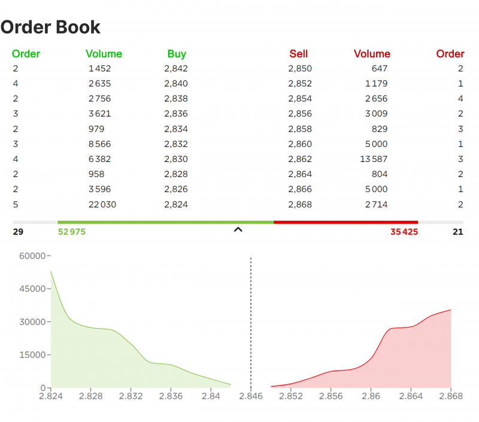

## Table of Contents

## What is a synthetic limit order book?

A synthetic limit order book is a computer-made version of a real limit order book. A limit order book is a list that shows all the buy and sell orders for a stock or other financial product. The synthetic version is created using computer models and data to guess what the real limit order book might look like. This can be useful for testing trading strategies or for learning about how markets work without using real market data.

People use synthetic limit order books because real limit order books can be hard to get or expensive. By making a synthetic version, researchers and traders can study market behavior and test their ideas in a safe way. It's like practicing on a simulator before driving a real car. This helps them understand how markets might react to different situations without risking real money.

## How does a synthetic limit order book differ from a traditional limit order book?

A synthetic limit order book is made up by a computer, while a traditional limit order book is the real list of buy and sell orders for a stock or other financial product. The traditional limit order book shows what people actually want to buy or sell at different prices. It's like a live scoreboard that updates every time someone places a new order or changes an existing one. On the other hand, a synthetic limit order book is created using computer models and data to guess what the real limit order book might look like. It's not real data, but an educated guess based on past information and patterns.

The main difference is that a traditional limit order book uses real-time data from actual market participants, while a synthetic one uses simulated data. This means that a traditional limit order book is always accurate and up-to-date, reflecting the current state of the market. A synthetic limit order book, however, might not be as accurate because it's based on assumptions and models. People use synthetic limit order books when they can't access real data, or when they want to test trading strategies in a safe environment without affecting the real market.

## What are the main components of a synthetic limit order book?

A synthetic limit order book has several main parts that help it work like a real one. The first part is the order data, which is made up of buy and sell orders at different prices. These orders are not real but are created using computer models that guess what people might want to buy or sell. The second part is the price levels, which show the different prices at which these orders are placed. Just like in a real limit order book, the synthetic one has a list of prices where people might want to trade.

Another important part is the volume, which tells how many shares or units are in each order. In a synthetic limit order book, the volume is also guessed by the computer based on past data and patterns. The last part is the time stamp, which shows when each order was placed. Even though these orders are not real, the time stamps help make the synthetic limit order book look and act like the real thing. Together, these parts help researchers and traders study and test their ideas without using real market data.

## What are the advantages of using a synthetic limit order book?

Using a synthetic limit order book has many benefits. One big advantage is that it's cheaper and easier to get than real market data. Real limit order books can be hard to access because they are often controlled by big financial companies or stock exchanges. A synthetic limit order book, on the other hand, can be made by anyone with a computer and the right software. This means that students, researchers, and small traders can study the market without spending a lot of money.

Another advantage is that a synthetic limit order book lets people test their trading ideas safely. When you use real market data, your actions can affect the market, and you might lose money if your ideas don't work. But with a synthetic limit order book, you can try out different strategies without any risk. This is like practicing a sport or a game before playing for real. It helps people learn and improve their skills without worrying about losing money or messing up the market.

## Can you explain the process of creating a synthetic limit order book?

Creating a synthetic limit order book starts with gathering historical data about a stock or financial product. This data includes past prices, trading volumes, and other market information. Using this data, a computer model is built to guess how people might want to buy or sell in the future. The model looks at patterns and trends from the past to make these guesses. For example, if a stock often has a lot of buy orders at a certain price, the model might put more buy orders at that price in the synthetic book.

Once the model is ready, it starts making up orders. It decides on the prices, the number of shares or units for each order, and the time when each order is placed. All these details are put together to create a list that looks like a real limit order book. The computer keeps updating this list to make it seem like real trading is happening. This way, the synthetic limit order book can be used to study how the market might behave or to test trading strategies without using real market data.

## What types of data are used to construct a synthetic limit order book?

To build a synthetic limit order book, people use different kinds of data from the past. This includes information about the prices at which stocks or other financial products were bought and sold, how many shares or units were traded, and when these trades happened. They also look at other things like how often the price changed, how big those changes were, and how the market reacted to news or events. All this data helps the computer model guess what people might want to buy or sell in the future.

Once the computer has this historical data, it uses it to create a model. This model looks for patterns and trends in the past data to make up new orders. It decides on the prices for these orders, how many shares or units should be in each order, and when each order should be placed. By putting all these made-up orders together, the computer creates a list that looks like a real limit order book. This synthetic book can then be used to study the market or test trading ideas without using real market data.

## How does a synthetic limit order book handle high-frequency trading?

A synthetic limit order book can be set up to mimic high-frequency trading by using fast computer models that guess how traders might act. High-frequency trading is when computers trade very quickly, often in milliseconds. To handle this in a synthetic limit order book, the computer uses past data to create lots of quick buy and sell orders. It tries to copy the speed and patterns of real high-frequency trading, making the synthetic book look and act like the real market.

This helps people study how high-frequency trading might affect the market without using real data. They can see how fast trades might change prices or how the market might react to quick buying and selling. By using a synthetic limit order book, researchers and traders can test their ideas about high-frequency trading in a safe way, without risking real money or affecting the actual market.

## What are the potential risks and limitations of using a synthetic limit order book?

Using a synthetic limit order book has some risks and limits. One big risk is that it's not real data, so it might not be accurate. The computer guesses what people might want to buy or sell, but these guesses can be wrong. If someone uses a synthetic limit order book to make trading decisions, they might lose money because the guesses were off. It's like trying to predict the weather with a model that's not always right. This means people need to be careful and not trust the synthetic book too much.

Another limit is that a synthetic limit order book can't show everything that happens in the real market. Real markets have lots of things going on, like news events, big trades, and people's feelings about the market. A synthetic book can't copy all these things perfectly. It's like trying to make a copy of a painting but missing some of the details. This means that while a synthetic limit order book is good for learning and testing, it might not be as useful for making real trading decisions because it doesn't show the full picture of the market.

## How can synthetic limit order books be used for market analysis and prediction?

Synthetic limit order books can help people study the market and make guesses about what might happen next. They do this by using past data to create a fake version of the real market. Researchers and traders can look at this fake market to see how prices might change or how people might react to different things. For example, they can test what would happen if a lot of people suddenly wanted to buy a stock. By playing around with the synthetic book, they can learn about market patterns and trends without using real money or affecting the real market.

However, synthetic limit order books are not perfect. They are based on guesses and past data, so they might not always be right. This means that while they are good for learning and testing ideas, they should not be the only thing people use to make real trading decisions. It's like using a practice field to get better at a sport; it helps, but you still need to play the real game to see how things really work. So, while synthetic limit order books are a useful tool for market analysis and prediction, they should be used carefully and along with other information.

## What are the regulatory considerations for synthetic limit order books?

When it comes to synthetic limit order books, there are some rules and things to think about. Since these books are not real and are made up by computers, they don't have the same strict rules as real markets. But, if people use them to make real trading decisions, they need to be careful. Regulators might want to make sure that people are not using fake data to trick others or to do things that are not allowed in the real market. So, it's important for people to be honest about using synthetic books and not pretend that the data is real.

Also, regulators might want to know how synthetic limit order books are being used. They might check to see if these books are helping people learn and test ideas without hurting the real market. If someone uses a synthetic book to practice high-frequency trading, for example, regulators might want to make sure it's not causing problems. Overall, while synthetic limit order books are useful tools, people need to follow the rules and use them in a way that is fair and honest.

## How do synthetic limit order books integrate with existing trading systems?

Synthetic limit order books can be added to existing trading systems to help people learn and test their trading ideas. They are not real, so they don't affect the actual market. Instead, they work alongside the real trading system, letting people practice without risking money. For example, a trader might use a synthetic book to see how a new strategy would work before trying it in the real market. This helps them get better at trading without messing up the real market.

To use a synthetic limit order book with a real trading system, the computer needs to be set up to run both at the same time. The synthetic book uses past data to guess what the market might do, while the real system shows what is actually happening. By comparing the two, people can see how well their guesses match up with reality. This can help them improve their models and make better trading decisions. But they need to remember that the synthetic book is just a guess, so it should not be the only thing they use to make real trades.

## What advanced techniques can be applied to optimize the performance of a synthetic limit order book?

To make a synthetic limit order book work better, people can use some smart tricks. One way is to use machine learning. This is when computers learn from past data to make better guesses about the future. By feeding the computer lots of information about how the market has acted before, it can get better at making up orders that look more like real ones. Another trick is to use more detailed data. Instead of just looking at prices and volumes, the computer can also look at things like how often the price changes or how the market reacts to news. This can help the synthetic book act more like the real market.

Another way to improve a synthetic limit order book is to make it faster. High-frequency trading happens very quickly, so the computer needs to be able to keep up. By using special computer programs that can handle lots of data very fast, the synthetic book can mimic high-frequency trading better. Also, people can test different models to see which one works best. By trying out different ways of making up orders and seeing which one matches the real market more closely, they can keep making the synthetic book better and better.

## References & Further Reading

Bouchaud, J.-P., Farmer, J. D., & Lillo, F. (2009). "How Markets Slowly Digest Changes in Supply and Demand." This work offers valuable insights into the dynamics of market adaptation following fluctuations in supply and demand, emphasizing the underlying processes that drive market changes. It is highly pertinent for readers interested in understanding the implications of synthetic limit order books on market behaviors.

O'Hara, M. (1995). "Market Microstructure Theory." O'Hara's book is a foundational text that elaborates on the intricate mechanisms governing trading exchanges and price formation. This resource aids in comprehending how synthetic orders and traditional orders coexist and interact within financial markets, providing a strong theoretical framework for interpreting modern trading practices.

Aldridge, I. (2009). "High-Frequency Trading: A Practical Guide to Algorithmic Strategies and Trading Systems." Aldridge's guide is essential for practitioners keen on mastering algorithmic trading. It focuses on high-frequency trading strategies, algorithms, and the associated systems, encompassing the practical aspects and challenges of deploying synthetic limit order books in real-world trading scenarios.

Gould, M. D., et al. (2013). "Limit Order Books." This resource provides an extensive examination of limit order books, detailing their structure, function, and role in present-[day trading](/wiki/day-trading-spy) environments. It serves as a comprehensive reference for understanding the transition from traditional to synthetic limit order books, particularly in algorithmic trading contexts.

Hasbrouck, J. (2007). "Empirical Market Microstructure: The Institutions, Economics, and Econometrics of Securities Trading." Hasbrouck's work delves into the empirical aspects of market microstructures, offering insights into the statistical and econometric analysis of trading processes. This book is crucial for those looking to analyze the impacts of synthetic limit order books quantitatively and enhance strategy optimization through empirical data examination.

