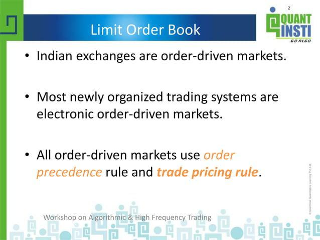

The rapid advancement of technology has fundamentally transformed the landscape of financial markets. With the rise of algorithmic trading, market participants are now capable of executing complex strategies with remarkable speed and precision. At the heart of this sophisticated trading environment lies a crucial component known as the synthetic limit order book.

Algorithmic trading, often abbreviated as algo trading, utilizes computer algorithms to make trading decisions and execute orders. These algorithms can process vast amounts of data, analyze market trends, and execute trades within milliseconds. As a result, they enable traders to take advantage of fleeting market opportunities that would be impossible to capitalize on using traditional manual methods. A key element in facilitating such rapid and complex trading strategies is the synthetic limit order book.

A synthetic limit order book is a virtual representation of trading activity and potential orders in the market. Unlike traditional limit order books, which record actual orders placed in the market, synthetic limit order books simulate the presence of potential orders. They do so by aggregating data from multiple sources and utilizing algorithmic constructs to mimic real market conditions. This allows traders to visualize and anticipate market dynamics more effectively, enhancing their ability to implement sophisticated strategies.

This article explores the concept of synthetic limit order books and their pivotal role in algorithmic trading. It examines how these virtual constructs function and contrasts them with their traditional counterparts. Furthermore, the discussion covers the benefits they provide, such as enhanced market transparency, improved liquidity management, and the ability to execute complex multi-layered strategies with greater flexibility and efficiency.

However, the use of synthetic limit order books is not without its challenges. The increased volatility and risk of latency, particularly in high-frequency trading environments, present notable challenges that require attention. Additionally, maintaining data quality and addressing regulatory concerns are critical for the successful deployment of these tools. As technology continues to evolve, the integration of advanced systems, such as machine learning and blockchain, may hold the potential to further refine and enhance the capabilities of synthetic limit order books.

In summary, synthetic limit order books represent a fundamental advancement in trading technology, empowering traders with the tools necessary to navigate the complexities of modern financial markets. This article provides a comprehensive overview of their role in algorithmic trading, including the associated benefits and challenges, as well as insights into the technological and regulatory considerations that govern their use.

## Table of Contents

## Understanding Synthetic Limit Order Books

A synthetic limit [order book](/wiki/order-book-trading-strategies) (SLOB) represents an advanced iteration of traditional limit order [books](/wiki/algo-trading-books), tailored to enhance the efficiency and versatility of order execution in [algorithmic trading](/wiki/algorithmic-trading). Unlike their conventional counterparts, which rely solely on the current exchange's order book, SLOBs integrate data and functionality from multiple exchanges and across multiple financial instruments, creating a more holistic trading mechanism.

Traditional limit order books are structured around the aggregation of buy and sell orders at specified prices for a given security. Traders place these orders directly onto an exchange, where they remain until executed or canceled. The core advantage of this straightforward approach lies in its transparency and simplicity. However, this system can be limiting, particularly for traders engaging in complex strategies across different markets or asset classes.

In contrast, a synthetic limit order book expands these capabilities by incorporating synthetic orders—orders that are not directly placed on an exchange but are instead constructed through algorithmic strategies. Synthetic orders allow for more intricate trading tactics, such as spread trading and basket trading, which can be essential in high-frequency trading environments.

The structure of a SLOB is inherently hierarchical and modular. At its core are parent orders, which represent the primary strategy a trader wishes to execute. These parent orders are dissected into child orders, which are the actual executable components. This decomposition enables traders to better manage and control trading strategies as collective interactions rather than isolated mandates. The relationship between parent and child orders can be tracked and monitored through unique identifiers within the SLOB infrastructure, such as ParentID and ChildOrderID, facilitating detailed order management and tracking.

In modern trading environments, synthetic orders enhance flexibility by allowing algorithmic traders to respond dynamically to market fluctuations across various venues and instruments. For example, they can adjust child orders in real-time based on market conditions, often using predictive analytics and [machine learning](/wiki/machine-learning) algorithms. This adaptability mitigates the risks of adverse selection and slippage, which can be prevalent in high-frequency trading.

Finally, while synthetic limit order books offer substantial benefits, they also introduce complexity into the trading environment, necessitating sophisticated order management systems and infrastructure to support the nuanced relationships between orders. Despite these challenges, the role of synthetic orders continues to grow as technological capabilities expand, providing traders with robust tools for optimizing their trading strategies in increasingly competitive markets.

## Key Components of Synthetic Limit Order Books

Synthetic limit order books form a crucial part of modern algorithmic trading, providing traders with tools to optimize order placement and execution. These order books incorporate various synthetic orders, each tailored to enhance trading efficiency and strategy execution.

### Types of Synthetic Orders

**ADL Algos**: The Automated Decision Logic (ADL) algorithms are designed to execute trade strategies autonomously. These algorithms use predefined logic to make decisions based on market conditions, optimizing execution by autonomously adjusting order parameters such as price and quantity.

**Aggregator Orders**: Aggregator orders combine liquidity from multiple sources, presenting the trader a consolidated view of market opportunities. This order type enables traders to access different markets, benefiting from the best available prices and reducing potential price impact.

**Autospreader Orders**: Autospreader orders facilitate creating and managing complex spreads across different instruments or markets. This functionality allows for real-time hedging and arbitrage strategies, ensuring the precise execution of spread trades.

**Staged Orders**: Staged orders enable pre-planned order execution, which can be activated based on specific triggers or during certain market conditions. This type of order is essential for executing strategies that require precise timing and conditional deployment.

**TT Order Types**: Trading Technologies (TT) offers specialized order types that allow for advanced execution functionalities. TT (Trade Technologies) uses sophisticated algorithms to manage the intricacies of order execution, allowing traders to implement complex strategies efficiently.

### Hierarchical Structure and Management of Orders

Synthetic limit order books utilize a hierarchical structure composed of parent and child orders. Parent orders are the primary directives, representing the broader trading strategy. Within this framework, child orders are generated based on the parameters defined by the parent order. This hierarchical approach allows for meticulous management and adjustment of trading strategies.

### Interaction with Exchange Order Books

Synthetic orders interact dynamically with exchange order books, bridging off-book and on-book trading activities. By incorporating both synthetic and conventional orders, traders overcome typical order book limitations. The integration of synthetic orders with traditional exchange books enhances [liquidity](/wiki/liquidity-risk-premium) access, allowing for better positioning and execution in diverse market conditions.

### Significance of Key Columns

The columns **TTOrderID**, **ParentID**, and **Child Orders** are pivotal for tracking and managing orders within synthetic limit order books:

- **TTOrderID**: This unique identifier facilitates tracking and managing each order within the system, ensuring that trades are executed and reported accurately.

- **ParentID**: This column links child orders to their respective parent orders, enabling the hierarchical management of strategies. The structure allows for seamless adjustments to child orders without disrupting the overarching strategy.

- **Child Orders**: This column provides details about subordinate orders under the parent order, capturing the granularity necessary for precise trading strategy execution.

By understanding these key components and their interplay within synthetic limit order books, traders can leverage sophisticated algorithmic trading strategies to exploit market opportunities.

## Benefits of Using Synthetic Limit Order Books in Algo Trading

Synthetic limit order books (SLOBs) offer substantial advantages to algorithmic trading, primarily by enhancing market transparency and insights. With SLOBs, traders can access detailed information about the supply and demand at various price levels, allowing them to make more informed decisions. By providing a comprehensive view of the market, SLOBs enable traders to anticipate price movements and strategize accordingly.

The improved liquidity management and reduced market impact of synthetic limit order books is another significant benefit. SLOBs aggregate orders from multiple exchanges, optimizing order execution by finding the best available prices. This aggregation minimizes the market impact of large orders, as trades are dispersed across different venues, reducing the likelihood of significant price disruption. Consequently, it maintains tighter spreads and enhances overall market efficiency.

SLOBs also offer flexibility and scalability for executing complex trading strategies. Traders can deploy advanced algorithms that operate across various asset classes and geographic regions. The ability to handle a high [volume](/wiki/volume-trading-strategy) of trades with varying degrees of complexity makes SLOBs an invaluable tool for institutional investors seeking to implement sophisticated trading strategies with precision.

Increased efficiency and speed in trade execution is another critical advantage offered by synthetic limit order books. The automation and algorithmic nature of SLOBs enable rapid execution of trades, capitalizing on fleeting market opportunities. With reduced latency and immediate order fulfillment, traders can achieve better price execution and potentially higher returns.

Furthermore, synthetic limit order books facilitate [backtesting](/wiki/backtesting) and strategy optimization. By simulating past market conditions, traders can evaluate the performance of their algorithms under various scenarios. This capability allows for refining strategies, identifying weaknesses, and enhancing overall trading performance. Backtesting with SLOBs provides a robust framework for continuous improvement, leading to more resilient and adaptive trading strategies.

In summary, synthetic limit order books significantly contribute to the effectiveness of algorithmic trading. By enhancing market transparency, improving liquidity management, offering flexibility, and facilitating rapid execution, SLOBs empower traders to achieve more efficient and profitable outcomes. Additionally, the ability to backtest and optimize strategies ensures that traders remain competitive and responsive to dynamic market conditions.

## Challenges and Risks in Using Synthetic Limit Order Books

The utilization of synthetic limit order books (SLOBs) in algorithmic trading presents a range of challenges and risks, particularly in the context of market [volatility](/wiki/volatility-trading-strategies). Market volatility can significantly impact SLOBs, as rapid price changes and varying liquidity can lead to increased uncertainty in price discovery and execution. High market volatility might cause the synthetic orders to be less effective, as the strategies embedded within them depend on stability to optimize execution and reduce costs.

Latency is another critical risk associated with synthetic limit order books, especially in high-frequency trading environments where speed is crucial. Latency refers to the delay between receiving market information and executing trades based on that information. Even a few milliseconds of delay can lead to adverse selection, where traders are more likely to transact with informed parties, resulting in unfavorable prices. High-frequency traders must manage this latency to minimize slippage and ensure optimal trade execution.

Maintaining data quality is also a complex challenge, as synthetic limit order books require vast amounts of real-time and historical data to function effectively. Poor data quality can lead to incorrect order representations and flawed strategy optimizations, enhancing the risk of execution errors and market misconceptions. Moreover, slippage, or the difference between the expected price of a trade and the actual executed price, can be exacerbated by poor data quality and unpredictable market conditions.

Regulatory challenges are another key consideration for synthetic and algorithmic trading. Regulators are increasingly scrutinizing algorithmic trading practices due to their potential to disrupt markets and their role in past financial crises. Compliance with regulatory frameworks is essential, necessitating extensive record-keeping, transparency, and robust risk management practices to ensure that synthetic orders do not contribute to market instability.

In summary, while synthetic limit order books offer significant advantages in executing sophisticated trading strategies, they also pose substantial challenges and risks. Effective management of these risks requires advanced technological infrastructure, robust data management practices, and adherence to regulatory standards to ensure market integrity and efficient trading operations.

## Technological and Regulatory Considerations

Technological infrastructure plays a pivotal role in the operation and management of synthetic limit order books, which are fundamental in algorithmic trading. Efficient handling of massive volumes of data and performing complex calculations in real-time demand robust computational and networking systems. High-performance servers, capable of executing trades within microseconds, form the backbone of this infrastructure. Co-location services, where trading servers are placed in proximity to exchange data centers, are commonly used to reduce latency.

Data providers are critical to the functionality of synthetic limit order books, supplying both historical and real-time market data. Real-time data is essential for accurate decision-making and timely trade execution. Disparities in data quality can significantly impact the performance of trading algorithms, emphasizing the need for reliable and consistent data feeds. Therefore, partnerships with reputable data providers are imperative to accessing precise and immediate information.

Regulatory frameworks governing synthetic orders and algorithmic trading are diverse and continually evolving. Regulatory bodies such as the U.S. Securities and Exchange Commission (SEC) and the European Securities and Markets Authority (ESMA) have established guidelines to ensure fair and transparent trading. These regulations mandate the monitoring of trading activities and the maintenance of detailed audit trails. Compliance with these frameworks is crucial for mitigating risks associated with high-frequency trading and preventing market manipulation.

Emerging technologies are poised to further enhance the management of synthetic limit order books. Machine learning algorithms can analyze vast datasets to uncover patterns and optimize trading strategies. These algorithms are adept at identifying market trends and adapting to volatile conditions, offering a competitive edge. Additionally, blockchain technology presents opportunities for improving the transparency and security of order book operations. Its decentralized ledger system ensures that transaction records are immutable, reducing the risk of data tampering and enhancing trust among market participants.

In summary, the technological and regulatory landscape for synthetic limit order books is complex but essential for the efficient functioning of modern financial markets. Technological advancements and stringent regulatory measures work in tandem to facilitate secure, fast, and transparent trading activities.

## Conclusion and Future Prospects

Synthetic limit order books play a pivotal role in the realm of algorithmic trading, serving as a core component that facilitates the execution of complex trading strategies. Their importance lies in providing enhanced market transparency and improved liquidity management, which are crucial for minimizing market impact and optimizing trading outcomes. By offering a structured environment where synthetic orders are efficiently managed and executed, traders can leverage these systems to gain a competitive edge through speed and precision in high-frequency trading scenarios.

The future of synthetic limit order books appears promising as technological advancements continue to unfold. Emerging technologies such as machine learning and blockchain present exciting opportunities to further optimize order book management. Machine learning can be utilized to predict market movements and adjust trading strategies in real-time, enhancing the decision-making process. Meanwhile, blockchain technology offers a secure and transparent solution for order validation and execution, reducing the risk of fraud and increasing trust in trading systems.

Balancing technological innovation with risk management remains a critical consideration for the effective utilization of synthetic limit order books. As algorithms become more sophisticated, the potential for system vulnerabilities could increase. Therefore, robust security measures and vigilant monitoring are necessary to mitigate potential risks associated with high-frequency trading, such as system failures or data breaches.

Continuous learning is essential for trading professionals navigating the evolving landscape of algorithmic trading. Staying abreast of technological advancements and regulatory changes is key to maintaining a competitive advantage and ensuring compliance. Training programs and industry workshops can provide valuable insights and skill development crucial for adapting to new tools and methodologies.

In conclusion, the synthetic limit order book is indispensable in modern algorithmic trading, offering the potential for significant efficiency gains. As the trading environment evolves, embracing technological innovations while maintaining a strong focus on risk management will be essential for harnessing the full potential of these sophisticated trading systems.

## References & Further Reading

Bouchaud, J.-P., Farmer, J. D., & Lillo, F. (2009). "How Markets Slowly Digest Changes in Supply and Demand." This work offers valuable insights into the dynamics of market adaptation following fluctuations in supply and demand, emphasizing the underlying processes that drive market changes. It is highly pertinent for readers interested in understanding the implications of synthetic limit order books on market behaviors.

O'Hara, M. (1995). "Market Microstructure Theory." O'Hara's book is a foundational text that elaborates on the intricate mechanisms governing trading exchanges and price formation. This resource aids in comprehending how synthetic orders and traditional orders coexist and interact within financial markets, providing a strong theoretical framework for interpreting modern trading practices.

Aldridge, I. (2009). "High-Frequency Trading: A Practical Guide to Algorithmic Strategies and Trading Systems." Aldridge's guide is essential for practitioners keen on mastering algorithmic trading. It focuses on high-frequency trading strategies, algorithms, and the associated systems, encompassing the practical aspects and challenges of deploying synthetic limit order books in real-world trading scenarios.

Gould, M. D., et al. (2013). "Limit Order Books." This resource provides an extensive examination of limit order books, detailing their structure, function, and role in present-[day trading](/wiki/day-trading-spy) environments. It serves as a comprehensive reference for understanding the transition from traditional to synthetic limit order books, particularly in algorithmic trading contexts.

Hasbrouck, J. (2007). "Empirical Market Microstructure: The Institutions, Economics, and Econometrics of Securities Trading." Hasbrouck's work delves into the empirical aspects of market microstructures, offering insights into the statistical and econometric analysis of trading processes. This book is crucial for those looking to analyze the impacts of synthetic limit order books quantitatively and enhance strategy optimization through empirical data examination.