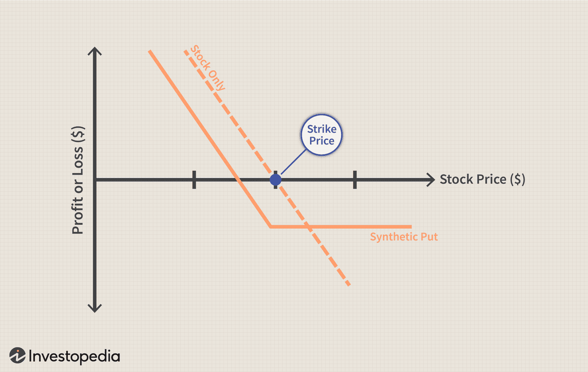

## Table of Contents

## What are synthetic options?

Synthetic options are a way to create the same effect as buying or selling an option, but using different financial tools. Instead of buying an actual option, you use a combination of stocks and other options to mimic the payoff of the option you want. This can be useful for traders who want to achieve specific investment goals or manage risk in different ways.

For example, to create a synthetic call option, you can buy the stock and buy a put option at the same time. This combination will give you the same financial outcome as if you had bought a call option. Synthetic options can be more flexible and sometimes cheaper than regular options, but they can also be more complex to set up and manage. It's important for traders to understand how they work before using them.

## How do synthetic options differ from traditional options?

Synthetic options and traditional options both let you bet on where a stock's price might go, but they work differently. Traditional options are straightforward: you buy a call option if you think the stock price will go up, or a put option if you think it will go down. You pay a premium for this right, and if the stock moves the way you expect, you can make money.

Synthetic options, on the other hand, are like a recipe made from different ingredients. Instead of buying one option, you use a mix of stocks and other options to create the same effect as a traditional option. For example, to make a synthetic call option, you might buy the stock and a put option at the same time. This can be cheaper or more flexible, but it's also more complicated and requires a good understanding of how all the pieces fit together.

In short, traditional options are simpler and more direct, while synthetic options offer more ways to customize your strategy but require more knowledge and careful management. Both can be useful tools for investors, depending on what they're trying to achieve.

## What are the basic components of a synthetic option?

A synthetic option is made up of two main parts: stocks and options. To create a synthetic call option, you buy the stock and also buy a put option on that same stock. This combination gives you the same financial outcome as if you had bought a traditional call option. On the other hand, to create a synthetic put option, you sell the stock short and buy a call option. This setup mimics the effect of buying a traditional put option.

The idea behind synthetic options is to use these two parts to achieve the same result as a traditional option but in a different way. This can sometimes be cheaper or offer more flexibility, depending on what you're trying to do with your investment. However, because you're dealing with multiple pieces, synthetic options can be more complex and require a good understanding of how stocks and options work together.

## Can you explain how to construct a synthetic long option?

A synthetic long option is a way to mimic the effect of buying a call option without actually buying one. To do this, you need to buy the stock and also buy a put option on the same stock. The put option acts like insurance, protecting you if the stock price goes down. If the stock price goes up, you make money from the stock, just like you would with a call option. If the stock price goes down, the put option helps limit your losses.

For example, imagine you want to invest in Company XYZ, which is currently trading at $50 per share. Instead of buying a call option, you buy 100 shares of XYZ at $50 each, which costs you $5,000. At the same time, you buy a put option with a strike price of $50 for a premium of $2 per share, which costs you another $200. Now, if XYZ's stock price goes up to $60, you make $1,000 from the stock (100 shares x $10 gain per share), and you only lose the $200 premium you paid for the put option. If the stock price drops to $40, you lose $1,000 on the stock, but you can exercise the put option to sell the stock at $50, limiting your loss to the $200 premium. This setup gives you the same payoff as a call option but with different pieces.

## How does one create a synthetic short option?

A synthetic short option is a way to mimic the effect of buying a put option without actually buying one. To do this, you sell the stock short and buy a call option on the same stock. Selling the stock short means you borrow shares and sell them, hoping to buy them back later at a lower price. The call option you buy acts as a safety net, protecting you if the stock price goes up instead of down.

For example, let's say you think the stock of Company ABC, which is trading at $30 per share, will go down. Instead of buying a put option, you sell 100 shares of ABC short at $30 each, which means you get $3,000. At the same time, you buy a call option with a strike price of $30 for a premium of $1 per share, which costs you $100. If ABC's stock price drops to $20, you can buy back the shares at $20, making a $1,000 profit (100 shares x $10 gain per share), minus the $100 premium for the call option. If the stock price rises to $40, you lose $1,000 on the stock, but you can exercise the call option to buy the shares at $30, limiting your loss to the $100 premium. This setup gives you the same payoff as a put option but with different pieces.

## What are the primary uses of synthetic options in trading?

Synthetic options are useful for traders who want to be flexible with their investments. They can help you make money if you think a stock's price will go up or down, just like regular options. But with synthetic options, you can use different pieces like stocks and other options to create the same effect. This can sometimes be cheaper than buying a regular option, especially if you can find good deals on the pieces you need. It's like building your own custom tool instead of buying one off the shelf.

Another big use for synthetic options is to manage risk. By using stocks and options together, you can protect yourself from big losses if the market moves against you. For example, if you're worried about a stock going down, you can use a synthetic option to limit how much money you could lose. This way, you can still try to make money if the stock goes up, but you won't lose as much if it goes down. It's all about finding the right balance between making money and keeping your investments safe.

## What are the risks associated with trading synthetic options?

Trading synthetic options can be risky because they are more complicated than regular options. When you use synthetic options, you are dealing with multiple pieces like stocks and other options. If you don't understand how these pieces work together, you could lose money. For example, if you set up a synthetic option wrong, it might not protect you from losses the way you expect. Also, the costs of buying the pieces you need can add up, and if the market moves in a way you didn't expect, you could end up losing more money than you planned.

Another risk is that synthetic options can be harder to manage. Because they involve more parts, you have to keep an eye on all of them. If the stock price changes a lot, you might need to make quick decisions to adjust your strategy. This can be stressful and requires a good understanding of the market. If you're not ready to handle these adjustments, you could miss out on making money or lose more than you expected. So, it's important to know what you're doing before you start trading synthetic options.

## How do synthetic options affect portfolio diversification?

Synthetic options can help with portfolio diversification by giving you more ways to invest in different stocks and strategies. When you use synthetic options, you can create positions that act like you own the stock or bet against it without actually buying or selling the stock. This means you can spread your money across more investments without needing a lot of cash. For example, if you want to invest in different industries but don't have enough money to buy shares in all of them, you can use synthetic options to get exposure to those industries.

However, synthetic options can also make your portfolio more complicated and risky if you're not careful. Because they involve multiple pieces like stocks and other options, they can be harder to manage. If you don't understand how all these parts work together, you might end up with a portfolio that's too focused on one stock or strategy, which can be risky. So, while synthetic options can help you diversify, it's important to use them wisely and make sure you understand what you're doing.

## What are the tax implications of trading synthetic options?

Trading synthetic options can have different tax implications compared to trading regular options. When you use synthetic options, you're dealing with stocks and other options, which can lead to different kinds of taxes. For example, if you make money from the stock part of your synthetic option, you might have to pay capital gains tax. This tax can be short-term if you hold the stock for less than a year, or long-term if you hold it for more than a year. Short-term gains are taxed at your regular income tax rate, while long-term gains have a lower tax rate.

The options part of your synthetic option can also affect your taxes. If you buy or sell options, you might have to report these as part of your income. The tax treatment of options can be complex, and it depends on whether you're dealing with equity options or index options, and whether you're exercising them or letting them expire. It's important to keep good records of all your trades and talk to a tax professional to make sure you're handling your taxes correctly. They can help you understand how synthetic options fit into your overall tax situation and make sure you're not missing any important details.

## Can synthetic options be used for hedging, and if so, how?

Yes, synthetic options can be used for hedging. Hedging is like buying insurance for your investments. It helps protect you from losing too much money if the market moves against you. With synthetic options, you can set up a position that acts like a safety net. For example, if you own a stock and you're worried it might go down, you can create a synthetic put option by selling the stock short and buying a call option. This setup helps limit your losses if the stock price drops.

Using synthetic options for hedging can be more flexible than using regular options. You can adjust the pieces of your synthetic option to fit your needs better. For instance, you can choose different strike prices or expiration dates for the options you use. This can help you manage your risk more precisely. However, because synthetic options are more complex, it's important to understand how they work before using them for hedging. If you make a mistake, you might not get the protection you're looking for.

## What advanced strategies can be implemented using synthetic options?

Synthetic options can be used for advanced strategies like delta-neutral trading. This means you set up your investments so they don't change much in value when the stock price moves a little. To do this, you might buy a stock and then use options to balance out the risk. For example, if you buy 100 shares of a stock, you can sell call options and buy put options to make sure your overall position stays stable. This can be useful if you want to make money from small changes in the stock price without taking big risks.

Another advanced strategy is called a synthetic straddle. This is when you want to bet on big moves in the stock price but you're not sure which way it will go. You can create a synthetic straddle by buying the stock and a put option, and then selling a call option at the same time. If the stock price goes up a lot, you make money from the stock but lose on the call option. If the stock price goes down a lot, you lose money on the stock but make money from the put option. This strategy can help you profit from big swings in the market, but it's complicated and requires careful management.

Using synthetic options for these advanced strategies can be powerful, but it's also risky. Because you're dealing with multiple pieces like stocks and options, you need to understand how they all work together. If you make a mistake, you could lose more money than you planned. So, it's important to learn about synthetic options and practice with them before using them in real trading.

## How do market conditions influence the effectiveness of synthetic options?

Market conditions can really change how well synthetic options work. When the market is calm and stock prices don't move much, synthetic options can be a good way to make small profits without taking big risks. For example, if you use a delta-neutral strategy, you can make money from small changes in the stock price. But if the market is very quiet, the costs of setting up the synthetic option might be more than what you make, so it's important to think about these costs.

On the other hand, when the market is moving a lot, synthetic options can be very useful but also more risky. If you think the stock price will go up or down a lot, you can use a synthetic straddle to bet on big moves. This can help you make money if the stock price changes a lot, but it can also lead to big losses if the market doesn't move the way you expect. So, you need to watch the market closely and be ready to make quick changes to your strategy.

## What are financial derivatives?

Financial derivatives are sophisticated financial instruments whose value depends on the performance of an underlying asset, index, or [interest rate](/wiki/interest-rate-trading-strategies). These contracts serve as essential tools in the financial markets for risk management, speculation, and arbitrage. The versatility and utility of derivatives stem from their ability to provide exposure to price movements of various assets without necessitating ownership of the asset itself. 

Among the most widely recognized types of financial derivatives are options, futures, forwards, and swaps. Each of these instruments has unique features and applications:

1. **Options**: Options are contracts that confer the holder the right, but not the obligation, to buy (call option) or sell (put option) an asset at a predetermined price, known as the strike price, within a specified period. The flexibility of options markets allows for a multitude of strategies, accommodating both hedgers who aim to mitigate risk and speculators seeking to profit from market fluctuations.

2. **Futures**: Unlike options, futures contracts obligate the holder to buy or sell an asset at a predetermined price at a specific future date. These contracts trade on exchanges and are standardized in terms of maturity and size, contributing to market liquidity but also imposing margin requirements.

3. **Forwards**: Similar to futures, forwards are agreements to buy or sell an asset at a set price on a future date. However, forward contracts are private agreements between parties and are customizable, which can make them less liquid compared to standardized futures.

4. **Swaps**: Swaps involve the exchange of cash flows or other financial instruments between parties. Interest rate swaps, for example, may involve swapping fixed interest rate payments for floating rate payments, offering companies a tool to manage exposure to fluctuations in interest rates.

Options, as a significant category of derivatives, offer particular advantages due to their asymmetric risk profile. The holder of an option can benefit from favorable moves in the underlying asset's price while limiting potential losses to the premium paid for the option. This characteristic makes options attractive for both risk management and speculative purposes, providing opportunities to construct complex strategies tailored to anticipated market events or conditions without direct investment in the underlying assets.

In conclusion, financial derivatives, including options, provide varied benefits and opportunities in financial markets, contributing crucially to their participants' ability to hedge, speculate, and engage in [arbitrage](/wiki/arbitrage) efficiently and effectively.

 to Synthetic Options

Synthetic options are sophisticated financial instruments designed to mimic the payoff profiles of standard options but through the use of different underlying components. This replication is achieved by strategically combining positions in other financial securities. The primary advantage of synthetic options lies in their ability to offer similar market exposure as traditional options, often with distinct cost or risk characteristics.

### Synthetic Call and Put

A **synthetic call** is constructed by taking a long position in an underlying asset and simultaneously purchasing a long put option on that asset. This combination effectively replicates the payoff structure of a conventional call option. Mathematically, the payoff of a synthetic call at expiration can be represented as:

$$
\text{Synthetic Call Payoff} = \max(0, S_T - K) = (S_T - K)^+
$$

where $S_T$ is the asset price at expiration and $K$ is the strike price of the put option. The logic behind this setup is straightforward: the long put option provides downside protection, while the ownership of the asset allows for participation in upside movements.

Conversely, a **synthetic put** achieves its payoff by holding a short position in the underlying asset combined with a long call option. The payoff mirror that of a traditional put option, offering profit potential if the asset price falls below a predetermined level. The synthetic put's payoff at expiration is defined as:

$$
\text{Synthetic Put Payoff} = \max(0, K - S_T) = (K - S_T)^+
$$

Here, the long call provides insurance against large movements upward in asset prices, which cause losses in a short position.

These synthetic strategies enable investors to tailor their exposure to market movements with precision and flexibility. They can serve as building blocks for more complex strategies, enhancing potential returns or managing risks associated with existing portfolios.

## References & Further Reading

[1]: ["Option Pricing Models and Volatility Using Excel-VBA"](https://onlinelibrary.wiley.com/doi/epdf/10.1002/9781119202097.fmatter) by Fabrice D. Rouah, Gregory Vainberg

[2]: Hull, J. C. (2018). ["Options, Futures, and Other Derivatives."](https://www.semanticscholar.org/paper/Options%2C-Futures%2C-and-Other-Derivatives-Hull/89bdee500c8623864fc9eb7a471546aa713acc44) Pearson Education Limited.

[3]: Chan, E. (2009). ["Quantitative Trading: How to Build Your Own Algorithmic Trading Business"](https://github.com/ftvision/quant_trading_echan_book). John Wiley & Sons.

[4]: Brunnermeier, M. K., & Pedersen, L. H. (2009). ["Market Liquidity and Funding Liquidity."](https://www.nber.org/papers/w12939) The Review of Financial Studies, 22(6), 2201-2238.

[5]: Jansen, S. (2020). ["Machine Learning for Algorithmic Trading, 2nd Edition"](https://www.amazon.com/Machine-Learning-Algorithmic-Trading-alternative/dp/1839217715). Packt Publishing.

[6]: Lopez de Prado, M. (2018). ["Advances in Financial Machine Learning"](https://www.amazon.com/Advances-Financial-Machine-Learning-Marcos/dp/1119482089) John Wiley & Sons.

[7]: Aronson, D. R. (2006). ["Evidence-Based Technical Analysis: Applying the Scientific Method and Statistical Inference to Trading Signals"](https://www.amazon.com/Evidence-Based-Technical-Analysis-Scientific-Statistical/dp/0470008741). Wiley Trading.