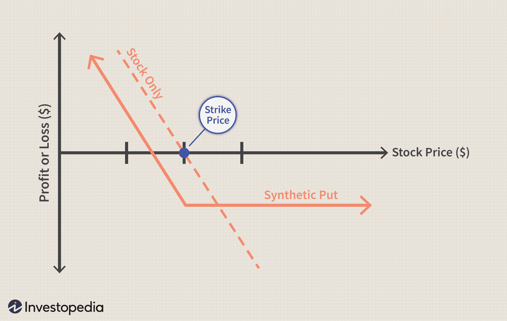

Financial derivatives like options are integral to modern trading strategies, offering traders mechanisms to hedge risks and enhance returns. These instruments allow market participants to operate with flexibility, responding to diverse market conditions without definitively committing capital until necessary. An option provides the right, but not the obligation, to buy or sell an asset, helping traders implement various strategic goals such as risk management, income generation, or pure speculation. Options trading involves constructing complex and innovative strategies to control and manage market exposure, among which synthetic options stand out. These synthetic instruments creatively mimic other financial positions and offer unique pathways to achieve specific trading objectives.

One notable variation within options trading is the synthetic put, a strategy developed as an alternative to traditional options. It involves configurations that mimic the payoff and risk profile of a classic put option but are structured differently. These configurations prove versatile and can be customized to meet specific risk management requirements when executed properly. With the right application, synthetic puts can provide traders the ability to protect against adverse price movements while still allowing for exposure to potential gains.



Enhancing these strategies with algorithmic, or algo trading, provides significant advantages by introducing automation, precision, and speed. Algorithms can systematically execute trades based on pre-defined criteria, significantly reducing human error and bias. Algorithmic trading enables practitioners to process vast amounts of market data in real time, applying complex strategies like synthetic options more effectively. By combining these technological advancements with financial insights, traders can optimize their operations, aligning them more precisely with their financial goals and market forecasts.

This article explores the intersection of these elements—financial derivatives, options trading, synthetic strategies, and algorithmic trading—highlighting how their integration can transform trading practices.

## Table of Contents

## Understanding Financial Derivatives and Options

Derivatives are financial instruments whose value is contingent upon the price movements of underlying assets, such as stocks, bonds, commodities, or interest rates. They play a vital role in the financial markets, providing mechanisms for traders to hedge risk, speculate on price movements, and enhance leverage. These instruments include futures, options, swaps, and forwards, each serving unique strategic purposes while sharing the characteristic of deriving value from other entities.

Options, a prominent type of derivative, grant traders the right, but not the obligation, to purchase (call option) or sell (put option) an underlying asset at a specified strike price before a set expiration date. This flexibility distinguishes options from forward contracts, which obligate the parties involved to execute the transaction. Traders pay a premium to acquire options, ensuring the right to act according to market conditions without compulsion, thus offering a strategic advantage in various scenarios.

The functionality of options is often utilized for hedging purposes, where investors seek to mitigate potential losses in other positions by purchasing options as insurance. For instance, an investor holding a substantial stock portfolio might acquire put options to guard against a market downturn, effectively setting a floor on potential losses. Conversely, options empower traders to speculate on future price movements, betting on either a rise or a decline in the value of the underlying asset relative to the strike price.

Leveraging options extends beyond simple speculation or hedging. Through leverage, traders can control a larger position with a smaller capital investment, amplifying potential returns. However, this leverage also introduces heightened risk, necessitating comprehensive understanding and strategic planning to manage potential adverse movements effectively.

In summary, financial derivatives such as options are instrumental in the arsenal of modern trading, enabling risk management, speculation, and leverage in various market settings. Their intricate functionality and strategic applications make them indispensable tools for traders and investors aiming to navigate the complexities of financial markets.

## What is a Synthetic Put?

A synthetic put is an advanced financial strategy within the options trading domain that offers a clever way to mimic the payoff of a conventional long put option. This strategy involves the simultaneous execution of a short stock position and the purchase of a long call option, effectively creating a position with a risk-reward profile similar to that of holding a long put option. This construction allows traders to protect against rising stock prices while maintaining the potential to profit from downward price movements.

The mechanics of a synthetic put rest on the principle of equivalence in options trading. By combining a short position in the underlying stock with a long call option, the trader simulates the same payoff structure as a long put option. This configuration ensures that if the stock price declines, the trader benefits from the short position's profitability. Conversely, if the stock price increases, the long call option cap the potential losses, much like a long put would. Mathematically, this principle can be described by the put-call parity formula:

$$

P = C + K - S 
$$

Where:
- $P$ is the value of the put option,
- $C$ is the value of the call option,
- $K$ is the strike price,
- $S$ is the current stock price.

This arrangement is often referred to as a married call or protective call. It serves as a strategic tool to hedge against unforeseen market risks while preserving the ability to benefit from a downturn in the stock price. Synthetic puts are particularly popular among traders who hold bearish outlooks but prefer not to outright sell or short a security. Instead, they leverage the flexibility of options to construct protective positions that align with their market expectations and risk profiles.

Moreover, this versatile strategy can be adjusted or reversed more easily compared to outright selling positions, offering traders additional maneuverability in their portfolios. Nonetheless, employing synthetic puts requires a keen understanding of both stock and options dynamics, as well as an assessment of associated costs, such as option premiums and potential margin requirements.

## How Synthetic Puts Function

Synthetic puts are constructed by combining a short position in a stock with a long call option on the same stock. This configuration essentially mirrors the payoff profile of a traditional long put option. To visualize, consider the payoff structure of a synthetic put, which can be represented mathematically.

The profit for holding a synthetic put can be modeled as follows:

$$
\text{Profit}_{\text{Synthetic Put}} = \text{Profit}_{\text{Short Stock}} + \text{Profit}_{\text{Long Call}}
$$

Where:
- $\text{Profit}_{\text{Short Stock}} = P_{\text{initial}} - P_{\text{final}}$

- $\text{Profit}_{\text{Long Call}} = \max(0, P_{\text{final}} - K) - C$

Here, $P_{\text{initial}}$ is the initial price at which the stock is shorted, $P_{\text{final}}$ is the price at expiration, $K$ is the strike price of the call option, and $C$ is the call option premium.

Institutional investors often employ synthetic puts as a protective strategy against potential upward movements in a stock's price while maintaining the possibility for profit if the stock's price declines. This dual capacity allows investors to hedge against unfavorable market conditions without altering their current stock positions.

The implementation of this strategy is particularly valuable in volatile markets. By holding a short stock position, the potential loss incurred due to a price increase is limited by the long call option, which allows them to buy back the stock at a predetermined price. This hedging capability reduces exposure to [volatility](/wiki/volatility-trading-strategies). 

However, investors must account for the costs associated with this strategy, including the call option premium and possible transaction fees. Even though synthetic puts can be cost-effective compared to traditional puts due to the lack of time decay (theta), these additional fees and the need for a margin account to maintain the short position can present obstacles, particularly for less experienced traders.

## Benefits and Drawbacks of Synthetic Puts

Synthetic puts are favored for their cost efficiency and flexibility when compared to traditional put options. This strategy allows traders to construct positions that mimic the payoff of a long put option by combining a short stock position with a long call option. The primary financial advantage of using synthetic puts resides in their ability to harness similar risk management and profit aspirations to conventional puts while potentially minimizing transaction costs and time decay.

One of the key benefits of synthetic puts is the potential for reduced time decay. Traditional option holders, particularly those with long-dated options, face theta risk, where the option's value erodes over time as it approaches expiration. Synthetic puts, structured through offsetting positions, exhibit reduced sensitivity to time decay, thereby preserving value over longer periods.

Additionally, synthetic puts offer significant flexibility for traders. Adjusting these positions can be more straightforward than with traditional puts; traders may reallocate or reconfigure the underlying stock and call option components to rapidly respond to changing market conditions without needing to deal with the [liquidity](/wiki/liquidity-risk-premium) issues that sometimes accompany traditional options instruments. This flexibility can be particularly advantageous in volatile markets where swift strategic pivots are necessary.

However, synthetic puts are not without drawbacks. One such complexity is the requirement of a margin account. Holding a short stock position necessitates maintaining adequate margin in the trader’s account, which could complicate matters for those who prefer not to utilize leverage or do not meet the broker’s requirements for a margin account.

Moreover, while synthetic puts may mitigate certain trading costs associated with options, they do involve other fees such as margin interest on the short stock position and premiums for the long call. These costs can accumulate, particularly if the positions are held for an extended period.

New traders may find the complexity of managing synthetic options intimitating, as it demands an understanding of both the stock and options markets. This complexity can limit accessibility and increase the risk of execution errors for less experienced traders. Proper knowledge of market dynamics and comprehensive risk assessments are essential when considering synthetic positions over traditional options.

Ultimately, understanding the trade-offs between synthetic strategies and traditional options is pivotal for effective risk management. Traders must weigh the reduced time decay and flexibility benefits against the complexities and costs associated with margin requirements and market exposure. This consideration ensures that synthetic puts are employed as part of a broader, well-informed trading strategy.

## The Role of Algorithmic Trading

Algorithmic trading, commonly known as algo trading, employs sophisticated computer programs to [carry](/wiki/carry-trading) out trades according to preset parameters and strategic frameworks. In the context of synthetic put configurations, [algorithmic trading](/wiki/algorithmic-trading) significantly enhances the execution of strategies by acting with precision and speed, which are crucial in the fast-paced environment of financial markets.

One primary advantage of algorithmic trading is its ability to maximize trading speed. Traditional manual trading is often impeded by time delays and human limitations, whereas automated systems can process and execute trades in fractions of a second. This rapid execution is particularly beneficial for strategies involving synthetic puts, where swift adjustments to hedge against market fluctuations can mean the difference between profit and loss.

Algo trading also mitigates the risks associated with manual errors. Human traders are susceptible to emotional decision-making and computational mistakes, which can lead to costly errors. By contrast, algorithms operate based on predefined rules and criteria, faithfully executing trades in accordance with the strategy's logic without emotional interference.

Furthermore, algorithmic systems optimize the profitability of complex strategies. With the ability to process vast amounts of data in real time, algorithms can identify and exploit market inefficiencies—situations where asset prices deviate from their true value at a scale or frequency unattainable by human traders. This capability is instrumental when managing synthetic put strategies, allowing for continuous assessment and recalibration of positions to align with current market conditions.

In practical terms, traders program algorithms using data-driven models that inform decision-making processes. These models often incorporate statistical methods, technical indicators, and [machine learning](/wiki/machine-learning) techniques to predict price movements and determine optimal entry and [exit](/wiki/exit-strategy) points. By integrating these models into trading algorithms, participants can automate synthetic strategies, maintaining an agile and responsive approach to evolving market dynamics.

Here is a simple Python pseudocode example of an algorithmic trading system executing a synthetic put strategy:

```python
import time
import market_data_api  # Hypothetical API for market data

def execute_synthetic_put_strategy(stock_symbol, short_position, call_option):
    # Fetch current market data
    current_price = market_data_api.get_stock_price(stock_symbol)
    call_option_price = market_data_api.get_option_price(call_option)

    # Check conditions for executing the strategy
    if should_enter_position(current_price, call_option_price):
        # Execute short sale and buy call option
        market_data_api.short_sell(stock_symbol, short_position)
        market_data_api.buy_option(call_option)

    if should_exit_position(current_price, call_option_price):
        # Cover short sale and sell call option
        market_data_api.buy_to_cover(stock_symbol, short_position)
        market_data_api.sell_option(call_option)

def should_enter_position(current_price, call_option_price):
    # Define entry criteria
    return current_price < specific_threshold and call_option_price < another_threshold

def should_exit_position(current_price, call_option_price):
    # Define exit criteria
    return current_price > exit_threshold or call_option_price > exit_option_threshold

# Run the strategy continuously
while True:
    execute_synthetic_put_strategy('AAPL', 100, 'AAPL2023Call')
    time.sleep(60)  # Wait for one minute before reassessing
```

This pseudocode outlines a simplified version of how traders can automate synthetic put strategies using algorithms. By continually reassessing and executing trades based on real-time data, algorithmic systems fortify the strategic advantages of using synthetic puts, ultimately driving efficiency and accuracy in trading operations.

## Using Synthetic Puts in Algo Trading

When integrated with algorithmic trading, synthetic puts gain enhanced dynamism, allowing for instantaneous adjustments based on market fluctuations. This fusion leverages computer algorithms that execute trades defined by predetermined parameters, thereby augmenting the strategic application of synthetic puts. Algorithms facilitate instantaneous reactions to changing market conditions, providing a consistent and disciplined approach that outperforms human traders, particularly in volatile environments.

Automation reduces the potential for human error and cognitive biases, which are common pitfalls in manual trading. An algorithm can be programmed to continuously monitor the market, executing synthetic put strategies as conditions change. For example, a simple algorithm might be designed to sell stock short and purchase a call option simultaneously once certain market thresholds are met. This capability ensures that synthetic puts adapt swiftly to both upward and downward market shifts, thereby optimizing the strategic intent of the positions.

Python, being a highly versatile language with libraries like NumPy and pandas, is ideal for traders developing these algorithmic strategies. A basic Python snippet for implementing a synthetic put strategy might involve monitoring stock prices and executing trades under certain conditions:

```python
import numpy as np
import pandas as pd

# Simulated market data
market_data = pd.DataFrame({
    'stock_price': np.random.normal(100, 10, 1000)  # Simulated stock prices
})

def trade_synthetic_put(data, threshold=5):
    initial_price = data['stock_price'].iat[0]
    trades_executed = []

    for index, row in data.iterrows():
        if abs(row['stock_price'] - initial_price) >= threshold:
            trade_action = 'Execute synthetic put' if row['stock_price'] < initial_price else 'Hold'
            trades_executed.append((row['stock_price'], trade_action))
            initial_price = row['stock_price']  # reset initial_price for the next threshold

    return trades_executed

# Execute trades based on synthetic put strategy
trade_results = trade_synthetic_put(market_data)
print(trade_results)
```

This script tracks changes in stock prices and executes a synthetic put strategy whenever the price moves significantly from its initial value by a given threshold. Such automation ensures that positions are adjusted precisely without delay, thus maintaining strategic integrity.

The integration of synthetic puts into algorithmic trading also enables bespoke strategies that align with individual financial objectives and risk profiles. Through careful calibration of algorithmic parameters, traders can design strategies that offer a balanced risk-return profile, personalized to their specific needs. The resulting strategies are not only robust but also scalable, allowing for significant trading operations without compromising on precision or efficiency.

## Conclusion

Synthetic puts provide traders with a level of flexibility that is often unrivaled by traditional options. This flexibility makes synthetic puts a powerful tool for creating alternative risk management solutions. By design, synthetic puts allow traders to mirror the payoff of a long put option through a strategic combination of a short stock position and a long call option. This strategy enables such traders to effectively hedge against adverse price movements while maintaining the potential to profit from a stock's decline.

When synthetic put strategies are paired with algorithmic trading, the benefits become even more pronounced. Algorithmic trading introduces automation, allowing these strategies to be executed with precision and speed that are impossible to achieve manually. This synergy enhances trading operations by automating responses to market conditions in real time, reducing the latency and errors associated with manual execution. Algorithms can be programmed to adjust synthetic put strategies automatically when specific market conditions are met, ensuring consistency and adherence to pre-defined trading parameters.

Implementing synthetic put strategies effectively requires a comprehensive understanding of financial derivatives and options markets. Traders must grasp not only the mechanics of synthetic puts but also the intricacies of algorithmic trading systems. This involves knowledge of the technological advancements in trading platforms, including programming and the integration of complex financial models. With these tools, traders can craft sophisticated strategies that align with their specific financial goals and risk tolerances.

In summary, synthetic puts, enhanced by algorithmic trading, offer significant potential for improved risk management and trading efficacy. Mastery of these techniques can yield greater precision and operational efficiency in today's fast-paced financial markets.

## References & Further Reading

[1]: Rubenstein, M. (1994). ["Cheap Options and Put‐Call Parity"](https://homepage.ntu.edu.tw/~jryanwang/courses/Financial%20Computation%20or%20Financial%20Engineering%20(graduate%20level)/FE_Ch08%20Barrier%20Option.pdf) The Journal of Finance, 39(3), 831-847. 

[2]: Black, F., & Scholes, M. (1973). ["The Pricing of Options and Corporate Liabilities."](https://www.cs.princeton.edu/courses/archive/fall09/cos323/papers/black_scholes73.pdf) Journal of Political Economy, 81(3), 637-654.

[3]: Hull, J. C. (2017). ["Options, Futures, and Other Derivatives."](https://www.semanticscholar.org/paper/Options%2C-Futures%2C-and-Other-Derivatives-Hull/89bdee500c8623864fc9eb7a471546aa713acc44) Pearson Education.

[4]: Wilmott, P. (2006). ["Paul Wilmott Introduces Quantitative Finance."](https://www.amazon.com/Paul-Wilmott-Quantitative-Finance-Set/dp/0470018704) Wiley.

[5]: Kissell, R. (2014). ["The Science of Algorithmic Trading and Portfolio Management."](https://www.sciencedirect.com/book/9780124016897/the-science-of-algorithmic-trading-and-portfolio-management) Elsevier.

[6]: Chan, E. P. (2009). ["Quantitative Trading: How to Build Your Own Algorithmic Trading Business."](https://github.com/ftvision/quant_trading_echan_book) John Wiley & Sons.

[7]: Cover, T. M. (1991). ["Universal Portfolios."](https://onlinelibrary.wiley.com/doi/abs/10.1111/j.1467-9965.1991.tb00002.x) Mathematical Finance, 1(1), 1-29.

[8]: Jansen, S. (2018). ["Machine Learning for Algorithmic Trading: Predictive models to extract signals from market and alternative data for systematic trading strategies in Python."](https://www.amazon.com/Machine-Learning-Algorithmic-Trading-alternative/dp/1839217715) Packt Publishing.