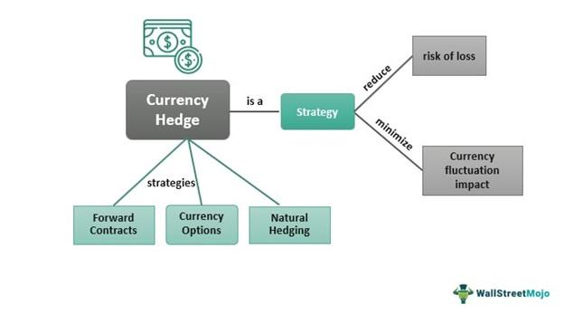

## Table of Contents

## What is cryptocurrency?

Cryptocurrency is a type of digital money that you can use to buy things online. It's different from regular money because it's not controlled by banks or governments. Instead, it uses a technology called blockchain, which is like a big, secure list of all the transactions that have ever happened. This makes it very hard for anyone to cheat or steal.

People use cryptocurrencies like Bitcoin or Ethereum to send money to each other quickly and cheaply, no matter where they are in the world. You can store your cryptocurrency in a digital wallet on your computer or phone. Some people also buy and sell cryptocurrencies hoping to make a profit, but this can be risky because their value can go up and down a lot.

## What is a cryptocurrency portfolio?

A cryptocurrency portfolio is like a collection of different digital currencies that someone owns. Just like how you might have a wallet with different types of money, a crypto portfolio can have Bitcoin, Ethereum, and other cryptocurrencies. People build these portfolios to spread out their risk and maybe make more money. If one type of cryptocurrency goes down in value, the others might go up, so it's not all bad news.

Managing a cryptocurrency portfolio means keeping an eye on how each currency is doing and deciding when to buy more or sell some. It's a bit like playing a game where you need to think about what might happen next. Some people use special tools or apps to help them keep track of everything and make smart choices. It can be exciting but also a bit scary because the value of cryptocurrencies can change a lot very quickly.

## What is hedging and why is it important?

Hedging is like buying insurance for your investments. Imagine you have a lot of money in one thing, like a certain cryptocurrency. If the value of that cryptocurrency goes down, you could lose a lot of money. To protect yourself, you can use hedging. Hedging means you do something else to balance out the risk. For example, you might buy another investment that goes up when your main investment goes down. This way, if your main investment loses value, the other one might make up for it, so you don't lose as much money.

Hedging is important because it helps you sleep better at night. When you know your investments are protected, you worry less about sudden changes in the market. It's especially useful in the world of cryptocurrencies, where prices can jump around a lot. By using hedging, you can keep your money safer and be ready for whatever happens. It's like having a safety net that catches you if you fall, making investing less scary and more manageable.

## How does systematic hedging differ from other hedging strategies?

Systematic hedging is a way to protect your investments using a set plan that you follow all the time. It's different from other hedging strategies because it doesn't rely on guessing or feeling what the market will do next. Instead, it uses rules and math to decide when to buy or sell things that protect your money. This means you don't have to make quick decisions based on what's happening right now; you just stick to your plan.

Other hedging strategies might be more flexible and change based on what's happening in the market. For example, someone might decide to hedge more if they think the market is going to go down, or less if they think it's going up. These strategies can work well, but they need you to be good at predicting the future, which is hard. Systematic hedging takes the guesswork out of it, making it easier to manage and less stressful because you're always following the same steps.

## What are the common risks associated with cryptocurrency investments?

Investing in cryptocurrencies can be risky because their prices can change a lot very quickly. One day, a cryptocurrency might be worth a lot of money, and the next day, it could be worth much less. This is called volatility, and it can make it hard to know if you're making a good investment. Also, there's a risk of losing your money to hackers. If someone steals your digital wallet or the exchange you use gets hacked, you could lose all your cryptocurrencies.

Another risk is that the rules about cryptocurrencies can change. Governments might decide to make new laws that affect how you can use or trade them. This can make the value of your cryptocurrencies go down. Plus, there's the risk of scams. Some people might try to trick you into giving them your money by promising big returns on new cryptocurrencies that aren't real. It's important to be careful and do your research before investing in anything.

## What are the basic tools and methods for hedging a cryptocurrency portfolio?

Hedging a cryptocurrency portfolio means finding ways to protect your money from big changes in the value of your cryptocurrencies. One common tool for hedging is using futures contracts. These are agreements to buy or sell a cryptocurrency at a certain price in the future. If you think the price of your cryptocurrency might go down, you can use a futures contract to sell it at today's price, even if the actual price drops later. This way, you can make up for the loss in value of your cryptocurrency.

Another method is using options. Options give you the right, but not the obligation, to buy or sell a cryptocurrency at a set price before a certain date. If you're worried about the price of your cryptocurrency going down, you can buy a put option, which lets you sell it at a higher price than it might be worth in the future. This can help limit your losses. You can also use stablecoins, which are cryptocurrencies that are tied to the value of something stable like the US dollar. By holding some of your portfolio in stablecoins, you can reduce the risk of big price swings affecting your whole portfolio.

These tools and methods can help you feel safer when investing in cryptocurrencies. They don't make the risk go away completely, but they can help you manage it better. It's like having a safety net that catches you if the value of your cryptocurrencies falls. By using these hedging strategies, you can be more confident in your investments and better prepared for whatever the market does next.

## How can beginners start implementing systematic hedging in their cryptocurrency portfolios?

For beginners, starting with systematic hedging in a cryptocurrency portfolio can seem tricky, but it's about setting up a simple plan and sticking to it. First, you need to decide how much risk you're okay with. If you don't want to lose too much money, you might want to hedge more of your portfolio. A good way to start is by using stablecoins, which are cryptocurrencies tied to the value of something stable like the US dollar. You can keep a part of your portfolio in stablecoins to protect against big price swings in other cryptocurrencies.

Once you've decided on the amount of risk you want to take, you can set up automatic rules for hedging. For example, you might decide to buy a certain amount of stablecoins every time your main cryptocurrency goes up by a certain percentage. This way, you don't have to make quick decisions based on what's happening in the market right now; you just follow your plan. There are apps and tools that can help you set up these rules and do the work for you. By using systematic hedging, you can make your cryptocurrency investments safer and easier to manage, even if you're just starting out.

## What are advanced hedging strategies specific to cryptocurrencies?

Advanced hedging strategies for cryptocurrencies can help you protect your money better, but they can be a bit more complicated. One strategy is using options contracts. Options give you the right to buy or sell a cryptocurrency at a set price before a certain date. If you think the price of your cryptocurrency might go down, you can buy a put option. This lets you sell it at a higher price than it might be worth in the future, which can help limit your losses. Another advanced strategy is using inverse ETFs. These are funds that go up in value when the price of a cryptocurrency goes down. By investing in an inverse ETF, you can make money if your cryptocurrency loses value, which can help balance out your losses.

Another advanced strategy is delta hedging. This involves adjusting your portfolio to keep it balanced as the price of your cryptocurrency changes. For example, if the price of your cryptocurrency goes up, you might sell some of it and buy more of something else to keep your risk level the same. This can be tricky because you need to keep an eye on the market and make changes often. Lastly, you can use arbitrage, which means taking advantage of price differences between different exchanges. If a cryptocurrency is cheaper on one exchange than another, you can buy it on the cheaper exchange and sell it on the more expensive one. This can help you make money and reduce your risk at the same time.

## How do market conditions affect the choice of hedging strategies for cryptocurrencies?

Market conditions play a big role in deciding which hedging strategies to use for cryptocurrencies. If the market is really up and down a lot, you might want to use more hedging to protect your money. For example, if everyone is worried and the prices are dropping fast, you might buy more stablecoins or use options to limit your losses. On the other hand, if the market is calm and prices are not changing much, you might not need to hedge as much. You can take more risks and maybe make more money because the chance of losing a lot is smaller.

Different market conditions can also make some hedging strategies work better than others. In a bull market, where prices are going up a lot, you might use delta hedging to keep your portfolio balanced. This means you'll adjust your investments to make sure you're not taking too much risk. In a bear market, where prices are going down, you might use inverse ETFs to make money when the price of your cryptocurrency drops. By understanding the market and choosing the right hedging strategy, you can protect your money and feel more confident in your investments.

## What are the regulatory considerations when hedging cryptocurrency portfolios?

When you hedge your cryptocurrency portfolio, you need to think about the rules that different countries have about cryptocurrencies. Some places have strict rules that say what you can and can't do with cryptocurrencies. For example, some countries might not let you use certain hedging tools like futures or options. If you break these rules, you could get in trouble, so it's important to know the laws in your country before you start hedging.

Also, the rules about cryptocurrencies can change. Governments might decide to make new laws that affect how you can use or trade them. This can make your hedging plans harder to follow. For example, if a new law comes out that stops you from using a certain hedging tool, you might have to find a different way to protect your money. Staying up to date with these changes can help you keep your portfolio safe and make sure you're always following the rules.

## How can one measure the effectiveness of systematic hedging in a cryptocurrency portfolio?

To measure how well systematic hedging works in a cryptocurrency portfolio, you can look at how much less risk you're taking. When you hedge, you're trying to protect your money from big drops in the value of your cryptocurrencies. If your portfolio doesn't lose as much money during times when the market goes down, that means your hedging strategy is working. You can compare the performance of your hedged portfolio to what it would have been without hedging. If the hedged portfolio loses less money or stays more stable, then your systematic hedging is effective.

Another way to measure the effectiveness is by looking at how much your hedging costs you. Hedging isn't free; you might have to pay fees or give up some potential profits to protect your money. If the cost of hedging is less than the amount of money you save by avoiding big losses, then it's a good strategy. Over time, you can keep track of these costs and benefits to see if your systematic hedging plan is worth it. By regularly checking these two things—risk reduction and cost—you can tell if your systematic hedging is helping your cryptocurrency portfolio.

## What are the future trends and innovations in systematic hedging of cryptocurrency portfolios?

In the future, we might see new tools and methods for systematic hedging in cryptocurrency portfolios. One trend could be the use of artificial intelligence (AI) and machine learning to make better hedging plans. These technologies can look at a lot of data very quickly and find patterns that humans might miss. This means they could help you hedge your portfolio in a smarter way, by predicting when the market might go up or down and adjusting your investments automatically. Another trend could be the creation of new financial products that are made just for cryptocurrencies. These could be new types of options or futures that are easier to use and more effective at protecting your money.

Also, as more people start using cryptocurrencies, we might see more ways to hedge that are built into the blockchain itself. This could mean using smart contracts, which are like digital agreements that automatically do what they're supposed to do. For example, a smart contract could automatically buy or sell cryptocurrencies to hedge your portfolio when certain things happen in the market. This would make hedging easier and more reliable. As the world of cryptocurrencies keeps growing, these innovations could help make systematic hedging a normal part of managing your digital money, making it safer and less stressful.

## What is the setup process?

To establish a robust strategy for managing [cryptocurrency](/wiki/cryptocurrency) investment risks, one pivotal step is creating a framework for a hypothetical Top 5 cryptocurrency index portfolio (T5). This virtual portfolio functions as a representative model for investors seeking diversified exposure to altcoins, facilitating analytical studies such as optimal hedging strategy evaluations.

The construction of the T5 portfolio begins with the identification and selection of the top 5 altcoins by market capitalization at a given point in time. Market capitalization is a widely accepted metric for assessing a cryptocurrency's prominence and stability, calculated as:

$$
\text{Market Capitalization} = \text{Price Per Coin} \times \text{Total Circulating Supply}
$$

For the T5 portfolio, the selection is dynamic, with periodic re-evaluations—such as quarterly or yearly assessments—to accommodate the volatile nature of the cryptocurrency landscape. This ensures that the portfolio remains representative of the most significant altcoins.

Once selected, the assets within the portfolio are weighted. A common practice is using a market-capitalization-weighted approach, mimicking the structure of major equity indexes like the S&P 500. Here, each asset's weight in the portfolio is proportionate to its respective market capitalization:

$$
\text{Weight}_i = \frac{\text{Market Cap}_i}{\sum_{j=1}^{5} \text{Market Cap}_j}
$$

This methodology emphasizes larger-cap coins, potentially reducing [volatility](/wiki/volatility-trading-strategies) owing to their relative market stability compared to smaller-cap peers.

As the focus of this index is on altcoins, stablecoins are intentionally excluded from the T5 portfolio. This exclusion is justified by their distinct nature and primary function. Stablecoins are designed to minimize price volatility by pegging their value to a reserve of assets, typically resembling fiat currencies. Including stablecoins would skew the portfolio's volatility metrics and disrupt the assessment of hedging strategies, which are tailored towards managing risks associated with price fluctuations rather than the ostensible stability offered by fiat-linked cryptocurrencies.

Overall, the T5 portfolio is a strategic tool for simulating the investment landscape of leading altcoins, providing a foundational platform to analyze and implement systematic hedging strategies effectively.

## What is the methodology?

The construction of the Top 5 cryptocurrency index, hereafter referred to as T5, is designed to mimic a buy and hold (B&H) investment strategy. This index serves as a representative model, capturing the market dynamics of the leading altcoins over a period, allowing for an informed analysis of hedging strategies. The methodology involves specific steps to ensure the index reflects the characteristics and volatility inherent in cryptocurrency markets, akin to established equity market indices, such as market cap-weighted indexes like the Dow Jones Industrial Average (DJIA).

To construct the T5 index, cryptocurrencies are selected based on their market capitalization rankings, with the top five non-stablecoin cryptocurrencies being chosen at the start of each investment period. These selections are revisited annually to account for changes in market status and emerging technologies that might influence rankings. By concentrating on these top contenders, the index encapsulates a significant portion of the market's overall value and activity.

The T5 index is particularly comparable to the DJIA in terms of its weighting methodology, although with key distinctions. While the DJIA is price-weighted, the T5 index employs a market capitalization-weighted strategy. This means that each cryptocurrency's influence on the index is proportionate to its total market capitalization relative to the sum of the market caps of the top five. Such a weighting approach can be mathematically expressed as:

$$
W_i = \frac{MC_i}{\sum_{j=1}^{5} MC_j}
$$

where $W_i$ is the weight of cryptocurrency $i$ in the index, and $MC_i$ represents the market capitalization of cryptocurrency $i$.

This method ensures that the index dynamically reflects the shifting weight of each component, aligning with fluctuations in market value. Such flexibility is pivotal in a volatile market where dramatic shifts can occur with rapid regularity.

Concentration levels within the T5 index are notably high due to the focus on five dominant market players. This concentration results in increased exposure to the performances and volatilities of a few select assets. While this can result in substantial gains during bullish periods, it also amplifies risk during downturns. These characteristics necessitate a thoughtful approach to systematic hedging, emphasizing the importance of strategies that can mitigate the adverse impacts associated with high concentration.

The implications for systematic hedging are twofold: first, there needs to be a recognition of the heightened risk inherent in a concentrated portfolio, which can experience significant valuation changes with the performance of a few assets. Second, the dynamics of the cryptocurrency market require flexible, adaptive hedging strategies that can respond to rapid market movements while ensuring the preservation of capital within the B&H strategy. By understanding these concentration effects, investors can better tailor hedging approaches to safeguard their portfolios, balancing risk and reward within the unique context of cryptocurrency investments.

## What are the results and what solutions were found?

In the analysis of cryptocurrency portfolios, hedging strategies can provide a crucial layer of protection against market volatility. The evaluation involves both naive and active hedging approaches to mitigate risk while preserving potential returns.

### Naive Hedging Strategies

Three naive hedging strategies are explored to identify their effectiveness in managing risk:

1. **Simple Ratio Hedge**: This strategy involves maintaining a constant proportionate hedge. Investors typically hedge a fixed percentage of their portfolio using Bitcoin or other derivative assets. For example, a 1:1 ratio hedge would entail buying $1 worth of a derivative for every $1 in the underlying asset.

2. **Minimum Variance Hedge**: This method seeks to minimize the portfolio's variance by adjusting weights based on historical data. The minimum variance hedge ratio can be calculated using the formula:
$$
   h = \frac{\text{Covariance}(R_p, R_h)}{\text{Variance}(R_h)}

$$

   Where $R_p$ is the return of the portfolio, and $R_h$ is the return of the hedge asset.

3. **Equally Weighted Hedge**: Here, each asset in the portfolio is equally weighted, and the hedge proportion reflects this distribution.

Each naive strategy is assessed for performance through simulations using historical data. These models generally offer moderate risk reduction but may fall short during periods of extreme market conditions due to their static nature.

### Active Hedging Strategy

The active hedging strategy builds upon past quantitative analyses, aiming for dynamic adjustments based on market signals. This approach leverages a trend-following mechanism, employing Bitcoin derivatives to hedge assets based on market [momentum](/wiki/momentum).

Key components of the active strategy include:

- **Signal Generation**: Trend indicators, such as moving averages, trigger hedge adjustments. For instance, if the short-term moving average of Bitcoin exceeds the long-term average, it may signal an uptrend, prompting reduced hedge positioning.

- **Adaptive Hedging**: The hedge ratio is periodically recalibrated based on market conditions and predicted volatility. 

- **Performance Metrics**: To evaluate the efficacy of the approach, metrics such as Sharpe Ratio, Maximum Drawdown, and volatility are used. Back-testing against historical data from 2015 onwards reveals enhanced performance in terms of risk-adjusted returns and lower volatility compared to unhedged portfolios.

In summary, while naive strategies offer simplicity and moderate risk mitigation, the active hedging strategy showcases improved adaptability and effectiveness, particularly in response to volatile cryptocurrency markets. The use of dynamic adjustments based on quantitative signals aligns better with the erratic nature of cryptocurrency assets.

## What are the proposed hedge strategies?

In implementing cryptocurrency hedging strategies, one effective approach is the 1:1 Proportional Hedge. This strategy involves acquiring a derivative position that directly offsets the portfolio's value fluctuations, ideally mitigating risk without sacrificing the portfolio's growth potential. The core philosophy here is to hold an equal value in hedging instruments to the value of the cryptocurrency portfolio being protected. This method is straightforward, providing significant reduction in volatility if maintained consistently, especially during turbulent market phases.

The performance of the 1:1 Proportional Hedge can be assessed by monitoring how well it counterbalances market fluctuations over time. Assuming the portfolio follows substantial market trends, the hedge's success depends on the precise timing and maintenance of these hedges. If executed properly, this strategy can significantly shield investors from catastrophic losses during downturns, albeit at the potential cost of muted gains during bullish periods.

In adopting more sophisticated approaches, Regression for the Whole Period comes into play. This involves the use of Ordinary Least Squares (OLS) regression analysis to establish a constant beta—a measure of the portfolio's systematic risk relative to the market (in this case, Bitcoin or a broad cryptocurrency index). In practice, the beta derived from OLS regression informs the proportion of the portfolio to be hedged, accommodating the natural correlations between the portfolio's performance and the broader market movements. 

Let's denote the portfolio returns as $R_P$ and the market returns as $R_M$. The OLS regression can be expressed as:

$$
R_P = \alpha + \beta R_M + \epsilon
$$

Where:
- $\alpha$ represents the intercept,
- $\beta$ is the beta coefficient,
- $\epsilon$ denotes the error term.

By determining a constant beta, investors can maintain a hedge that reflects their portfolio's long-term risk exposure.

Another dimension of adapting hedging strategies is through Rolling Regression, which recalibrates the hedging approach on an annual basis using fresh data to enhance responsiveness and accuracy. This technique recognizes that market conditions and asset correlations can shift over time. By continuously updating the regression model, Rolling Regression adapts to these changes, recalculating the beta and adjusting the hedge volumes accordingly. This dynamic adjustment aims to maintain the hedge's efficacy as market dynamics evolve.

Rolling Regression, frequently employed in portfolio management, involves updating the dataset periodically and recalibrating the regression parameters:

```python
import numpy as np
import pandas as pd
from statsmodels.api import OLS

# Assuming we have a DataFrame 'data' with columns 'portfolio_returns' and 'market_returns'

window_size = 252  # Annual window size for daily data
roll_betas = []

for end in range(window_size, len(data)):
    train_data = data.iloc[end-window_size:end]
    reg_model = OLS(train_data['portfolio_returns'], train_data['market_returns']).fit()
    roll_betas.append(reg_model.params[0])

data['rolling_beta'] = np.nan
data.iloc[window_size:, data.columns.get_loc('rolling_beta')] = roll_betas
```

By adopting these hedging strategies, investors can navigate the volatile cryptocurrency landscape with improved risk management, aligning their hedging tactics with prevailing market conditions and individual risk tolerance levels.

## References & Further Reading

[1]: Nakamoto, S. (2008). ["Bitcoin: A Peer-to-Peer Electronic Cash System."](https://nakamotoinstitute.org/library/bitcoin/) Bitcoin.org.

[2]: Hull, J. C. (2017). ["Options, Futures, and Other Derivatives"](https://www.semanticscholar.org/paper/Options%2C-Futures%2C-and-Other-Derivatives-Hull/89bdee500c8623864fc9eb7a471546aa713acc44). Pearson.

[3]: Makarov, I., & Schoar, A. (2020). ["Trading and Arbitrage in Cryptocurrency Markets."](https://www.sciencedirect.com/science/article/pii/S0304405X19301746) Review of Financial Studies, 34(11), 5135-5184.

[4]: Baur, D. G., Hong, K., & Lee, A. D. (2018). ["Bitcoin: Medium of Exchange or Speculative Assets?"](https://papers.ssrn.com/sol3/papers.cfm?abstract_id=2561183) Journal of International Financial Markets, Institutions and Money, 54, 177-189.

[5]: Burniske, C. & Tatar, J. (2017). ["Cryptoassets: The Innovative Investor's Guide to Bitcoin and Beyond"](https://www.amazon.com/Cryptoassets-Innovative-Investors-Bitcoin-Beyond/dp/1260026671). McGraw-Hill Education.

[6]: Peters, G. W., & Panayi, E. (2016). ["Understanding Modern Banking Ledgers Through Blockchain Technologies: Future of Transaction Processing and Smart Contracts on the Internet of Money."](https://papers.ssrn.com/sol3/papers.cfm?abstract_id=2692487) In: Banking Beyond Banks and Money (pp. 239-278). Springer.

[7]: Yermack, D. (2015). ["Is Bitcoin a Real Currency? An Economic Appraisal."](https://www.sciencedirect.com/science/article/pii/B9780128021170000023) Journal of Economic Perspectives, 29(2), 213-238.