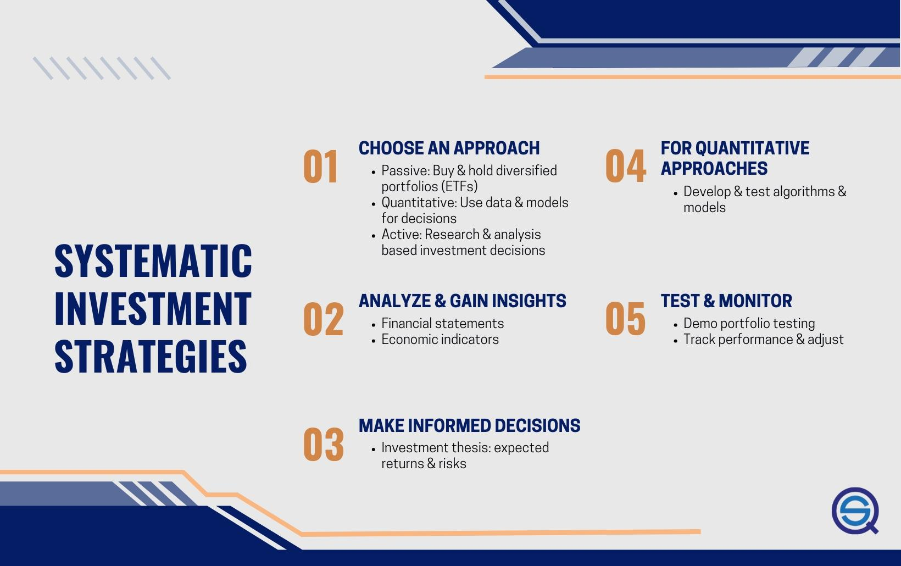

## Table of Contents

## What is a systematic investment strategy?

A systematic investment strategy is a way to invest money regularly over time, instead of trying to time the market or invest all at once. It involves setting up a plan to put a fixed amount of money into investments, like stocks or mutual funds, at regular intervals, such as monthly or weekly. This approach helps to spread out the risk of investing because you buy more shares when prices are low and fewer when prices are high, which can lead to a lower average cost per share over time.

This strategy is often used by people who want to build wealth slowly and steadily. It's popular because it doesn't require a lot of knowledge about the market or constant monitoring of investments. By automating the investment process, it takes the emotion out of investing, which can help people stick to their plan even when the market goes up and down. Over the long term, this disciplined approach can help investors reach their financial goals, like saving for retirement or buying a home.

## How does a systematic investment strategy differ from a discretionary one?

A systematic investment strategy is like setting a routine for your money. You decide to put a certain amount into your investments at regular times, like every month, without changing your plan based on what's happening in the market. It's like setting an automatic payment for your investments. This way, you don't have to think about when to buy or sell; it just happens on its own. It's good for people who want to save without worrying about the ups and downs of the market.

On the other hand, a discretionary investment strategy is more hands-on. With this approach, you decide when to buy or sell based on what you think the market will do next. It's like choosing when to go shopping based on sales and prices. You might buy more when you think prices will go up or sell when you think they will go down. This method needs more time and knowledge about the market because you're making decisions all the time.

In short, a systematic strategy is about sticking to a plan and letting time do the work, while a discretionary strategy is about trying to make smart moves based on what's happening right now. Both have their own benefits, but they suit different kinds of investors and require different levels of involvement.

## What are the benefits of using systematic investment strategies?

Using a systematic investment strategy has many benefits. One big plus is that it helps you avoid trying to guess what the market will do next. Instead of worrying about when to buy or sell, you just keep investing the same amount regularly. This takes away the stress of making quick decisions and helps you stay calm even when the market goes up and down. It's like putting money into a savings account but for investments, making it easier to stick to your plan over time.

Another benefit is that it can lower the average cost of your investments. When you invest the same amount every time, you end up buying more shares when prices are low and fewer when prices are high. This is called dollar-cost averaging, and it can help you get a better overall price for your investments. Over many years, this can add up and help your money grow more than if you tried to time the market.

Lastly, systematic investing is great for building wealth slowly and steadily. It's perfect for long-term goals like saving for retirement or buying a house. Because you're investing regularly, you don't need a lot of money to start. Even small amounts can grow over time, and the power of compounding can turn those regular investments into a big sum. This way, you can reach your financial goals without needing to be an expert on the stock market.

## Can you explain the concept of dollar-cost averaging in systematic investing?

Dollar-cost averaging is a smart way to invest money over time, especially when you use a systematic investment strategy. It means you put the same amount of money into your investments at regular times, like every month. When the price of the investment is low, your money buys more shares. When the price is high, you buy fewer shares. This helps you avoid buying all your shares at a high price, which can happen if you invest all your money at once.

Over time, dollar-cost averaging can lower the average cost of your investments. Since you're buying more shares when prices are low and fewer when they're high, you end up with a better overall price for your shares. This can help your money grow more than if you tried to guess the best time to invest. It's a simple but effective way to build wealth slowly and steadily, without needing to be an expert on the market.

## What are some common types of systematic investment strategies?

One common type of systematic investment strategy is dollar-cost averaging. With this approach, you invest a fixed amount of money into your chosen investments at regular intervals, like every month. This means you buy more shares when prices are low and fewer when prices are high. Over time, this can help lower the average cost of your investments and reduce the risk of investing all your money at the wrong time. It's a popular choice for people who want to build wealth slowly and steadily without needing to predict the market.

Another type is a target-date fund, which is often used for retirement savings. These funds automatically adjust the mix of investments as you get closer to your target date, like when you plan to retire. Early on, the fund might have more stocks to grow your money, but as the date gets closer, it shifts to more bonds to protect your savings. This way, you don't have to make changes yourself; the fund does it for you based on a set plan. It's great for people who want a hands-off approach to investing.

A third type is a robo-advisor, which uses computer algorithms to manage your investments. You tell the robo-advisor about your goals, how much risk you're willing to take, and how long you plan to invest. Then, it creates a personalized investment plan and automatically adjusts your portfolio over time. Robo-advisors often use a mix of low-cost index funds and ETFs to keep fees low. This is a good option for people who want professional management without the high costs of a human financial advisor.

## How do you set up a systematic investment plan?

Setting up a systematic investment plan is easy and can help you save money over time. First, decide how much money you want to invest regularly. It could be a small amount like $50 or $100 each month, depending on what you can afford. Next, choose where you want to invest your money. You might pick a mutual fund, an index fund, or an [ETF](/wiki/etf-trading-strategies). These are all good choices for a systematic plan because they spread your money across many different investments, which can lower your risk. Once you've picked your investment, you'll need to set up automatic transfers from your bank account to your investment account. This way, the money goes in without you having to remember to do it each time.

After you've set up your plan, it's important to keep an eye on it but not too closely. The idea is to let your money grow over time without trying to guess what the market will do next. If your financial situation changes, you might want to adjust how much you're investing, but try to stick to your plan as much as you can. Over the years, this regular investing can help you reach your goals, like saving for a house or retirement. Remember, the key is to be consistent and patient, letting time and the power of compounding work in your favor.

## What role does risk management play in systematic investment strategies?

Risk management is very important in systematic investment strategies. It helps you protect your money by spreading it out in different ways. When you use a systematic plan, you invest a little bit at a time, which means you don't put all your money into the market at once. This can help you avoid big losses if the market goes down right after you invest. Also, by choosing different types of investments, like stocks, bonds, and funds, you can lower the chance that all your money will be affected by one bad event. This is called diversification, and it's a key part of managing risk in your investments.

Another way risk management helps in systematic investing is by keeping your emotions in check. When you set up a plan to invest regularly, you don't have to worry about when to buy or sell based on what the market is doing that day. This can stop you from making quick decisions that might lose you money. Over time, sticking to your plan can help you build wealth slowly and safely. By managing risk well, you can feel more confident that your money is working hard for you, even when the market goes up and down.

## How can one evaluate the performance of a systematic investment strategy?

To evaluate the performance of a systematic investment strategy, you need to look at how your investments are doing over time. Start by checking the total return on your investments. This means seeing how much your money has grown, including any interest or dividends you've earned. You can compare this to a benchmark, like a stock market index, to see if your strategy is doing better or worse than the market as a whole. It's also important to look at the risk you're taking. If your investments are growing but they're also going up and down a lot, you might be taking on too much risk. So, you should check something called the Sharpe ratio, which tells you how much return you're getting for the risk you're taking.

Another way to evaluate your systematic investment strategy is by looking at how well it's helping you reach your goals. If you're saving for something specific, like a house or retirement, see if you're on track to have enough money when you need it. You can use tools like investment calculators to help with this. Also, think about how easy it is to stick to your plan. If you're finding it hard to keep investing regularly, your strategy might need to be simpler or more flexible. The best systematic investment strategies are the ones that help you grow your money over time while fitting into your life and financial situation.

## What are the challenges and limitations of systematic investing?

One challenge of systematic investing is that it might not give you the best returns if the market goes up a lot right after you start investing. Since you're putting in money little by little, you miss out on the big gains you could have gotten if you had put all your money in at the right time. Also, if the market keeps going down, you'll keep buying at lower and lower prices, which can be scary. It can make you feel like your money is disappearing, even though it might be a good long-term strategy.

Another limitation is that systematic investing doesn't protect you from all risks. Even if you spread your money across different investments, the whole market can still go down. This means you could lose money even if you're following your plan perfectly. Plus, sticking to a systematic plan can be hard if you see other people making more money by trying to time the market. It takes discipline to keep investing the same amount every time, no matter what's happening around you.

## How do advanced algorithms and machine learning enhance systematic investment strategies?

Advanced algorithms and [machine learning](/wiki/machine-learning) can make systematic investment strategies even better. They help by looking at a lot of data really fast and finding patterns that people might miss. For example, they can look at how the market has moved in the past and use that to guess what might happen next. This can help investors make smarter choices about when to buy or sell. Also, these smart tools can change your investment plan automatically based on what they learn. So, if they see that certain types of investments are doing better right now, they can move your money into those without you having to do anything.

But it's not just about making decisions faster and better. Machine learning can also help manage risk better. By looking at a lot of different information, these tools can figure out how risky different investments are and help you spread your money out in a way that protects it. They can also keep an eye on your investments all the time and make small changes to keep your plan on track. This means you don't have to worry as much about the ups and downs of the market because the algorithms are working to keep your money safe and growing.

## Can you discuss the impact of market volatility on systematic investment strategies?

Market volatility means the market goes up and down a lot, and it can affect systematic investment strategies in both good and bad ways. When the market is very up and down, it can be scary to keep investing the same amount every time. You might see your investments losing value and feel like you should stop putting money in. But the good thing about a systematic strategy is that it helps you keep going, even when the market is bumpy. By sticking to your plan, you buy more shares when prices are low, which can actually be a good thing in the long run.

The other side of market volatility is that it can make your systematic strategy work even better. When the market goes down, your regular investments buy more shares at lower prices. This is called dollar-cost averaging, and it can lower the average cost of your investments over time. So, even though it might feel risky, the ups and downs of the market can help you build wealth slowly and steadily. The key is to stay calm and keep following your plan, letting time and regular investing smooth out the bumps in the market.

## What future trends might influence the development of systematic investment strategies?

In the future, technology will play a big role in shaping how people use systematic investment strategies. More advanced computers and [artificial intelligence](/wiki/ai-artificial-intelligence) will help make these strategies even smarter. They will be able to look at a lot of information very quickly and find patterns that can help investors make better choices. This means that systematic investing could become more personalized, with plans that fit each person's goals and how much risk they want to take. Also, more people might start using robo-advisors, which are computer programs that manage your investments for you. These tools will get better at adjusting your investments automatically, making it easier for everyone to invest without needing to be an expert.

Another trend that might influence systematic investment strategies is a growing focus on sustainable and ethical investing. More and more people want their money to help the world, not just grow. So, systematic strategies might start to include more investments in things like green energy or companies that treat their workers well. This could mean that the way we measure how well an investment is doing will change, looking not just at money but also at how good the investment is for the planet and society. As these trends grow, systematic investing will need to adapt, offering new ways for people to save and invest that match their values and the changing world around them.

## What is Systematic Investing?

Systematic investing refers to an investment approach where assets are allocated based on a pre-defined, rule-based strategy. Unlike discretionary investing, which relies on the investor's subjective judgment and experience, systematic investing emphasizes adherence to established guidelines to make investment decisions. This approach aims to minimize emotional influence, thus promoting more consistent outcomes over time.

Central to systematic investing is the use of a clear set of rules and criteria for selecting and managing investments. These rules are typically based on quantitative analysis, including statistical models and historical data. The objective is to establish a framework that systematically guides decision-making processes, focusing on long-term growth, risk management, and capital preservation.

A fundamental aspect of systematic investing is its regularity in execution. Investors consistently follow the established strategy regardless of market conditions, which aids in mitigating market timing risks. Moreover, this method offers a structured approach to asset allocation and diversification, essential components for managing risk. For example, an investment strategy might involve periodically rebalancing a portfolio to maintain desired asset weightings, which can be mathematically represented as: 

$$
W_{new} = W_{target} \times \frac{V_{portfolio}}{V_{asset}}
$$

Where $W_{new}$ is the new weight of an asset, $W_{target}$ is the target weight, $V_{portfolio}$ is the current value of the portfolio, and $V_{asset}$ is the current value of the asset.

The goals of systematic investing align with achieving stable, long-term financial growth and ensuring effective risk management. By implementing a systematic strategy, investors can potentially reduce the influence of cognitive biases and emotional reactions to market fluctuations, which are common pitfalls in discretionary investing. This disciplined methodology assists in maintaining a focus on investment objectives, even amidst short-term market [volatility](/wiki/volatility-trading-strategies), thus supporting overall portfolio performance and sustainability.

## References & Further Reading

[1]: Markowitz, H. (1952). ["Portfolio Selection"](https://onlinelibrary.wiley.com/doi/abs/10.1111/j.1540-6261.1952.tb01525.x). The Journal of Finance, 7(1), 77-91.

[2]: De Prado, M. L. (2018). ["Advances in Financial Machine Learning"](https://www.amazon.com/Advances-Financial-Machine-Learning-Marcos/dp/1119482089). Wiley.

[3]: Chan, E. (2009). ["Quantitative Trading: How to Build Your Own Algorithmic Trading Business"](https://github.com/ftvision/quant_trading_echan_book). Wiley.

[4]: Pardo, R. (1992). ["Design, Testing, and Optimization of Trading Systems"](https://www.amazon.com/Design-Testing-Optimization-Trading-Systems/dp/0471554464). Wiley.

[5]: Jansen, S. (2018). ["Machine Learning for Algorithmic Trading"](https://books.google.com/books/about/Hands_On_Machine_Learning_for_Algorithmi.html?id=tx2CDwAAQBAJ). Packt Publishing.

[6]: Aronson, D. R. (2006). ["Evidence-Based Technical Analysis: Applying the Scientific Method and Statistical Inference to Trading Signals"](https://www.amazon.com/Evidence-Based-Technical-Analysis-Scientific-Statistical/dp/0470008741). Wiley.