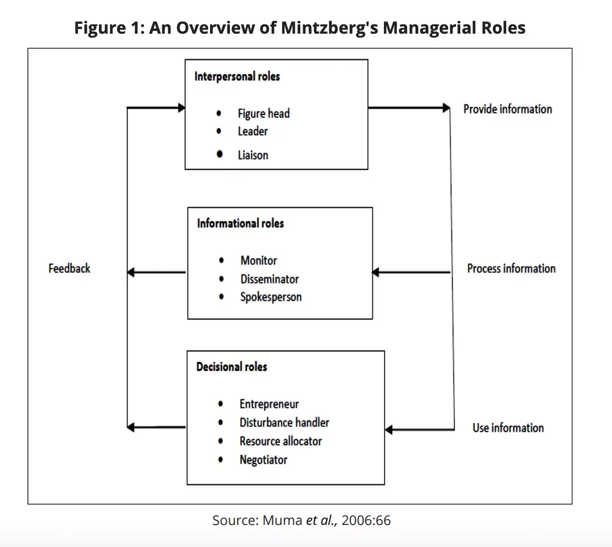

## Table of Contents

## What is a systematic manager?

A systematic manager is someone who uses a set of rules and computer programs to make decisions about investing money. Instead of making choices based on feelings or guesses, they follow a plan that is based on data and math. This way, they can manage money in a way that is organized and consistent, without letting emotions get in the way.

These managers often use complex computer models to analyze lots of information, like stock prices or economic reports. They then use this information to buy or sell investments according to their plan. This approach can help them make more predictable decisions and possibly reduce the risk of making big mistakes.

## What are the primary roles of a systematic manager?

A systematic manager's main job is to create and follow a clear set of rules for investing money. They use computer programs and math to make decisions about buying or selling investments. This helps them stay organized and make choices based on data instead of feelings. They spend a lot of time studying information like stock prices and economic reports to find patterns and make their investment plan better.

Another important role of a systematic manager is to keep their investment strategy working smoothly. They need to check their computer models often to make sure they are still doing a good job. If something isn't working right, they fix it or update it. They also need to make sure they are following all the rules and laws about investing. This helps them manage money in a way that is safe and fair for everyone involved.

## How does a systematic manager differ from other types of managers?

A systematic manager is different from other types of managers because they use a set of rules and computer programs to make investment decisions. They rely on data and math, not feelings or guesses. This means they follow a plan that is the same every time, which helps them stay organized and avoid big mistakes. Other managers, like discretionary managers, might make decisions based on their own thoughts or what they think might happen in the future. They might change their minds a lot and their choices can be different each time.

Another way systematic managers are different is in how they use technology. They spend a lot of time working with computer models to find patterns in information like stock prices or economic reports. These models help them decide when to buy or sell investments. Other managers might not use computers as much. They might look at the same information, but they decide what to do without a computer telling them. This can make their decisions less predictable and sometimes more risky.

Overall, systematic managers focus on being consistent and reducing risk by sticking to their plan. They work hard to make sure their computer models are always up to date and working well. Other managers might focus more on trying to guess what will happen next or following their instincts. This can lead to different results, and sometimes more excitement, but it can also lead to bigger mistakes if they guess wrong.

## What skills are essential for a systematic manager?

A systematic manager needs to be good at math and computer programming. They use math to create rules for investing money and computer programs to follow those rules. They also need to understand a lot about how the stock market works and what makes prices go up or down. This helps them make smart choices about when to buy or sell investments.

It's also important for a systematic manager to be good at solving problems. They need to check their computer models often to make sure they are working right. If something goes wrong, they need to fix it quickly. They also need to keep learning new things about the market and technology so they can make their investment plan better. Being able to work well with others is helpful too, because they often work with a team of people to manage money.

## Can you explain the process a systematic manager uses to manage tasks?

A systematic manager starts by making a clear plan for managing tasks. They use math and computer programs to create rules that help them decide what to do. They look at a lot of information, like stock prices and economic reports, to find patterns. This helps them make smart choices about when to buy or sell investments. They write down all these rules in a way that a computer can understand, so the computer can do the work for them.

Once they have their plan, the systematic manager keeps an eye on how well it's working. They check their computer models often to make sure everything is going as expected. If something isn't working right, they fix it or update it. They also make sure they are following all the rules and laws about investing. This helps them manage money in a way that is safe and fair for everyone. By sticking to their plan and using data instead of feelings, they can make decisions that are more predictable and less risky.

## What tools and technologies do systematic managers typically use?

Systematic managers use a lot of computer programs and math to make decisions about money. They use software that can look at lots of information really fast. This software helps them find patterns in things like stock prices and economic reports. They also use programming languages like Python or R to write the rules for their computer models. These models help them decide when to buy or sell investments based on the data they have.

Another important tool for systematic managers is a database. They use databases to store all the information they need, like stock prices and financial reports. This helps them keep everything organized and easy to find. They also use data analysis tools to understand the information better. These tools help them see trends and make better decisions. By using these tools and technologies, systematic managers can manage money in a way that is organized and based on facts, not feelings.

## How does a systematic manager implement and maintain systems within an organization?

A systematic manager starts by making a clear plan for the organization. They use computer programs and math to create rules that help everyone know what to do. They look at a lot of information, like how the company is doing and what's happening in the market, to find patterns. This helps them make smart choices about how to run things. They write down all these rules in a way that computers can understand, so the computers can help them manage tasks. They also make sure everyone in the organization knows the plan and follows it.

Once the plan is in place, the systematic manager keeps an eye on how well it's working. They check their computer models often to make sure everything is going as expected. If something isn't working right, they fix it or update it. They also make sure the organization is following all the rules and laws. This helps them run the organization in a way that is safe and fair for everyone. By sticking to their plan and using data instead of feelings, they can make decisions that are more predictable and less risky.

## What are some common challenges faced by systematic managers and how can they be overcome?

Systematic managers often face challenges with their computer models. Sometimes the models don't work as well as expected because the market changes in ways they didn't predict. To fix this, they need to keep updating their models and checking them often. They should also be ready to change their plan if something isn't working. By staying flexible and always learning new things, they can make their models better and handle surprises better.

Another challenge is making sure everyone in the organization follows the plan. Sometimes people might not understand the rules or might want to do things their own way. To overcome this, the systematic manager needs to explain the plan clearly and make sure everyone knows why it's important. They should also train people well and keep reminding them about the rules. By building a good team and working together, they can make sure the plan is followed and the organization runs smoothly.

## Can you provide examples of successful systematic management in different industries?

In the finance industry, a great example of systematic management is how some big investment firms use computer programs to manage money. For example, Renaissance Technologies uses math and computer models to find patterns in stock prices and economic reports. They follow a set of rules to decide when to buy or sell investments. This helps them make a lot of money for their clients because their decisions are based on data, not feelings. They keep their models up to date and check them often to make sure they are working well.

In the manufacturing industry, Toyota is a good example of using systematic management to make cars. They use a system called "lean manufacturing" to make sure everything runs smoothly. This system has clear rules for how to make cars, and everyone in the factory follows these rules. They use data to find problems and fix them quickly. This helps them make cars faster and with fewer mistakes. By sticking to their plan and using data, Toyota can make high-quality cars that people want to buy.

## How does a systematic manager measure the effectiveness of their systems?

A systematic manager measures the effectiveness of their systems by looking at how well they are doing their job. They check things like how much money they are making or losing, and how often their computer models are right about what will happen in the market. They also look at how well everyone in the organization is following the rules. By keeping track of these things, they can see if their plan is working or if they need to make changes.

To make sure they are measuring the right things, systematic managers use numbers and data. They might use special computer programs to help them understand the data better. If they see that their system is not working as well as it should, they will try to find out why and fix it. By always checking and updating their systems, they can make sure they are doing the best job possible.

## What advanced strategies can systematic managers employ to optimize organizational processes?

Systematic managers can use machine learning to make their systems better. Machine learning is when computers learn from data to make better choices. They can use this to find new patterns in the market or in how their organization works. By using machine learning, they can make their computer models smarter and more accurate. This helps them make better decisions about what to do next. They can also use it to see if there are any problems in their systems and fix them before they get worse.

Another strategy is to use real-time data to make quick decisions. This means they look at information as it happens, not just after it's already happened. By using real-time data, they can see what's going on right now and react faster. This can help them take advantage of new opportunities or avoid problems before they get too big. It also helps them keep their systems running smoothly because they can make changes as soon as they need to. By staying on top of things and using the latest information, they can keep their organization working at its best.

## How can someone aspiring to be a systematic manager develop the necessary expertise?

To become a systematic manager, someone should start by learning a lot about math and computer programming. These skills are really important because they help you make rules and computer models for managing money or running an organization. You can learn these skills by going to school or taking online classes. It's also a good idea to practice using computer programs like Python or R to write code and solve problems. The more you practice, the better you will get at it.

Another important thing is to understand how the stock market or your industry works. You can learn this by reading books, taking courses, or even working in the field. It's helpful to keep up with the latest news and trends so you can make smart choices. Joining groups or clubs where you can talk to other people who are interested in systematic management can also help you learn more and get new ideas. By combining all these skills and knowledge, you can become a great systematic manager.

## What is Systematic Management in Algorithmic Trading?

Algorithmic trading, a method that uses automated and pre-programmed trading instructions to execute trades, has gained significant traction within the financial sector. This rise in popularity can be attributed to the increased computational power and availability of high-speed data feeds, which enable traders to implement complex trading strategies with precision and speed.

Systematic management plays a critical role in [algorithmic trading](/wiki/algorithmic-trading) by leveraging algorithms to execute trading strategies without the influence of human emotion or bias. These algorithms follow predefined rules based on statistical analysis and historical data, making decisions on transactions such as entering or exiting positions.

One significant advantage of systematic management in algorithmic trading is the elimination of emotional bias. Human traders can be swayed by fear or greed, leading to suboptimal decisions. Systematic trading, on the other hand, adheres strictly to predetermined rules, which helps mitigate the risk of emotional interference. This methodological rigor ensures consistency across trading activities, potentially leading to more predictable performance outcomes.

The process of entering and exiting trading positions in systematic management involves the use of mathematical models and algorithms. For example, moving averages, Bollinger Bands, and other technical indicators can be used as signals to make buying or selling decisions. If $P(t)$ represents the price at time $t$, and $MA(t)$ is the moving average of the price, a simple rule could be:

$$
\text{if } P(t) > MA(t), \text{ then buy; if } P(t) < MA(t), \text{ then sell.}
$$

Technology is a cornerstone of efficient systematic management in algorithmic trading. Advanced software platforms provide the necessary infrastructure for developing, testing, and executing trading algorithms. High-frequency trading, for instance, relies on sophisticated algorithms capable of executing orders within microseconds. Furthermore, modern technologies facilitate connectivity with multiple trading venues, access to vast amounts of market data, and integration with risk management systems.

In conclusion, systematic management in algorithmic trading offers a structured approach free from emotional bias, making it an attractive strategy for optimizing trade execution and enhancing decision-making processes in financial markets.

## What are examples of systematic management in trading strategies?

Systematic management in trading strategies represents a disciplined methodology where trading decisions are made based on predefined rules and statistical models. This section provides an overview of real-world examples where these systematic approaches have been effectively utilized.

**Trend-Following Strategy**

A foundational example of systematic management in trading is the trend-following strategy. This approach involves identifying and capitalizing on existing market trends. Systematic managers employing this strategy rely on technical indicators such as moving averages or the Average True Range (ATR) to dictate entry and exit points. For instance, a simple moving average crossover system can be defined with the condition:

$$
\text{Buy if } \text{SMA}_{50} > \text{SMA}_{200}
$$

where $\text{SMA}_{50}$ and $\text{SMA}_{200}$ are the 50-day and 200-day simple moving averages, respectively. This mathematical condition implies a bullish trend where a short-term moving average crosses above a long-term moving average.

**Mean Reversion Strategy**

Mean reversion strategies are predicated on the hypothesis that asset prices tend to revert to their long-term mean or average level. These strategies involve identifying overbought or oversold conditions using indicators like the Relative Strength Index (RSI) or Bollinger Bands. For example, a mean reversion strategy using RSI might buy an asset when the RSI falls below 30 (indicating oversold conditions) and sell when RSI rises above 70 (indicating overbought conditions). This systematic approach allows managers to exploit statistical anomalies in price movements, adhering to rules that are less influenced by market noise.

**Market-Making Algorithm Case Study**

A systematic market-making algorithm was successfully implemented by an investment firm, utilizing defined parameters to quote buy and sell prices. The algorithm applied the principle of consistent bid-ask spreads, altering prices based on the [liquidity](/wiki/liquidity-risk-premium) and [volatility](/wiki/volatility-trading-strategies) of the asset. The system's logic included adjusting the spread in response to changes in trading volume and volatility, optimizing inventory levels, and hedging risks systematically. This case exemplifies how systematic management can mitigate risk and capture profits through high-frequency trading operations.

**Statistical Arbitrage**

Statistical arbitrage employs quantitative models to identify price discrepancies between related instruments and profit from their convergence. One notable example is the pairs trading strategy, where systematic managers select two historically correlated stocks and construct a model to trade them when their price relationship diverges. Utilizing statistical measures, such as the z-score, systematic managers can identify times when the spread between the two stocks deviates significantly from its historical mean. A typical pairs trading rule might involve:

$$
\text{Open positions if } |z| > 2
$$
$$
\text{Close positions if } |z| < 0.5
$$

where $z$ is the z-score, representing the number of standard deviations from the expected spread, indicating a potential short-term profit opportunity.

These examples illustrate how systematic management harnesses algorithmic strategies to enhance decision-making processes, reduce human bias, and optimize trade outcomes. By employing data-driven insights and statistical rigor, systematic trading strategies help managers navigate complex market landscapes, maximizing returns and minimizing risks.

## What are the tools and technologies used for systematic management?

Systematic management in algorithmic trading leverages advanced technologies and programming languages to develop, test, and implement trading algorithms. This approach relies on precise analysis and execution to create automated systems that operate within the dynamic landscape of financial markets.

### Overview of Programming Languages and Tools

For developing systematic algorithms, programming languages like Python, C++, and Java are commonly used due to their computational efficiency, extensive libraries, and robust frameworks. Python, in particular, is favored for its simplicity and the strength of its data manipulation libraries such as Pandas and NumPy, which facilitate complex numerical computations.

```python
import pandas as pd
import numpy as np

# Example: Simple Moving Average Crossover Strategy
def moving_average_crossover(data, short_window, long_window):
    short_mavg = data['Close'].rolling(window=short_window).mean()
    long_mavg = data['Close'].rolling(window=long_window).mean()
    signals = pd.DataFrame(index=data.index)
    signals['signal'] = 0.0
    signals['signal'][short_window:] = np.where(short_mavg[short_window:] > long_mavg[short_window:], 1.0, 0.0)
    signals['positions'] = signals['signal'].diff()
    return signals
```

### Technologies for Data Analysis and Trade Execution

Efficient data analysis is vital to systematic trading, necessitating robust data processing capabilities. Libraries such as Pandas, NumPy, and SciPy enable traders to perform high-level data manipulations. Visualization tools, such as Matplotlib and Seaborn, assist in analyzing market data trends to refine trading strategies.

For trade execution, technologies like FIX (Financial Information Exchange) protocol are often employed. This protocol standardizes communication for trading transactions, ensuring fast and reliable data exchanges between traders and financial institutions. Low-latency networks and co-location services, where trading servers are placed near exchange servers, also enhance the execution speed.

### Simulation Tools for Backtesting

Backtesting strategies is critical, enabling traders to evaluate potential performance before live deployment. Tools such as QuantConnect, Backtrader, and pyalgotrade offer platforms for testing strategies against historical data. The backtesting process utilizes historical price data to simulate trade positions, identifying potential profitability and recognizing risks.

For instance, using these frameworks, traders can test a strategy by specifying rules based on historical market conditions and assess its effectiveness in generating returns.

### Risk Management Systems

Risk management systems are integral to systematic trading. They focus on minimizing downside risks and ensuring compliance with investment objectives. These systems often incorporate sophisticated models to determine optimal position sizing, stop-loss orders, and portfolio diversification strategies.

Value-at-Risk (VaR) models, for example, are common risk assessment tools that estimate the potential loss in value of a portfolio with a given probability over a set time frame under normal market conditions. The formula can be expressed as:

$$
\text{VaR} = (Z \times \sigma + \mu) \times \sqrt{t}
$$

where $Z$ is the Z-score representing the confidence level, $\sigma$ is the standard deviation of portfolio returns, $\mu$ is the mean return, and $t$ is time.

### Platforms Supporting Systematic Algorithmic Trading

Several platforms support the development and execution of systematic algorithms. [Interactive Brokers](/wiki/interactive-brokers-api), MetaTrader, and NinjaTrader provide comprehensive solutions for managing trades, analyzing data, and integrating custom algorithms. Their frameworks offer APIs that allow traders to connect their strategies directly to market data, execute trades, and monitor outcomes in real time.

These platforms often include comprehensive tools for automated trading, enabling seamless transitions from backtesting environments to live execution, thus optimizing trading efficiency and effectiveness. 

Overall, the integration of these sophisticated tools and technologies forms the backbone of successful systematic management in algorithmic trading, optimizing every phase from strategy development to real-time execution and risk management.

## References & Further Reading

[1]: Bergstra, J., Bardenet, R., Bengio, Y., & Kégl, B. (2011). ["Algorithms for Hyper-Parameter Optimization."](https://dl.acm.org/doi/10.5555/2986459.2986743) Advances in Neural Information Processing Systems 24.

[2]: ["Advances in Financial Machine Learning"](https://www.amazon.com/Advances-Financial-Machine-Learning-Marcos/dp/1119482089) by Marcos Lopez de Prado

[3]: ["Evidence-Based Technical Analysis: Applying the Scientific Method and Statistical Inference to Trading Signals"](https://www.amazon.com/Evidence-Based-Technical-Analysis-Scientific-Statistical/dp/0470008741) by David Aronson

[4]: ["Machine Learning for Algorithmic Trading"](https://github.com/stefan-jansen/machine-learning-for-trading) by Stefan Jansen

[5]: ["Quantitative Trading: How to Build Your Own Algorithmic Trading Business"](https://www.amazon.com/Quantitative-Trading-Build-Algorithmic-Business/dp/1119800064) by Ernest P. Chan