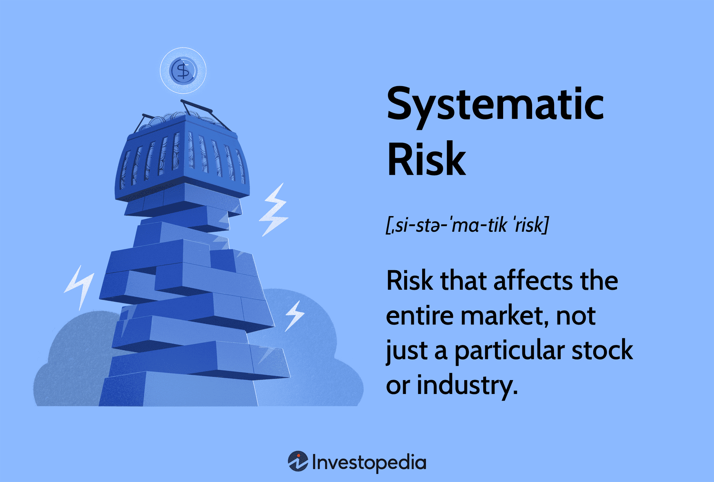

## Table of Contents

## What is systematic risk?

Systematic risk, also known as market risk, is the risk that affects the overall market or a broad segment of it. It's the type of risk that you can't avoid by simply diversifying your investments. Things like economic recessions, political instability, changes in interest rates, and natural disasters are examples of events that can cause systematic risk. Because these events impact the entire market, they can't be eliminated through diversification.

On the other hand, systematic risk is important for investors to understand because it helps them gauge the overall risk of their investment portfolio. For example, if an investor knows that the market is likely to experience a downturn due to an upcoming election, they might adjust their investments to be more conservative. Tools like beta, which measures a stock's volatility relative to the market, can help investors assess and manage systematic risk. By understanding and preparing for systematic risk, investors can make more informed decisions and potentially protect their investments from broad market movements.

## How does systematic risk differ from unsystematic risk?

Systematic risk and unsystematic risk are two types of risks that affect investments, but they are different in important ways. Systematic risk is the risk that affects the whole market or a big part of it. It comes from things like economic changes, political events, or natural disasters that you can't control or avoid by just picking different investments. For example, if the economy goes into a recession, it can hurt almost all stocks, no matter what company they are from. This type of risk is also called market risk because it impacts the market as a whole.

On the other hand, unsystematic risk is the risk that is specific to a single company or a small group of companies. It comes from things like bad management decisions, product failures, or lawsuits that only affect that particular company. Unlike systematic risk, you can reduce unsystematic risk by diversifying your investments. If you own stocks in many different companies and industries, a problem in one company won't hurt your whole portfolio. This type of risk is also called specific risk because it is specific to individual companies or industries.

## What are the main sources of systematic risk?

Systematic risk comes from things that affect the whole market or a big part of it. One main source is economic changes, like when the economy goes into a recession or when inflation goes up a lot. These changes can make it harder for companies to make money, which can cause stock prices to go down. Another source is changes in interest rates. When interest rates go up, it can make borrowing more expensive for companies, which can slow down their growth and hurt their stock prices.

Another big source of systematic risk is political events. Things like elections, new laws, or international conflicts can shake up the market. For example, if a new government comes in and changes tax laws, it can affect how much money companies make and how much investors want to invest. Natural disasters are also a source of systematic risk. Events like earthquakes or hurricanes can damage businesses and disrupt the economy, causing stock prices to fall.

Overall, systematic risk is caused by big events that you can't control or avoid by just [picking](/wiki/asset-class-picking) different investments. Understanding these sources can help investors prepare for and manage the risks that come with investing in the market.

## Can you provide examples of systematic risk events?

Systematic risk events are big things that can shake up the whole market. One example is the 2008 financial crisis. It started with problems in the housing market in the United States, but it quickly spread to affect banks, businesses, and economies all over the world. Stock markets crashed, and many people lost their jobs and savings. This was a classic case of systematic risk because it wasn't just one company or industry that was affected; it was the whole global economy.

Another example is the COVID-19 pandemic that started in 2020. When the virus spread around the world, governments had to shut down businesses and tell people to stay home to stop the spread. This caused a huge drop in economic activity, and stock markets fell sharply. Many industries, like travel and hospitality, were hit hard, but the impact was felt across the board. The pandemic showed how a health crisis can turn into a major economic and market risk.

Changes in interest rates can also cause systematic risk. For instance, when the Federal Reserve in the United States raises interest rates, it can make borrowing more expensive for everyone. This can slow down the economy because businesses might not want to take out loans to grow, and people might not want to buy houses or cars. When the economy slows down, stock prices can go down too. This shows how a change in interest rates, which affects the whole economy, can be a source of systematic risk.

## How does systematic risk affect the overall market?

Systematic risk affects the overall market by causing big changes that everyone feels. When something like a recession or a big political event happens, it can make the whole market go up or down. For example, if the economy goes into a recession, companies might make less money, and people might lose their jobs. This can make investors worried, so they might sell their stocks, which makes stock prices go down. Because systematic risk affects everything, it can make the market more unpredictable and harder to invest in.

Another way systematic risk affects the market is through things like changes in interest rates or natural disasters. If interest rates go up, it can make borrowing more expensive for companies, which can slow down the economy. When the economy slows down, stock prices can go down too. Natural disasters, like hurricanes or earthquakes, can also hurt the market. They can damage businesses and disrupt the economy, which can make stock prices fall. These events show how systematic risk can shake up the whole market and make it harder for investors to make money.

## What are common measures used to assess systematic risk?

One common measure used to assess systematic risk is beta. Beta is a number that shows how much a stock moves compared to the overall market. If a stock has a beta of 1, it moves the same as the market. If it's more than 1, it moves more than the market, and if it's less than 1, it moves less. This helps investors see how sensitive a stock is to big market changes. For example, if a stock has a high beta, it might go up a lot when the market goes up, but it could also go down a lot when the market goes down.

Another measure is the Capital Asset Pricing Model (CAPM). CAPM helps investors figure out what return they should expect from an investment based on its systematic risk. It uses the risk-free rate, the expected market return, and the stock's beta to calculate this. The idea is that investors should get a higher return for taking on more systematic risk. By using CAPM, investors can compare different investments and see which ones might be worth the risk.

## How can investors mitigate systematic risk in their portfolios?

Investors can mitigate systematic risk by diversifying their investments across different asset classes, like stocks, bonds, and real estate. While diversification can't eliminate systematic risk completely, it can help balance out the ups and downs of the market. For example, when stocks go down, bonds might go up, which can help protect the overall value of the portfolio. Another way to mitigate systematic risk is by investing in assets that don't move in the same way as the market. These are called low-beta investments, and they can help reduce the impact of big market swings on a portfolio.

Another strategy is to use hedging techniques, like buying options or futures contracts. These financial tools can help protect against big drops in the market. For example, an investor might buy a put option on a stock index, which gives them the right to sell the index at a certain price. If the market goes down, the put option can help offset the losses in the portfolio. Lastly, investors can also adjust their asset allocation based on their risk tolerance and market conditions. By being more conservative during times of high systematic risk, like before an election or during an economic downturn, investors can better protect their investments from big market movements.

## What role do economic indicators play in systematic risk?

Economic indicators are like signs that tell us how the economy is doing. They can help investors understand and prepare for systematic risk, which is the risk that affects the whole market. Things like unemployment rates, inflation, and GDP growth are important economic indicators. If unemployment goes up a lot, it might mean the economy is slowing down, which can make investors worried and cause stock prices to fall. On the other hand, if inflation is high, it can make it harder for companies to make money, which can also hurt the market.

By keeping an eye on these economic indicators, investors can get a better idea of what might happen to the market. For example, if the GDP growth rate is going down, it might be a sign that a recession is coming. This can help investors decide to be more careful with their investments, maybe by moving some money into safer assets like bonds. Understanding economic indicators can help investors manage systematic risk and make smarter choices about where to put their money.

## How do global events influence systematic risk?

Global events can have a big impact on systematic risk because they can affect the whole world's economy. When something big happens, like a war or a worldwide health crisis, it can shake up markets everywhere. For example, when the COVID-19 pandemic started, countries had to close their borders and businesses had to shut down. This made the economy slow down a lot, and stock markets around the world fell. These kinds of events can make investors worried and cause them to sell their investments, which can make the market go down even more.

Another way global events influence systematic risk is through changes in trade and politics. If two big countries start a trade war, it can make it harder for companies to sell their products and make money. This can hurt the stock market and the economy. Also, if there's a big political change, like a new government coming in, it can change laws and policies that affect businesses. These changes can make the market more unpredictable and increase systematic risk. By understanding how global events can affect the market, investors can be better prepared for the ups and downs that come with systematic risk.

## What are the implications of systematic risk for asset pricing models?

Systematic risk is really important for asset pricing models because it helps figure out how much return an investor should expect from an investment. One popular model that uses systematic risk is the Capital Asset Pricing Model, or CAPM. CAPM says that the expected return of an investment depends on its systematic risk, which is measured by something called beta. If an investment has a high beta, it means it moves a lot with the market, so investors should expect a higher return to make up for the extra risk. This helps investors decide if an investment is worth the risk they're taking.

Another way systematic risk affects asset pricing models is by making them more accurate. Since systematic risk can't be gotten rid of by just picking different investments, it's a big part of the risk that investors face. Models like the Arbitrage Pricing Theory, or APT, take into account different sources of systematic risk, like changes in interest rates or inflation. By including these factors, these models can give a better idea of what returns investors should expect. This helps investors make smarter choices about where to put their money, knowing how much risk they're taking on.

## How do financial regulations aim to manage systematic risk?

Financial regulations help manage systematic risk by making rules that banks and other financial companies have to follow. These rules are there to make sure that these companies don't take too many risks that could hurt the whole economy. For example, after the 2008 financial crisis, governments made new rules like the Dodd-Frank Act in the United States. This law made banks keep more money on hand, called capital, so they could handle losses better. It also set up ways to watch over big financial companies to make sure they weren't doing things that could cause another big crisis.

Another way financial regulations manage systematic risk is by making sure that the financial system is more stable. Regulators keep an eye on things like how much debt companies have and how they're investing their money. They also make rules about how much risk banks can take when they lend money or invest. By doing this, they try to stop problems in one part of the financial system from spreading and causing a big crash. This helps protect the economy from the kind of big events that can shake up the whole market.

## What advanced strategies can be employed to hedge against systematic risk?

One advanced strategy to hedge against systematic risk is using derivatives like options and futures. Options give investors the right, but not the obligation, to buy or sell an asset at a certain price. For example, an investor might buy a put option on a stock index. If the market goes down, the put option can help offset the losses in the portfolio. Futures contracts are agreements to buy or sell an asset at a future date for a set price. By using futures, investors can lock in prices and protect against big market swings. These tools can be complex, but they can help manage the risk that affects the whole market.

Another strategy is to use dynamic asset allocation. This means changing the mix of investments in a portfolio based on what's happening in the market. For example, if an investor thinks the market is going to be more risky because of an upcoming election, they might move some money into safer assets like bonds or cash. This can help protect the portfolio from big drops in the market. By being flexible and adjusting the portfolio as needed, investors can better handle the ups and downs that come with systematic risk.

## References & Further Reading

[1]: ["Quantitative Risk Management: Concepts, Techniques and Tools"](http://assets.press.princeton.edu/chapters/c10496.pdf) by Alexander J. McNeil, Rüdiger Frey, and Paul Embrechts

[2]: ["Algorithmic Trading: Winning Strategies and Their Rationale"](https://www.wiley.com/en-us/Algorithmic+Trading%3A+Winning+Strategies+and+Their+Rationale-p-9781118460146) by Ernest P. Chan

[3]: Aldridge, I. (2013). ["High-Frequency Trading: A Practical Guide to Algorithmic Strategies and Trading Systems."](https://books.google.com/books/about/High_Frequency_Trading.html?id=6l0DDQAAQBAJ) Wiley.

[4]: ["Risk Management and Financial Institutions"](https://books.google.com/books/about/Risk_Management_and_Financial_Institutio.html?id=1J1QDwAAQBAJ) by John C. Hull

[5]: Farmer, J. D., and Foley, D. (2009). ["The economy needs agent-based modelling."](https://pubmed.ncbi.nlm.nih.gov/19661896/) Nature, 460(7256), 685-686. 

[6]: ["Flash Crash: A Trading Savant, a Global Manhunt, and the Most Mysterious Market Crash in History"](https://www.amazon.com/Flash-Crash-Trading-Manhunt-Mysterious/dp/0385543654) by Liam Vaughan