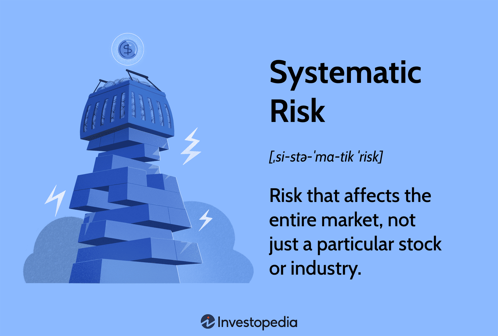

## Table of Contents

## What is systematic risk?

Systematic risk is the risk that affects the overall market or a broad segment of it. It's also known as market risk because it impacts almost all investments in the market. This type of risk cannot be eliminated through diversification because it is inherent to the entire market. Examples of systematic risk include economic recessions, political instability, changes in interest rates, and natural disasters.

Because systematic risk is unavoidable, investors need to understand it and manage it. One common way to manage this risk is by adjusting the overall asset allocation in a portfolio. For instance, during times of high market volatility, an investor might choose to shift more of their investments into safer assets like bonds or cash. Another way to manage systematic risk is through the use of financial instruments like options and futures, which can help hedge against market downturns.

## How does systematic risk differ from unsystematic risk?

Systematic risk and unsystematic risk are two types of risks that affect investments, but they are different in how they work and what causes them. Systematic risk is the kind of risk that affects the whole market or a big part of it. It's caused by things like economic changes, political events, or natural disasters that no single investor can control. Because it impacts everything, you can't get rid of it by just spreading your investments around. It's like a storm that hits all boats in the ocean, no matter where they are.

On the other hand, unsystematic risk is specific to a single company or a small group of companies. It comes from things like bad management decisions, product failures, or lawsuits that only affect that company. This type of risk can be reduced or even eliminated by diversifying your investments. If you spread your money across different companies and industries, a problem in one company won't sink your whole portfolio. It's like having several small boats; if one gets a hole, the others can still float.

## What are the main sources of systematic risk?

Systematic risk comes from big things that can shake the whole market or a large part of it. One main source is economic changes, like when the economy goes into a recession. During a recession, many companies might struggle, and people might lose their jobs, which makes them spend less money. This can lead to lower stock prices across the board. Another big source is changes in interest rates. When interest rates go up, borrowing money becomes more expensive, which can slow down business growth and affect stock prices.

Another source of systematic risk is political events. Things like new laws, elections, or even wars can make the market nervous and cause big swings in stock prices. For example, if a new government comes in and changes the tax rules, it can affect how much money companies make and how investors feel about the market. Natural disasters are also a source of systematic risk. Events like earthquakes or hurricanes can damage businesses and disrupt the economy, causing widespread impact on investments.

Overall, these sources of systematic risk are things that no single investor can control. They affect the whole market, so even if you spread your investments around, you can't completely avoid them. Understanding these risks helps investors prepare and adjust their strategies to handle them better.

## How can systematic risk impact an investment portfolio?

Systematic risk can shake up your whole investment portfolio because it affects the entire market or a big part of it. Imagine you have a bunch of different investments, like stocks, bonds, and real estate. Even though they're different, if there's a big economic downturn, like a recession, all of these investments can lose value at the same time. This is because when the economy struggles, people spend less, companies make less money, and the value of stocks and other investments goes down. It's like a storm that hits all boats in the ocean, no matter where they are.

To deal with systematic risk, investors often try to adjust their portfolios. For example, if they think the market might get rocky, they might move some of their money into safer investments like government bonds or cash. These don't grow as fast as stocks, but they're less likely to lose a lot of value during tough times. Another way to handle systematic risk is by using financial tools like options and futures, which can help protect against big drops in the market. Even though you can't completely avoid systematic risk, understanding it and making smart adjustments can help keep your investments safer.

## What are common indicators used to measure systematic risk?

To measure systematic risk, people often look at something called beta. Beta is a number that tells you how much a stock moves compared to the whole market. If a stock has a beta of 1, it moves just like the market. If it's more than 1, like 1.5, it moves more than the market, so it's riskier. If it's less than 1, like 0.5, it moves less than the market, so it's less risky. Beta helps investors understand how sensitive their investments are to big market changes.

Another way to measure systematic risk is by looking at the [volatility](/wiki/volatility-trading-strategies) of the market. Volatility is just a fancy word for how much prices go up and down. When the market is very volatile, prices can swing a lot, which means there's more systematic risk. People often use something called the VIX, which is known as the "fear index," to measure this. The VIX goes up when people are worried about the market, showing that there's more systematic risk around.

## What role does diversification play in managing systematic risk?

Diversification can help manage some risks in your investments, but it doesn't work well for systematic risk. Systematic risk is like a big storm that affects the whole market, so no matter how you spread your money around, you can't avoid it completely. If the economy goes into a recession or there's a big political change, all your investments, whether they're in different companies or industries, can still lose value at the same time.

Even though diversification can't get rid of systematic risk, it's still important. By spreading your investments across different types of assets, like stocks, bonds, and real estate, you can reduce the impact of that big storm on your overall portfolio. For example, if stocks go down a lot during a market crash, your bonds might not lose as much value, helping to balance things out. So, while diversification can't protect you from systematic risk, it can help make the ride a bit smoother when the market gets rough.

## Can systematic risk be completely eliminated through diversification?

Systematic risk can't be completely eliminated through diversification. This type of risk comes from big things that shake the whole market, like a recession or a sudden change in interest rates. No matter how you spread your money around, these big events will still affect all your investments at the same time. It's like a storm that hits all the boats in the ocean, no matter where they are.

Diversification is still important, though. By spreading your money across different types of investments, like stocks, bonds, and real estate, you can make the impact of systematic risk a bit less painful. If stocks go down a lot during a market crash, your bonds might not lose as much value, helping to balance things out. So, while diversification can't make systematic risk go away, it can help your portfolio handle the rough times better.

## What are some traditional financial instruments used to hedge against systematic risk?

One traditional financial instrument used to hedge against systematic risk is options. Options give you the right, but not the obligation, to buy or sell an asset at a certain price before a certain date. If you think the market might go down, you can buy a put option. This lets you sell your stocks at a set price even if the market drops a lot. It's like buying insurance for your investments, helping to protect them from big losses when the whole market takes a hit.

Another tool is futures contracts. Futures are agreements to buy or sell an asset at a set price on a future date. If you're worried about the market going down, you can sell futures contracts. This means you agree to sell something at today's price, even if the price drops later. It's a way to lock in the current price and protect yourself from the market going down. Both options and futures can help you manage the risk that affects the whole market, but they can be complicated and need careful handling.

## How do macroeconomic factors influence systematic risk?

Macroeconomic factors are big things that affect the whole economy, and they play a huge role in creating systematic risk. Things like interest rates, inflation, and unemployment rates can shake up the market. For example, if the government decides to raise interest rates, borrowing money becomes more expensive. This can slow down businesses because they have to pay more to get loans, which can lead to lower profits and stock prices falling across the market. It's like turning down the heat in a room; everything cools off, not just one part.

Another way macroeconomic factors influence systematic risk is through economic cycles. When the economy goes into a recession, people lose jobs and spend less money. This hits companies hard because they sell fewer products and make less profit. As a result, stock prices can drop a lot, affecting everyone's investments. Even if you have a mix of different investments, this big economic change can still make them all lose value at the same time. It's like a big wave that pushes all boats in the ocean, no matter where they are.

## What advanced strategies can investors use to mitigate systematic risk?

One advanced strategy to mitigate systematic risk is using derivatives like options and futures. These financial tools can act like insurance for your investments. For example, if you're worried about the market going down, you can buy put options. This gives you the right to sell your stocks at a set price, even if the market drops a lot. Futures contracts work a bit differently but can also help. By selling futures, you agree to sell something at today's price, so if the market falls, you're protected because you've locked in the current price. Both options and futures need careful handling because they can be complicated, but they're powerful tools to manage big market swings.

Another strategy is using asset allocation and rebalancing. This means spreading your money across different types of investments like stocks, bonds, and real estate, but also changing how much you have in each based on what's happening in the market. If you think the market might get rough, you might move more money into safer investments like bonds or cash. This doesn't eliminate systematic risk, but it can help your portfolio handle the ups and downs better. Rebalancing means checking your investments regularly and adjusting them to keep your plan on track, making sure you're not too heavily invested in one area that could be hit hard by systematic risk.

## How does the concept of beta relate to systematic risk in portfolio management?

Beta is a number that helps investors understand how much a stock or a portfolio moves compared to the whole market. If a stock has a beta of 1, it moves just like the market. If it's more than 1, like 1.5, it moves more than the market, which means it's riskier. If it's less than 1, like 0.5, it moves less than the market, so it's less risky. Beta is all about systematic risk because it shows how sensitive your investments are to big changes that affect the whole market, like a recession or a sudden change in interest rates.

In portfolio management, knowing the beta of your investments helps you manage systematic risk. If you have a lot of stocks with high betas, your portfolio will be more affected by market ups and downs. To reduce this risk, you might want to add some stocks or other investments with lower betas, like bonds, to balance things out. This way, even if the market takes a big hit, your portfolio won't swing as wildly because the different parts of it will react differently to the market changes.

## What are the limitations of current models used to predict and manage systematic risk?

The models we use to predict and manage systematic risk have some big problems. One main issue is that they often look at past data to guess what will happen in the future. But the economy and markets can change a lot, and what happened before might not happen again. This means these models can miss big events that no one saw coming, like a sudden financial crisis or a global health scare. They're good at spotting patterns, but not so good at dealing with surprises.

Another problem is that these models can be too simple. They might not think about all the different things that can affect the market, like political changes or natural disasters. They often focus on numbers and forget about the human side of things, like how people feel about the market. This can make their predictions less accurate. Also, because these models are based on math and numbers, they can be hard to understand for people who aren't experts, which can make it tough for everyone to use them to make smart investment choices.

## How can one build a comprehensive risk management framework?

A comprehensive risk management framework in [algorithmic trading](/wiki/algorithmic-trading) requires a blend of expertise spanning coding, market dynamics, and statistical methodologies. This framework is essential for developing algorithms capable of controlling volatility and managing market shifts effectively.

1. **Embedding Risk Management Protocols**: Developers should ensure that risk management protocols are integrated into trading algorithms. This includes setting parameters for acceptable risk levels and incorporating mechanisms to adjust trading behavior based on market fluctuations. For example, a trading algorithm may use stop-loss orders to automatically sell a security when it reaches a certain price, limiting potential losses.

2. **Utilizing Statistical Models**: Statistical models play a pivotal role in the framework by helping traders measure potential losses and assess their risk tolerance. Value-at-Risk (VaR) is a widely used measure that estimates the maximum potential loss over a given time frame with a specific confidence level. The formula for VaR can be given by:
$$
   \text{VaR} = \mu + z \cdot \sigma

$$

   where $\mu$ is the expected return, $z$ is the z-score corresponding to the desired confidence level, and $\sigma$ is the standard deviation of returns.

   Monte Carlo simulations further enhance risk assessment by modeling the probability distribution of potential outcomes. These simulations generate random samples of possible price paths to predict future market conditions, offering a robust understanding of risk exposure.

3. **Machine Learning Techniques**: Implementing machine learning in trading systems allows for the transformation of historical data into predictive analytics that help mitigate risks. Machine learning algorithms can analyze vast datasets to identify patterns and forecast market trends. For instance, a machine learning model can be trained to recognize early signs of market volatility, enabling preemptive adjustments to trading strategies.

   Here is a simple Python example using a hypothetical [machine learning](/wiki/machine-learning) model with a basic structure:

   ```python
   from sklearn.ensemble import RandomForestClassifier
   from sklearn.model_selection import train_test_split

   # Sample data: features and target
   features = ...  # Historical market data
   target = ...    # Respective outcomes (e.g., buy/sell signals)

   # Split data into training and testing sets
   X_train, X_test, y_train, y_test = train_test_split(features, target, test_size=0.3)

   # Initialize and train the model
   model = RandomForestClassifier(n_estimators=100)
   model.fit(X_train, y_train)

   # Predict and adapt strategies based on new data
   predictions = model.predict(X_test)
   ```

   This model can be integrated into trading systems to provide real-time risk assessments and strategy optimization, adapting as new data becomes available.

In conclusion, a comprehensive risk management framework in algorithmic trading harnesses the power of advanced statistical models and machine learning to anticipate market shifts and mitigate risks proactively. By embedding these protocols within trading algorithms, traders can create systems resilient to market volatility and aligned with strategic investment goals.

## References & Further Reading

[1]: Bergstra, J., Bardenet, R., Bengio, Y., & Kégl, B. (2011). ["Algorithms for Hyper-Parameter Optimization."](https://papers.nips.cc/paper/4443-algorithms-for-hyper-parameter-optimization) Advances in Neural Information Processing Systems 24.

[2]: ["Advances in Financial Machine Learning"](https://www.amazon.com/Advances-Financial-Machine-Learning-Marcos/dp/1119482089) by Marcos Lopez de Prado

[3]: ["Evidence-Based Technical Analysis: Applying the Scientific Method and Statistical Inference to Trading Signals"](https://www.amazon.com/Evidence-Based-Technical-Analysis-Scientific-Statistical/dp/0470008741) by David Aronson

[4]: ["Machine Learning for Algorithmic Trading"](https://github.com/stefan-jansen/machine-learning-for-trading) by Stefan Jansen

[5]: ["Quantitative Trading: How to Build Your Own Algorithmic Trading Business"](https://www.amazon.com/Quantitative-Trading-Build-Algorithmic-Business/dp/1119800064) by Ernest P. Chan