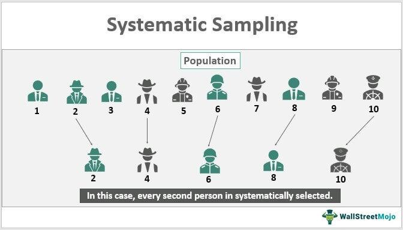

In the world of research and data analysis, sampling techniques are essential for extracting meaningful insights from large datasets. These methods help researchers and analysts make informed inferences about a population without needing to examine every individual data point, which is often impractical due to time and computational constraints. 

One of the notable probability sampling methods is systematic sampling. It is distinguished by its ease of use and efficiency, making it particularly appealing when dealing with extensive datasets. Unlike other sampling techniques, systematic sampling involves selecting sample elements from a larger population at regular intervals. This methodology ensures that each data point has a fair chance of being selected through a fixed periodic interval, thus reducing the effort required for data analysis while maintaining the reliability of the results.



In systematic sampling, the first step is to randomly choose a starting point within the data set. Subsequently, sample members are selected at regular intervals, which is determined as the ratio of the population size to the desired sample size. This interval-based selection minimizes the risk of cluster sampling, where only specific groups within the population are randomly chosen, potentially skewing results.

One practical application of systematic sampling is in algorithmic trading, also known as algo trading. Systematic sampling provides traders with a reliable mechanism for selecting data points, helping them test trading strategies efficiently. By focusing on a representative subset of transactions, traders can optimize their models and improve market predictions without the need to analyze every trade data point. This function is vital in high-frequency trading environments, where rapid decision-making is crucial.

Overall, systematic sampling stands out as a valuable tool for both researchers and traders. By ensuring equitable representation of data points within a dataset, it supports the derivation of accurate insights and facilitates informed decision-making in various domains, including financial markets and beyond.

## Table of Contents

## Understanding Systematic Sampling

Systematic sampling is a statistical method used in drawing a sample from a larger population wherein elements are selected at predetermined intervals. This approach involves choosing a random starting point and consistently [picking](/wiki/asset-class-picking) every nth item from a list until the desired sample size is achieved. The method is straightforward, making it particularly advantageous for large datasets where more complex sampling techniques might become cumbersome.

The key feature of systematic sampling is the sampling interval, which is calculated as the population size (N) divided by the desired sample size (n), mathematically represented as:

$$
\text{Sampling Interval (k)} = \frac{N}{n}
$$

For instance, if a researcher intends to sample 100 units from a population of 1,000, the sampling interval would be 10. This means starting at a randomly chosen point, and selecting every 10th item in the population list for inclusion in the sample.

Systematic sampling is often preferred over simple random sampling for its efficiency. While simple random sampling aims for complete randomness by treating each unit independently, systematic sampling organizes the selection process in a manner that is less prone to overlook areas of the dataset, thereby reducing the risk of cluster selection. Cluster selection occurs when segments of the population are accidentally overrepresented due to random sampling errors, a risk mitigated by the orderly process of systematic sampling.

Another advantage is its ease of execution. Once the sampling interval and starting point are determined, the process is mechanical, minimizing human error and subjectivity. This method's structured nature helps protect against data contamination, particularly in environments where maintaining the integrity of the sample is critical.

In conclusion, systematic sampling offers a practical balance between randomness and structure, making it an effective sampling method in research and analytical scenarios where large datasets need to be handled with precision and efficiency.

## Steps to Conduct Systematic Sampling

Systematic sampling follows a straightforward process, adhering to a series of steps that ensure a fair and representative sample from a larger population. The initial step involves defining the target population and determining the desired sample size. This establishes the groundwork for an organized sampling process.

Once the sample size is specified, the next step is to calculate the sampling interval, denoted as $k$. This interval is determined by dividing the population size $N$ by the sample size $n$. The formula is represented as:

$$
k = \frac{N}{n}
$$

This interval $k$ indicates the frequency at which members of the population will be selected for the sample.

The subsequent step is to choose a random starting point within the first interval. This adds an element of randomness to the systematic sampling process, reducing the likelihood of biases. The starting point must be a number between 1 and $k$.

Following the establishment of the starting point, every $k$-th member from this initial point is selected to form the sample. This progression continues to select every $k$-th member until the desired sample size is achieved. If reaching the end of the list, the sampling must circle back to the beginning of the population list if there are still samples to be selected. This continuation ensures that the sample size is maintained without exceeding the population size.

Through these precise steps, systematic sampling offers an efficient method to derive a representative subset. The strategy balances simplicity and reliability, making it a popular choice for handling large datasets.

## Systematic Sampling in Algo Trading

Traders employ systematic sampling to facilitate efficient data analysis within high-frequency and [algorithmic trading](/wiki/algorithmic-trading). This technique is advantageous as it provides a structured method to select representative data samples, allowing traders to build reliable models without the necessity of examining each trade individually. By utilizing systematic sampling, traders can evaluate strategies on smaller, yet comprehensive, datasets which reduces computational resources and time.

The approach of systematic sampling in algorithmic trading involves selecting data points at regular intervals from a sequential dataset, ensuring a fair representation of the entire dataset. This can be essential for [backtesting](/wiki/backtesting) trading strategies, where examining every transaction may be computationally prohibitive. By systematically selecting data points, traders can test their algorithms under diverse market conditions without overfitting to specific temporal patterns.

Additionally, systematic sampling can enhance the precision of market predictions. By maintaining consistency in sample selection, it reduces variability and potential biases that might arise from analyzing transactions over multiple timeframes or market events. For example, if a dataset comprises trades occurring every second, a trader might decide to sample every 10th trade to form a model that is efficient yet statistically robust.

Implementing systematic sampling in a Python script might involve the following steps:

```python
import pandas as pd

# Assume df is a DataFrame containing trade data, with 'TradeID' as an index
n = 10  # Sampling interval
sampled_df = df.iloc[::n]  # Selects every nth trade

# Proceed to backtesting or model evaluation using the sampled_df
```

This code snippet demonstrates the simplicity and efficiency offered by systematic sampling in practice. Traders can easily adjust the sampling interval (`n`) to match their desired level of data granularity or to control the trade-off between computational costs and modeling accuracy. As a result, systematic sampling contributes significantly to streamlined decision-making processes, providing a balance between data complexity and resource utilization.

Through its structured approach, systematic sampling aligns with the inherent needs of algorithmic trading by ensuring that strategic evaluation and market predictions are reliable, scalable, and less prone to overfitting to specific transaction cycles.

## Examples of Systematic Sampling

Systematic sampling is widely applied across various fields, providing an efficient method for obtaining representative samples when analyzing large datasets. One practical application occurs in market research, where companies might select every 10th customer for satisfaction surveys. This ensures a consistent and unbiased approach by capturing a regular sample across their customer base, thereby gaining insight into general satisfaction trends without having to exhaustively survey every individual.

In the domain of financial trading, systematic sampling plays a crucial role in performance reviews and strategy optimization. Traders often face the challenge of analyzing vast amounts of transaction data to evaluate the efficacy of their trading strategies. By using systematic sampling, traders can select every nth trade for performance review. This approach not only streamlines the data analysis process but also mitigates biases that might arise from cyclical trends in transaction data.

Consider a situation where a trading firm aims to analyze the performance of its trades over a month. If there are 10,000 trades and the firm decides to examine 1,000 trades, systematic sampling allows them to avoid the pitfalls of selecting non-representative trades due to transaction cycles. By choosing a fixed sampling interval, say every 10th trade, the firm ensures that the sample reflects the overall trading activity without the need to scrutinize every single transaction manually.

Moreover, systematic sampling’s methodological simplicity allows for straightforward implementation in computational algorithms. In Python, for instance, the sample selection can be implemented using basic list slicing techniques:

```python
trades = list(range(1, 10001))  # Example list of trades numbered 1 to 10,000
sample_interval = len(trades) // 1000  # Calculate the sampling interval

# Select every 10th trade
sampled_trades = trades[::sample_interval]
```

This code snippet selects every 10th trade from a list of trades, demonstrating how systematic sampling can be effortlessly integrated into trading systems to facilitate rapid decision-making and strategy evaluation. Such practices empower traders to focus on critical insights, refining their decision-making strategies in fast-paced financial markets.

## Comparing Systematic and Other Sampling Techniques

Systematic sampling is often compared to other sampling methods due to its distinct advantages and specific use cases. In cluster sampling, the population is divided into distinct subgroups, known as clusters, and a random sample of these clusters is chosen. All individuals within the selected clusters are then surveyed or analyzed. This approach is beneficial when the population is naturally grouped, and it can reduce costs by focusing on specific subgroups. However, it can also introduce bias if the selected clusters are not representative of the entire population.

In contrast, systematic sampling does not require the population to be divided into subgroups. Instead, it involves selecting members at regular intervals from an ordered population. This method is particularly useful when a complete list of the population is available, as it simplifies the process and eliminates the need for grouping.

Simple random sampling, often considered the gold standard, relies on random selection, ensuring that each member of the population has an equal chance of being included in the sample. This method minimizes bias and is highly effective for small populations where random selection is feasible. However, as dataset sizes increase, simple random sampling can become less practical due to the computational and logistical challenges of ensuring true randomness.

Systematic sampling offers a more efficient alternative for large datasets by utilizing a fixed interval approach that simplifies selection and maintains a structured method for achieving representative samples. The interval $k$ is calculated using the formula:

$$
k = \frac{N}{n}
$$

where $N$ is the population size and $n$ is the desired sample size. By selecting every $k$-th member, researchers can effectively manage large data quantities without the overhead of random selection, making it advantageous when full randomization is unnecessary.

While both systematic and simple random sampling aim to produce unbiased samples, their applicability varies depending on the dataset's size and nature. Systematic sampling excels when dealing with ordered lists and when efficiency is a priority, whereas simple random sampling is preferable for smaller, more manageable populations that require high precise randomness.

## Limitations of Systematic Sampling

One notable limitation of systematic sampling is its vulnerability to bias if there are underlying patterns within the population list. This method involves selecting members at regular intervals, which can inadvertently align with periodic patterns in the data, leading to unrepresentative samples. For instance, if every nth data point coincides with a recurring trend or cycle in the dataset, the sample may amplify or diminish these trends artificially. 

To illustrate, consider a scenario where the population exhibits a periodicity of k elements, and the chosen sampling interval is also k. In such cases, the sample might only capture one specific phase of the cycle, potentially missing variations present in other phases. This misalignment can lead to skewed results and biased conclusions.

Addressing this issue requires careful examination of the dataset for any inherent periodicity and selecting an appropriate sampling interval. One strategy to mitigate this risk is to incorporate randomness into the starting point, ensuring it does not consistently synchronize with any recurring patterns. Additionally, altering the sampling interval can help avoid alignment with underlying population cycles.

Despite these limitations, systematic sampling remains a useful tool. Awareness and adjustment for periodicity can allow researchers and practitioners to utilize systematic sampling effectively while minimizing the effects of such biases.

## Conclusion

Systematic sampling proves to be a potent methodology in both research and trading contexts due to its inherent efficiency and straightforward nature. Its design, which involves selecting data points at regular intervals, facilitates structured and consistent data collection, enhancing analytical processes. This regularity reduces the complexity often encountered with other sampling methods, making it particularly beneficial for handling large datasets where simplicity and systematic processing are advantageous.

Despite its significant advantages, systematic sampling is not devoid of potential biases. It requires careful application to ensure that the resulting sample is representative of the entire population. For instance, if the list from which samples are drawn has inherent patterns that coincide with the sampling interval, it can lead to skewed results, thus undermining the representativeness of the sample. Conscious implementation, such as varying starting points or adjusting intervals, can counteract these biases and maintain the integrity of the analysis.

Moreover, in algorithmic trading, systematic sampling plays a crucial role in supporting replicable and dependable decision-making. By enabling traders to analyze subsets of transactional data efficiently, it assists in developing robust financial strategies. The periodic selection provides a clear framework that can enhance model reliability, essential for high-frequency trading scenarios where precise and timely decision-making is critical.

Overall, while mindful of its limitations, systematic sampling remains a favorable technique in numerous research and trading applications. Its potential for facilitating consistent, efficient, and unbiased data analysis underscores its value as a strategic tool for both academics and practitioners in the financial sector.

## References & Further Reading

[1]: Kalton, G. (1983). ["Introduction to Survey Sampling."](https://archive.org/details/introductiontosu0000kalt) Sage Publications.

[2]: Cochran, W. G. (1977). ["Sampling Techniques (3rd Edition)."](https://archive.org/details/samplingtechniqu0000coch_t4x6) John Wiley & Sons.

[3]: Salganik, M. J., & Heckathorn, D. D. (2004). ["Sampling and Estimation in Hidden Populations Using Respondent-Driven Sampling."](https://journals.sagepub.com/doi/10.1111/j.0081-1750.2004.00152.x) Sociological Methodology, 34(1), 193-240.

[4]: ["Applied Spatial Data Analysis with R."](https://link.springer.com/book/10.1007/978-1-4614-7618-4) by Roger S. Bivand, Edzer J. Pebesma, and Virgilio Gómez-Rubio

[5]: Yates, F. (1949). ["Sampling Methods for Censuses and Surveys."](https://archive.org/details/SamplingMethodsForCensusesAndSurveys) Charles Griffin & Company.