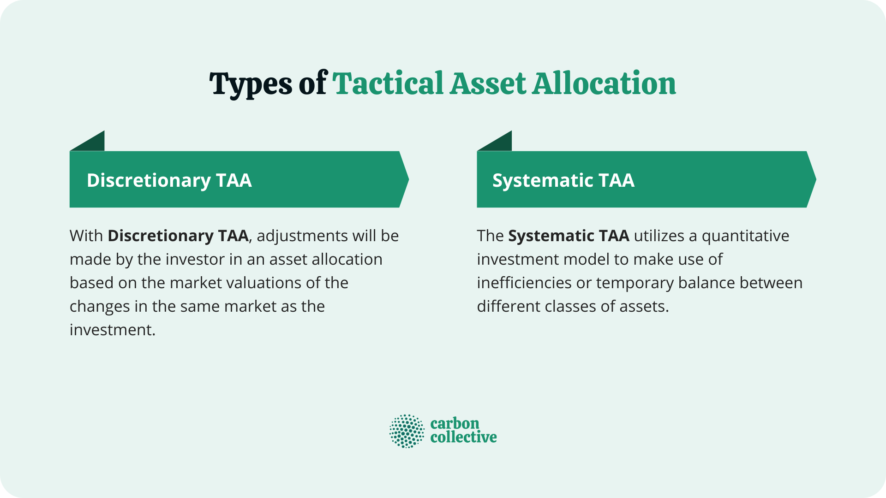

## Table of Contents

## What is Systematic Tactical Asset Allocation (STAA)?

Systematic Tactical Asset Allocation (STAA) is a way of managing investments that involves regularly changing the mix of assets in a portfolio based on certain rules or signals. Instead of sticking with the same investments all the time, STAA uses a system to decide when to move money into different types of assets like stocks, bonds, or cash. This approach aims to take advantage of market trends and reduce risk by not staying too heavily invested in one type of asset for too long.

The key to STAA is that it follows a set of rules or a model to make decisions. These rules might look at things like how the market has been doing recently, economic indicators, or other data to decide when to shift investments. By using a systematic approach, STAA tries to be more disciplined and less emotional than just guessing when to buy or sell. This can help investors potentially get better returns while managing risk, but it also requires careful planning and monitoring to make sure the rules are working well.

## How does STAA differ from traditional asset allocation strategies?

STAA is different from traditional asset allocation because it changes the mix of investments more often. Traditional asset allocation usually sets a fixed mix of stocks, bonds, and other assets and sticks with it for a long time. This mix might be based on how much risk someone wants to take or how long they plan to invest. But STAA doesn't stay the same. It uses rules to decide when to move money around, trying to do better by catching good trends and avoiding bad ones.

The other big difference is that STAA uses a system to make decisions. Traditional asset allocation might be more about setting it and forgetting it, or maybe making changes based on big life events or big market changes. But STAA is always looking at data and following rules to decide what to do next. This can make it more active and maybe more responsive to what's happening in the markets, but it also means you need to keep a close eye on things and make sure the rules you're using are good ones.

## What are the key principles behind STAA?

The main idea behind Systematic Tactical Asset Allocation (STAA) is to use a set of rules to decide when to change the mix of investments in a portfolio. Instead of keeping the same mix all the time, STAA looks at things like how the market is doing or other economic signs to decide when to move money into different types of assets like stocks, bonds, or cash. This way, it tries to take advantage of good times in the market and avoid the bad times, which can help make more money while also trying to keep risks lower.

Another important principle of STAA is that it's all about following a system, not making guesses or decisions based on feelings. The rules are set up ahead of time, and the portfolio is managed by sticking to these rules. This helps keep things disciplined and can make the process less emotional. But it's also important to keep checking that the rules are working well and to be ready to change them if they're not helping the portfolio do better.

## What types of assets are typically included in an STAA portfolio?

An STAA portfolio usually includes a mix of different types of assets. The most common ones are stocks, which are shares in companies, and bonds, which are loans to governments or companies. These two are the main building blocks because they often move in different ways, helping to balance risk and reward. Besides stocks and bonds, an STAA portfolio might also have cash or cash equivalents, like money market funds, which are very safe and easy to turn into cash when needed.

Sometimes, an STAA portfolio might also include other types of assets to spread out risk even more. These could be things like real estate investment trusts (REITs), which let you invest in property without buying buildings yourself, or commodities, like gold or oil, which can act differently from stocks and bonds. The exact mix of these assets can change based on the rules the STAA system follows, but the goal is always to have a good balance that can take advantage of different market conditions.

## How do you identify market trends and signals in STAA?

In Systematic Tactical Asset Allocation (STAA), identifying market trends and signals is all about using rules to look at data. These rules might check things like how stock prices have been moving lately, or how the economy is doing. For example, if stock prices have been going up for a while, the rule might say it's a good time to put more money into stocks. Or if the economy seems to be slowing down, the rule might suggest moving money into safer assets like bonds or cash. The key is to have clear rules that tell you what to look for and what to do when you see certain signs.

These rules can be based on different kinds of data. Some rules might use technical analysis, which looks at charts and patterns in how prices have moved in the past. Other rules might use [fundamental analysis](/wiki/fundamental-analysis), which looks at things like company earnings or economic reports. By combining different types of data, STAA tries to get a full picture of what's happening in the market. This helps make better decisions about when to change the mix of investments in the portfolio, aiming to catch good trends and avoid bad ones.

## What are the common indicators used in STAA for making allocation decisions?

In Systematic Tactical Asset Allocation (STAA), common indicators used for making allocation decisions include moving averages, which help spot trends by looking at average prices over time. If the short-term moving average goes above the long-term one, it might be a good time to buy more stocks. Another indicator is the Relative Strength Index (RSI), which shows if a stock or market is overbought or oversold. If the RSI is high, it might mean it's time to sell some stocks because they might be too expensive. Economic indicators like GDP growth, unemployment rates, and inflation also play a role. If the economy is doing well, STAA might suggest putting more money into stocks.

Other indicators used in STAA are [momentum](/wiki/momentum) indicators, which look at how fast prices are changing. If prices are going up quickly, it might be a good sign to buy more of that asset. Volatility measures like the VIX index, which shows how much people expect the market to move around, can also be important. If the VIX is high, it might be a good time to move money into safer assets like bonds or cash. By using these different indicators, STAA tries to make smart decisions about when to change the mix of investments in the portfolio, aiming to do better by catching good trends and avoiding bad ones.

## How often should one rebalance a portfolio using STAA?

In Systematic Tactical Asset Allocation (STAA), how often you should rebalance your portfolio depends on the rules you set up. Some people might check their portfolio and make changes every month, while others might do it every week or even every day. It all comes down to how quickly you want to react to what's happening in the market. If you think things can change fast, you might want to check more often. But if you think changes happen more slowly, you might not need to check as much.

The key is to stick to the rules you've set up. If your rules say to check every month, then you should do that, even if the market is doing something different. This helps keep your decisions disciplined and not based on feelings. But you also need to keep an eye on how well your rules are working. If they're not helping your portfolio do better, you might need to change them. So, while the rules tell you how often to rebalance, you should also be ready to adjust those rules if they're not working out.

## What are the potential risks and benefits of implementing STAA?

Implementing Systematic Tactical Asset Allocation (STAA) can bring some big benefits. One of the main ones is that it can help you make more money by catching good trends in the market. Because STAA uses rules to decide when to move money around, it can quickly take advantage of times when stocks or other assets are doing well. It also tries to keep risks lower by not staying too heavily invested in one type of asset for too long. This can help protect your money during bad times in the market. Plus, since STAA follows a set of rules, it can help you make decisions without letting your feelings get in the way, which can lead to better choices over time.

But there are also some risks to think about with STAA. One big risk is that the rules you set up might not work as well as you hope. If the market changes in ways you didn't expect, your rules might make you buy or sell at the wrong times, which could lose you money. Another risk is that you might end up trading too much, which can cost you money in fees and taxes. And because STAA needs you to keep a close eye on things and maybe change your rules, it can take a lot of time and work. So while STAA can be a good way to manage your investments, it's important to understand these risks and be ready to deal with them.

## Can STAA be automated, and if so, how?

Yes, STAA can be automated. This means using a computer program to follow the rules you set up for changing your investments. The program can look at the market data, like stock prices or economic reports, and decide when to buy or sell different assets based on those rules. This can save you a lot of time because you don't have to check everything yourself. You just need to make sure the program is set up right and keep an eye on it to see if it's working well.

Automating STAA can be done with special software or by using online platforms that let you set up rules for your investments. These tools can watch the market all the time and make changes to your portfolio when the rules say it's time. But even with automation, it's important to check the rules now and then to make sure they're still good. If the market changes a lot, you might need to update the rules to keep your investments doing well.

## How does STAA perform during different market conditions?

STAA can do well in different market conditions because it uses rules to change the mix of investments. When the market is going up, STAA might put more money into stocks to catch the good times. If the market starts to go down, the rules might say to move money into safer things like bonds or cash. This way, STAA tries to make more money when things are good and lose less when things are bad. But it's not perfect. If the rules don't work well with what's happening in the market, STAA might make the wrong moves and lose money.

In a steady market, STAA might not make big changes but will still follow its rules to keep the portfolio balanced. This can help keep things stable and maybe make a little more money than just leaving everything the same. But in a very up-and-down market, STAA might be moving money around a lot. This can be good if it catches the right trends, but it can also mean more trading costs and taxes. So, while STAA tries to do well no matter what the market is doing, how well it works depends a lot on how good the rules are and how well they match what's happening in the market.

## What advanced techniques can enhance the effectiveness of STAA?

One way to make STAA work better is by using [machine learning](/wiki/machine-learning). This means using computers to look at a lot of data and find patterns that might be hard for people to see. The computer can learn from past market trends and use that to make better rules for changing investments. This can help STAA catch good trends faster and avoid bad ones. But it needs a lot of data and someone who knows how to use machine learning well.

Another advanced technique is using more types of data. Besides looking at stock prices and economic reports, STAA can also use things like news stories, social media posts, or even weather data. All these things can affect the market, so using them can give a fuller picture of what's happening. This can help make better decisions about when to change the mix of investments. But it also means more work to gather and understand all this extra data.

## How can one evaluate the performance of an STAA strategy over time?

To evaluate how well an STAA strategy is doing over time, you need to look at how much money it makes and how much risk it takes. One way to do this is by checking the returns of your portfolio. Returns are how much your investments have grown or shrunk. You can compare these returns to a benchmark, like a stock market index, to see if your STAA strategy is doing better or worse than the market. Another thing to look at is how much your portfolio goes up and down, which is called [volatility](/wiki/volatility-trading-strategies). If your STAA strategy keeps risks low while still making good returns, that's a sign it's working well.

It's also important to look at how your STAA strategy does in different market conditions. You can do this by breaking down the performance into times when the market is going up, going down, or staying the same. This helps you see if your strategy is good at catching good trends and avoiding bad ones. Another thing to check is how often you're trading and how much it costs. If you're trading a lot, you might be losing money on fees and taxes, which can eat into your returns. By looking at all these things together, you can get a good idea of how well your STAA strategy is doing and if you need to make any changes to the rules.

## References & Further Reading

[1]: Bergstra, J., Bardenet, R., Bengio, Y., & Kégl, B. (2011). ["Algorithms for Hyper-Parameter Optimization."](https://papers.nips.cc/paper/4443-algorithms-for-hyper-parameter-optimization) Advances in Neural Information Processing Systems 24.

[2]: ["Advances in Financial Machine Learning"](https://www.amazon.com/Advances-Financial-Machine-Learning-Marcos/dp/1119482089) by Marcos Lopez de Prado

[3]: ["Evidence-Based Technical Analysis: Applying the Scientific Method and Statistical Inference to Trading Signals"](https://www.amazon.com/Evidence-Based-Technical-Analysis-Scientific-Statistical/dp/0470008741) by David Aronson

[4]: ["Machine Learning for Algorithmic Trading"](https://github.com/stefan-jansen/machine-learning-for-trading) by Stefan Jansen

[5]: ["Quantitative Trading: How to Build Your Own Algorithmic Trading Business"](https://books.google.com/books/about/Quantitative_Trading.html?id=j70yEAAAQBAJ) by Ernest P. Chan