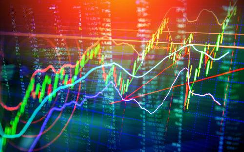

Tactical asset allocation (TAA) represents a dynamic investment strategy that actively adjusts the composition of a portfolio. Unlike strategic asset allocation, which establishes long-term investment goals based on an investor's risk tolerance and investment horizon, TAA is focused on capitalizing on short-term market opportunities. It allows investors to temporarily deviate from their strategic asset mix to exploit these opportunities, potentially enhancing returns.

Algorithmic trading, or algo trading, refers to the use of computer systems to execute trades at high speeds and volumes based on predefined criteria in the financial markets. It has become a significant force, accounting for a substantial proportion of trading volume globally. Its appeal lies in its ability to process vast amounts of data, execute trades with precision, and remove emotional biases from trading decisions.



At the intersection of TAA and algorithmic trading lies a powerful synergy. Algorithmic systems can be designed to incorporate TAA principles, using real-time data and analytics to make swift allocation adjustments that are difficult to achieve manually. This integration not only enhances the responsiveness of TAA but also optimizes decision-making processes through technology.

The objective of this article is to explore how TAA is implemented within algorithmic trading frameworks. We will examine the technological underpinnings, the methodologies employed, and the benefits of combining these two approaches. By leveraging technology, investors can optimize their asset allocation strategies, responding nimbly to market fluctuations and improving overall portfolio performance. This exploration highlights the transformative role of technology in the financial sector, reshaping traditional asset management practices.

## Table of Contents

## Understanding Tactical Asset Allocation

Tactical Asset Allocation (TAA) is an investment strategy designed to take advantage of short-term market fluctuations by dynamically adjusting an asset portfolio's allocation. Unlike Strategic Asset Allocation (SAA), which focuses on maintaining a predetermined asset mix based on long-term objectives and risk tolerance, TAA seeks to enhance portfolio returns by temporarily deviating from the strategic mix. The primary goal of TAA is to capitalize on short-term market opportunities, often influenced by macroeconomic factors, market trends, and investor sentiments.

Several factors influence TAA decisions, including market conditions, economic indicators, and investment forecasts. Market conditions such as volatility, market cycles, and seasonal trends can prompt tactical shifts in asset allocation. Economic indicators like interest rates, inflation, and employment figures play a critical role in determining the attractiveness of certain asset classes relative to others. Additionally, geopolitical events and policy changes can impact market dynamics, necessitating tactical adjustments.

Employing TAA in a trading or investment strategy offers potential benefits, such as enhanced returns and improved risk management. By exploiting short-term inefficiencies or mispricings in financial markets, investors can adjust their portfolios to capture extra returns. Moreover, TAA allows for more flexible risk management; investors can increase their holdings in safer asset classes during turbulent times and shift towards riskier assets during stable periods.

Before the advent of algorithmic solutions, traditional methods for implementing TAA included [fundamental analysis](/wiki/fundamental-analysis), technical analysis, and macroeconomic forecasting. These approaches required substantial manual input, intuition, and expertise to interpret market signals and make allocation decisions. While effective, these methods were often labor-intensive and subject to human error or bias, constraints now increasingly overcome by [algorithmic trading](/wiki/algorithmic-trading) technologies.

## The Role of Algorithmic Trading in Modern Markets

Algorithmic trading, often referred to as algo trading, involves the use of computer programs and systems to execute trades in financial markets automatically and at high speeds. Over the years, the adoption of algorithmic trading has significantly increased, transforming trading landscapes by enhancing efficiency and reducing the cost of executions. Initially gaining traction in the late 20th century, algo trading surged in popularity with the advancement of technology and increased accessibility to vast amounts of market data. Today, algorithmic trading is pivotal in modern markets, accounting for a substantial portion of trading volumes worldwide. According to a report by the Financial Times, algorithmic trading accounted for about 60-73% of all U.S. equity trading [volume](/wiki/volume-trading-strategy) in 2019.

One of the primary advantages of algorithms in trading is the unparalleled speed at which they can execute transactions. While human traders are limited by their cognitive processing capabilities, algorithmic systems can process complex calculations and execute trades in fractions of a second, taking advantage of fleeting market opportunities. Additionally, algorithms offer enhanced accuracy by minimizing human errors, thus ensuring trades are executed under predetermined conditions precisely. The ability to process and analyze large datasets rapidly is another key benefit, enabling traders to identify patterns and trends that may be invisible to the human eye.

There are several distinct types of algorithmic trading strategies employed by market participants. Market making involves algorithms posting and updating bid and offer prices to capitalize on the spread. Arbitrage strategies exploit price differences in the same asset across different markets, buying low in one and selling high in another. Trend following strategies utilize algorithms to identify and follow existing market trends, buying when prices rise and selling when prices fall, without attempting to predict turns in the market.

Machine learning and [artificial intelligence](/wiki/ai-artificial-intelligence) (AI) have further enhanced the capabilities of algorithmic trading. By leveraging AI, trading systems can learn from past data, identify complex patterns, and adapt to new conditions without explicit reprogramming. For instance, [machine learning](/wiki/machine-learning) models can enhance predictive accuracy in market movements, enabling more informed decision-making. As a result, AI-powered algorithms can potentially yield higher returns and manage risks more effectively than traditional approaches.

The influence of algorithmic trading on market [liquidity](/wiki/liquidity-risk-premium) and efficiency is profound. By providing constant bid and offer prices, algo trading contributes to more liquid markets, where assets can be bought and sold more easily without significant price changes. Additionally, algorithmic trading increases market efficiency by ensuring that prices more accurately reflect all available information, thereby reducing the chances of significant mispricing. However, there are concerns regarding potential market disruptions, as evidenced by the flash crash of 2010, which highlighted the need for proper regulations and safeguards in algorithmic systems.

## Integrating Tactical Asset Allocation in Algo Trading

Tactical Asset Allocation (TAA) can be effectively integrated into algorithmic trading systems through a structured approach of embedding TAA principles into programmable algorithms. The core idea is to dynamically adjust asset weights to capitalize on short-term market opportunities, based on a comprehensive analysis of various economic and financial indicators. This systematic approach allows for real-time decision-making and adjustments to portfolios aligned with market conditions.

To implement TAA within an algorithmic framework, several technological elements are crucial. High-quality data feeds are fundamental, as they provide the real-time economic indicators, market prices, and other financial data necessary for informed decision-making. These data feeds must be reliable and comprehensive, covering multiple asset classes and geographical markets. Furthermore, robust real-time analytics capabilities are required to process and analyze this data swiftly, enabling timely tactical decisions. Platforms like Python, integrated with financial libraries and APIs, such as Pandas for data manipulation and NumPy for numerical operations, are often employed to facilitate rapid analysis.

Machine learning models, particularly those utilizing supervised and unsupervised learning methods, play a pivotal role in automating TAA decisions. These models analyze patterns and correlations in historical and real-time data to forecast future market movements and identify potential investment opportunities. For example, a machine learning model might be trained to predict the risk-adjusted returns of different asset classes based on various economic indicators, allowing the algorithm to adjust allocations proactively:

```python
from sklearn.ensemble import RandomForestRegressor
import pandas as pd

# Sample dataset with economic indicators and asset class returns
data = pd.read_csv('market_data.csv')

# Feature matrix X and target variable y
X = data.drop(columns='asset_returns')
y = data['asset_returns']

# Train the machine learning model
model = RandomForestRegressor().fit(X, y)

# Predict future returns for asset allocation decisions
predicted_returns = model.predict(X_new)
```

While the integration of TAA strategies into algorithmic trading offers significant advantages, it also presents challenges. Data reliability is a critical concern, as the accuracy of TAA decisions heavily relies on the quality and timeliness of the data. Additionally, [backtesting](/wiki/backtesting) these strategies poses a challenge, as historical market conditions may not perfectly represent future market environments, leading to potential model overfitting. Overcoming these challenges requires rigorous backtesting procedures and continuous model validation to ensure robustness and adaptability to changing market dynamics.

An example of successful integration of TAA strategies in algorithmic trading is the utilization of [factor](/wiki/factor-investing)-based models that adjust allocations based on macroeconomic trends and sentiment analysis. These factors are programmed as inputs in the algorithm, which continuously recalibrates the portfolio in response to new data. Some hedge funds have adopted these programmable strategies, which yielded consistent outperformance by swiftly adjusting their exposure according to prevailing market conditions.

In conclusion, integrating TAA into algorithmic trading involves a marriage of strategic principles and technological precision—leveraging data feeds, machine learning, and robust analytics to dynamically adjust asset allocations. Despite the inherent challenges, diligent implementation and upkeep of these algorithms can offer substantial benefits in harnessing market opportunities efficiently.

## Benefits of Using TAA in Algo Trading

Tactical Asset Allocation (TAA) when integrated with algorithmic trading systems offers increased agility and responsiveness to market changes. Algorithms enable real-time monitoring and reallocation of assets based on predetermined criteria and market signals. This allows for swift adjustments to investment portfolios in response to market [volatility](/wiki/volatility-trading-strategies), economic shifts, or unexpected geopolitical events. Automated systems can instantly execute trade orders and reallocate resources, reducing human latency and increasing the precision of asset distribution to align with market conditions.

Risk management is enhanced through the use of TAA in algorithmic trading. Algorithms can be programmed to implement risk-management strategies effectively, including dynamic hedging and tailored stop-loss orders. Moreover, machine learning models can analyze large datasets to predict potential risk scenarios, allowing pre-emptive actions. These models can continuously learn and adapt, improving the accuracy of their predictions over time while managing risk exposure.

The integration of TAA within algorithmic trading frameworks can lead to improved potential returns. By continually optimizing asset rebalancing based on market conditions, TAA strategies ensure that portfolios are aligned with current opportunities. This dynamic adjustment enables capturing short-term gains while maintaining a diversified and balanced portfolio. In mathematical terms, this might involve solving optimization problems that maximize expected returns subject to risk constraints.

Algorithmic trading with TAA reduces emotional bias in investment decisions. Emotional decisions often arise in manual trading due to psychological factors like fear or greed. In contrast, algorithmic systems adhere to systematic processes based on quantitative analysis, which eliminates subjective interpretation. Algorithms operate based on logic and predefined parameters, ensuring consistency and discipline in trading activities.

Several studies and case examples underscore the benefits of integrating TAA in algorithmic trading. Research indicates that algorithmic strategies deploying TAA exhibit superior performance in reacting to market fluctuations compared to traditional methods. This is due to the high-frequency data processing and the ability to analyze complex market patterns that such systems offer. For instance, studies have shown enhanced alpha generation and risk-adjusted returns for funds utilizing TAA algorithms compared to those relying solely on static asset allocation strategies.

In conclusion, the adaptability, risk management, potential for higher returns, and reduction of emotional bias present compelling reasons to leverage TAA in algorithmic trading. As these technologies continue to evolve, their integration is likely to become increasingly sophisticated, offering even greater advantages to investors.

## Challenges and Considerations

Implementing Tactical Asset Allocation (TAA) in algorithmic trading systems presents several significant challenges that necessitate careful consideration and adept handling. One primary challenge is ensuring the systems are continually updated and the parameters finely tuned. Given the dynamic nature of financial markets, static models can rapidly become obsolete. Regular updates can optimize trading algorithms by adapting to new market conditions and incorporating the latest data and methodological advances. Much of this updating involves parameter optimization, where traders must find a balance between too few updates, which might miss market shifts, and too many, which could lead to overfitting.

Overfitting is another critical challenge. It involves tailoring an algorithm too closely to historical data, capturing noise rather than genuine patterns. This can be problematic in TAA, where the objective is not only to fit past data well but also to make accurate predictions about future performance. An overfitted model may perform well in backtesting but poorly when faced with new, unseen data. Avoiding overfitting can be achieved through methods such as cross-validation, where data is divided into subsets to ensure the model generalizes well to different data portions. Implementing regularization techniques like L1 or L2 regularization can also help in maintaining model generality by penalizing overly complex models.

Ethical concerns and regulatory implications are significant considerations in algorithmic trading, including TAA. Algorithmic trading has been scrutinized due to its potential to exacerbate market volatility and its role in events like the "Flash Crash" of 2010. The ethical implications include ensuring fairness and transparency in market operations and preventing algorithms from engaging in manipulative behaviors. Regulatory bodies worldwide have responded with frameworks to govern the use of algorithmic systems, mandating measures such as pre-trade risk controls and post-trade monitoring. Firms must navigate and comply with these regulations to avoid penalties while maintaining the ethical integrity of their trading strategies.

Mitigating these challenges involves a multifaceted approach. Developing robust testing environments that mimic real market conditions can aid in tuning parameters effectively while avoiding overfitting. Machine learning models, like ensemble methods, can enhance predictive accuracy while mitigating the risk of overfitting through the aggregation of multiple models. Furthermore, engaging with regulators proactively to understand and align with the evolving regulatory landscape ensures compliance and fosters trust in algorithmic strategies.

By addressing these challenges through systematic approaches, incorporating innovations in machine learning, and adhering to ethical and regulatory standards, TAA can be successfully integrated into algorithmic trading systems, enhancing their performance and robustness in the complex financial markets.

## Future Trends in TAA and Algo Trading

Emerging technologies are rapidly transforming tactical asset allocation (TAA) and algorithmic trading, presenting both challenges and opportunities for investors and financial institutions. One of the most significant influences is the integration of big data and advanced analytics, which are crucial for refining TAA strategies. By utilizing vast datasets, algorithms can identify patterns and correlations that may not be apparent through traditional analysis methods. This enhanced data processing capability allows for more accurate market predictions and asset rebalancing, leading to optimized portfolio performance. For instance, machine learning techniques, such as neural networks and random forests, are increasingly employed to parse and interpret complex datasets that inform TAA decisions.

Decentralized finance (DeFi) is another burgeoning trend impacting TAA and algorithmic trading. DeFi leverages blockchain technology to recreate traditional financial instruments in a decentralized architecture, eliminating intermediaries. This paradigm shift creates new opportunities for TAA by introducing a broader range of tradable assets and liquidity pools, thereby augmenting the flexibility and scope of algorithmic strategies. As DeFi platforms continue to grow, incorporating these assets into TAA frameworks could lead to unprecedented diversification and potentially higher returns, albeit with increased volatility and risk management challenges.

Moreover, collaborations between financial institutions and technology companies are increasingly common as both sectors seek to harness each other’s expertise. Such partnerships enable the development of sophisticated trading algorithms and platforms capable of implementing complex TAA strategies. By pooling resources, financial institutions gain access to cutting-edge technology and data analytics, while tech companies benefit from the financial sector's regulatory insights and market access. These synergies facilitate the creation of robust, scalable, and efficient algorithmic trading systems, thereby enhancing the effectiveness of TAA implementations.

Looking forward, the future landscape of algorithmic trading incorporating TAA is likely to be shaped by several key developments. The continued evolution of artificial intelligence (AI) and machine learning models will further refine decision-making processes and predictive analytics in TAA. The expansion of quantum computing holds the potential to revolutionize data analysis, enabling unparalleled computational speed and precision. Additionally, as regulatory frameworks adapt to keep pace with technological advancements, they will play a crucial role in determining the reach and application of TAA in algorithmic trading.

In summary, the future of TAA in algorithmic trading is intricately linked with advances in technology, data analytics, and market structures. While these developments promise enhanced performance and strategy sophistication, they also necessitate careful consideration of risk and regulatory implications. As such, continued innovation and strategic partnerships will be essential for successfully navigating this dynamic financial landscape.

## Conclusion

In this article, we have examined the integration of Tactical Asset Allocation (TAA) within algorithmic trading frameworks. Our exploration highlights the capability of TAA to significantly enhance trading performance through the systematic and efficient management of assets, capitalizing on short-term market movements. By integrating TAA into algorithmic systems, investors are empowered with a sophisticated toolset that leverages real-time data processing and advanced predictive analytics, leading to more informed and timely investment decisions.

Technological advancements play a pivotal role in transforming asset allocation methodologies. The automation of TAA strategies through algorithmic trading harnesses the power of machine learning and artificial intelligence, enabling unparalleled accuracy, speed, and adaptability in market operations. This dynamic setup drastically improves risk management and potential returns, offering a competitive edge in various economic conditions.

The growing interest and application of algorithmic trading in financial markets underscore the necessity for continued research in enhancing TAA strategies. Innovative approaches in machine learning models, big data analytics, and market simulations hold promise for further refining these strategies. The ongoing partnership between financial institutions and technology companies also provides a fertile ground for optimizing the integration and performance of TAA in trading systems.

As we look forward, the evolution of financial markets with the incorporation of TAA in algorithmic trading is likely to redefine investment paradigms. Emerging trends such as decentralized finance (DeFi) and quantum computing may further accelerate the possibilities of TAA, providing deeper insights and more sophisticated trading solutions. Embracing these innovations will be critical for staying ahead in a rapidly changing financial landscape, heralding a new era of strategic asset management.

## References & Further Reading

[1]: Bergstra, J., Bardenet, R., Bengio, Y., & Kégl, B. (2011). ["Algorithms for Hyper-Parameter Optimization."](https://papers.nips.cc/paper/4443-algorithms-for-hyper-parameter-optimization) Advances in Neural Information Processing Systems 24.

[2]: ["Advances in Financial Machine Learning"](https://www.amazon.com/Advances-Financial-Machine-Learning-Marcos/dp/1119482089) by Marcos Lopez de Prado

[3]: ["Evidence-Based Technical Analysis: Applying the Scientific Method and Statistical Inference to Trading Signals"](https://www.amazon.com/Evidence-Based-Technical-Analysis-Scientific-Statistical/dp/0470008741) by David Aronson

[4]: ["Machine Learning for Algorithmic Trading"](https://github.com/stefan-jansen/machine-learning-for-trading) by Stefan Jansen

[5]: ["Quantitative Trading: How to Build Your Own Algorithmic Trading Business"](https://books.google.com/books/about/Quantitative_Trading.html?id=j70yEAAAQBAJ) by Ernest P. Chan