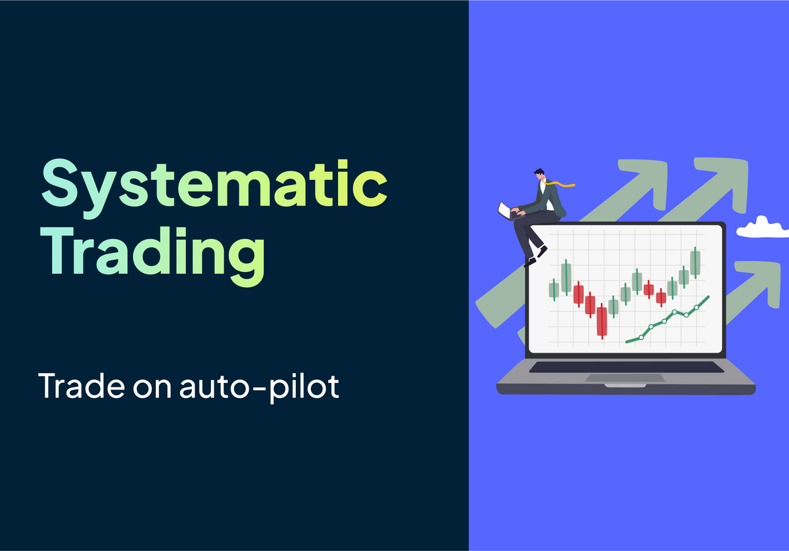

Systematic trading has cemented its position in modern finance as a major player, revolutionizing how investments are managed and decisions are made. Its roots can be traced back to the latter half of the 20th century, but it was the rise of computer technology and advanced analytics that provided the much-needed impetus. Today, systematic trading is not just an option but a critical component of the financial toolkit, with a significant share of market transactions being executed by algorithms.

These strategies have emerged as a beacon of rationality, often attempting to eliminate emotional biases and human errors that can negatively impact trading performance. Systematic trading encompasses a variety of approaches including trend-following, statistical arbitrage, market making, and more, each [driven by rigorous research and backtesting](https://blog.paperswithbacktest.com/p/how-to-collect-data-for-backtesting) to validate their efficacy. The methodology harnesses historical and real-time data to capitalize on market inefficiencies through precise, programmed instructions.

The influence of [systematic strategies](https://paperswithbacktest.com/) extends beyond the operational—it reshapes the trading landscape by fostering market efficiency and liquidity. While traditional discretionary trading relies heavily on individual judgment, systematic trading operates within predefined parameters and rules, executing trades in a disciplined and repeatable fashion. This methodological approach aims to deliver more consistent returns while managing risk and reducing the likelihood of costly emotional decisions.

From quantitative hedge funds to individual retail traders, the adoption of systematic strategies has become widespread, thanks in part to the democratization of data and advancements in computing power. [As artificial intelligence and machine learning evolve](https://blog.paperswithbacktest.com/p/fundamentals-of-machine-learning), they continuously redefine the boundaries of what systematic trading can achieve. The resulting strategies are sophisticated, adaptable, and often more aligned with the increasingly complex and interconnected global markets.

The continuous growth and integration of [systematic strategies](https://paperswithbacktest.com/) signal a profound and enduring shift in the landscape of trading and investment management. As the financial world becomes more data-driven and automated, the role of systematic trading is likely to expand, solidifying its importance in the pursuit of market opportunities.

## Table of Contents

## Foundations of Systematic Trading

### Systematic Trading Demystified

Systematic trading harnesses complex algorithms to execute trades, anchoring on objectivity by adhering to predefined rules and avoiding emotional decision-making. The principle behind this approach is the utilization of quantifiable data to establish clear entry, [exit](/wiki/exit-strategy), and trade management directives. Its emergence as a dominant force in financial markets is driven by its capacity to dissect and interpret vast datasets faster and more accurately than human traders.

The paradigm shift from discretionary to systematic trading commenced with the digitization of financial markets and the evolution of computational technology. Historically, strategies such as trend-following were simplistic, utilizing moving averages or [[momentum](/wiki/momentum) indicators](https://paperswithbacktest.com/paper/optimal-momentum-a-global-cross-asset-approach). The inception of electronic trading platforms provided a fertile ground for these early [systematic strategies](https://paperswithbacktest.com/), allowing for the development of more complex models and the automation of trade execution.

As the financial landscape grew more sophisticated, [systematic trading strategies evolved to incorporate a multitude of frameworks](https://paperswithbacktest.com/), from statistical [arbitrage](/wiki/arbitrage) to [advanced machine learning techniques](https://blog.paperswithbacktest.com/p/fundamentals-of-machine-learning). The advent of high-frequency trading ([HFT](/wiki/high-frequency-trading-strategies)) pushed the boundaries of speed and efficiency, while [the integration of [artificial intelligence](/wiki/ai-artificial-intelligence) (AI) and [machine learning](/wiki/machine-learning) has introduced unprecedented adaptability and predictive power](https://blog.paperswithbacktest.com/p/fundamentals-of-machine-learning). Modern systematic strategies can now autonomously learn from market behaviors, adjust to new information in real time, and identify opportunities that may be invisible or counterintuitive to human traders.

AI-driven systematic trading strategies leverage [neural network](/wiki/neural-network)s, natural language processing, and [deep learning](/wiki/deep-learning) to analyze unstructured data, including news, social media sentiment, and economic reports, transforming them into actionable insights. These sophisticated models require robust infrastructure and access to high-quality data, as well as significant computational prowess to process and execute trades within microsecond timescales.

The rise of systematic trading has democratized market access, allowing individual traders to compete with institutional investors. Open-source programming languages like Python have become instrumental in building and deploying trading algorithms, evidenced by Python's extensive libraries and frameworks that cater specifically to quantitative finance, such as Pandas for data manipulation, NumPy for numerical computing, and [backtesting](/wiki/backtesting) frameworks like Backtrader and Zipline.

Systematic trading's evolution is marked by its progressive complexity and integration with cutting-edge technologies, transforming it into a vital component of contemporary finance. As markets continue to evolve, systematic strategies are poised to become more adaptive and intelligent, driven by ongoing advancements in AI and machine learning[1][2][3].

### The Mechanics of Systematic Trading

Systematic trading is structured around algorithmic models which enable the automation of trade analysis and execution. These models follow strict, predefined rules that are designed to make trading decisions based on quantitative data. At the core of systematic trading is the algorithm—a set of instructions that dictate when to buy or sell an asset, how much to trade, and how to manage the risk of the trade.

Developing a systematic trading strategy begins with hypothesis formation. Traders and quantitative analysts conceive a theory or observe market patterns that could lead to profitable trades. This hypothesis is then translated into an algorithm by selecting appropriate market indicators, historical data, and statistical methods to test its viability. Common indicators used in these algorithms include moving averages, price oscillators, and [volatility](/wiki/volatility-trading-strategies) measures. [These indicators form the signals on which the algorithms act.](https://blog.paperswithbacktest.com/p/trading-signals-an-introduction)

Algorithmic models vary widely, from simple strategies that might trade based on moving average crossovers to complex strategies that involve machine learning algorithms trained to identify profitable trading patterns from vast sets of market data. Machine learning models might use techniques such as classification, regression, and [reinforcement learning](/wiki/reinforcement-learning) to continually improve their trading rules based on new data.

Once a model is built, it enters the backtesting phase. Here, historical market data is used to simulate how the strategy would have performed in the past. This process is critical to identify any potential issues with the strategy, such as overfitting, where [a model may perform exceptionally well on historical data but fails to generalize to unseen market conditions](https://blog.paperswithbacktest.com/p/how-to-collect-data-for-backtesting). To combat this, techniques like cross-validation and walk-forward optimization are employed.

After backtesting, [the strategy is optimized to refine the parameters, such as the length of a moving average or the thresholds for buy and sell signals](https://blog.paperswithbacktest.com/p/trading-signals-an-introduction). Optimization must be carefully balanced to improve performance without making the strategy overly sensitive to the idiosyncrasies of the historical data on which it was tested.

Execution systems then come into play, transforming signals into actual trades. This involves connecting to a brokerage service, handling order placement, and managing the lifecycle of a trade. [Execution systems must be robust and efficient, ensuring trades are executed quickly and at the best possible prices.](https://blog.paperswithbacktest.com/p/execute-your-trades-at-lower-cost) Factors such as slippage—the difference between the expected price of a trade and the price at which the trade is executed—and transaction costs are critical considerations that can significantly impact the profitability of a strategy.



An execution system also deals with real-time risk management, including setting stop-loss orders, monitoring positions for margin calls, and adjusting exposures according to the volatility in the market. Furthermore, the system should be capable of adapting to live market conditions, accounting for events like significant news announcements that can cause rapid changes in market prices.

In the real-world application of these strategies, execution can also involve working with brokers to use algorithms that break up large orders to minimize market impact. Many brokers, like [Interactive Brokers](/wiki/interactive-brokers-api), offer a suite of such execution algorithms, each tailored to different market conditions and trading objectives[4][5][6].

### Types of Systematic Trading Strategies

Systematic trading strategies harness algorithms to make trading decisions based on specific rules. These strategies can be categorized into several types, each with its distinct methodology and market philosophy.

**Trend-Following Strategies** are perhaps the most straightforward and widely used systematic approaches. They assume that financial markets have [directional momentum](https://paperswithbacktest.com/paper/optimal-momentum-a-global-cross-asset-approach) that persists for some time. Traders using these strategies look to capitalize on these movements by 'buying high and selling higher' or 'selling low and buying back lower.' They often use technical indicators such as moving averages or price breakouts to identify trends. The main advantage of trend-following is its simplicity and effectiveness over long periods, especially in markets that exhibit persistent trends. However, these strategies can suffer during range-bound market conditions, leading to numerous false signals and potential losses.

**Mean Reversion Strategies** operate on the principle that prices and returns eventually move back towards the mean or average. This strategy typically involves buying securities that are underperforming and selling those that are overperforming. Indicators for mean reversion strategies might include Bollinger Bands or the Relative Strength Index (RSI). The upside to mean reversion is that it can capture quick profits from market inefficiencies. However, the risk lies in the assumption that prices will revert to the mean, which may not always occur, particularly during a market event that causes a structural break in price patterns.

**Arbitrage Strategies** seek to exploit price discrepancies of similar or related instruments across different markets or forms. Pure arbitrage, considered risk-free, is rare and typically found only for brief moments. A common example is the simultaneous buying and selling of a stock in different exchanges to profit from price differences. Statistical arbitrage, on the other hand, uses mathematical modeling to identify and exploit price differences and is more common. While theoretically profitable, arbitrage strategies require very fast execution and are highly competitive, with profits being razor-thin and dependent on sophisticated technology and high trading volumes.

Other systematic strategies include **event-driven** approaches, which capitalize on price movements caused by corporate events like mergers or earnings announcements, and **seasonal or [calendar strategies](https://paperswithbacktest.com/paper/testing-the-significance-of-calendar-effects)**, which exploit patterns tied to specific times or events, like the January effect or holiday sales impacts on stocks[7].

Each of these systematic approaches has its pros and cons. Trend-following strategies may be slow to respond to market reversals and can result in large drawdowns during sideways markets. Mean reversion strategies may fail during strong trend movements and are vulnerable to sudden price jumps. Arbitrage strategies, while often low risk, are highly reliant on technology and speed and may have significant barriers to entry due to the capital required.

When selecting a systematic trading strategy, one must consider market conditions, personal risk tolerance, execution capabilities, and the financial and technological resources available. Each strategy demands a distinct approach to market analysis, execution speed, and risk management. Thus, a trader's choice of strategy should align with their investment goals and operational strengths.

## Strategy Development and Execution

### Crafting Your Systematic Strategy

Designing a systematic trading strategy is a structured process, grounded in quantitative analysis and model building. The first step is to formulate a hypothesis based on market behavior or inefficiencies you aim to exploit. This idea forms the cornerstone of your trading strategy.

Quantitative analysis then takes center stage, where you transform your **hypothesis** into testable rules. You would use historical data to examine if the idea holds up against past market conditions. This phase involves statistical analyses to determine the validity and potential profitability of the strategy.

Once you have a promising concept, the next step is to develop a **mathematical model**. This model uses algorithms to define the conditions under which trades will be executed, the size of the positions, and the duration of trades. These algorithms are typically based on technical indicators, statistical patterns, or a combination of several predictive [factor](/wiki/factor-investing)s.

Model building is not solely about entry and exit points. It encompasses the entire trading plan, including risk management rules and capital allocation. This step often involves constructing a diversified portfolio of strategies to spread risk and enhance returns.

The model then undergoes **backtesting**, a critical step where you simulate trading using historical data to evaluate the strategy's effectiveness. The backtesting process helps identify any overfitting to past data, which can lead to misleadingly optimistic performance expectations.

Following backtesting, forward testing, also known as **paper trading**, is conducted to assess the strategy's performance in real-time market conditions without actual capital at risk. This testing phase helps validate the robustness of the strategy against recent market data.

Once the strategy passes both backtesting and forward testing, it moves to the **execution phase**. Execution fidelity is paramount in systematic trading, as slippage and transaction costs can turn a theoretically profitable strategy into a loss-making one when applied in the real world.

Throughout the design process, **continuous refinement** and optimization are necessary to adapt to evolving market conditions. This could involve adjusting parameters, incorporating new data sets, or even overhauling the strategy's logic as new information becomes available[8][9][10].

### Backtesting and Optimization

Backtesting is the cornerstone of developing a robust systematic trading strategy. It involves simulating the trading strategy using historical data to ascertain performance, giving traders insights into the strategy's risk and return profile. Through backtesting, traders can evaluate various metrics such as drawdowns, Sharpe ratio, and overall profitability before risking any actual capital.

The process typically involves reconstructing, with historical data, trades that would have occurred in the past using rules defined by a given strategy. The result is a simulation of what a trader might expect to have achieved, had they implemented the strategy during a past period. Effective backtesting requires careful consideration of data quality and the potential for data mining bias, ensuring that the historical simulation is as realistic as possible.

Optimization is the next step, where traders fine-tune strategy parameters to achieve the best possible performance. However, a common pitfall to avoid during optimization is overfitting, where a strategy is overly tailored to historical data and therefore may not perform well in live markets. Techniques such as out-of-sample testing and cross-validation can help prevent overfitting. They involve testing the strategy on a set of data that was not used during the initial development and optimization processes.

Python has emerged as a leading programming language for backtesting and optimization due to its ease of use and extensive ecosystem of libraries. Python backtesting frameworks such as `Backtrader`, `PyAlgoTrade`, and `Zipline` offer traders powerful tools to simulate their trading strategies. These frameworks provide functionalities for order execution, handling of various data types, and statistical analysis tools to assess a strategy’s performance.

`Backtrader`, for example, is designed for those who need rapid development of complex strategies with an emphasis on the reuse of components. It allows for strategy parameter optimization using a built-in analyser that adjusts parameters over a specified range to find the combination that yields the best results based on a specified metric[11].

`Zipline` is another notable framework used for backtesting. It is well-integrated with the Quantopian platform, which provides an IDE and a vast array of financial data. Zipline offers an event-driven system that makes it suitable for strategies that require handling of every market tick[12].

For optimization, Python’s `SciPy` library contains modules for optimization and root finding, which can be used to optimize strategy parameters. Pandas can be employed for data manipulation and analysis, essential when handling the vast datasets typically involved in backtesting[13].

### Execution Systems

Execution systems are the backbone of systematic trading, bridging the gap between strategy and the actual placement of orders in the market. An execution system's primary role is to translate the strategy signals into buy and sell orders and manage the execution of those orders with the objective of achieving the best possible result for the trade.

Trade execution mechanisms vary widely and include simple market orders, which are executed at the current market price, limit orders, which are set to execute at a specific price or better, and more sophisticated algorithmic orders, which can break up a large order into smaller pieces to minimize market impact and slippage.

Slippage refers to the difference between the expected price of a trade and the price at which the trade is actually executed. It occurs when the market moves against the order in the time between the signal and execution, which can be a significant cost in fast-moving markets or when large orders are placed. Minimizing slippage is critical for the performance of a systematic trading strategy, particularly for high-frequency strategies.

Transaction costs are another crucial consideration. These include not just the commissions paid to brokers but also the bid-ask spread, which is the difference between the price to buy and sell an asset. Keeping transaction costs low is essential for strategies with thin margins, such as many arbitrage strategies.

Market impact is the effect that a trader's orders have on the market price of an asset. Large orders, especially in less liquid markets, can move the market, potentially to the trader's disadvantage. Careful execution is required to minimize this impact, often through the use of iceberg orders or by trading during periods of higher [liquidity](/wiki/liquidity-risk-premium).

Interactive Brokers, a popular brokerage among systematic traders, provides a suite of execution algorithms designed to help traders minimize costs and market impact. These algorithms range from [volume](/wiki/volume-trading-strategy)-weighted average price (VWAP), which aims to trade at the average price over a specified period, to accumulation/distribution algorithms, which work to execute orders in line with the market volume, minimizing market impact[14].


Moreover, Interactive Brokers' algorithms like Adaptive Algo are designed to provide a balance between speed of execution and minimizing market impact. The algorithm dynamically adjusts its behavior based on real-time market conditions, seeking the best execution according to the trader's specified parameters.

Understanding and properly configuring these execution mechanisms is a sophisticated task that can make a significant difference in the overall performance of a systematic trading strategy. Traders and [quant developer](/wiki/becoming-a-quant-developer)s must backtest not only their trading signals but also their execution systems, ensuring that both work harmoniously to capitalize on market opportunities while controlling for costs and market impact.

## Advanced Systematic Trading Concepts

### Risk Management in Systematic Trading

Risk management is the cornerstone of systematic trading, underpinning the sustainability and longevity of any trading strategy. In systematic trading, risk is managed programmatically through the development of rules and algorithms designed to preserve capital and control losses.

Establishing risk parameters involves setting predetermined limits on various aspects of the trading process. These limits include drawdown controls, which halt trading if losses reach a certain percentage of the portfolio; position sizing rules, which determine how much capital is allocated to individual trades based on their perceived risk; and stop-loss orders, which automatically sell an asset when it reaches a certain price limit.

Control mechanisms are integrated into the trading system to enforce these risk parameters. They function automatically, responding in real time to market movements and the performance of the trading strategy. The goal of these mechanisms is not only to prevent significant losses but also to help ensure that the strategy adheres to its expected risk-return profile.

Stress testing is a simulation technique used to understand the behavior of trading strategies under extreme market conditions. By applying historical data from past market crises, such as the 2008 financial crisis or the 2010 Flash Crash, traders can gauge potential losses and identify strategy vulnerabilities. Scenario analysis extends this by modifying various factors, such as volatility or correlation, to predict the strategy's performance in hypothetical future scenarios.

Python, being the lingua franca of [algorithmic trading](/wiki/algorithmic-trading), offers a multitude of risk management modules. These include:

1. **Pyfolio**: An open-source tool developed by Quantopian that provides performance and risk analysis of financial portfolios. It allows traders to create tear sheets that detail the risk and return statistics of their strategies[15].
2. **Quantlib**: A library for modeling, trading, and risk management in real-life. Quantlib is equipped with tools for calculating dates, yields, and risk factors, among others[16].
3. **Riskalyze**: This module is designed to provide quantitative risk assessment tools for finance, including Value at Risk (VaR) and Conditional Value at Risk (CVaR) calculations[17].

Integrating these Python modules into a systematic trading strategy enables traders to conduct rigorous risk management and maintain a resilient trading operation. The continuous monitoring and adjusting of risk parameters and controls, facilitated by stress testing and scenario analysis, help to ensure that strategies stay within their risk tolerance levels and can survive turbulent market conditions.

### Portfolio Construction

In systematic trading, portfolio construction is a critical process that entails strategic asset allocation and diversification to optimize returns and manage risk. The methodology combines financial theory, quantitative methods, and computational tools to assemble a portfolio aligned with the trader's risk tolerance and investment objectives.

Asset allocation in systematic trading is based on a quantitative framework that assesses various asset classes' expected returns, volatilities, and correlations. The aim is to exploit diversification benefits to improve the portfolio's risk-adjusted returns. Typically, systematic traders employ optimization algorithms to solve for the optimal asset weights in a portfolio. These algorithms use inputs such as historical returns, volatilities, and cross-correlations between asset returns, and they aim to either maximize return for a given level of risk or minimize risk for a given level of expected return.

Diversification is achieved by spreading investments across assets that are not perfectly correlated. This spreads risk and can lead to a reduction in the portfolio's overall volatility. In a diversified portfolio, the underperformance of some assets can be balanced by the outperformance of others. The effectiveness of diversification depends on the degree of correlation between the assets: the lower the correlation, the greater the diversification benefit.

Understanding correlation and covariance is vital in building a balanced portfolio. Correlation measures how assets move in relation to one another, while covariance measures the directional relationship between the returns of two assets. By analyzing both, systematic traders can construct a portfolio that aims to capture the benefits of diversification, minimizing idiosyncratic risk while potentially improving returns.

Python offers several portfolio construction modules that enable traders to apply these concepts programmatically:

1. **PyPortfolioOpt**: This module offers portfolio optimization capabilities, including classical mean-variance optimization techniques and more modern methods such as hierarchical risk parity and the Black-Litterman model[18].
2. **zipline**: Originally developed by Quantopian, zipline is an event-driven backtesting library that also supports portfolio construction and risk management. It allows for simulation of strategies over historical data to test their performance before live deployment[19].
3. **QuantLib**: It is a comprehensive software framework for quantitative finance, providing tools for portfolio optimization, among others. It's particularly useful for strategies involving derivatives and fixed income assets[20].

By leveraging these tools, systematic traders can construct and continuously refine portfolios to adapt to changing market conditions, maintain risk at acceptable levels, and pursue their targeted returns. Through disciplined asset allocation and robust diversification practices, reinforced by quantitative analysis and cutting-edge computational tools, systematic trading strategies can achieve a balanced portfolio designed for long-term performance.

### Machine Learning and Artificial Intelligence

Machine learning (ML) and artificial intelligence (AI) have revolutionized systematic trading strategies, providing tools that can uncover complex patterns in data that would be impossible for a human to discern. These approaches allow traders to create models that can learn from market data and make predictions or decisions without explicit programming for every possible scenario.

One cutting-edge approach in this realm is the application of neural networks, including deep learning models, which can identify nonlinear relationships within vast datasets. Convolutional Neural Networks (CNNs) and Recurrent Neural Networks (RNNs), including Long Short-Term Memory networks (LSTMs), have been particularly impactful in analyzing time-series data for market predictions.

Another approach is reinforcement learning, which trains algorithms to make a sequence of decisions by rewarding the model for profitable strategies. This method aligns closely with the goals of systematic trading, as it involves learning optimal actions within a dynamic, often unpredictable, environment.

Case studies have shown AI's impact on trade prediction and execution. For instance, researchers at J.P. Morgan demonstrated the potential of ML algorithms to improve trading strategies by using historical data to predict trade outcomes. Another example is the use of AI by [hedge fund](/wiki/hedge-fund-trading-strategies)s like Renaissance Technologies, which has been a pioneer in applying complex mathematical models to trading for decades.

For implementing ML and AI in trading, Python remains a preferred choice due to its simplicity and the rich ecosystem of data analysis and machine learning libraries available. Some of the Python modules that are indispensable for systematic traders include:

- **scikit-learn**: This library provides simple and efficient tools for data mining and data analysis. It is built on NumPy, SciPy, and matplotlib, offering algorithms for classification, regression, clustering, and dimensionality reduction[21].
- **TensorFlow**: An end-to-end open-source platform for machine learning from Google, TensorFlow facilitates building and deploying ML models with tools such as Keras, which provides a high-level API for neural networks[22].
- **PyTorch**: Developed by Facebook's AI Research lab, PyTorch is an open-source machine learning library that accelerates the path from research prototyping to production deployment with tools and libraries for deep learning[23].
- **Keras**: Now integrated with TensorFlow, Keras is an open-source software library that provides a Python interface for artificial neural networks. Keras acts as an interface for the TensorFlow library[24].
- **pandas**: Critical for data manipulation and analysis, pandas offer data structures and operations for manipulating numerical tables and time series, which is essential in the data preprocessing stage of ML and AI models[25].
- **NumPy**: A library adding support for large, multi-dimensional arrays and matrices, along with a large collection of high-level mathematical functions to operate on these arrays, which is foundational for any computation in Python[26].

With these modules, systematic traders can process vast datasets, build predictive models, backtest strategies, and deploy AI-driven systematic trading strategies. The continuous development in ML and AI technologies promises even more sophisticated tools in the future, further enhancing the capabilities of systematic traders.

## The Systematic Trader’s Toolkit

### Essential Software and Tools

Systematic trading hinges on the employment of software and tools that enable the design, backtesting, optimization, and execution of strategies. The spectrum of these tools ranges from comprehensive trading platforms to specialized programming languages and libraries.

The cornerstone of systematic trading software is the trading platform. MetaTrader (MT4/MT5) by MetaQuotes is widely used for [forex](/wiki/forex-system) and CFD trading, notable for its built-in scripting language, MQL, which allows traders to develop their own indicators and automated trading robots (Expert Advisors or EAs). Another formidable platform is TradeStation, which offers similar functionalities with its own scripting language, EasyLanguage.

For more sophisticated quantitative analysis and high-frequency trading, platforms such as QuantConnect and Quantopian (now part of Robinhood) have emerged, providing a cloud-based, Python-oriented environment for strategy development and backtesting. These platforms support multiple assets classes and come with a vast array of data for analysis.

In the proprietary sector, Bloomberg Terminal remains a gold standard for market data and financial analysis. Although costly, its advanced analytics and comprehensive data feeds make it indispensable for many professional traders and institutions. Similarly, Reuters' Eikon provides powerful analysis tools and deep market insights.

On the open-source front, Python has become the lingua franca for systematic traders due to its simplicity and the robust ecosystem. Libraries such as pandas for data manipulation, NumPy for numerical computation, and matplotlib for charting form the backbone of the data analysis workflow. For backtesting, libraries like Backtrader and Zipline offer robust frameworks that simulate the execution of strategies against historical data.

Proprietary systems may offer comprehensive support and integrated workflows, which can be a significant advantage for institutions that require reliability and can afford the associated costs. On the other hand, open-source solutions are flexible and customizable, albeit often requiring more technical expertise to integrate various components effectively.

Third-party solutions bridge gaps between proprietary and open-source offerings. Interactive Brokers, for example, provides APIs that allow traders to connect their custom-built systems or third-party applications to its brokerage service for execution.

When comparing these solutions, consider factors like cost, flexibility, supported languages, available assets, data quality, and community support. The choice often depends on the trader’s specific needs, expertise, and budget.

For direct access to market data and order execution APIs, many turn to services like Alpaca and OANDA. These platforms offer APIs that are particularly friendly to Python developers, facilitating the automation of trading strategies.

To summarize, the ecosystem for systematic trading software and tools is diverse, with platforms and programming languages catering to a wide range of trading styles and objectives. While proprietary systems may lead in terms of integration and support, the open-source community is a powerhouse of innovation, offering customizable and cost-effective solutions. The trade-off between these options depends on the individual trader's requirements, with third-party solutions frequently serving to balance the two ends of the spectrum.

### Data: The Lifeblood of Systematic Strategies

The precision of systematic trading strategies is heavily reliant on the quality and integrity of the data they use. This dependency underscores the need for accuracy, completeness, and consistency of data sets which power the decision-making algorithms. Data errors can propagate through a system and result in substantial losses, which is why traders go to great lengths to ensure their data is clean and reliable.

Data quality issues such as missing values, duplicates, or incorrect timestamps must be addressed before data can be used for backtesting or live trading. This typically involves a rigorous process of data cleaning and validation. Methods such as statistical analysis, anomaly detection, and cross-validation with other data sources help ensure the integrity of the data.

When it comes to historical data, sources like Bloomberg, Thomson Reuters, and S&P Global Market Intelligence are industry staples, providing extensive historical data across a myriad of financial instruments. Their data services, while costly, are often indispensable to institutional traders due to the breadth and reliability of the information they offer.

Real-time data is equally critical, particularly for strategies that depend on short-term market fluctuations. Services such as Quandl, now part of Nasdaq, and IEX Cloud offer access to real-time and historical market data, with varying levels of latency and granularity suitable for different trading styles.

Alternative data sets, ranging from satellite imagery to credit card transactions, are becoming increasingly popular, especially among hedge funds seeking an informational edge. Vendors like RavenPack or Eagle Alpha curate such [alternative data](/wiki/best-alternative-data), providing structured data sets that are ready for quantitative analysis.

For those operating on a tighter budget or requiring a more hands-on approach, there are open-source options available. Yahoo Finance, through libraries like yfinance for Python, offers access to historical stock prices and financial summaries. The quandl Python package provides a straightforward way to download financial, economic, and sociology data from the Quandl database.

With the rise of cryptocurrencies, a new market for data providers has emerged. Platforms like CoinMarketCap and CryptoCompare offer data services tailored to digital assets, including historical trade data, [order book](/wiki/order-book-trading-strategies) data, and blockchain analytics.

Data storage and management are also critical considerations. Storing large datasets requires robust database systems. SQL databases, such as PostgreSQL, are common for structured data requiring complex queries, while NoSQL databases like MongoDB are favored for their flexibility and scalability with semi-structured data.

Finally, the practice of data normalization — converting different data formats into a standardized format — ensures compatibility across different systems and models within a trading platform. This step is crucial for accurate cross-instrument and cross-market analysis, which is fundamental for strategies involving pairs trading or arbitrage.

Given the increasing importance and evolving nature of financial data, staying current with the latest developments in data provision, management, and integrity checks is vital for the systematic trader. The difference between a successful and a failing systematic strategy can often be traced back to the quality of the underlying data.

## Systematic Trading in Practice

### Real-World Applications and Case Studies

Systematic trading strategies span a vast spectrum, from simple moving average crossovers to complex strategies that incorporate machine learning and artificial intelligence. A common thread among successful strategies is their ability to consistently execute trading rules and manage risks, regardless of market conditions.

#### Trend-Following Strategies

One of the most enduring systematic strategies is [trend following](/wiki/trend-following). Funds like AQR Capital Management have been known to employ trend-following algorithms that capture [momentum](https://paperswithbacktest.com/paper/optimal-momentum-a-global-cross-asset-approach) across various asset classes. These strategies typically enter long positions in assets that are trending upwards and short positions in those trending downwards. They often utilize indicators such as moving averages, with Python's Pandas and TA-Lib libraries providing the necessary computational tools. For instance, calculating a moving average crossover can be executed in Python as follows:

```python
import pandas as pd
import talib

## Assume 'data' is a Pandas DataFrame with a 'Close' column
data['50_MA'] = talib.SMA(data['Close'], timeperiod=50)
data['200_MA'] = talib.SMA(data['Close'], timeperiod=200)
data['Signal'] = 0
data['Signal'][data['50_MA'] > data['200_MA']] = 1
data['Position'] = data['Signal'].diff()
```

#### Mean Reversion Strategies

Another category is mean reversion, which capitalizes on the principle that prices and returns eventually move back towards the mean or average. Quantitative hedge funds like Renaissance Technologies have been pioneers in deploying sophisticated versions of these strategies. They rely on statistical measures such as standard deviations and z-scores, which can be computed using Python's NumPy or SciPy libraries. A simple mean reversion setup might look like this:

```python
import numpy as np

## Calculate moving average and standard deviation
data['Moving_Average'] = data['Close'].rolling(window=20).mean()
data['Std_Dev'] = data['Close'].rolling(window=20).std()

## Define entry and exit thresholds
data['Upper_Band'] = data['Moving_Average'] + (data['Std_Dev'] * 2)
data['Lower_Band'] = data['Moving_Average'] - (data['Std_Dev'] * 2)

## Create signals
data['Long_Entry'] = data['Close'] < data['Lower_Band']
data['Long_Exit'] = data['Close'] >= data['Moving_Average']
data['Positions'] = np.nan
data.loc[data['Long_Entry'], 'Positions'] = 1
data.loc[data['Long_Exit'], 'Positions'] = 0
data['Positions'].ffill(inplace=True)
```

#### Arbitrage Strategies

Arbitrage strategies seek to exploit price discrepancies between markets or instruments. For example, [statistical arbitrage](/wiki/statistical-arbitrage) strategies, like those used by Citadel LLC, involve simultaneously buying and selling two co-integrated securities when their prices diverge in a way that provides a risk-free profit opportunity. Coding such strategies would involve advanced statistical tests, for which Python's statsmodels library could be employed:

```python
import statsmodels.api as sm

## Assuming 'price_series1' and 'price_series2' are co-integrated
model = sm.OLS(price_series1, price_series2)
results = model.fit()
hedge_ratio = results.params[0]
spread = price_series1 - hedge_ratio * price_series2
```

#### Machine Learning-Based Strategies

With the advent of big data and computational advances, machine learning-based strategies are becoming prevalent. These strategies might use supervised learning to predict market movements or reinforcement learning to dynamically adjust to new information. Deep learning frameworks like TensorFlow or PyTorch are typically used for constructing these models. An example of a machine learning model for predicting stock prices might involve creating features, labels, and training a model as follows:

```python
from sklearn.ensemble import RandomForestRegressor

## Assume 'features' is a DataFrame with predictive features
## 'target' is a Series with the target variable, e.g., future returns
model = RandomForestRegressor(n_estimators=100)
model.fit(features, target)
predictions = model.predict(new_features)
```

#### Case Studies

Case studies, such as the success of Bridgewater Associates' Pure Alpha fund, often highlight the application of these strategies in a mixed approach that combines trend-following, mean-reversion, and other elements to diversify across strategies and asset classes.

These Python examples represent simplified versions of strategies that require additional layers of complexity, such as risk management and cost considerations, in actual trading environments. They are intended to illustrate the coding aspect of systematic trading, with the understanding that successful real-world applications are the result of extensive research, robust infrastructure, and continuous refinement.

### Challenges and Solutions

Systematic trading, despite its rigor and quantitative backbone, is not without challenges. One major hurdle is overfitting, where a strategy is too finely tuned to historical data, leading to disappointing performance in live markets. This often occurs when too many parameters are included or when a model is excessively optimized on historical market noise rather than true underlying patterns. To mitigate this, traders employ walk-forward analysis and cross-validation techniques that validate the strategy's effectiveness on out-of-sample data, ensuring that the strategy can adapt to unseen market conditions.

Market conditions are another challenge. Systematic strategies that performed well in trending markets may struggle during periods of high volatility or when the market regime shifts. Strategies can be made more robust by including regime detection algorithms that switch between different sets of trading rules depending on market conditions, a technique often referred to as dynamic strategy allocation.

Costs are a silent killer of many trading strategies. Transaction costs, slippage, and market impact can all turn a theoretically profitable strategy into a losing one. A diligent approach involves simulating trades with realistic costs and slippage assumptions. Advanced execution algorithms available through platforms like Interactive Brokers can help minimize these costs in real trading.

Data management is a complex field with its own set of challenges, such as ensuring data integrity, accounting for corporate actions, handling outliers, and dealing with missing values. Solutions include using robust data cleaning techniques, selecting reliable data sources, and continuously monitoring for data quality issues.

Machine learning and AI integration introduce complexity and computational overhead. They require significant expertise to implement correctly. Strategies must be continually monitored and updated as they can behave unpredictably in live markets. An example is the reinforcement learning-based strategy, which should be trained with a simulation environment that closely mirrors the actual market to prevent overfitting to historical data.

Lastly, systematic trading is heavily regulated. Compliance with financial regulations is critical, and failure to do so can result in significant penalties. Automated compliance monitoring systems are now essential, which check for issues such as wash trades or insider trading patterns in real time.

In the face of these challenges, ongoing education is paramount. Traders must stay updated on the latest research, continually improve their programming and analytical skills, and network with other professionals in the field. Active participation in forums like Quantopian, attending conferences, and engaging with academic journals can provide insights into the latest techniques and regulatory changes.

Adjusting to changing market conditions requires a mindset that is flexible and open to continuous learning. The evolution of markets is relentless, and systematic strategies that do not evolve with them are doomed to obsolescence. Successful traders treat strategies as living entities that must be nurtured, evolved, and sometimes retired, based on empirical evidence and disciplined testing.

### Regulatory Considerations

The landscape of systematic trading is not only shaped by market forces but also by a complex framework of legal and compliance considerations that traders must navigate. Understanding these regulatory environments is critical, as they can significantly influence strategy development and operational procedures.

In the United States, the Securities and Exchange Commission (SEC) and the Commodity Futures Trading Commission (CFTC) are the primary regulators overseeing systematic trading activities. The SEC enforces a rigorous set of rules for securities trading, including but not limited to regulations on insider trading, market manipulation, and trading during blackout periods. Systematic traders must ensure that their algorithms comply with these regulations by implementing proper controls, such as pre-trade checks and post-trade monitoring systems.

The CFTC, which regulates futures, options, and swaps markets, imposes its own set of rules, particularly on automated trading systems, which are covered under its Regulation Automated Trading (Reg AT). This regulation mandates risk controls, compliance requirements, and reporting obligations to prevent disruptive trading practices.

In the European Union, the Markets in Financial Instruments Directive (MiFID II) applies a comprehensive set of rules affecting trading venues, investment firms, and intermediaries. It focuses on transparency, reporting, and ensuring fair market access. MiFID II has introduced extensive reporting requirements for algorithmic trading activities, necessitating robust data recording systems that can handle real-time reporting obligations.

Globally, the Basel III accord impacts systematic traders by imposing capital requirements on banks, which can affect trading liquidity and costs, particularly in the derivatives market. Traders working through banks or prime brokers need to be aware of how these requirements might influence their strategies and execution.

Jurisdiction-specific regulations also pose challenges for international systematic traders. For instance, China's securities market is regulated by the China Securities Regulatory Commission (CSRC), which has its own set of rules that can be vastly different from Western standards. These can include restrictions on foreign investment, unique disclosure requirements, and stringent control on automated trading practices.

Moreover, the use of machine learning and AI in systematic trading may invite additional scrutiny from regulators due to concerns about market stability and transparency. As AI-driven strategies become more prevalent, regulatory bodies are beginning to formulate guidelines to govern their use. For example, the Algorithmic Accountability Act proposed in the U.S. Congress would require firms to conduct impact assessments of highly automated systems, including those used for trading, to evaluate their impact on privacy and security.

Compliance with global anti-money laundering (AML) and know your customer (KYC) regulations is also essential. Systematic trading firms must ensure that their operations have the necessary controls to prevent the facilitation of money laundering activities. This involves establishing AML programs, customer due diligence procedures, and transaction monitoring systems.

To remain compliant, it is imperative for systematic trading firms to invest in compliance personnel and legal expertise, implement comprehensive compliance programs, and use technology to keep up with the rapidly changing regulatory landscape. Staying informed about regulatory changes through official channels such as the SEC, CFTC, or the Financial Industry Regulatory Authority (FINRA) in the U.S., the European Securities and Markets Authority (ESMA) in Europe, and other relevant bodies is essential.

The regulatory environment for systematic trading is ever-evolving, and adherence to these regulations is not just about legal compliance but also about maintaining the integrity of the financial markets and the trust of the participants involved.

## Building a Career in Systematic Trading

### Becoming a Systematic Trader

Embarking on a career as a systematic trader requires a specific set of skills and education, often rooted in quantitative fields. A strong foundation in mathematics, [statistics](/wiki/bayesian-statistics), and computer science is essential due to the heavy reliance on algorithmic models and data analysis in systematic trading strategies. Degrees that can pave the way include but are not limited to Finance, Econometrics, Mathematics, Statistics, Computer Science, and Engineering. [Relevant [course](/wiki/best-algorithmic-trading-courses)work or understanding in areas such as machine learning, data analysis, financial engineering, and programming is highly beneficial](https://paperswithbacktest.com/course).

Expertise in programming languages is crucial, with Python being the predominant language due to its extensive libraries and frameworks for data analysis and machine learning, such as pandas, NumPy, scikit-learn, and TensorFlow. C++ and Java are also valuable for high-frequency trading platforms due to their speed and efficiency. Furthermore, understanding of financial markets, instruments, and econometrics allows traders to design and interpret systematic strategies effectively.

Practical experience is equally important. Many systematic traders begin their careers with internships or entry-level positions in trading firms, hedge funds, or financial institutions where they can learn from experienced traders and get accustomed to the pace and nature of the markets. Certifications such as the Chartered Financial Analyst (CFA) or Financial Risk Manager (FRM) may provide an advantage in understanding risk management and the complexities of financial markets.

As traders gain experience, they can progress to roles such as quantitative analyst, portfolio manager, or head of systematic trading. A career in systematic trading can also evolve into managing a hedge fund or starting a proprietary trading firm. Continuous professional development is critical; staying current with new statistical techniques, machine learning algorithms, and evolving programming tools is part of the job.

Networking within the financial community, attending industry conferences, participating in online forums, and contributing to open-source projects can lead to opportunities and collaborations that might not be available through traditional employment channels.

For those looking to deepen their understanding of systematic trading or to refine their skills, numerous resources are available. [Online courses](https://paperswithbacktest.com/course) from platforms like Coursera or edX, covering topics from Python programming to machine learning for trading, can be highly useful. Specialized programs, such as the Certificate in Quantitative Finance (CQF), offer in-depth knowledge pertinent to the field.

While the path to becoming a systematic trader can be intellectually demanding, it offers the potential for significant financial rewards and the opportunity to be at the forefront of financial technology innovation.

### Continuous Learning and Adaptation

Systematic trading, by its very nature, is in a constant state of evolution, demanding that traders commit to ongoing education to remain competitive. To sustain and enhance their strategic edge, traders frequently turn to a blend of formal and informal learning resources.

Formal education often includes [advanced courses in quantitative finance](https://paperswithbacktest.com/course), computational finance, data science, and machine learning. Institutions like MIT OpenCourseWare and Stanford [Online offer free courses](https://paperswithbacktest.com/course) that cover these subjects in depth. For more structured learning, traders may enroll in programs like the Certificate in Quantitative Finance (CQF), which are designed to provide a practical understanding of quantitative analysis, risk management, and model development.

Informal learning can be just as critical. Traders tend to stay abreast of developments in the field through a variety of channels. Community forums, such as Quantopian, provide a platform to discuss ideas, share algorithms, and learn from peers. Social media groups, particularly on LinkedIn and Twitter, often feature insights from industry leaders and discussions on the latest trends in systematic trading.

Subscriptions to key publications such as The Journal of Financial Data Science, The Journal of Portfolio Management, and SSRN's eLibrary keep professionals informed on academic and industry research findings. Podcasts and webinars featuring experts in systematic trading can also be a valuable source of new perspectives and information.

Networking plays a pivotal role in a trader's ability to learn and adapt. Industry conferences, such as those hosted by the CFA Institute or the Global Association of Risk Professionals (GARP), provide opportunities for traders to connect with peers, learn from seasoned professionals, and explore innovative ideas in systematic trading.

Community involvement extends to open-source projects as well. Contributing to projects on platforms like GitHub allows traders to work with the latest technologies and methods in systematic trading. This not only aids personal development but also benefits the wider trading community by enhancing the collective toolkit available.

The rapid advancement of technologies like AI and machine learning in finance means that traders must maintain a learning mindset. MOOCs (Massive Open Online Courses) from providers like Coursera and edX serve as an accessible means to gain knowledge on these topics, offering courses developed by universities such as Harvard and industry leaders like Google.

## Conclusion

The trajectory of systematic trading suggests an increasingly sophisticated and interconnected future, where big data, high-speed computation, and advanced algorithms will play pivotal roles. Technological advancements will continue to drive the evolution of trading strategies, with machine learning and artificial intelligence becoming more entrenched in the decision-making processes of financial markets.

The shift towards a more data-driven approach in finance signals a growing reliance on quantitative methods. As such, the ability to harness and analyze vast arrays of information in real-time will likely become a core competency for successful trading firms. Emerging technologies, such as quantum computing, could further revolutionize the field by enabling the processing of complex calculations at unprecedented speeds, potentially unlocking new opportunities and strategies.

The future landscape of systematic trading will not only be shaped by technological prowess but also by regulatory developments. Compliance with evolving regulatory frameworks across different jurisdictions will remain a crucial aspect, necessitating adaptive and flexible trading models. The rise of decentralized finance (DeFi) and crypto-assets could introduce new regulatory challenges and opportunities, reshaping the systematic trading domain in unforeseen ways.

Systematic trading is expected to become even more accessible to a broader audience, with retail traders gaining access to tools and platforms once reserved for institutional players. This democratization of finance will encourage a more competitive environment, prompting continuous innovation and perhaps a surge in collaborative efforts within the trading community.

## References & Further Reading

[1]: Murphy, J. J. (1999). ["Technical Analysis of the Financial Markets"](https://www.amazon.com/Technical-Analysis-Financial-Markets-Comprehensive/dp/0735200661)

[2]: Chan, E. P. (2013). ["Algorithmic Trading: Winning Strategies and Their Rationale"](https://www.amazon.com/Algorithmic-Trading-Winning-Strategies-Rationale/dp/1118460146)

[3]: López de Prado, M. (2018). ["Advances in Financial Machine Learning"](https://www.amazon.com/Advances-Financial-Machine-Learning-Marcos/dp/1119482089)

[4]: Leshik, E., & Cralle, J. (2011). ["An Introduction to Algorithmic Trading: Basic to Advanced Strategies"](https://www.amazon.com/Introduction-Algorithmic-Trading-Advanced-Strategies/dp/0470689544).

[5]: Pardo, R. (2008). ["The Evaluation and Optimization of Trading Strategies"](https://www.amazon.com/Evaluation-Optimization-Trading-Strategies/dp/0470128011).

[6]: Aldridge, I. (2013). ["High-Frequency Trading: A Practical Guide to Algorithmic Strategies and Trading Systems"](https://www.amazon.com/High-Frequency-Trading-Practical-Algorithmic-Strategies/dp/1118343506).

[7]: Kaufman, P.J. (2013). ["Trading Systems and Methods"](https://www.amazon.com/Trading-Systems-Methods-Website-Wiley/dp/1118043561).

[8]: ["Quantitative Trading: How to Build Your Own Algorithmic Trading Business"](https://www.amazon.com/Quantitative-Trading-Build-Algorithmic-Business/dp/0470284889) by Ernest P. Chan

[9]: ["Systematic Trading: A unique new method for designing trading and investing systems"](https://www.amazon.com/Systematic-Trading-designing-trading-investing/dp/0857194453) by Robert Carver

[10]: ["Algorithmic Trading and DMA: An introduction to direct access trading strategies"](https://www.amazon.com/Algorithmic-Trading-DMA-introduction-strategies/dp/0956399207) by Barry Johnson

[11]: Backtrader documentation: [https://www.backtrader.com/](https://www.backtrader.com/)

[12]: Zipline documentation: [https://zipline.ml4trading.io/](https://zipline.ml4trading.io/)

[13]: SciPy Optimization and Root Finding documentation: [https://docs.scipy.org/doc/scipy/reference/optimize.html](https://docs.scipy.org/doc/scipy/reference/optimize.html)

[14]: Interactive Brokers Execution Algorithms documentation: [https://www.interactivebrokers.com/en/index.php?f=19091](https://www.interactivebrokers.com/en/index.php?f=19091)

[15]: [Pyfolio GitHub Repository](https://github.com/quantopian/pyfolio)

[16]: [Quantlib Documentation](https://www.quantlib.org/docs.shtml)

[17]: [Riskalyze GitHub Repository](https://github.com/Riskalyze)

[18]: [PyPortfolioOpt GitHub Repository](https://github.com/robertmartin8/PyPortfolioOpt)

[19]: [Zipline GitHub Repository](https://github.com/quantopian/zipline)

[20]: [QuantLib Documentation](https://www.quantlib.org/docs.shtml)

[21]: [scikit-learn Documentation](https://scikit-learn.org/stable/)

[22]: [TensorFlow Documentation](https://www.tensorflow.org/)

[23]: [PyTorch Documentation](https://pytorch.org/)

[24]: [Keras Documentation](https://keras.io/)

[25]: [pandas Documentation](https://pandas.pydata.org/)

[26]: [NumPy Documentation](https://numpy.org/)