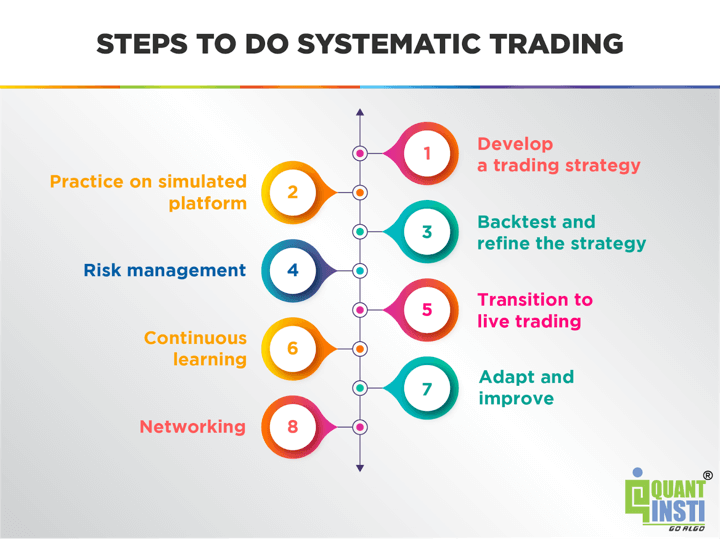

## Table of Contents

## What is systematic trading?

Systematic trading is a method of trading where decisions are made based on a set of rules and algorithms, rather than human judgment. These rules are often programmed into a computer system that automatically executes trades when certain conditions are met. This approach removes emotional decision-making from the trading process, which can help traders stick to their strategies more consistently.

The rules used in systematic trading can be based on various factors such as price movements, technical indicators, or even fundamental data. For example, a simple rule might be to buy a stock when its 50-day moving average crosses above its 200-day moving average. By using these predefined rules, systematic trading aims to take advantage of market patterns and trends in a disciplined and repeatable way.

## How do systematic trading strategies differ from discretionary trading?

Systematic trading strategies and discretionary trading are two different ways to trade in the markets. Systematic trading uses a set of rules and computer programs to make trading decisions. These rules are set up ahead of time and the computer follows them without any emotions. This means that once the rules are set, the trading happens automatically. The goal is to take advantage of patterns in the market in a consistent way.

On the other hand, discretionary trading relies on a person's judgment and experience. Traders who use this method make decisions based on what they see and feel at the moment. They might look at charts, news, and other information, but they decide when to buy or sell based on their own analysis. This approach can be more flexible because it allows traders to react to new information quickly, but it can also be influenced by emotions like fear or greed.

The main difference between the two is how decisions are made. Systematic trading takes the human element out of the equation, aiming for consistency and discipline. Discretionary trading, however, depends on the trader's skills and intuition, which can lead to more varied results but also allows for quick adjustments to changing market conditions.

## What are the basic components of a systematic trading strategy?

The first basic component of a systematic trading strategy is the set of rules or algorithms that guide the trading decisions. These rules are based on things like price movements, technical indicators, or even fundamental data. For example, a rule might say to buy a stock when its price goes above a certain level. These rules are programmed into a computer, which then automatically makes trades when the conditions are met. This helps to keep emotions out of trading and makes sure the strategy is followed consistently.

The second component is the data that the strategy uses. This can include historical price data, real-time market data, and other information like economic reports or company earnings. The strategy needs good data to work well, so it's important to have reliable sources. The data is fed into the computer system, which then uses it to check if the trading rules are met. If they are, the system will execute the trades according to the plan.

The third component is the risk management part of the strategy. This includes setting limits on how much money can be lost on a single trade or over a period of time. It might also involve rules for when to stop trading if things are not going well. Good risk management helps to protect the money being used for trading and can make the strategy last longer. By having clear rules for managing risk, the strategy can be more successful over time.

## Can you explain the concept of backtesting in systematic trading?

Backtesting is a way to check if a systematic trading strategy would have worked well in the past. It's like a test run, but instead of using real money, you use old market data to see how the strategy would have done. You take the rules of your strategy and apply them to this old data. If the strategy made good trades and earned money in the past, it might be a good sign that it could work well in the future too.

But [backtesting](/wiki/backtesting) has some limits. Just because a strategy worked well in the past doesn't mean it will work the same way in the future. Markets change, and what worked before might not work now. Also, sometimes people make mistakes when they do backtesting, like using data that's too perfect or not accounting for things like trading costs. So, while backtesting is a useful tool to check a strategy, it's important to be careful and not rely on it too much.

## What are some common types of systematic trading strategies?

One common type of systematic trading strategy is [trend following](/wiki/trend-following). This strategy looks for patterns in the market where prices are moving in one direction, either up or down. The idea is to buy when the market is going up and sell when it's going down. Traders using this strategy might use tools like moving averages to help them spot these trends. The goal is to ride the trend as long as it lasts and make money from the price movement.

Another type is mean reversion. This strategy is based on the idea that prices will eventually return to their average level after moving away from it. So, if a stock's price goes too high, a mean reversion trader might sell it, expecting the price to come back down. If the price goes too low, they might buy it, expecting it to go back up. This strategy tries to take advantage of these price swings back to the average.

A third type is statistical [arbitrage](/wiki/arbitrage). This strategy uses math and computer models to find small differences in prices between related assets, like stocks in the same industry. The idea is to buy the cheaper asset and sell the more expensive one, betting that the prices will eventually line up. This strategy often involves a lot of trades and relies on very fast computers to make quick decisions.

## How does one develop a systematic trading strategy from scratch?

To develop a systematic trading strategy from scratch, you start by figuring out what you want to achieve. You need to decide what market you want to trade in, like stocks, [forex](/wiki/forex-system), or commodities, and what your goals are. Once you have that, you can begin to create the rules for your strategy. These rules are based on things like price movements, technical indicators, or even news and economic data. For example, you might decide to buy a stock when its price goes above a certain level or when a specific indicator signals a good opportunity. You write these rules down clearly so that a computer can follow them.

After setting your rules, you need to test your strategy to see if it works. This is done through backtesting, where you use old market data to see how your strategy would have done in the past. If the backtesting shows good results, you might feel more confident about using your strategy in real trading. But remember, past performance doesn't guarantee future success. You also need to think about risk management, which means setting limits on how much money you can lose on each trade or over time. Once you've tested and refined your strategy, you can start using it in the real market, but always keep an eye on it and be ready to make changes if needed.

## What are the key performance metrics to evaluate a systematic trading strategy?

When you want to see how well a systematic trading strategy is doing, you look at some key numbers. One important number is the return, which tells you how much money the strategy made. You also look at the risk, which is how much money you could lose. A common way to measure risk is by looking at the standard deviation of the returns, which shows how much the returns go up and down. Another important number is the Sharpe ratio, which compares the return to the risk. A higher Sharpe ratio means the strategy is doing a good job of making money without taking too much risk.

Another key metric is the drawdown, which is the biggest drop in the value of your account from its highest point. This helps you understand the worst-case scenario and how much money you might lose at one time. You also want to look at the win rate, which is the percentage of trades that make money, and the average win and loss sizes, which tell you how much you make or lose on winning and losing trades. All these numbers together give you a good picture of how the strategy is performing and help you decide if it's worth using or if you need to make changes.

## How can risk management be integrated into systematic trading strategies?

Risk management is a big part of making a systematic trading strategy work well. It's all about setting rules to keep your money safe. One way to do this is by setting stop-loss orders, which automatically sell a trade if it loses too much money. Another way is to decide how much of your money you want to use for each trade, so you don't risk too much at once. You can also set a limit on how much money you're willing to lose over a certain time, like a month or a year. By having these rules in place, you can help make sure that one bad trade doesn't ruin everything.

Another important part of risk management is keeping an eye on how your strategy is doing and being ready to make changes if needed. This means checking your trades often and seeing if your strategy is still working the way you want it to. If it's not, you might need to adjust your rules or even stop trading for a while. It's also a good idea to spread your money across different kinds of trades or markets, which is called diversification. This can help lower your risk because if one trade goes bad, the others might still do well. By always thinking about risk and making smart choices, you can make your systematic trading strategy stronger and more likely to succeed over time.

## What role does machine learning play in advanced systematic trading strategies?

Machine learning plays a big role in making advanced systematic trading strategies even better. It helps traders find patterns in lots of data that they might miss otherwise. For example, [machine learning](/wiki/machine-learning) can look at tons of information like stock prices, news articles, and even social media posts to find out what might happen next in the market. By using these patterns, traders can make smarter decisions about when to buy or sell. Machine learning also helps in making the trading rules more flexible, so they can change and improve over time as they learn from new data.

Another way machine learning helps is by making risk management smarter. It can predict how risky a trade might be and suggest ways to lower that risk. For instance, machine learning can figure out the best times to use stop-loss orders or how much money to put into each trade. This makes the whole trading strategy more reliable and safer. By using machine learning, traders can keep their strategies up to date with the latest market changes and make better choices to protect their money.

## How do market conditions affect the performance of systematic trading strategies?

Market conditions can really change how well a systematic trading strategy works. If the market is going up and down a lot, a strategy that tries to follow trends might do well because it can catch those big moves. But if the market is calm and not moving much, the same strategy might not make much money because there aren't big trends to follow. Also, if the market suddenly changes because of big news or events, a strategy that worked before might not work anymore. That's why it's important to keep an eye on the market and be ready to change the strategy if needed.

Different types of market conditions can also make some strategies better than others. For example, in a market where prices keep going back to their average, a mean reversion strategy might do well. But in a market where prices keep moving in one direction, a trend-following strategy might be better. It's all about matching the strategy to what's happening in the market. By understanding how market conditions affect the strategy, traders can make smarter choices and adjust their plans to keep making money no matter what the market is doing.

## What are the challenges and limitations of implementing systematic trading strategies?

Implementing systematic trading strategies comes with its own set of challenges and limitations. One big challenge is that these strategies rely a lot on the rules and data they use. If the rules are not set up right or the data is not good, the strategy might not work well. Also, markets can change a lot, and what worked in the past might not work in the future. This means traders need to keep checking and updating their strategies, which can be hard work. Another challenge is that systematic trading can sometimes miss out on big market moves that a person might see and react to quickly.

Another limitation is that systematic trading strategies can be affected by things like trading costs and slippage, which is when the price changes between when a trade is ordered and when it actually happens. These costs can eat into the profits of the strategy. Also, while systematic trading takes out the emotions of trading, it can sometimes be too strict. If the market does something unexpected, the strategy might not be able to change fast enough. This is why it's important for traders to keep an eye on their strategies and be ready to make changes when needed.

## How can one optimize and refine a systematic trading strategy over time?

To optimize and refine a systematic trading strategy over time, you need to keep checking how it's doing. This means looking at the key performance numbers like return, risk, and the Sharpe ratio to see if the strategy is making money and not taking too much risk. If you see that the strategy is not working as well as before, you might need to change the rules a bit. This could mean adjusting the levels at which you buy or sell, or maybe using different indicators to make decisions. It's also important to keep testing the strategy with new data to make sure it's still good. By doing this, you can find ways to make the strategy better and keep up with changes in the market.

Another way to refine a systematic trading strategy is by using new tools and technology. For example, machine learning can help find new patterns in the data that you might not see otherwise. This can make your strategy smarter and more flexible. Also, you can try out different risk management ideas, like changing how much money you put into each trade or setting different stop-loss levels. By always looking for ways to improve and being ready to make changes, you can keep your strategy working well even when the market changes. This helps you stay ahead and keep making money over time.

## References & Further Reading

[1]: Marcos López de Prado. ["Advances in Financial Machine Learning."](https://www.amazon.com/Advances-Financial-Machine-Learning-Marcos/dp/1119482089) Wiley, 2018.

[2]: David Aronson. ["Evidence-Based Technical Analysis: Applying the Scientific Method and Statistical Inference to Trading Signals."](https://www.amazon.com/Evidence-Based-Technical-Analysis-Scientific-Statistical/dp/0470008741) Wiley, 2006.

[3]: Stefan Jansen. ["Machine Learning for Algorithmic Trading: Predictive models to extract signals from market and alternative data for systematic trading strategies with Python."](https://www.amazon.com/Machine-Learning-Algorithmic-Trading-alternative/dp/1839217715) Packt Publishing, 2020.

[4]: Ernest P. Chan. ["Quantitative Trading: How to Build Your Own Algorithmic Trading Business."](https://www.amazon.com/Quantitative-Trading-Build-Algorithmic-Business/dp/0470284889) Wiley, 2008.

[5]: Benjamin Graham and David Dodd. ["Security Analysis."](https://www.amazon.com/Security-Analysis-Seventh-Principles-Techniques/dp/1264932405) McGraw-Hill, 2008.