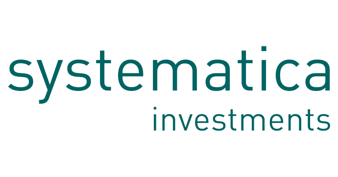

## Table of Contents

## What is Systematica Investments?

Systematica Investments is a company that manages money for other people and organizations. They use computers and math to make decisions about where to invest this money. The goal is to make more money for their clients by investing wisely. Systematica was started by a man named Leda Braga, who is very good at using computers to make investment choices.

The company is based in Switzerland and also has offices in other places around the world. They focus on something called "systematic trading," which means they use set rules and formulas to buy and sell investments. This is different from traditional investing, where people might make decisions based on their feelings or guesses. Systematica believes that using computers and math can lead to better results over time.

## When was Systematica Investments founded?

Systematica Investments was founded in 2015. It was started by Leda Braga, who is known for being good at using computers to make investment choices. The company is based in Switzerland but also has offices in other countries.

Systematica focuses on systematic trading, which means they use set rules and math formulas to decide where to invest money. They believe that using computers can help them make better investment decisions than just guessing or using feelings. Their goal is to make more money for the people and organizations that trust them with their investments.

## Who are the founders of Systematica Investments?

Systematica Investments was started by Leda Braga. She is the main person who founded the company. Leda Braga is known for being very good at using computers to make choices about where to invest money. She believes that using math and computers can help make better investment decisions than just guessing or using feelings.

The company was founded in 2015 and is based in Switzerland. Systematica also has offices in other countries. They focus on something called systematic trading, which means they use set rules and formulas to buy and sell investments. Their goal is to make more money for the people and organizations that trust them with their investments.

## What is the primary focus of Systematica Investments?

Systematica Investments mainly focuses on something called systematic trading. This means they use computers and math to decide where to invest money. They believe that using set rules and formulas can help them make better choices than just guessing or using feelings. The company was started by Leda Braga, who is known for being good at using computers for investing.

Systematica was founded in 2015 and is based in Switzerland. They also have offices in other countries around the world. Their goal is to make more money for the people and organizations that trust them with their investments. By using computers and math, Systematica tries to find the best ways to invest and grow their clients' money over time.

## How does Systematica Investments approach investing?

Systematica Investments uses a method called systematic trading to make choices about where to invest money. This means they use computers and math to follow set rules and formulas. They believe this way of investing can lead to better results than just guessing or using feelings. The company was started by Leda Braga, who is known for being good at using computers to make investment decisions.

Systematica was founded in 2015 and is based in Switzerland. They also have offices in other countries around the world. Their main goal is to make more money for the people and organizations that trust them with their investments. By using computers and math, Systematica tries to find the best ways to invest and grow their clients' money over time.

## What types of investment strategies does Systematica Investments employ?

Systematica Investments uses a method called systematic trading for their investment strategies. This means they use computers and math to make decisions about where to invest money. They follow set rules and formulas instead of guessing or using feelings. This approach is different from traditional investing, where people might make choices based on what they think or feel. Systematica believes that using computers and math can help them make better investment choices and grow their clients' money over time.

The company focuses on different types of investments, like stocks, bonds, and other financial products. They use their computer models to look at a lot of information and find patterns that can help them decide when to buy or sell these investments. By doing this, Systematica tries to make more money for the people and organizations that trust them with their investments. Their goal is to use their systematic approach to find the best ways to invest and increase the value of their clients' money.

## Can you explain the role of technology in Systematica Investments' operations?

Systematica Investments uses technology a lot in their work. They use computers and math to make choices about where to invest money. This is called systematic trading. Instead of guessing or using feelings, they follow set rules and formulas. This helps them make better decisions and find the best ways to grow their clients' money over time.

The company uses computer models to look at a lot of information. These models help them see patterns and decide when to buy or sell investments like stocks and bonds. By using technology, Systematica can handle a lot of data quickly and make smart choices. This is important because it helps them reach their goal of making more money for the people and organizations that trust them with their investments.

## What are some of the key achievements of Systematica Investments?

Systematica Investments has made a big name for itself since it started in 2015. One of their key achievements is how well they use computers and math to make smart investment choices. This method, called systematic trading, has helped them grow the money of the people and organizations that trust them. They have been able to handle a lot of data quickly and make good decisions because of their technology.

Another important achievement is how they have grown as a company. Systematica is based in Switzerland but now has offices in other countries too. This shows that more and more people around the world trust them with their money. Their founder, Leda Braga, is also well-known for being good at using computers to invest, which has helped make Systematica successful.

## How has Systematica Investments performed compared to its competitors?

Systematica Investments has done well compared to other companies that manage money. They use computers and math to make choices about where to invest, which is called systematic trading. This way of investing has helped them grow the money of their clients better than many of their competitors. Because they use technology to look at a lot of information quickly, they can make smart choices and find good ways to invest.

Other companies might use feelings or guesses to make investment choices, but Systematica sticks to set rules and formulas. This has made them stand out and be successful. They have offices in different countries, which shows that more people around the world trust them with their money. Their founder, Leda Braga, is known for being good at using computers to invest, which has helped Systematica do well compared to other companies.

## What are the future plans or expansions for Systematica Investments?

Systematica Investments wants to keep growing and helping more people with their money. They plan to use their computers and math even more to find the best ways to invest. This means they will keep using systematic trading, where they follow set rules and formulas instead of guessing. They hope to make even more money for their clients by doing this. They also want to keep making their technology better so they can handle more information and make smarter choices.

Another part of their plan is to open more offices in different countries. This will help them reach more people around the world who need help with their investments. By having offices in more places, they can work with more clients and grow their business. Systematica believes that by sticking to their way of using computers and math, they can keep doing well and help more people in the future.

## How does Systematica Investments manage risk in its investment strategies?

Systematica Investments uses computers and math to manage risk in their investment strategies. They follow set rules and formulas to decide where to invest money. This way, they can look at a lot of information quickly and make smart choices. By using technology, they can see patterns and understand how different investments might do in the future. This helps them avoid big losses and keep their clients' money safe.

They also use something called diversification. This means they spread the money they manage across different types of investments, like stocks, bonds, and other financial products. By doing this, they reduce the risk that one bad investment could hurt all their clients' money. Systematica believes that by using computers and math to manage risk, they can make better choices and help their clients' money grow over time.

## What insights can you provide on the organizational structure and culture at Systematica Investments?

Systematica Investments has a clear and focused organizational structure. They have a team of people who are good at using computers and math to make investment choices. These people work together to follow set rules and formulas for their systematic trading. At the top, there is the founder, Leda Braga, who leads the company. She is known for being good at using technology to invest money. The rest of the team is organized into different groups, each working on specific parts of the investment process. This helps them make sure they are always using the best information and technology to help their clients.

The culture at Systematica is all about using technology and math to make smart choices. They believe in working together and using data to find the best ways to invest. Everyone at Systematica is focused on using computers to handle a lot of information quickly and make good decisions. They also value being honest and clear with their clients. This means they always try to explain what they are doing and why. The culture is about being careful with risk and always trying to do better for the people who trust them with their money.

## References & Further Reading

[1]: ["Advances in Financial Machine Learning"](https://www.amazon.com/Advances-Financial-Machine-Learning-Marcos/dp/1119482089) by Marcos Lopez de Prado

[2]: ["Evidence-Based Technical Analysis: Applying the Scientific Method and Statistical Inference to Trading Signals"](https://www.amazon.com/Evidence-Based-Technical-Analysis-Scientific-Statistical/dp/0470008741) by David Aronson

[3]: ["Machine Learning for Algorithmic Trading"](https://github.com/stefan-jansen/machine-learning-for-trading) by Stefan Jansen

[4]: ["Quantitative Trading: How to Build Your Own Algorithmic Trading Business"](https://books.google.com/books/about/Quantitative_Trading.html?id=j70yEAAAQBAJ) by Ernest P. Chan

[5]: ["The Man Who Solved the Market: How Jim Simons Launched the Quant Revolution"](https://www.amazon.com/Man-Who-Solved-Market-Revolution/dp/073521798X) by Gregory Zuckerman

[6]: Mullainathan, S., & Spiess, J. (2017). ["Machine Learning: An Applied Econometric Approach."](https://www.aeaweb.org/articles?id=10.1257/jep.31.2.87) Journal of Economic Perspectives, 31(2), 87-106.