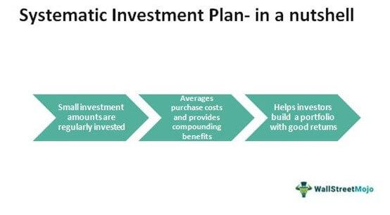

Systematica Investments, founded in 2015, has established itself as a significant player in the algorithmic trading landscape. The firm is helmed by Leda Braga, a well-regarded figure in the field, known for her expertise and strategic vision. Under her leadership, Systematica has been at the forefront of integrating quantitative analysis and systematic trading strategies into investment management.

The company's approach involves leveraging mathematical models and data-driven techniques to identify and execute trading opportunities. This systematic process aims to remove human biases and emotions from trading decisions, enhancing precision and efficiency in execution. By focusing on algorithmic trading, Systematica can analyze substantial volumes of data quickly, allowing them to detect patterns and trends that might be invisible through traditional means.

Systematica's strategy is defined by its reliance on rigorous quantitative analysis. By employing advanced computing power and sophisticated algorithms, the firm can assess risk and make informed investment decisions. This emphasis on systematic trading strategies not only allows for more consistent performance but also offers a robust risk management framework, essential in today's volatile markets.

Overall, Systematica Investments represents a modern approach to trading, where technology and quantitative methods pave the way for innovation and growth in the financial sector.

## Table of Contents

## Historical Background

Systematica Investments traces its origins back to BlueTrend, a prominent fund within BlueCrest Capital Management. BlueTrend, under the leadership of Leda Braga, gained a reputation for its robust performance and innovative approach to [hedge fund](/wiki/hedge-fund-trading-strategies) management. From 2004 to 2014, BlueTrend was a stellar performer in the hedge fund landscape, leveraging quantitative analysis and algorithmic strategies to achieve significant profitability. This period of success established BlueTrend as a key player, reinforcing the viability of systematic trading strategies over a range of market conditions.

However, the broader challenges faced by BlueCrest Capital Management catalyzed significant changes. Despite BlueTrend's continued success, BlueCrest encountered performance difficulties that necessitated organizational restructuring. In response to these challenges, BlueCrest made the strategic decision to spin off BlueTrend, essentially allowing it to operate independently as a new entity—Systematica Investments. This decision was driven by the need to optimize performance and focus resources on proven quantitative and systematic trading strategies.

BlueTrend's track record from 2004 to 2014 was instrumental in the creation of Systematica as an independent entity. Over that decade, the fund's ability to consistently generate high returns laid a strong foundation for Systematica's future operations. The spin-off allowed Leda Braga and her team to gain strategic control, positioning Systematica to tailor its strategies specifically to investor needs and market developments without the constraints of BlueCrest's broader organizational challenges. This transition highlighted a pivotal moment in the evolution of quantitative hedge funds, marking Systematica's emergence as a leader in [algorithmic trading](/wiki/algorithmic-trading) with a legacy rooted in BlueTrend's established success.

## Transition and Independence

In 2015, Systematica Investments emerged as an independent entity following its spin-off from BlueCrest Capital Management. This transition marked a pivotal moment for the firm, providing it with the autonomy to focus exclusively on algorithmic trading. The move was strategically orchestrated by Leda Braga and her team, who sought to leverage their expertise in quantitative analysis and develop a tailored approach to trading that harnessed cutting-edge technology and data analytics.

The spin-off from BlueCrest was driven by the need for clarity and concentration on performance without the overarching challenges BlueCrest was facing at the time. By becoming independent, Systematica gained strategic control over its operations and investment strategies. This newfound control allowed Braga to implement a more agile and focused business model, prioritizing technological advancements and sophisticated algorithms to optimize trading strategies.

Independence allowed Systematica to tailor its offerings more precisely to the needs of its investors. Freed from the constraints of a larger organization, the firm could innovate and adapt more swiftly to market dynamics. This flexibility translated into the development of more robust and precise trading strategies, driven by the use of big data and AI. These strategies aimed at maximizing returns while effectively managing risk, setting Systematica apart in a competitive financial landscape.

Moreover, with an emphasis on maintaining a streamlined organization, Systematica could delve deep into enhancing its algorithmic trading capabilities, offering investors a more dynamic and responsive portfolio management approach. In summary, the strategic control obtained through independence not only empowered Systematica to advance its trading methodologies but also enabled the firm to offer more innovative and tailored investment solutions to its clientele.

## Algorithmic Trading Strategies

Algorithmic trading involves the use of advanced mathematical models and algorithms to execute trades automatically across financial markets. This approach is central to Systematica Investments' strategy, providing a scientific methodology to its investment process. By leveraging sophisticated algorithms, Systematica systematically analyzes market data, identifies patterns, and determines optimal trading strategies, all without human intervention. 

Systematica Investments' focus on quantitative analysis is deeply rooted in its utilization of big data and computing power. These technologies enable the firm to process vast amounts of market data swiftly, uncovering subtle signals and trends that may not be evident through traditional analysis. By harnessing sophisticated algorithms and [neural network](/wiki/neural-network)s, Systematica can make precise calculations and predictions, ensuring trades are executed at the most advantageous times.

The benefits of algorithmic trading are manifold. Speed is a crucial advantage—computers can process information and execute trades in fractions of a second, much faster than human traders. This rapid execution minimizes costs and maximizes potential gains. Additionally, algorithmic trading allows for high-frequency trading strategies, taking advantage of even minute price discrepancies across markets.

Accurate predictions are another significant benefit. By continuously learning from data, algorithmic models can improve over time, identifying patterns with increasing precision. This capability enhances Systematica's ability to forecast market movements and adjust strategies accordingly.

Risk management is integral to Systematica’s algorithmic approach. Algorithms are designed to mitigate risks by diversifying portfolios, monitoring market conditions in real-time, and automatically adjusting positions when pre-set risk parameters are breached. This reduces the likelihood of losses due to unforeseen market shifts.

In summary, Systematica Investments' reliance on algorithmic trading forms the foundation of its investment strategy, enabling the firm to efficiently capitalize on market opportunities while minimizing risks and augmenting prediction accuracy through data-driven methodologies.

## Growth and Expansion

Systematica Investments has accelerated its growth and expanded its influence across major financial hubs worldwide, establishing significant presences in cities like Geneva, London, and New York. This strategic expansion has been crucial in cementing Systematica's position as a leader in the algorithmic trading field. The firm's geographical diversification not only broadens its operational capabilities but also amplifies its access to a wider array of market data and investment opportunities.

A pivotal moment in Systematica's growth story was the acquisition of BlueCrest’s stake by Affiliated Managers Group (AMG). This move brought substantial financial backing and resources, enabling Systematica to scale its operations and invest in innovative trading strategies. The support from AMG has allowed Systematica to enhance its technological infrastructure, essential for maintaining its competitive edge in algorithmic trading.

One of the notable milestones post-acquisition was the launch of the Systematica Alternative Risk Premia fund in Europe. This initiative marked a significant step in Systematica's strategy to diversify its product offerings and tap into the growing demand for alternative investment strategies. The Alternative Risk Premia fund is designed to capture returns from various risk [factor](/wiki/factor-investing)s systematically, leveraging Systematica’s expertise in data analysis and quantitative modeling.

Through these advancements, Systematica continues to adapt to the dynamic financial landscape, capitalizing on growth opportunities and reinforcing its commitment to innovation in investment management.

## Key Figures and Leadership

Leda Braga is a prominent figure in the financial industry, known for her pioneering role in algorithmic trading and investment management. As the founder and CEO of Systematica Investments, Braga has been instrumental in steering the firm towards innovation in systematic trading strategies. Her academic background is impressive; she holds a PhD in Engineering from Imperial College London, which has provided a strong foundation for her analytical and quantitative approach to investment strategy.

Braga's leadership style is characterized by a combination of scientific rigor and a commitment to technological advancement. Under her leadership, Systematica has focused on leveraging sophisticated algorithms and big data analytics to implement systematic trading strategies. Braga's emphasis on data-driven decision making and her forward-thinking approach have been critical in positioning Systematica as a leader in the competitive landscape of quant-based hedge funds.

Aside from Braga, Systematica's leadership team includes several other key contributors who have played significant roles in the firm's success. The team is comprised of experts with diverse backgrounds in mathematics, physics, and computer science, ensuring a multidisciplinary approach to trading and risk management. This diversity in expertise has helped Systematica maintain a competitive edge and rapidly adapt to the dynamic market conditions.

The strategic vision of Systematica under Braga's leadership is focused on continuous innovation and adaptation. This involves not only staying ahead of technological advancements but also anticipating and responding to shifts in market dynamics. The firm's management fosters a culture of collaboration and creativity, encouraging team members to explore new methodologies and improve existing trading models.

In summary, Leda Braga, with her analytical expertise and innovative vision, along with a talented executive team, has been pivotal in shaping Systematica's success. Their leadership style emphasizes scientific methodology, technological integration, and strategic foresight, which collectively drive the firm's ongoing achievements and future potential in the algorithmic trading sector.

## Looking Ahead

Systematica Investments is poised to capitalize on emerging trends and developments in algorithmic trading. The rapidly evolving landscape of financial technology offers numerous avenues for growth and innovation. One of the primary trends Systematica could leverage is the increasing use of [machine learning](/wiki/machine-learning) and [artificial intelligence](/wiki/ai-artificial-intelligence) (AI) to enhance trading algorithms. These technologies can process vast amounts of data to detect patterns and predict market movements with increasing accuracy, offering a competitive edge.

In addition to AI, the proliferation of [alternative data](/wiki/best-alternative-data) sources presents new opportunities for Systematica. By integrating unconventional data such as social media sentiment, satellite images, and IoT signals, the firm can refine its quantitative models to better predict market behavior and uncover lucrative investment opportunities. The use of big data analytics will be crucial in transforming such diverse pieces of information into actionable insights.

While these advancements offer significant upside, Systematica also faces challenges in the evolving financial landscape. Regulatory changes could impact the way trading algorithms are developed and executed. The need for transparency in AI-driven decisions is growing, and ensuring compliance with these requirements without compromising proprietary strategies will be pivotal. Furthermore, the increased competition from emerging fintech startups, which are also harnessing advanced technologies, demands continuous innovation and adaptation.

Cybersecurity is another critical area. As trading platforms become more reliant on digital infrastructure, the risk of cyber threats escalates. Maintaining robust security protocols to safeguard sensitive data and trading strategies will be essential for sustaining investor confidence and ensuring operational integrity.

Despite these challenges, Systematica remains committed to its mission of driving innovation in investment management. The firm’s ongoing investment in research and development, coupled with its strategic focus on cutting-edge technology, position it well to navigate future complexities. By leveraging its expertise in systematic trading strategies and expanding its use of AI and alternative data, Systematica can seize new opportunities, maintain its competitive edge, and continue delivering value to its investors.

## References & Further Reading

[1]: ["Advances in Financial Machine Learning"](https://www.amazon.com/Advances-Financial-Machine-Learning-Marcos/dp/1119482089) by Marcos Lopez de Prado

[2]: ["Evidence-Based Technical Analysis: Applying the Scientific Method and Statistical Inference to Trading Signals"](https://www.amazon.com/Evidence-Based-Technical-Analysis-Scientific-Statistical/dp/0470008741) by David Aronson

[3]: ["Machine Learning for Algorithmic Trading"](https://github.com/stefan-jansen/machine-learning-for-trading) by Stefan Jansen

[4]: ["Quantitative Trading: How to Build Your Own Algorithmic Trading Business"](https://books.google.com/books/about/Quantitative_Trading.html?id=j70yEAAAQBAJ) by Ernest P. Chan

[5]: ["The Man Who Solved the Market: How Jim Simons Launched the Quant Revolution"](https://www.amazon.com/Man-Who-Solved-Market-Revolution/dp/073521798X) by Gregory Zuckerman

[6]: Mullainathan, S., & Spiess, J. (2017). ["Machine Learning: An Applied Econometric Approach."](https://www.aeaweb.org/articles?id=10.1257/jep.31.2.87) Journal of Economic Perspectives, 31(2), 87-106.