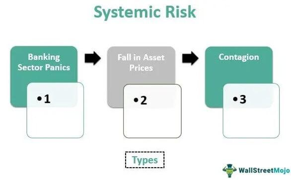

In the modern financial landscape, systemic risk, financial stability, and banking risk are crucial concerns for investors and policymakers. The intricate dynamics within these areas are increasingly compounded by the rise of algorithmic trading, a method that employs automated systems to execute trades at extraordinarily high speeds. This has introduced new complexities, necessitating a detailed examination of how these factors interconnect.

Algorithmic trading, while enhancing efficiency and liquidity in financial markets, also poses potential risks that could undermine financial stability. Systemic risk, characterized by the potential for disruptions within a single financial institution or component to precipitate a broader economic collapse, exemplifies a primary threat intensified by algorithmic mechanisms. The rapid execution and volume of trades conducted algorithmically can exacerbate market volatility, sometimes triggering events like flash crashes, which rapidly send waves of instability across the financial ecosystem.

Understanding the interplay between systemic risk and financial stability is pivotal for developing strategies aimed at mitigating potential threats to economic equilibrium. Factors such as banking risk, which encompasses operational, credit, and market risks, play a significant role in this relationship. Banks, being central to economic operations, have the potential to propagate systemic risk given their interconnected nature. The failure of a significant financial institution can lead to widespread economic distress, necessitating robust oversight and regulatory frameworks to safeguard against such eventualities.

This discussion will explore real-world examples and regulatory responses, shedding light on how algorithmic trading and banking risk impact systemic risk and financial stability. By examining past events and current regulatory measures, the article will highlight the importance for policymakers and financial institutions to devise frameworks that can effectively counteract these emerging threats, ensuring economic resilience in the face of growing complexities.

## Table of Contents

## Understanding Systemic Risk

Systemic risk refers to the potential threat that an event at the company level could trigger severe instability or even collapse across an industry or the entire economy. This type of risk became notably prominent during the 2008 financial crisis, which underscored the vulnerabilities of institutions deemed "too big to fail." The crisis illustrated how the failure of a single, large entity can set off a chain reaction affecting multiple financial sectors, leading to widespread economic repercussions.

Systemic risk often results from the intricate interconnections within the financial system. This network of interdependencies means that the failure of one entity can lead to cascading effects across the system. For example, if a major bank fails due to insolvency, the impact isn't isolated; it stretches out to affect creditors, investors, and other banks, potentially spiraling into a broader financial crisis.

Distinguishing between systemic and systematic risk is crucial for a nuanced understanding of financial risk management. Systematic risk, sometimes referred to as market risk, pertains to the risk inherent to the entire market or a particular segment of the market. Unlike systemic risk, systematic risk is influenced by factors such as economic changes, [interest rate](/wiki/interest-rate-trading-strategies) fluctuations, and geopolitical events, impacting all investments to some extent. 

The role of government intervention in mitigating systemic risk is often justified by the potential to curb the domino effects of such failures. This rationalization underpins measures like bailouts, where the government steps in to stabilize key institutions deemed crucial to the overall economic structure. Such interventions aim to prevent the spillover effects that arise when pivotal institutions are allowed to fail. Through measures such as increased oversight, stringent regulatory frameworks, and stress tests, governments strive to identify vulnerabilities and enhance the resilience of financial systems against potential systemic disruptions. 

Given these complexities, understanding and addressing systemic risk remains a fundamental challenge for economists, policymakers, and financial institutions alike, necessitating coordinated efforts to safeguard economic stability.

## Financial Stability and Systemic Risk

Financial stability is the ability of the financial system to withstand external shocks and disruptions without triggering widespread economic damage. It reflects the system's robustness and resilience, ensuring that financial institutions, markets, and infrastructure continue to function smoothly. A key characteristic of financial stability is maintaining healthy [liquidity](/wiki/liquidity-risk-premium) across the system. This ensures that financial institutions have sufficient capital to meet their short-term obligations, thereby preventing potential liquidity crises. Additionally, robust financial institutions are crucial as they provide the backbone needed to support economic activities, such as lending, investment, and payment services.

Systemic risk represents a formidable threat to financial stability, as demonstrated by historical economic crises. For instance, the 2008 financial crisis vividly illustrated how systemic vulnerabilities can lead to widespread instability. This crisis was precipitated by the collapse of major financial institutions and the failure of systemic safeguards, causing severe global economic repercussions. Such examples stress the importance of recognizing and managing systemic risk to ensure financial stability.

Central banks and government bodies serve pivotal roles in maintaining financial stability. Central banks, through their monetary policies and regulatory oversight, help stabilize inflation and provide emergency liquidity to struggling financial institutions. Government bodies, on the other hand, develop and enforce regulatory frameworks designed to prevent excessive risk-taking and ensure transparent financial practices. One example of such measures is the implementation of stress tests for banks, which assess their capital adequacy in hypothetical adverse scenarios.

To understand the impact of systemic risk on financial stability, it's essential to examine instances of banking failures, market disruptions, and the regulatory measures enacted in response. Banking failures occur when financial institutions cannot meet their obligations, often resulting in significant losses for depositors and other stakeholders. These failures can trigger a chain reaction, affecting interconnected institutions and leading to further instability. Market disruptions, such as rapid asset price movements, can also strain financial systems, contributing to systemic risk.

Regulatory responses to systemic threats include measures like the Dodd-Frank Wall Street Reform and Consumer Protection Act, which aims to reduce risks within the financial system by improving transparency and accountability. By adapting existing regulations and introducing new ones, authorities strive to enhance the resilience of the system against future shocks.

Ultimately, the interplay between systemic risk and financial stability necessitates continuous vigilance and proactive measures by policymakers, financial institutions, and regulators to safeguard the economy from potential disruptions. By maintaining healthy liquidity, robust institutions, and effective regulatory frameworks, the financial system can better manage the challenges posed by systemic risk.

## Banking Risk and Its Role in Systemic Risk

Banking risk refers to the various challenges that financial institutions face, including operational, credit, and market risks, which can significantly affect their stability and performance. Operational risk involves failures in internal processes, systems, or controls that could result in financial loss. Credit risk exists when borrowers fail to meet their obligations, potentially leading to substantial financial strain on the banks. Market risk arises from adverse changes in market conditions, such as fluctuations in interest rates or currency values, which can impact a bank's financial outcomes.

Banks play a critical role in the economy by providing essential services such as lending, deposit-taking, and facilitating financial transactions. Their failures can trigger systemic crises due to their interconnectedness and the central position they hold within financial networks. This interconnectedness means that the failure of one major institution can cascade through the market, affecting other banks and financial entities, leading to widespread instability. 

One of the most illustrative past events is the collapse of Lehman Brothers in 2008. This incident was a key [factor](/wiki/factor-investing) that aggravated the global financial crisis, demonstrating how banking risks could evolve into systemic threats. Lehman Brothers' failure underscored the vulnerabilities associated with interconnectedness and the inadequate assessment of risks by financial institutions.

The Dodd-Frank Wall Street Reform and Consumer Protection Act serves as one of the primary regulatory responses to mitigate such banking risks and limit systemic exposure. This act introduced comprehensive reforms aimed at enhancing the stability and transparency of the financial system. Key measures under the Dodd-Frank Act include stricter capital requirements, enhanced risk management standards, and the establishment of the Financial Stability Oversight Council, tasked with identifying and responding to emerging risks to the financial system. 

By implementing these regulations, the Act seeks to reduce the likelihood of bank failures, decrease the reliance on government bailouts, and enhance the ability of financial institutions to withstand economic shocks. In doing so, it plays a critical role in maintaining systemic stability and protecting economies from potential future crises.

## Algorithmic Trading and Its Systemic Implications

Algorithmic trading, commonly referred to as algo trading, represents a significant shift in the way financial markets operate. Utilizing sophisticated algorithms, this approach enables high-frequency trading ([HFT](/wiki/high-frequency-trading-strategies)) by automating the decision-making process for executing trades. The potential benefits of algo trading are evident: increased market efficiency and liquidity, reduced transaction costs, and the ability to capture market opportunities at unrivaled speeds. However, these advantages come with inherent systemic risks that warrant careful consideration.

One prominent risk associated with [algorithmic trading](/wiki/algorithmic-trading) is the potential for 'flash crashes'. These are sudden and severe market downturns caused by erroneous algorithms or conditions of extreme [volatility](/wiki/volatility-trading-strategies), where automation can exacerbate market movements abusively. The flash crash of May 6, 2010, serves as a pertinent example when the Dow Jones Industrial Average plummeted approximately 1,000 points (about 9%) within minutes, only to recover a significant portion of the loss shortly thereafter. This incident highlighted the capacity of algorithmic trading to amplify systemic risk due to its automated, high-speed, and often high-[volume](/wiki/volume-trading-strategy) nature.

Market volatility, often linked to algorithmic trading, poses another substantial risk. Algo trading systems can contribute to volatility by responding to market signals in homogeneous patterns, leading to simultaneous buy or sell actions that intensify price movements. This synchronized trading can create feedback loops that destabilize markets, making them more fragile. Moreover, the interconnectedness of global financial systems means that these disruptions can have far-reaching consequences.

Regulators express growing concern over the role of technology in amplifying systemic risk through algo trading. Traditional regulatory measures may be insufficient to address the rapid and complex dynamics of algorithm-driven markets. As such, financial watchdogs advocate for enhanced oversight, including measures to ensure the robustness of algorithms and the resilience of market infrastructure against automated disruptions. This approach might also involve mandating 'circuit breakers' – mechanisms designed to pause trading during periods of extreme volatility – to prevent market crashes.

Analyzing past case studies, such as the aforementioned flash crash, offers valuable insights into managing systemic risk in the context of algorithmic trading. These analyses often reveal weaknesses in existing financial regulatory frameworks and underscore the need for adaptive regulatory strategies. Adjustments, such as requiring algo traders to conduct thorough testing and validation of their algorithms under various market conditions, are essential in mitigating the systemic risks introduced by this mode of trading.

Ultimately, while algorithmic trading significantly contributes to the modern financial ecosystem by boosting efficiency and liquidity, it also necessitates stringent regulation and oversight. Balancing the benefits of technological innovation with the imperative of maintaining systemic safety remains a critical challenge for market regulators and participants.

## Regulatory Measures to Manage Systemic Risk

Regulatory frameworks are designed to mitigate systemic risk through the establishment of comprehensive guidelines that govern financial institutions and markets. The Dodd-Frank Wall Street Reform and Consumer Protection Act, enacted in response to the 2008 financial crisis, serves as a cornerstone of systemic risk regulation. This legislation addresses crucial issues such as enhancing transparency, accountability, and the resilience of financial systems. The act introduces significant measures aimed at reducing systemic threats, including the establishment of the Financial Stability Oversight Council (FSOC), which is tasked with identifying and addressing risks to the stability of the U.S. financial system.

A key aspect of systemic risk regulation involves the monitoring and stress testing of financial institutions. Stress tests are simulations designed to evaluate how banks and other financial entities can withstand economic shocks. For instance, the Comprehensive Capital Analysis and Review (CCAR) requires large banks in the U.S. to undergo an annual assessment of their capital adequacy under hypothetical adverse economic scenarios. These simulations help ensure that banks maintain sufficient capital buffers to absorb potential losses, thereby reinforcing the stability of the financial system.

On a global scale, international cooperation among regulatory bodies is critical to managing systemic risk. Institutions such as the Financial Stability Board (FSB) work to coordinate the implementation of regulatory standards across different jurisdictions. This global collaboration is essential because financial markets are interconnected and systemic risks can quickly spread across borders.

Furthermore, transparency and accountability are enhanced through the imposition of stricter disclosure requirements for financial institutions. The requirement for banks to disclose their risk exposures and governance processes allows for greater scrutiny by regulators and investors alike, thereby fostering a more stable financial environment.

Ultimately, these regulatory measures are crucial in safeguarding against systemic threats, ensuring that financial institutions operate in a manner that promotes stability and minimizes the potential for crisis. By continuously evolving and adapting to new financial innovations and challenges, such as those posed by algorithmic trading and emerging technologies, regulatory frameworks strive to maintain the delicate balance between fostering economic growth and ensuring financial security.

## Conclusion

The interplay between systemic risk, financial stability, banking risk, and algorithmic trading highlights the complexities of managing modern financial systems. Understanding and mitigating systemic risk is crucial for maintaining financial stability and preventing economic crises. Systemic risk, with its potential to precipitate widespread economic disruption, remains a focal point for policymakers and financial experts. Its root causes often lie in the inherent vulnerabilities of interconnected financial institutions and markets. 

Policymakers and financial institutions must collaborate to develop robust frameworks and safeguard against future disruptions. Effective communication and cooperation among global regulatory bodies are essential to address challenges that exceed national boundaries. Such collaborations often lead to innovative regulatory strategies which strengthen the global financial framework.

Technological advancements like algorithmic trading require continuous oversight to balance efficiency with systemic safety. While algorithmic trading offers efficiency gains and liquidity improvements, it also poses unique risks due to the speed and volume at which transactions occur. The potential for flash crashes and unpredictable market behaviors necessitates vigilant monitoring and comprehensive regulatory policies.

The lessons learned from past crises and regulatory efforts will guide future approaches to financial stability. Historical events have underscored the importance of maintaining a proactive stance in financial regulation. The global response to the 2008 financial crisis, exemplified by comprehensive measures such as the Dodd-Frank Act, remains a testament to the necessity of adapting regulatory frameworks in response to emerging risks and technologies. The ongoing evolution of financial systems calls for a dynamic approach to regulation, ensuring resilience amid the complexities of modern economic environments. 

## References & Further Reading

[1]: López de Prado, M. (2018). ["Advances in Financial Machine Learning."](https://www.amazon.com/Advances-Financial-Machine-Learning-Marcos/dp/1119482089) Wiley.

[2]: Chan, E. P. (2008). ["Quantitative Trading: How to Build Your Own Algorithmic Trading Business."](https://github.com/ftvision/quant_trading_echan_book) Wiley.

[3]: Aronson, D. R. (2006). ["Evidence-Based Technical Analysis: Applying the Scientific Method and Statistical Inference to Trading Signals."](https://www.amazon.com/Evidence-Based-Technical-Analysis-Scientific-Statistical/dp/0470008741) Wiley.

[4]: Jansen, S. (2020). ["Machine Learning for Algorithmic Trading."](https://github.com/stefan-jansen/machine-learning-for-trading) Packt Publishing.

[5]: Vayanos, D., & Woolley, P. (2012). ["An Institutional Theory of Momentum and Reversal."](https://www.jstor.org/stable/23470044) National Bureau of Economic Research.