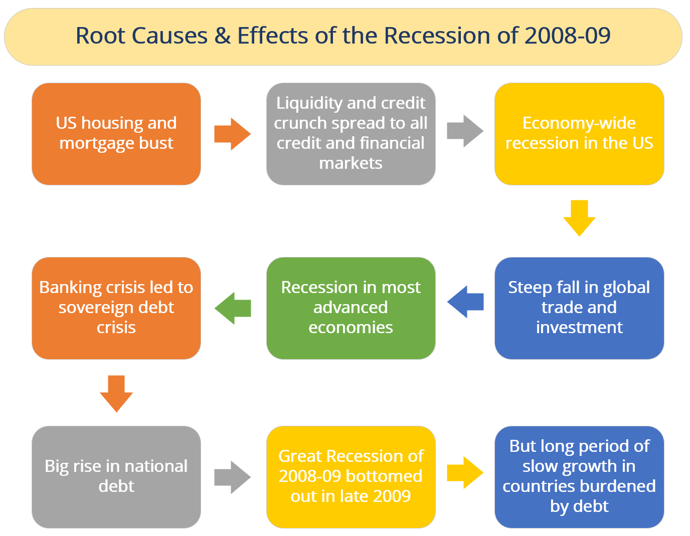

## Table of Contents

## What is systemic risk in the context of banking?

Systemic risk in banking refers to the danger that the failure of one bank or financial institution can cause a chain reaction, leading to the collapse of the entire financial system. Imagine a row of dominoes: if one falls, it can knock down the others. In banking, if a big bank fails, it might cause other banks to fail too, because they are all connected through loans, investments, and other financial ties.

This risk is a big worry for governments and financial regulators because it can lead to widespread economic problems, like a deep recession or even a depression. To prevent this, they keep a close watch on banks and have rules in place to make sure they are strong and safe. They also have emergency plans to help banks in trouble, so the whole system doesn't fall apart.

## How does systemic risk differ from other types of financial risks?

Systemic risk is different from other financial risks because it affects the whole financial system, not just one part. Other types of financial risks, like credit risk or market risk, usually affect just one bank or a small group of banks. Credit risk is when a bank might lose money because someone they lent money to can't pay it back. Market risk is when a bank loses money because the value of things they own, like stocks or bonds, goes down. These risks are important, but they don't usually threaten the whole financial system like systemic risk does.

Systemic risk is like a big storm that can shake the entire financial world. If one big bank fails because of systemic risk, it can cause other banks to fail too, creating a domino effect. This can lead to a financial crisis that hurts the economy a lot. Other risks, like operational risk, which is when a bank loses money because of problems in how it runs its business, or [liquidity](/wiki/liquidity-risk-premium) risk, which is when a bank can't get enough cash quickly, are serious but usually don't spread as widely or cause as much damage as systemic risk.

## What are the primary causes of systemic risk in banking?

Systemic risk in banking often starts when big banks take on too much risk. They might lend too much money or invest in things that are too risky. If these risky moves go wrong, the bank can lose a lot of money and might even fail. When a big bank fails, it can scare people and other banks. People might rush to take their money out of other banks, causing a "bank run." Other banks might also lose money because they had loans or investments tied to the failed bank.

Another cause of systemic risk is when banks are too connected to each other. They might lend money to each other or invest in the same things. If one bank gets into trouble, it can quickly spread to other banks because they are all linked together. This is like a web where pulling one string can mess up the whole thing. Also, if everyone in the financial system is doing the same risky thing, like investing in the same type of loan, a problem in that area can cause a big shock to the whole system.

Regulators try to watch out for these risks, but sometimes new problems can pop up that they didn't expect. For example, new financial products or ways of doing business can create new risks. If these new risks are not understood well, they can lead to systemic problems. That's why it's important for banks and regulators to keep learning and watching out for new dangers that could threaten the whole financial system.

## Can you explain the concept of 'too big to fail' in relation to systemic risk?

The idea of 'too big to fail' means that some banks are so large and important that if they fail, it could cause huge problems for the whole economy. These banks are connected to many other banks and businesses. If one of these big banks fails, it could start a chain reaction where other banks and businesses fail too. This is a big part of systemic risk because the failure of one big bank can shake the entire financial system.

Because of this, governments often step in to save these big banks when they are in trouble. They might give them money or help them in other ways to keep them from failing. This is done to stop the problems from spreading and causing a financial crisis. But it can also mean that these big banks take more risks because they think the government will always save them if things go wrong.

## What role do interconnected financial institutions play in systemic risk?

Interconnected financial institutions are a big reason why systemic risk happens. When banks and other financial companies are linked together through loans, investments, and other financial ties, problems in one place can spread quickly to others. If one bank starts to fail, it might owe money to other banks. Those banks could then have trouble because they were counting on getting that money back. It's like a game of dominoes where one falling piece can knock down the whole line.

This web of connections means that trouble in one part of the financial system can become a big problem for everyone. If many banks are investing in the same risky things, like certain types of loans, a problem with those loans can hurt all the banks at once. Regulators try to watch these connections closely to stop big problems from spreading, but it's hard to keep track of everything. That's why understanding and managing these connections is so important to keep the financial system safe.

## How do regulatory failures contribute to systemic risk?

Regulatory failures can make systemic risk worse because regulators are supposed to watch over banks and make sure they are not taking too many risks. If regulators don't do their job well, banks might take bigger risks than they should. For example, if regulators don't check on banks often enough, or if they don't have strict enough rules, banks might start doing risky things like lending too much money or investing in dangerous financial products. When these risky moves go wrong, it can lead to big problems that affect the whole financial system.

Another way regulatory failures can contribute to systemic risk is if regulators miss new dangers that come up. The world of finance changes fast, and new types of risks can appear that regulators didn't expect. If they are not keeping up with these changes and learning about new risks, they might not stop banks from getting into trouble with these new dangers. This can lead to big shocks to the financial system that could have been avoided if regulators had been more on top of things.

## What are some historical examples of systemic risk events in banking?

One big example of systemic risk in banking was the 2008 financial crisis. It started when many people in the United States couldn't pay back their home loans. These loans were bundled together and sold as investments to banks all over the world. When people stopped paying their loans, the value of these investments crashed. Big banks like Lehman Brothers failed because they had too much of these bad investments. This caused a chain reaction where other banks and businesses got into trouble too, leading to a global financial crisis.

Another example is the savings and loan crisis in the 1980s and early 1990s in the United States. Many savings and loan associations, which are like banks, made risky loans and investments. When these went bad, over 1,000 of these institutions failed. The government had to step in and spend a lot of money to fix the problem. This crisis showed how problems in one part of the financial system can spread and cause big trouble for the whole economy.

## How can systemic risk be measured and monitored?

Measuring and monitoring systemic risk is important to keep the financial system safe. One way to do this is by using something called stress tests. These tests check how well banks would do if bad things happened, like a big drop in the stock market or a lot of people not paying back their loans. By running these tests, regulators can see which banks might be in trouble and need help. Another way is by looking at how connected banks are to each other. If banks are lending a lot of money to each other or investing in the same things, a problem in one bank can spread quickly. Regulators keep an eye on these connections to spot risks early.

There are also special tools and models that help measure systemic risk. For example, some models look at how much risk banks are taking and how that might affect the whole system. These models use a lot of data to predict what might happen if things go wrong. Regulators use this information to make rules that keep banks from taking too many risks. By watching these measures closely, they can act fast to stop small problems from turning into big ones that hurt the whole economy.

## What are the potential impacts of systemic risk on the global economy?

Systemic risk can cause big problems for the global economy. When a big bank or financial institution fails, it can start a chain reaction that hurts other banks and businesses around the world. This can lead to a financial crisis where people lose trust in banks and start taking their money out. If many people do this at the same time, it can cause a "bank run," making the problem even worse. Businesses might find it hard to get loans, which can slow down the economy and lead to job losses and less spending.

The effects of systemic risk can spread far beyond just the financial world. When banks are in trouble, they might stop lending money, which can hurt businesses of all sizes. This can lead to a recession, where the economy shrinks and people have less money to spend. Governments might have to step in and spend a lot of money to fix the problem, which can lead to higher taxes or more debt. In the end, systemic risk can make life harder for people all over the world, affecting jobs, savings, and the overall health of the economy.

## What strategies can banks implement to mitigate systemic risk?

Banks can help reduce systemic risk by being careful about the risks they take. They should not lend too much money or invest in things that are too risky. Banks can also keep a close eye on how much they are connected to other banks. If they are lending a lot of money to each other or investing in the same things, they should try to spread out their risks more. This way, if one bank gets into trouble, it won't hurt the others as much. Banks can also use stress tests to see how they would do if bad things happened, like a big drop in the stock market. By doing these tests, they can find out where they might be weak and fix those problems before they get worse.

Another way banks can lower systemic risk is by having enough money set aside to cover losses. This is called having a strong capital buffer. If a bank has enough money saved up, it can handle losses better and won't need help from the government if things go wrong. Banks can also work together with regulators to make sure they are following the rules and not taking too many risks. By being open about their risks and working with others, banks can help stop small problems from turning into big ones that hurt the whole economy.

## How do international regulations like Basel III address systemic risk?

Basel III is a set of international rules that banks have to follow to make the financial system safer. These rules were made after the 2008 financial crisis to stop big problems like that from happening again. One big part of Basel III is making sure banks have enough money saved up, called capital, to cover losses if things go wrong. This helps banks stay strong even if they lose money on loans or investments. Basel III also says banks need to keep enough cash or things they can quickly turn into cash, called liquidity, so they can pay back people who want their money back, even during tough times.

Another way Basel III helps with systemic risk is by making banks be more careful about the risks they take. The rules say banks need to keep an eye on how much they are connected to other banks and make sure they are not all investing in the same risky things. This helps stop problems in one bank from spreading to others. By following these rules, banks can help keep the whole financial system safer and stop small problems from turning into big ones that hurt the global economy.

## What are the future challenges in managing systemic risk in the banking sector?

One big challenge in managing systemic risk in the future is keeping up with new types of risks that come from new technology and ways of doing business. As banks start using more digital tools and new financial products, like cryptocurrencies, it can be hard for regulators to understand all the new risks. These new risks might not be covered by old rules, so banks and regulators need to keep learning and updating their rules to stay safe. If they don't, these new risks could lead to big problems that spread through the whole financial system.

Another challenge is making sure that banks in different countries are following the same rules. Since banks are connected all over the world, a problem in one country can quickly spread to others. If some countries have stricter rules than others, banks might move their risky business to places with weaker rules. This can make it harder to stop systemic risk from spreading. So, it's important for countries to work together and make sure their rules are strong and similar, so the whole global financial system stays safe.

## References & Further Reading

[1]: López de Prado, M. (2018). ["Advances in Financial Machine Learning."](https://www.amazon.com/Advances-Financial-Machine-Learning-Marcos/dp/1119482089) Wiley.

[2]: Chan, E. P. (2008). ["Quantitative Trading: How to Build Your Own Algorithmic Trading Business."](https://github.com/ftvision/quant_trading_echan_book) Wiley.

[3]: Aronson, D. R. (2006). ["Evidence-Based Technical Analysis: Applying the Scientific Method and Statistical Inference to Trading Signals."](https://www.amazon.com/Evidence-Based-Technical-Analysis-Scientific-Statistical/dp/0470008741) Wiley.

[4]: Jansen, S. (2020). ["Machine Learning for Algorithmic Trading."](https://github.com/stefan-jansen/machine-learning-for-trading) Packt Publishing.

[5]: Vayanos, D., & Woolley, P. (2012). ["An Institutional Theory of Momentum and Reversal."](https://www.jstor.org/stable/23470044) National Bureau of Economic Research.