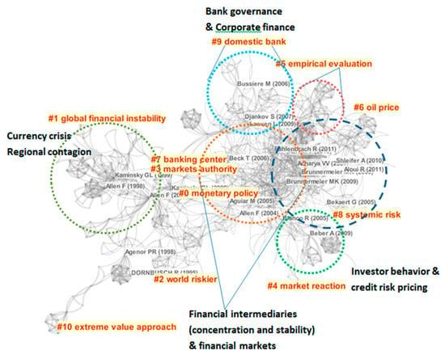

## Table of Contents

## What is systemic risk in the context of market microstructure?

Systemic risk in the context of market microstructure refers to the danger that problems in one part of the financial system can spread and cause trouble for the whole system. Imagine a row of dominoes: if one falls, it can knock down the others. In financial markets, if one big bank or institution fails, it might cause others to fail too, leading to a widespread crisis. This risk is especially important in market microstructure, which looks at how individual trades and orders affect the overall market.

Market microstructure focuses on the details of how trading happens, like the rules and technology used in trading platforms. Systemic risk can arise from these details if, for example, a major trading platform crashes or if there's a sudden drop in liquidity, making it hard for people to buy or sell assets. These events can create panic and lead to a chain reaction of failures across the financial system. Understanding and managing systemic risk is crucial for keeping the financial markets stable and preventing widespread economic damage.

## How does market microstructure contribute to systemic risk?

Market microstructure looks at the nitty-gritty of how trading works, like the rules and technology used in trading platforms. It can contribute to systemic risk if something goes wrong in these details. For example, if a major trading platform crashes, it can stop people from buying and selling, causing panic. This panic can spread quickly, making more people want to sell their assets, which can lead to a big drop in prices and hurt the whole financial system.

Another way market microstructure can lead to systemic risk is through [liquidity](/wiki/liquidity-risk-premium) problems. Liquidity is about how easily you can buy or sell something without affecting its price too much. If there's suddenly less liquidity, maybe because of a big event or a technical glitch, it can be hard for people to trade. This can cause a chain reaction where more people try to sell, making liquidity even worse and causing more panic. This kind of situation can spread from one part of the market to another, creating a systemic crisis.

## What are the key components of market microstructure that influence systemic risk?

Market microstructure involves the nitty-gritty of how trading happens, and several parts of it can affect systemic risk. One key part is trading platforms. If a big trading platform has a technical problem and stops working, it can make it hard for people to buy and sell things. This can lead to panic and cause people to want to sell their assets quickly, which can make prices drop a lot and spread trouble to other parts of the financial system.

Another important part is liquidity, which is about how easily you can buy or sell something without changing its price too much. If something happens that makes liquidity suddenly low, like a big event or a glitch in the trading system, it can be tough for people to trade. This can cause a chain reaction where more people want to sell, making liquidity even worse and causing more panic. When this happens, the problems can spread from one part of the market to another, leading to a big crisis that affects the whole financial system.

## Can you explain the relationship between liquidity and systemic risk in market microstructure?

Liquidity is about how easy it is to buy or sell things in the market without changing their price too much. In market microstructure, which looks at the details of trading, liquidity is really important. If something happens that suddenly makes it hard to buy or sell, like a big event or a problem with the trading system, it can cause a lot of trouble. When liquidity drops, people can start to panic because they can't trade as easily as they want to. This panic can make more people want to sell their assets quickly, which can lead to a big drop in prices.

When prices drop a lot because of low liquidity, it can cause problems that spread to other parts of the financial system. This is what we call systemic risk. If one part of the market starts to have trouble because of low liquidity, it can make other parts of the market have trouble too. For example, if a big bank or institution can't sell its assets because there's not enough liquidity, it might struggle financially and cause other banks or institutions to have problems too. This chain reaction can lead to a big crisis that affects the whole financial system.

## What role do high-frequency trading and algorithmic trading play in systemic risk?

High-frequency trading and [algorithmic trading](/wiki/algorithmic-trading) use computers to buy and sell things very quickly. These kinds of trading can make the market more efficient, but they can also add to systemic risk. If something goes wrong with the computers or the trading rules, it can cause a lot of trouble. For example, if a high-frequency trading system starts selling a lot of things quickly because of a mistake, it can make prices drop fast and cause other traders to panic and sell too. This can lead to a big drop in prices and spread trouble to other parts of the market.

Another way high-frequency and algorithmic trading can add to systemic risk is by making the market more connected. When these trading systems are used a lot, they can make what happens in one part of the market affect other parts more quickly. If something bad happens, like a big drop in prices, it can spread to other markets faster because of these fast trading systems. This can make a small problem turn into a big one that affects the whole financial system.

## How do regulatory frameworks address systemic risk in market microstructure?

Regulatory frameworks play a big role in trying to keep systemic risk under control in market microstructure. They do this by setting rules that help make trading safer and more stable. For example, they might require trading platforms to have good technology and backup systems so they don't crash and cause panic. They also might set rules about how much risk big banks and institutions can take, so if one of them gets into trouble, it doesn't hurt the whole financial system.

Another way regulators try to manage systemic risk is by watching the market closely and stepping in if things start to go wrong. They might do things like putting limits on how fast prices can change or making sure there's enough liquidity in the market so people can buy and sell easily. By keeping an eye on high-frequency trading and algorithmic trading, they can also try to stop these kinds of trading from causing big problems. All these efforts are aimed at keeping the financial system stable and preventing small problems from turning into big crises.

## What historical events illustrate systemic risk caused by market microstructure?

One big event that shows systemic risk from market microstructure is the "Flash Crash" of May 6, 2010. On that day, the U.S. stock market suddenly dropped a lot in just a few minutes. It happened because of high-frequency trading and a big sell order that caused a lot of other traders to start selling quickly too. This made prices drop very fast, and it showed how problems in the details of trading can spread and cause a big crisis in the whole market.

Another example is the Knight Capital incident in August 2012. Knight Capital, a big trading firm, had a problem with their new trading software. The software started buying and selling a lot of stocks very quickly without anyone meaning for it to happen. This caused big changes in stock prices and cost Knight Capital a lot of money. It shows how a small mistake in the technology used for trading can lead to big problems that affect the whole market and even threaten the stability of a big trading firm.

## How can systemic risk in market microstructure be measured and monitored?

To measure and monitor systemic risk in market microstructure, people look at things like how easy it is to buy and sell things, called liquidity, and how fast prices can change. They use special tools and data to keep an eye on these things. For example, they might watch how much trading is happening and how quickly prices are moving to see if there's a risk of a big problem. They also use computer models to predict what might happen if something goes wrong, like if a big trading platform crashes or if there's a sudden drop in liquidity.

Regulators and financial experts also pay close attention to high-frequency trading and algorithmic trading. They use special systems to watch these kinds of trading and see if they're causing trouble. If they notice something that might lead to a big problem, they can step in and do things like put limits on how fast prices can change or make sure there's enough liquidity in the market. By keeping a close watch on these details, they can try to stop small problems from turning into big crises that hurt the whole financial system.

## What are the current models used to predict systemic risk in market microstructure?

People use special models to predict systemic risk in market microstructure. One common model is called the "stress test." It's like a practice run where they see what would happen if something bad happened, like if a big trading platform crashed or if there was a sudden drop in liquidity. By running these tests, they can see where the weak spots are and fix them before a real problem happens. Another model is the "network analysis," which looks at how different parts of the financial system are connected. This helps them understand how a problem in one place might spread to other places, like a game of dominoes.

Another important model is the "agent-based model." This one uses computers to simulate how traders and trading systems might behave in different situations. It can show how high-frequency trading and algorithmic trading might cause big changes in the market. By watching these simulations, people can see where systemic risk might come from and take steps to stop it. All these models help people keep an eye on the market and try to stop small problems from turning into big ones that hurt the whole financial system.

## How does market fragmentation affect systemic risk within market microstructure?

Market fragmentation happens when trading is spread out across different places, like different trading platforms. This can add to systemic risk because it makes the market more complicated. If something goes wrong in one place, it might not be easy to fix because the problem can spread to other places quickly. For example, if one platform has a problem and people can't trade there, they might go to another platform, but that can cause too much trading in one place and make prices change a lot. This can lead to panic and cause problems that affect the whole financial system.

On the other hand, market fragmentation can sometimes help reduce systemic risk. If trading is spread out, a problem in one place might not hurt the whole market as much. For example, if one trading platform crashes, people can still trade on other platforms, so the market can keep working. But it's important to keep a close watch on how these different places are connected because if they're too connected, a problem can still spread quickly. Regulators need to balance these things to make sure the market stays stable and safe.

## What strategies can market participants employ to mitigate systemic risk in market microstructure?

Market participants can take several steps to help reduce systemic risk in market microstructure. One way is to be careful with how much they trade and how they use high-frequency trading and algorithmic trading systems. By setting limits on how fast they trade and making sure their systems are safe and reliable, they can help stop small problems from turning into big ones. Another strategy is to keep an eye on liquidity and make sure they're not trading in a way that makes it hard for others to buy or sell. If they see that liquidity is getting low, they can slow down their trading to help keep the market stable.

Another important thing market participants can do is to work together and share information about what's happening in the market. By talking to each other and regulators, they can spot problems early and take action to fix them before they get worse. For example, if they notice that a trading platform is having trouble, they can warn others and help find a solution. By being open and working together, they can help make the market safer and reduce the chance of a big crisis that hurts everyone.

## What are the future research directions for understanding systemic risk in market microstructure?

Future research into systemic risk in market microstructure will likely focus on better understanding how high-frequency trading and algorithmic trading affect the market. These kinds of trading can make prices change very quickly, so researchers want to know more about how they can cause big problems. They will also look at how new technology, like [artificial intelligence](/wiki/ai-artificial-intelligence) and [machine learning](/wiki/machine-learning), might change the way trading happens and add to systemic risk. By studying these things, researchers hope to find new ways to predict and stop big problems before they happen.

Another important area for future research is how different parts of the financial system are connected. When trading is spread out across different places, a problem in one place can spread to others quickly. Researchers will work on better models to understand these connections and see how problems can spread. They will also study how rules and regulations can help keep the market stable and safe. By doing this research, they can help make the financial system stronger and less likely to have big crises.

## What is the impact of systemic risk on market microstructure?

Systemic risk poses significant challenges to market microstructure, primarily through its capacity to distort price formation, leading to increased bid-ask spreads and diminished market liquidity. In periods of heightened systemic risk, financial markets often experience higher [volatility](/wiki/volatility-trading-strategies), which can manifest as widened bid-ask spreads. This widening represents increased uncertainty and transaction costs for market participants, as they require higher compensation for the risk of price fluctuations. The equation for the bid-ask spread $S$ in simplified terms is:

$$
S = P_a - P_b
$$

where $P_a$ is the ask price and $P_b$ is the bid price. As systemic risk rises, $S$ tends to increase, reflecting the market's uncertainty. 

Furthermore, systemic risk can compel market participants to modify their trading strategies, significantly impacting market depth and efficiency. Market depth, which refers to the market's ability to absorb large orders without significant price changes, can be severely affected as traders might withdraw liquidity to mitigate potential losses. This reduction in available liquidity not only increases transaction costs but can also lead to inefficiencies in how prices are discovered and formed.

For market regulators, understanding the impacts of systemic risk is essential to ensure that market structures remain robust against shocks. Regulators need to closely monitor indicators of systemic risk and the associated changes in market microstructure to implement timely interventions. These might include enforcing trading halts or circuit breakers during extreme volatility to stabilize markets. Proactive measures and continuous oversight are vital to maintaining a resilient financial system capable of withstanding systemic disruptions.

## References & Further Reading

[1]: O'Hara, M. (1995). ["Market Microstructure Theory."](https://openlibrary.org/books/OL1103097M/Market_microstructure_theory) Blackwell Publishers.

[2]: Aldridge, I. (2013). ["High-Frequency Trading: A Practical Guide to Algorithmic Strategies and Trading Systems."](https://www.wiley.com/en-us/High+Frequency+Trading%3A+A+Practical+Guide+to+Algorithmic+Strategies+and+Trading+Systems%2C+2nd+Edition-p-9781118343500) Wiley.

[3]: Lopez de Prado, M. (2018). ["Advances in Financial Machine Learning."](https://www.amazon.com/Advances-Financial-Machine-Learning-Marcos/dp/1119482089) Wiley.

[4]: Harris, L. (2003). ["Trading and Exchanges: Market Microstructure for Practitioners."](https://www.amazon.com/Trading-Exchanges-Market-Microstructure-Practitioners/dp/0195144708) Oxford University Press.

[5]: Degryse, H., de Jong, F., & van Kervel, V. (2015). ["The Impact of Dark Trading and Visible Fragmentation on Market Quality."](https://academic.oup.com/rof/article/19/4/1587/1567671) Review of Financial Studies, 28(3), 446-485.

[6]: Kirilenko, A. A., Kyle, A. S., Samadi, M., & Tuzun, T. (2017). ["The Flash Crash: High-Frequency Trading in an Electronic Market."](https://www.jstor.org/stable/26652722) Journal of Finance, 72(3), 967–998.

[7]: Zigrand, J.-P., Cliff, D., & Hendershott, T. (2011). ["Financial Stability and Algorithmic Trading."](https://research-information.bris.ac.uk/en/publications/the-future-of-computer-trading-in-the-financial-markets-working-p) London School of Economics and Political Science.