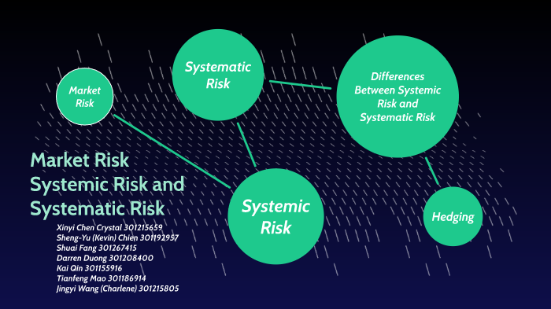

In today's complex financial landscapes, algorithmic trading, commonly referred to as algo trading, is rapidly becoming a defining factor. It leverages advanced computational methods to execute trades at speeds and efficiencies unattainable by human traders. Algo trading relies heavily on market microstructure, which encompasses the mechanics of how trades are executed in financial markets. This includes the processes and rules that govern trading, the behavior of various market participants, and how these elements interact to form prices and facilitate transactions.

Simultaneously, these technologies introduce considerations of systemic risk. Systemic risk refers to the potential for disturbances within the financial system that can cascade, leading to instability across markets or institutions. In trading environments influenced by algorithms, these risks can be exacerbated, as the speed and automated nature of trading can amplify both market efficiencies and potential dislocations.



This article explores the intersection between systemic risk and market microstructure in the context of algorithmic trading. Understanding these interactions is crucial, as they have broader implications for financial stability. Analyzing how algos affect market dynamics not only helps in pinpointing vulnerabilities but also in informing regulatory practices aimed at maintaining robust and resilient financial systems.

## Table of Contents

## Understanding Market Microstructure

Market microstructure encompasses the complex mechanisms and processes through which securities transactions are executed in financial markets. It constitutes a fundamental aspect of financial markets by shedding light on the forces driving price formation, trading processes, and the roles of various market participants.

At the core of market microstructure is the concept of price formation, which involves determining the price at which trades are executed. This process is influenced by the interaction of supply and demand, where buyers and sellers submit orders to the market. These orders may take the form of limit orders, which specify a maximum or minimum price at which a participant is willing to buy or sell, or market orders, which are executed immediately at the best available price. The equilibrium between these orders facilitates the discovery of prices, ultimately reflecting the market's consensus on the value of a security at a given time.

Trading processes are another vital component of market microstructure. These processes involve the methods by which trades are matched and executed. Electronic trading platforms, auction-based systems, and over-the-counter (OTC) markets represent different trading mechanisms, each with unique characteristics impacting trade execution and liquidity. Electronic communication networks (ECNs) and high-frequency trading ([HFT](/wiki/high-frequency-trading-strategies)) exemplify the evolution of trading processes driven by advancements in technology.

Roles of market participants represent the third pillar of market microstructure. These participants include institutional investors, retail traders, market makers, and [algorithmic trading](/wiki/algorithmic-trading) systems. Each participant contributes uniquely to market dynamics. For instance, market makers provide [liquidity](/wiki/liquidity-risk-premium) by continuously quoting buy and sell prices, facilitating smooth market operations. Algorithmic trading systems, driven by pre-programmed instructions, execute trades at high speeds, contributing to efficient order execution and increased market liquidity.

Analyzing market microstructure offers valuable insights into how trading costs evolve and impact liquidity. Trading costs include explicit costs, like commissions and fees, as well as implicit costs, such as bid-ask spreads and market impact. By understanding the intricacies of market microstructure, analysts can identify how these costs are affected by factors like order flow, [volatility](/wiki/volatility-trading-strategies), and market depth, ultimately influencing liquidity levels.

In summary, market microstructure plays a pivotal role in understanding the mechanics of securities transactions. It encompasses price formation, trading processes, and participant roles, providing a comprehensive framework to analyze how trading costs and liquidity evolve in financial markets.

## The Role of Algorithmic Trading

Algorithmic trading leverages computer algorithms to automate the execution of trading orders, dramatically altering the landscape of financial markets. This sophisticated method facilitates the rapid enactment of trades, achieving speeds that are well beyond the capabilities of manual human intervention. At its core, algorithmic trading employs pre-defined rules that are programmed to execute trades when certain conditions are met. These algorithms can process vast arrays of market data points, such as price levels, trading volumes, and timing, to make decisions in real-time. 

The effectiveness of algorithmic trading is, in large part, derived from its capacity to analyze and respond to multiple market indicators simultaneously. This allows for split-second trading decisions that can capitalize on market inefficiencies before they are corrected. Consequently, algorithmic trading has significant implications for market liquidity and volatility. By increasing the [volume](/wiki/volume-trading-strategy) and frequency of trades, algorithms contribute to creating a more liquid market, making it easier for participants to buy and sell securities without causing drastic changes in price.

However, this increased activity can also lead to heightened volatility. The rapid execution of trades means that markets can swiftly react to new information or shifts in conditions, sometimes resulting in erratic price movements. This dual impact of enhancing liquidity while potentially increasing volatility makes algorithmic trading a powerful tool with both benefits and risks.

The algorithms used in this form of trading can be as simple as executing a large order at optimal prices or as complex as employing [machine learning](/wiki/machine-learning) techniques to predict future market movements. For instance, Python, a popular programming language in quant finance, facilitates the development of these algorithms through libraries such as NumPy for numerical computations, Pandas for data analysis, and TensorFlow for machine learning and [deep learning](/wiki/deep-learning) processes.

Python code example for a simple moving average algorithm:
```python
import pandas as pd

def moving_average_strategy(prices, window_size):
    moving_averages = prices.rolling(window=window_size).mean()
    signals = (prices > moving_averages).astype(int)
    return signals

# Sample usage
prices = pd.Series([100, 101, 102, 101, 98, 105, 107, 108])
signals = moving_average_strategy(prices, window_size=3)
print(signals)
```
This code calculates trading signals based on a simple moving average strategy. If the current price crosses above the moving average, it might indicate a buy signal, which can be automatically executed by the algorithm. 

Algorithmic trading's pervasive influence continues to shape market dynamics, making the understanding of its role essential for assessing modern financial market structures.

## Systemic Risk in Algorithmic Trading

Systemic risk in algorithmic trading represents a significant challenge to the stability of financial markets. This type of risk manifests when disruptions in one part of the financial system propagate and cause instability elsewhere. The nature of algorithmic trading, characterized by high-speed transactions and heavy reliance on technology, has the propensity to magnify such risks.

Algorithmic trading programs are designed to execute trades at speeds and frequencies impossible for human traders. This rapid execution capability can exacerbate systemic risk due to several factors. First, the interconnectedness of financial markets means that a failure or a bug in one algorithm can have cascading effects. For instance, if a large algorithmic trader experiences a malfunction, it could lead to a rapid sell-off, triggering a chain reaction affecting market prices across multiple platforms.

Furthermore, the reliance on vast amounts of historical and real-time data for decision-making can itself be a vulnerability. In situations of unexpected market conditions, algorithms may react to data anomalies in ways that humans would not. A 'flash crash' is a prime example of this phenomenon, where rapid and substantial sell-offs occur, resulting in dramatic price declines within minutes. These crashes are often attributed to automated trading systems responding to unusual market signals, which in turn create more sell signals in other systems, leading to a feedback loop of selling pressure.

In addition to technical glitches, systemic risk may also arise from strategic interactions among trading algorithms. These interactions can create crowded trades, where multiple algorithms execute similar strategies simultaneously, increasing the likelihood of liquidity shortages. Such scenarios can lead to market anomalies, with orders being executed at extreme prices before markets stabilize.

Mitigating these risks requires robust technological safeguards, including circuit breakers to halt trading during extreme volatility. Additionally, improved risk management frameworks and rigorous testing of trading algorithms can help reduce the likelihood of systemic disruptions. Understanding these mechanisms is crucial for regulators and market participants to design resilient markets capable of withstanding technology-induced shocks.

## Impact of Systemic Risk on Market Microstructure

Systemic risk poses significant challenges to market microstructure, primarily through its capacity to distort price formation, leading to increased bid-ask spreads and diminished market liquidity. In periods of heightened systemic risk, financial markets often experience higher volatility, which can manifest as widened bid-ask spreads. This widening represents increased uncertainty and transaction costs for market participants, as they require higher compensation for the risk of price fluctuations. The equation for the bid-ask spread $S$ in simplified terms is:

$$
S = P_a - P_b
$$

where $P_a$ is the ask price and $P_b$ is the bid price. As systemic risk rises, $S$ tends to increase, reflecting the market's uncertainty. 

Furthermore, systemic risk can compel market participants to modify their trading strategies, significantly impacting market depth and efficiency. Market depth, which refers to the market's ability to absorb large orders without significant price changes, can be severely affected as traders might withdraw liquidity to mitigate potential losses. This reduction in available liquidity not only increases transaction costs but can also lead to inefficiencies in how prices are discovered and formed.

For market regulators, understanding the impacts of systemic risk is essential to ensure that market structures remain robust against shocks. Regulators need to closely monitor indicators of systemic risk and the associated changes in market microstructure to implement timely interventions. These might include enforcing trading halts or circuit breakers during extreme volatility to stabilize markets. Proactive measures and continuous oversight are vital to maintaining a resilient financial system capable of withstanding systemic disruptions.

## Mitigating Systemic Risk

Market participants and regulators adopt various strategies to mitigate systemic risk within financial markets, particularly as the prevalence of algorithmic trading increases. These strategies include the implementation of circuit breakers, which are mechanisms designed to temporarily halt trading on an exchange to curb panic-selling and excessive volatility. Circuit breakers were notably utilized in the U.S. stock markets, where they function by triggering market-wide pauses or halts in trading if an index falls below specific thresholds during a trading session.

Enhanced regulatory compliance also plays a critical role in mitigating systemic risk. Regulatory frameworks have been strengthened to require firms to adhere to more rigorous standards, such as reporting requirements and stress testing. These measures aim to ensure that financial institutions maintain adequate capital reserves and are resilient enough to withstand adverse market conditions.

In addition to circuit breakers and regulatory compliance, risk management frameworks have been significantly improved. These frameworks include the development of sophisticated risk assessment models that use machine learning and statistical analysis to predict and manage potential vulnerabilities in trading systems. Market participants increasingly use [backtesting](/wiki/backtesting) and stress testing to simulate market conditions and assess the robustness of their trading algorithms under various scenarios.

Education and continuous monitoring are essential for equipping market participants with the knowledge and tools to handle sudden disruptions effectively. Continuous professional development programs and workshops ensure that traders and other financial industry professionals are up-to-date with the latest technological and regulatory developments. Furthermore, real-time monitoring systems are employed to detect irregular trading patterns and anomalies, thus allowing for timely intervention to prevent market disruptions.

In summary, a multi-faceted approach combining technological interventions, regulatory oversight, and continuous education is vital for mitigating systemic risk in financial markets. These strategies are integral in ensuring that market structures remain robust and capable of withstanding unexpected shocks, thereby maintaining overall financial stability.

## Conclusion

Systemic risk in market microstructures, particularly those influenced by algorithmic trading, represents a growing concern in today's financial environments. The intricate dynamics of modern trading systems, characterized by high-speed transactions and complex algorithms, can lead to significant disruptions if not properly managed. Understanding the interplay between systemic risk and market microstructure is essential for preserving market integrity. Market microstructure plays a pivotal role in price formation, liquidity, and the overall efficiency of financial markets. When systemic risk is introduced, these mechanisms can become distorted, potentially leading to broader financial instability.

Future research must prioritize the development of comprehensive strategies aimed at enhancing market resilience. This involves advancing both technological and regulatory frameworks to handle the challenges posed by high-frequency and algorithmic trading. Policymakers and market participants should focus on enhancing risk management practices and implementing robust regulatory measures, such as circuit breakers and real-time monitoring systems, to mitigate the risks associated with algorithmic trading. Additionally, ongoing education and training for market participants are crucial to ensure that they are equipped to manage unexpected market events effectively.

To prevent potential financial crises, collaboration between financial institutions, regulators, and technology developers is imperative. By fostering an environment of continuous innovation and adaptation, the financial system can better withstand shocks and maintain stability. Emphasizing research in the areas of algorithmic trading risks, market surveillance, and systemic risk indicators will be key to identifying vulnerabilities and implementing proactive measures. Through these combined efforts, the integrity and resilience of market microstructures can be upheld, safeguarding the financial markets against future systemic threats.

## References & Further Reading

[1]: O'Hara, M. (1995). ["Market Microstructure Theory."](https://openlibrary.org/books/OL1103097M/Market_microstructure_theory) Blackwell Publishers.

[2]: Aldridge, I. (2013). ["High-Frequency Trading: A Practical Guide to Algorithmic Strategies and Trading Systems."](https://www.wiley.com/en-us/High+Frequency+Trading%3A+A+Practical+Guide+to+Algorithmic+Strategies+and+Trading+Systems%2C+2nd+Edition-p-9781118343500) Wiley.

[3]: Lopez de Prado, M. (2018). ["Advances in Financial Machine Learning."](https://www.amazon.com/Advances-Financial-Machine-Learning-Marcos/dp/1119482089) Wiley.

[4]: Harris, L. (2003). ["Trading and Exchanges: Market Microstructure for Practitioners."](https://www.amazon.com/Trading-Exchanges-Market-Microstructure-Practitioners/dp/0195144708) Oxford University Press.

[5]: Degryse, H., de Jong, F., & van Kervel, V. (2015). ["The Impact of Dark Trading and Visible Fragmentation on Market Quality."](https://academic.oup.com/rof/article/19/4/1587/1567671) Review of Financial Studies, 28(3), 446-485.

[6]: Kirilenko, A. A., Kyle, A. S., Samadi, M., & Tuzun, T. (2017). ["The Flash Crash: High-Frequency Trading in an Electronic Market."](https://www.jstor.org/stable/26652722) Journal of Finance, 72(3), 967–998.

[7]: Zigrand, J.-P., Cliff, D., & Hendershott, T. (2011). ["Financial Stability and Algorithmic Trading."](https://research-information.bris.ac.uk/en/publications/the-future-of-computer-trading-in-the-financial-markets-working-p) London School of Economics and Political Science.