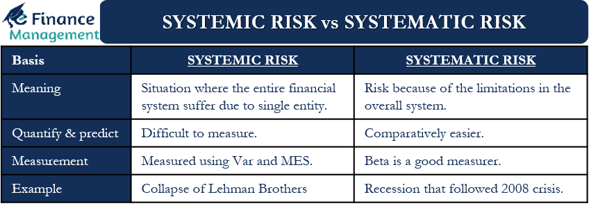

## Table of Contents

## What is systemic risk?

Systemic risk is the possibility that a problem in one part of the financial system can spread and cause trouble for the whole system. Imagine if one big bank fails, it might make other banks and businesses struggle too. This can lead to a domino effect where the failure spreads throughout the economy, affecting everyone.

To prevent systemic risk, governments and financial regulators keep a close watch on the financial system. They create rules and safety measures to stop problems from spreading too far. By doing this, they hope to keep the economy stable and protect people's money and jobs.

## What is systematic risk?

Systematic risk is the risk that affects the whole market or a large part of it. It's not about one company or one type of investment going wrong, but about things that can shake up the entire economy. Things like wars, big changes in interest rates, or natural disasters can cause systematic risk. These events can make the value of many investments go down at the same time.

You can't avoid systematic risk by just [picking](/wiki/asset-class-picking) different investments. It's like a storm that hits everyone, no matter where they are. But you can try to protect yourself a bit by spreading your money across different types of investments. This way, if one type of investment does badly because of a big event, the others might not be affected as much.

## How do systemic risk and systematic risk differ?

Systemic risk is like a sickness that starts in one part of the financial system and can spread to the whole thing. It's about how problems in one big bank or financial institution can cause trouble for other banks and businesses, leading to a big mess in the economy. Governments and regulators try to stop this by watching the financial system closely and making rules to keep things safe.

Systematic risk, on the other hand, is like a big storm that hits the whole market or a big part of it. It's not about one company or one type of investment going bad, but about big events like wars, big changes in interest rates, or natural disasters that can make many investments lose value at the same time. You can't avoid this kind of risk by just choosing different investments, but you can try to protect yourself a bit by spreading your money around.

So, systemic risk is about the spread of problems within the financial system, while systematic risk is about big events that affect the whole market. Both are important to understand and manage to keep your money and the economy safe.

## Can you provide examples of systemic risk?

Systemic risk is like when one big bank has a problem and it starts to affect other banks and businesses too. For example, during the 2008 financial crisis, a lot of banks in the United States had made risky loans. When people couldn't pay back these loans, the banks started to fail. This caused panic, and other banks and businesses that depended on these banks also got into trouble. It was like a domino effect where one bank's failure caused problems for the whole financial system.

Another example of systemic risk happened in 1997 with the Asian Financial Crisis. It started in Thailand when the government had to let their currency drop in value because they couldn't pay back their debts. This caused a lot of investors to pull their money out of Thailand, which made things worse. But the problem didn't stay in Thailand. It spread to other countries in Asia like Indonesia, South Korea, and Malaysia. Banks and businesses in these countries also started to fail because they were connected to the problems in Thailand. This shows how a problem in one place can spread and affect the whole region.

## Can you provide examples of systematic risk?

Systematic risk is like a big event that affects the whole market. For example, if there's a war, it can make the stock market go down because people are worried and unsure about the future. This kind of risk doesn't just hit one company or one type of investment; it affects everything. During the 2020 COVID-19 pandemic, the whole world was affected. People had to stay home, businesses closed, and the economy slowed down a lot. This made the stock market drop because everyone was worried about what would happen next.

Another example of systematic risk is when there are big changes in interest rates. If the government decides to raise interest rates a lot, it can make borrowing money more expensive. This can slow down the economy because businesses might not want to borrow money to grow, and people might not want to buy houses or cars. When the economy slows down, the stock market can go down too. This kind of risk affects everyone, no matter what they invest in.

## What are the primary sources of systemic risk?

Systemic risk often comes from big banks or financial institutions that are very important to the economy. If one of these big banks fails, it can cause a lot of trouble for other banks and businesses that depend on it. For example, if a big bank can't pay back the money it owes to other banks, those banks might also get into trouble. This can start a chain reaction where more and more banks and businesses fail, causing problems for the whole economy. This is why people call these big banks "too big to fail" because their failure can hurt everyone.

Another source of systemic risk is when a lot of people or businesses borrow too much money and can't pay it back. This can happen when there's a housing bubble, like what happened before the 2008 financial crisis. Banks gave out a lot of risky loans for houses, and when people couldn't pay them back, it caused a lot of banks to fail. This problem spread quickly because many banks and businesses were connected through these loans. When one part of the system fails, it can make other parts fail too, leading to a big mess in the economy.

## How does systematic risk affect individual investments?

Systematic risk is like a big storm that can shake up the whole market, and it can make your individual investments go down in value. For example, if there's a war or a big economic change like a rise in interest rates, it can make people worried and unsure about the future. When people are worried, they might sell their investments, which can make the prices of stocks, bonds, and other investments drop. This means that even if you picked good investments, they can still lose value because of these big events that affect everyone.

You can't avoid systematic risk by just choosing different investments because it affects the whole market. But you can try to protect yourself a bit by spreading your money around in different types of investments. This is called diversification. If you have your money in different places, like stocks, bonds, and real estate, then if one type of investment does badly because of a big event, the others might not be affected as much. This way, you can help cushion the blow from systematic risk, even though you can't avoid it completely.

## What measures can be taken to mitigate systemic risk?

To reduce systemic risk, governments and financial regulators keep a close eye on the financial system. They make rules to make sure that big banks and financial institutions don't take too many risks. For example, they might require banks to keep more money on hand so they can handle problems if they come up. They also watch how connected banks and businesses are to each other, so if one fails, it doesn't cause a big mess for everyone else. This way, they try to stop problems from spreading and keep the economy stable.

Another way to lower systemic risk is by having something called a "bailout" plan ready. This means that if a big bank or financial institution is in trouble, the government can step in and help them out. The idea is to stop the failure of one big bank from causing a chain reaction that hurts the whole economy. Governments also create safety nets like deposit insurance, which protects people's money in banks, so they don't panic and pull their money out all at once. By having these plans in place, governments hope to keep systemic risk under control and protect the economy from big problems.

## How can investors protect their portfolios from systematic risk?

Investors can protect their portfolios from systematic risk by spreading their money across different types of investments. This is called diversification. Instead of putting all your money in one type of investment like stocks, you can also invest in bonds, real estate, and maybe even some cash. If a big event like a war or a change in interest rates happens and makes one type of investment go down, the others might not be affected as much. This way, you can help cushion the impact of systematic risk on your overall portfolio.

Another way to protect your portfolio is by using something called hedging. This means you can buy investments that go up in value when the market goes down. For example, you might buy something called a put option, which gives you the right to sell a stock at a certain price. If the stock market goes down, the value of your put option might go up, which can help balance out the losses in your portfolio. While hedging can be a bit more complicated and might cost you some money, it's another tool you can use to try to protect yourself from systematic risk.

## What role do regulatory bodies play in managing systemic risk?

Regulatory bodies play a big part in keeping the financial system safe from systemic risk. They watch over banks and other financial institutions to make sure they don't take too many risks. They do this by making rules that banks have to follow, like keeping enough money on hand to handle problems if they come up. They also check how connected banks and businesses are to each other. If one big bank fails, they want to stop it from causing a big mess for everyone else. By keeping a close eye on things, they try to stop problems from spreading and keep the economy stable.

Another thing regulatory bodies do is create plans to help if a big bank or financial institution gets into trouble. This is called a bailout plan. The idea is to step in and help the bank so its failure doesn't hurt the whole economy. They also set up safety nets like deposit insurance, which protects people's money in banks. This stops people from panicking and pulling their money out all at once. By having these plans ready, regulatory bodies hope to control systemic risk and protect the economy from big problems.

## How do systemic and systematic risks impact the global financial system?

Systemic risk can cause big problems for the whole world's financial system. It's like when one big bank in one country fails, and it starts to affect other banks and businesses everywhere. For example, during the 2008 financial crisis, banks in the United States had made risky loans. When people couldn't pay back these loans, the banks started to fail, and this caused panic. The problem didn't stay in the U.S.; it spread to other countries too. Banks and businesses around the world that depended on these U.S. banks also got into trouble. This shows how a problem in one place can spread and affect the whole global financial system.

Systematic risk is different because it's about big events that shake up the whole market, no matter where you are. Things like wars, big changes in interest rates, or natural disasters can make the value of many investments go down at the same time all over the world. For example, during the 2020 COVID-19 pandemic, the whole world was affected. People had to stay home, businesses closed, and the economy slowed down everywhere. This made stock markets drop in many countries because everyone was worried about what would happen next. Systematic risk affects everyone, and it's hard to avoid, but countries can work together to try to manage it and protect their economies.

## What advanced models are used to predict and analyze systemic and systematic risks?

To predict and analyze systemic risk, experts use something called network analysis. This is like drawing a map of how banks and financial institutions are connected to each other. By looking at this map, they can see how a problem in one place might spread to others. Another model they use is called stress testing. This is where they pretend that bad things happen, like a lot of people not being able to pay back their loans, and then they see how banks would handle it. These models help regulators and banks figure out where the weak spots are in the financial system so they can make rules to keep things safe.

For systematic risk, experts often use something called the Capital Asset Pricing Model (CAPM). This model helps them understand how big events, like changes in interest rates or a war, might affect the whole market. They also use something called Value at Risk (VaR), which tries to guess how much money an investment might lose in a bad situation. These models help investors and financial planners see how different events could shake up their investments and the whole market. By using these tools, they can try to protect themselves and make better decisions about where to put their money.

## References & Further Reading

[1]: Acharya, V. V., Pedersen, L. H., Philippon, T., & Richardson, M. (2017). ["Measuring Systemic Risk."](https://academic.oup.com/rfs/article/30/1/2/2682977) The Review of Financial Studies, 30(1), 2-47.

[2]: Brunnermeier, M. K. (2008). ["Deciphering the 2007–08 Liquidity and Credit Crunch."](https://www.princeton.edu/~markus/research/papers/liquidity_credit_crunch.pdf) Journal of Economic Perspectives, 23(1), 77–100.

[3]: Black, F., & Scholes, M. (1973). ["The Pricing of Options and Corporate Liabilities."](https://www.cs.princeton.edu/courses/archive/fall09/cos323/papers/black_scholes73.pdf) Journal of Political Economy, 81(3), 637–654.

[4]: Hu, X., & Morley, J. (2016). ["Macroeconomic Uncertainty and Its Effects on the Credit Risk and Bank Lending Channel."](https://onlinelibrary.wiley.com/doi/10.1002/ijfe.2600) Finance and Economics Discussion Series, Federal Reserve Board.

[5]: Pichler, P., & Summer, M. (2020). ["Financial markets and algorithmic trading strategies: Evolution and future prospects."](https://www.researchgate.net/publication/378548435_Algorithmic_Trading_and_AI_A_Review_of_Strategies_and_Market_Impact) Journal of Behavioral and Experimental Finance, 28, 100452.

