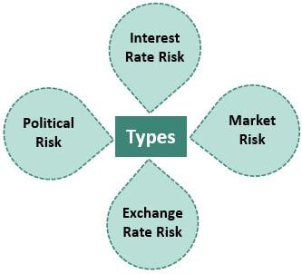

The world of finance is laden with various types of risks that can drastically affect markets and investments. Financial markets are complex environments where diverse risk factors interweave, influencing asset prices and investor behavior. With its dynamic nature, the financial landscape necessitates a thorough understanding of three pivotal concepts: financial risk, systemic risk, and systematic risk. These risks, although distinct, are interconnected and can severely impact the stability of financial systems and the success of investment strategies.

Financial risk refers to the chance of losing money in investments or business ventures due to fluctuations in market conditions or operational failures. It encompasses various sub-categories, such as credit risk, market risk, and liquidity risk, each presenting unique challenges and potential impacts on financial portfolios.



Systemic risk represents the peril of a collapse within an entire financial system or market, often triggered by highly disruptive events. Historical occurrences, like the 2008 financial crisis, serve as stark reminders of how systemic shocks can propagate through global financial networks, affecting economies worldwide.

Systematic risk, commonly referred to as market risk, is tied to macroeconomic factors that influence the entire market or a substantial market segment. It is a form of risk that cannot be easily diversified away and requires strategic measures for mitigation, which are crucial for preserving investment value over time.

In today's high-tech trading environment, algorithmic trading plays a significant role in managing and mitigating these risks. By employing advanced computer algorithms, traders and institutions can execute orders with speed, precision, and consistent logic that human intervention might not achieve. Algorithmic trading offers tools and techniques to optimize risk management processes, although it also presents new challenges that must be carefully navigated.

Understanding these risks is essential for developing effective trading strategies that promote financial stability. Investors, traders, and financial professionals are encouraged to deepen their comprehension of these concepts. This article aims to provide a comprehensive overview of these risk types and elucidate the role of algorithmic trading in current financial markets. By exploring the intricacies of financial, systemic, and systematic risks, and how they intersect with algorithmic strategies, we equip financial stakeholders to better navigate a landscape characterized by uncertainty and opportunity.

## Table of Contents

## Defining Financial Risk

Financial risk represents the potential for monetary losses in investment or business activities. Understanding and managing these risks is crucial for preserving assets and maximizing returns. Financial risk encompasses several types, namely credit risk, market risk, and [liquidity](/wiki/liquidity-risk-premium) risk, each with distinct characteristics and implications.

### Credit Risk

Credit risk is the danger that a borrower will default on a financial obligation, such as a loan or bond. This risk is a major concern for lenders and investors because it directly affects their return on investment. Real-world examples of credit risk include the collapse of Lehman Brothers in 2008, which exemplified how poor credit assessments and defaults on subprime mortgages led to widespread financial losses. To manage credit risk, financial institutions often conduct thorough due diligence, employ credit scoring models, and set aside capital reserves.

### Market Risk

Market risk, also known as systematic risk, pertains to losses arising from adverse market movements. Factors such as economic recessions, inflation, and natural disasters can significantly impact asset prices in financial markets. The stock market crash of 1987, triggered by a mix of geopolitical tensions and investor panic, is a historical example of market risk’s widespread impact on investments. Diversification, hedging with derivatives like options and futures, and the use of stop-loss orders are common strategies to mitigate market risk.

### Liquidity Risk

Liquidity risk arises when an entity is unable to meet its short-term financial obligations due to the inability to convert assets into cash without incurring substantial losses. This risk became apparent during the 2008 financial crisis when many financial institutions faced challenges in liquidating assets to cover liabilities. Effective liquidity risk management involves maintaining sufficient cash reserves, access to credit lines, and strong relationships with counterparties.

### Strategies for Managing Financial Risk

Managing financial risk requires a comprehensive approach that includes risk assessment, mitigation, and monitoring. Quantitative models, such as Value at Risk (VaR), are commonly used to estimate potential losses and guide risk management strategies. Consider the following Python code snippet for calculating VaR assuming a portfolio's value follows a normal distribution:

```python
import numpy as np
from scipy.stats import norm

# Parameters
portfolio_value = 1000000  # Example portfolio value
mean_return = 0.05  # Expected return
std_deviation = 0.15  # Portfolio standard deviation
confidence_level = 0.95  # Confidence level for VaR

# Calculate VaR
z_score = norm.ppf(confidence_level)  # Z-score for confidence level
var = portfolio_value * (z_score * std_deviation - mean_return)
print(f"Value at Risk (VaR): ${var:.2f}")
```

Moreover, stress testing and scenario analysis provide insights into how different market conditions can affect a portfolio. By employing these strategies, investors and financial professionals can better manage financial risks and safeguard their investments.

## Understanding Systemic Risk

Systemic risk represents the potential for a widespread collapse within an entire financial system or market, often spurred by high-impact events capable of triggering cascading adverse effects. Understanding systemic risk is critical to global financial stability, as it reflects the interconnectedness of financial institutions and markets, where the failure of a single entity or market can affect countless others.

High-impact events that illustrate systemic risk include the 2008 financial crisis, which was characterized by the collapse of major financial institutions, significant downturns in stock markets, and severe contractions in the availability of credit. The crisis underscored the contagion effect, where the distress in the U.S. housing market swiftly spread globally, affecting banking, investment, and even insurance sectors worldwide. This chain reaction was propelled by the intricate web of financial interdependencies and the globalization of financial markets.

The implications of systemic risk for global financial stability are profound. A financial system under systemic distress can lead to severe economic downturns, increased unemployment, and overall economic stagnation. The interconnectedness means that confidence in one part of the financial ecosystem, when shaken, can lead to a loss of trust in other parts, thereby crippling the entire system's functionality. Therefore, systemic risk not only threatens individual markets but can potentially destabilize the global economy.

Regulatory bodies play a vital role in monitoring and mitigating systemic risks. Institutions such as the Financial Stability Board (FSB) and national central banks implement stringent regulations aimed at enhancing transparency, improving risk management practices, and ensuring sufficient capital buffers for financial institutions. One mechanism utilized is stress testing, where financial institutions simulate crisis scenarios to evaluate their resilience against systemic shocks. These tests help regulators and financial entities identify vulnerabilities and prepare for potential crises.

Moreover, international cooperation among regulatory bodies has strengthened post-2008, recognizing that systemic risk often transcends national borders. Initiatives like the Basel III framework have established comprehensive guidelines for banking supervision, aiming to enhance the banking sector's ability to absorb financial and economic shocks, improve risk management and governance, and strengthen banks' transparency and disclosures.

In sum, systemic risk embodies the potential for pervasive disruption across financial systems, necessitating proactive and coordinated efforts from both domestic and international regulatory bodies to safeguard against such risks and maintain global financial stability.

## Exploring Systematic Risk

Systematic risk, also known as market risk, is the risk that affects the entire financial market or a significant portion of it and cannot be eliminated through diversification. This form of risk arises from widespread economic changes, [interest rate](/wiki/interest-rate-trading-strategies) fluctuations, and geopolitical events. Unlike unsystematic risk, which can be mitigated through diversification, systematic risk is inherent to the market environment itself.

Sources of systematic risk can often be traced back to macroeconomic factors. Economic changes such as inflation, recessions, or unexpected swings in GDP impact asset prices across the board. For instance, during an economic downturn, consumer spending typically decreases, leading to reduced corporate earnings and subsequently lower stock prices. Similarly, interest rate shifts, often dictated by central banks as part of monetary policy, can alter the cost of borrowing and influence investors' return expectations. A rise in interest rates generally makes fixed-income investments more attractive, potentially leading to a decline in stock market values as capital shifts from equities to bonds.

Geopolitical events also play a significant role in systematic risk. Political instability, wars, or changes in government policies can introduce uncertainty, affecting global financial markets. A historical example is the oil embargo of the 1970s, which led to an energy crisis, severely impacting all major stock markets simultaneously.

To clarify the distinction between systematic and unsystematic risk, consider a well-diversified portfolio. Unsystematic risk pertains to individual asset or sector-specific risk, which can be reduced by holding a variety of assets. However, even this diversified portfolio remains vulnerable to systematic risk. For example, a geopolitical event like Brexit affected various sectors and stocks on a large scale, not sparing even well-diversified portfolios.

Regarding strategies to hedge against systematic risk, investors commonly use financial instruments such as options, futures, and exchange-traded funds (ETFs) specifically designed to move inversely with the market or to protect against downside exposure. Consider a scenario where an investor wants protection against a potential decline in the S&P 500 index:

```python
import numpy as np
from scipy.stats import norm

# Define the parameters for a put option on the S&P 500
S = 4000  # Current S&P 500 index level
K = 3950  # Strike price of the put option
T = 30/365  # Time to expiration in years
r = 0.01  # Risk-free interest rate
σ = 0.2  # Volatility of the S&P 500

# Calculate the Black-Scholes put option price
d1 = (np.log(S/K) + (r + 0.5*σ**2)*T) / (σ*np.sqrt(T))
d2 = d1 - σ*np.sqrt(T)
put_price = K*np.exp(-r*T)*norm.cdf(-d2) - S*norm.cdf(-d1)

print(f"The cost of the protective put option is {put_price:.2f} per contract.")
```

In this case, the investor buys a put option, which allows them to sell the index at the strike price, thus offsetting some losses if the index falls.

In summary, while systematic risk is unavoidable, understanding its sources and using strategic hedging methods can help investors manage potential impacts on investments. It highlights the importance of evaluating the broader economic environment when making investment decisions.

## The Role of Algorithmic Trading in Risk Management

Algorithmic trading employs computer algorithms to optimize trading strategies and facilitate the execution of orders with precision and speed, thereby assisting in the management of various financial risks. This systematic approach allows for the real-time processing of large volumes of data, enabling traders and institutions to respond swiftly to market changes, which is crucial in mitigating financial, systemic, and systematic risks.

One of the primary advantages of [algorithmic trading](/wiki/algorithmic-trading) in risk management is its ability to enhance speed. Algorithms can execute trades at a velocity unattainable by human traders, significantly reducing the latency in decision-making processes. This rapid execution is vital in volatile markets where price movements can occur within milliseconds, potentially affecting the financial and systematic risks linked to asset price fluctuations.

Accuracy and consistency are other key benefits of algorithmic trading. Algorithms operate by adhering to pre-defined criteria and methodologies, minimizing human errors and emotional biases in trading decisions. By consistently applying these rules across numerous trades, algorithms help manage systematic risks that stem from macroeconomic changes or geopolitical events. For example, an algorithm might continuously monitor economic indicators and adjust portfolio allocations to hedge against expected interest rate hikes or political instability.

Financial institutions leverage algorithmic trading in risk assessment and market response through strategies such as statistical [arbitrage](/wiki/arbitrage), [market making](/wiki/market-making), and [trend following](/wiki/trend-following). For instance, in [statistical arbitrage](/wiki/statistical-arbitrage), algorithms identify pricing inefficiencies between correlated assets or markets, allowing traders to capitalize on these discrepancies while maintaining a balanced risk profile. This technique can mitigate risks by diversifying exposures and minimizing dependence on single asset classes or markets.

A notable case study illustrating the role of algorithmic trading in risk management involves the financial institution JPMorgan Chase. The firm's implementation of an algorithmic trading platform has enabled it to better manage and offset risks associated with fluctuations in market liquidity and credit conditions. By utilizing algorithms to predict liquidity risks and adjust asset positions accordingly, JPMorgan Chase enhances its ability to navigate complex market environments.

Despite these advantages, algorithmic trading is not without challenges and limitations. One significant concern is the potential for market disruption, as evidenced by "flash crashes." These events can occur when algorithms collectively engage in rapid buying or selling, leading to extreme short-term market [volatility](/wiki/volatility-trading-strategies). Additionally, the reliance on algorithms necessitates robust technological infrastructure and cybersecurity measures to prevent system failures and protect against cyber threats.

In conclusion, while algorithmic trading provides powerful tools for managing financial, systemic, and systematic risks, these systems require careful oversight and strategic planning. Balancing the advantages of speed, accuracy, and consistency with the need for extensive risk management frameworks is essential to safely harness the full potential of algorithmic trading in today's interconnected financial markets.

## Conclusion

Understanding financial, systemic, and systematic risks is a cornerstone for making astute investment decisions. Financial risk encapsulates the possibility of monetary loss from ventures, influenced by variables such as credit and market dynamics. Systemic risk pertains to the potential collapse of an entire financial system, often prompted by high-impact events like the 2008 financial crisis. Systematic risk involves market-wide uncertainties that remain impervious to diversification efforts, such as economic shifts and geopolitical upheavals.

Algorithmic trading presents robust tools to mitigate these risks through automation in strategy execution and order management. Utilizing various algorithms facilitates rapid and precise adjustments in response to market fluctuations, offering a layer of control over unpredictable variables. However, embracing algorithmic trading requires a judicious approach. Precision in algorithm design and continual refinement are imperative to prevent excessive volatility or inadvertent amplification of market disturbances.

As technology advances, its integration into risk management transforms how financial markets operate, offering novel insights and mechanisms for dealing with uncertainty. Yet, with growing interconnectivity, the stakes have risen. Investors and financial professionals must remain vigilant, constantly updating strategies to stay relevant in a landscape that values agility and foresight. Comprehensive risk management strategies are more crucial than ever, ensuring the stability and competitiveness of investment portfolios in an era marked by profound interconnectedness and rapid market changes.

## References & Further Reading

[1]: Acharya, V. V., Pedersen, L. H., Philippon, T., & Richardson, M. (2017). ["Measuring Systemic Risk."](https://academic.oup.com/rfs/article/30/1/2/2682977) The Review of Financial Studies, 30(1), 2-47.

[2]: Brunnermeier, M. K. (2008). ["Deciphering the 2007–08 Liquidity and Credit Crunch."](https://www.princeton.edu/~markus/research/papers/liquidity_credit_crunch.pdf) Journal of Economic Perspectives, 23(1), 77–100.

[3]: Black, F., & Scholes, M. (1973). ["The Pricing of Options and Corporate Liabilities."](https://www.cs.princeton.edu/courses/archive/fall09/cos323/papers/black_scholes73.pdf) Journal of Political Economy, 81(3), 637–654.

[4]: Hu, X., & Morley, J. (2016). ["Macroeconomic Uncertainty and Its Effects on the Credit Risk and Bank Lending Channel."](https://onlinelibrary.wiley.com/doi/10.1002/ijfe.2600) Finance and Economics Discussion Series, Federal Reserve Board.

[5]: Pichler, P., & Summer, M. (2020). ["Financial markets and algorithmic trading strategies: Evolution and future prospects."](https://www.researchgate.net/publication/378548435_Algorithmic_Trading_and_AI_A_Review_of_Strategies_and_Market_Impact) Journal of Behavioral and Experimental Finance, 28, 100452.

