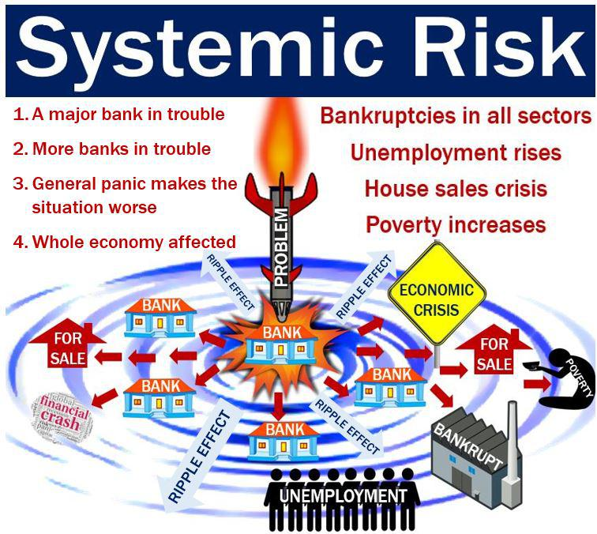

In the digital age, algorithmic trading has transformed financial markets by enabling transactions that are both efficient and lightning-fast. By leveraging complex algorithms and vast computational power, traders can execute trades with precision and at scales far beyond human capabilities. This technological advancement has democratized access to financial markets, reducing transaction costs and increasing liquidity. Nevertheless, as the prevalence of algorithmic trading has surged, it has brought forth a series of systemic risks that now serve as focal concerns for financial institutions and regulatory bodies alike.

Systemic risk refers to the potential for widespread disruption within the financial system, often precipitating broad economic instability. The intricacies of algorithmic trading introduce unique challenges, such as software mishaps, potential market manipulation, and unforeseen market dynamics, all of which can induce cascading failures across interconnected financial entities and platforms. This article will scrutinize the nature of systemic risk in the realm of algorithmic trading, considering its implications for the financial ecosystem and elucidating measures that are being implemented to mitigate these vulnerabilities.



## Table of Contents

## Understanding Algorithmic Trading

Algorithmic trading, widely known as algo trading, leverages computer algorithms to facilitate the automated execution of trades according to a set of predetermined rules. This innovation has dramatically transformed trading activities by enabling the handling of vast quantities of trades at unparalleled speeds and frequencies, outperforming manual trading processes. The use of advanced technology and sophisticated algorithms allows for the analysis and interpretation of market data in real time, leading to swift decision-making and trade execution.

One of the primary benefits of algorithmic trading is its ability to minimize the impact of human emotions and errors, thereby enhancing efficiency and execution accuracy. This is achieved by the systematic adherence to pre-established trading criteria, which are often based on quantitative models or historical data analysis. As a result, traders can exploit minute price discrepancies and market inefficiencies to achieve potential profit.

Common algo trading strategies have emerged as dominant forces within the financial markets. Among these, statistical arbitrage represents a popular method. It involves the simultaneous buying and selling of related financial instruments to profit from price differentials expected to revert to a mean value. This approach often requires analyzing vast data sets to identify relationships and potential opportunities.

Another widely utilized strategy is trend following, which focuses on identifying and capitalizing on the momentum of asset prices. Algorithms designed for trend following typically analyze historical price data to detect patterns and predict future price movements, enabling traders to align their positions with prevailing market trends.

Market making, an additional strategy employed in [algorithmic trading](/wiki/algorithmic-trading), involves providing [liquidity](/wiki/liquidity-risk-premium) to financial markets by simultaneously offering to buy and sell a particular asset. Algorithms engaged in [market making](/wiki/market-making) maintain a balance between supply and demand, narrowing bid-ask spreads and enhancing overall market liquidity.

Through the application of these strategies, algorithmic trading has become integral to the contemporary financial landscape, driving a significant portion of the [volume](/wiki/volume-trading-strategy) traded on exchanges globally. The synergistic combination of high-speed computation, data analysis, and strategic trading methodologies ensures that algorithmic trading remains at the forefront of market innovation.

## Defining Systemic Risk in Algo Trading

Systemic risk refers to the potential for disruptions in the financial system that can result in widespread economic instability. In the context of algorithmic trading, such risks are particularly pronounced due to several key factors. 

Firstly, software errors are a predominant source of systemic risk. These can occur when trading algorithms malfunction, leading to unintended market behaviors. An error in the coding of an algorithm could, for instance, trigger a massive number of trades in a short period, overwhelming the market and creating artificial [volatility](/wiki/volatility-trading-strategies).

Market manipulation presents another avenue through which systemic risk can manifest. In algorithmic trading, high-frequency traders might employ tactics that distort market prices. Such manipulation can lead to mistrust and market distortions, impacting the overall stability of financial systems.

Unexpected market events, including "black swan" occurrences that are rare and unforeseen, can also trigger cascading failures. Algorithms are typically programmed based on historical data and may not be equipped to handle unprecedented events, leading to systemic repercussions.

The interconnectedness of financial institutions and markets globally can amplify these risks considerably. The financial system’s networked nature means that disturbances in one area can propagate quickly across the entire system, leading to significant market impacts. This interconnectedness is often modeled using network theory, where nodes represent entities such as banks or trading platforms and edges represent the relationships or dependencies between them. In such a network, localized disruptions can quickly spread, evidenced by increased correlation among asset prices during times of stress.

Algorithmic trading, given its data-driven nature, has a unique susceptibility to these risk factors, requiring vigilant risk assessment and management to mitigate potential systemic fallout.

## Sources of Systemic Risk in Algo Trading

High-frequency trading ([HFT](/wiki/high-frequency-trading-strategies)) algorithms significantly contribute to liquidity imbalances and increased market volatility. These algorithms execute trades at exceptionally high speeds, taking advantage of minute price differences across markets. This rapid trading can lead to temporary liquidity dislocations, where the market depth is artificially inflated or deflated. As a result, the bid-ask spread widens, increasing transaction costs for market participants and potentially leading to destabilized markets.

Flash crashes are another critical risk associated with algorithmic trading. These events occur when market prices plummet abruptly and then recover shortly after. Automated trading systems, which often rely on similar data inputs and algorithms, can trigger cascades of sell or buy orders in response to price changes or market signals. For example, if a large number of trading algorithms interpret a price dip as a selling signal, they can collectively exacerbate the price decline, creating a self-reinforcing loop that results in a flash crash. Such events can erode investor confidence and highlight vulnerabilities within the trading infrastructure.

Moreover, risk models employed by algorithmic trading systems may inadequately account for low-probability, high-impact events, also known as black swan events. These models often rely on historical data to predict future market behaviors and may underestimate the likelihood of rare events that deviate significantly from historical norms. As these models are central to devising trading strategies, their failure to accurately predict such events can lead to substantial financial losses.

In Python, one might attempt to simulate the potential impact of high-frequency trades on market prices using a simplified model:

```python
import numpy as np

# Market parameters
initial_price = 100
num_trades = 10000
price_fluctuation = np.random.normal(0, 0.1, num_trades)  # small random fluctuation

# Simulate market price with high-frequency trading influence
market_prices = initial_price + np.cumsum(price_fluctuation)

# Identify potential flash crash points
threshold = 2  # price drop threshold for crash identification
flash_crashes = np.where((market_prices < initial_price - threshold) & 
                         (np.roll(market_prices, -1) > initial_price))[0]

print("Potential flash crash points detected at trades:", flash_crashes)
```

This code generates random price fluctuations around an initial market price to demonstrate how continuous trading can create significant price movements, identifying points where the price drops below a certain threshold and promptly recovers, potentially indicating a flash crash.

Overall, to manage these risks effectively, it is essential to implement stringent regulations, conduct thorough stress testing and [backtesting](/wiki/backtesting) of algorithms, and continuously monitor market activities to safeguard against the systemic risks associated with high-frequency trading.

## Historical Instances of Algo Trading-Induced Systemic Risk

The 'Flash Crash' of May 6, 2010, stands out as a significant example of systemic risk induced by algorithmic trading. On this day, the U.S. stock market witnessed a rapid and intense decline, with the Dow Jones Industrial Average plummeting nearly 1,000 points within minutes before quickly recovering. This event was mainly triggered by high-frequency trading algorithms that amplified the volatility due to a lack of liquidity and the rapid occurrence of trades beyond human intervention. These algorithms, operating at extremely high speeds, caused a feedback loop that exacerbated the market's fall and subsequent recovery.

Another notable incident is the software mishap at Knight Capital in 2012. Knight Capital, a major trading firm, encountered a software glitch that led to uncontrolled trading positions, resulting in a loss of approximately $440 million within 45 minutes. This event illustrated the potential for substantial financial losses stemming from technical errors within algorithmic trading systems. The mistake was attributed to a failure in deploying new trading software, which unexpectedly started executing numerous erroneous trades.

These events highlight significant vulnerabilities in algorithmic trading systems, emphasizing the necessity for robust safeguards and oversight mechanisms. The rapid pace and interconnected nature of these systems mean that even minor errors can propagate quickly, leading to severe market disruptions. Consequently, it underscores the importance of stringent testing, real-time monitoring, and the implementation of fail-safe measures to prevent such incidents from recurring.

## Regulatory Frameworks to Mitigate Risk

Regulatory frameworks have been instrumental in mitigating systemic risks associated with algorithmic trading. One of the key measures introduced by regulators is the implementation of circuit breakers. Circuit breakers operate as automatic temporary halts of trading on an exchange, designed to curb panic-selling and provide a cooling-off period for the markets. For instance, if a stock index experiences a significant drop within a short timeframe, the circuit breaker is triggered to pause trading. This mechanism helps prevent the amplification of market volatility and allows for information assimilation and strategic decision-making by market participants.

Another pertinent measure is the enforcement of trading halts. Trading halts also serve to stabilize the markets; however, they are typically applied to individual securities rather than the whole market. These halts might be initiated due to an imbalance of buy and sell orders or pending news about the security that could significantly impact its price. By temporarily suspending trading activities, these halts reduce the likelihood of tumultuous trading scenarios that could exacerbate systemic risks.

To further mitigate risks, there is an ongoing push for increased transparency in algorithmic trading. Regulatory bodies advocate for the introduction of stringent testing procedures for algorithms prior to their deployment in live trading environments. This includes comprehensive backtesting and stress testing under a plethora of market conditions to ascertain the robustness and reliability of these algorithms. Implementing these stringent measures can greatly minimize the chances of algorithm-induced market disruptions.

Moreover, collaboration between international regulators has become increasingly crucial due to the global nature of financial markets. Cross-border risks necessitate a coordinated international response to ensure coherence in regulatory standards and practices. This collaboration can be facilitated through forums such as the International Organization of Securities Commissions (IOSCO), which works towards maintaining global financial stability by setting international benchmarks and facilitating the exchange of information between regulators.

In conclusion, the regulatory frameworks established to mitigate systemic risks in algorithmic trading revolve around a combination of automated market control mechanisms, enhanced algorithm transparency, and international regulatory cooperation. These measures collectively aim to safeguard the integrity and stability of financial markets, ensuring that technological advancements in trading do not compromise systemic security.

## Best Practices for Risk Management in Algo Trading

Implementing robust risk management protocols is crucial in controlling systemic risk in algorithmic trading. Continuous monitoring of trading algorithms ensures that any deviations from expected performance are promptly identified and rectified. Stress testing is another essential component of these protocols. By simulating extreme market conditions, traders can identify potential vulnerabilities in their algorithms. This practice allows firms to anticipate and mitigate adverse market impacts before they occur.

Thorough backtesting of trading strategies is critical in assessing the potential impacts of an algorithm under various market scenarios. Backtesting involves applying historical market data to trading algorithms to evaluate their performance and understand possible outcomes. This process helps traders refine their strategies and make informed adjustments. Utilizing a diverse range of data sets in backtesting, including data from volatile periods, ensures that the algorithms are resilient and adaptable.

Establishing a clear governance framework is vital for maintaining accountability in algorithmic trading activities. A comprehensive governance framework outlines the roles and responsibilities of all parties involved in the trading process. This framework should include policies and procedures for developing, testing, and deploying algorithms. It should also address compliance with regulatory requirements and incorporate a feedback loop to enhance algorithm performance continually.

In conclusion, the implementation of continuous monitoring, rigorous stress testing, thorough backtesting, and a structured governance framework are best practices for managing risk in algorithmic trading. These measures help to mitigate systemic risk by ensuring that trading algorithms perform as expected and are resilient to market fluctuations, ultimately promoting stability in the financial markets.

## Future Outlook and Conclusion

As technology continues to advance, the landscape of algorithmic trading is poised to undergo significant transformations, introducing both opportunities and challenges. The evolution of strategies and systems in algorithmic trading is primarily influenced by the integration of cutting-edge technologies such as [artificial intelligence](/wiki/ai-artificial-intelligence) (AI) and [machine learning](/wiki/machine-learning) (ML). These technologies enhance the ability of algorithms to process vast amounts of data and adapt to changing market conditions in real-time, thereby augmenting trading efficiency. However, the introduction of AI into trading systems also raises concerns regarding systemic risk. 

AI-driven trading systems, with their capability to autonomously learn and evolve, hold the potential to create complex behaviors that are difficult to predict and control. The inherent opacity of many AI models, particularly [deep learning](/wiki/deep-learning) architectures, can obscure the understanding of decision-making processes, posing a significant challenge for risk management. This unpredictability necessitates rigorous evaluation mechanisms to ensure that AI systems do not inadvertently contribute to market instability. Establishing enhanced transparency and accountability in AI algorithms is crucial to mitigating potential systemic risks.

Continued vigilance in risk management is imperative to safeguarding financial markets from systemic disruptions. This involves not only adhering to robust risk management protocols but also fostering innovation in these practices to keep pace with technological advancements. For instance, deploying advanced machine learning techniques for stress testing and scenario analysis can provide deeper insights into a trading system's resilience under extreme market conditions. Additionally, ensuring real-time monitoring and implementing automated safeguards can prevent unintended market impacts.

In conclusion, while the progressive integration of AI within algorithmic trading presents transformative possibilities, it also necessitates a proactive approach to risk management. Financial institutions, regulators, and technology developers must collaborate to establish comprehensive frameworks that address emerging risks associated with these technologies. By maintaining a commitment to innovation and vigilance in risk management, the financial industry can navigate the complexities of an evolving trading environment, ultimately safeguarding against potential systemic risks.

## References & Further Reading

[1]: Aldridge, I. (2013). ["High-Frequency Trading: A Practical Guide to Algorithmic Strategies and Trading Systems."](https://www.ahmetbeyefendi.com/wp-content/uploads/2020/07/High-Frequency-Trading-Irene-Aldridge.pdf) Wiley.

[2]: Cartea, Á., Jaimungal, S., & Penalva, J. (2015). ["Algorithmic and High-Frequency Trading."](https://assets.cambridge.org/97811070/91146/frontmatter/9781107091146_frontmatter.pdf) Cambridge University Press.

[3]: MacKenzie, D. (2018). ["Material Signals: A Historical Sociology of High-Frequency Trading."](https://www.sps.ed.ac.uk/sites/default/files/assets/pdf/material-signals.pdf) Economy and Society.

[4]: López de Prado, M. (2018). ["Advances in Financial Machine Learning."](https://www.amazon.com/Advances-Financial-Machine-Learning-Marcos/dp/1119482089) Wiley.

[5]: Kirilenko, A., & Lo, A. W. (2013). ["Moore's Law versus Murphy's Law: Algorithmic Trading and Its Discontents."](https://www.aeaweb.org/articles?id=10.1257/jep.27.2.51) Journal of Economic Perspectives.

[6]: Lewis, M. (2014). ["Flash Boys: A Wall Street Revolt."](https://en.wikipedia.org/wiki/Flash_Boys) W. W. Norton & Company.

[7]: European Securities and Markets Authority (ESMA). (2020). ["Final Report: Algorithmic Trading."](https://www.esma.europa.eu/press-news/esma-news/esma-publishes-mifid-ii-review-report-algorithmic-trading)

[8]: United States Securities and Exchange Commission (SEC). (2014). ["Equity Market Structure Literature Review Part II: High Frequency Trading."](https://www.sec.gov/marketstructure/research/hft_lit_review_march_2014.pdf) 

[9]: Patterson, S. (2013). ["Dark Pools: The Rise of the Machine Traders and the Rigging of the U.S. Stock Market."](https://www.amazon.com/Dark-Pools-Machine-Traders-Rigging/dp/0307887189) Crown Business.