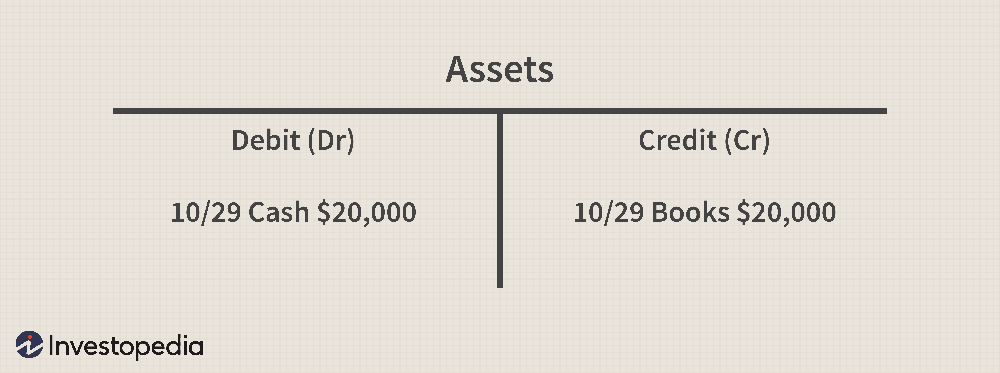

The financial world is vast and multifaceted, incorporating various elements ranging from fundamental accounting techniques to sophisticated trading strategies. At its core lies the crucial task of accurately recording financial transactions, a practice as old as commerce itself, which serves as the backbone for informed decision-making for businesses and investors alike. In this context, accounting financial recording, particularly through the use of T-Accounts, ensures the transparency and precision of financial statements, providing a solid foundation for evaluating a business's health and performance.

As technology evolved, the landscape of finance expanded further, paving the way for the emergence of algorithmic trading. This innovation utilizes mathematical models and computer algorithms to execute trades at an extraordinary speed, fundamentally transforming traditional trading methods. Understanding the relationship between financial data and trading outcomes is vital, as it influences trade execution and strategy formulation in this high-speed domain.



This article examines the intersection between these pivotal areas—accounting financial recording with T-Accounts and the thriving field of algorithmic trading. By bridging traditional accounting methods and modern algorithmic strategies, a more comprehensive understanding of how meticulous record-keeping can inform and enhance trading success emerges. As we explore this intersection, it becomes clear how time-honored accounting techniques underpin the sophisticated analytics driving today's financial markets, ultimately highlighting the synergy between accurate financial records and advanced trading mechanisms.

## Table of Contents

## Understanding Accounting Financial Recording

Accounting financial recording plays a critical role in ensuring both transparency and accuracy within any financial system. It forms the basis upon which financial statements are prepared, providing a clear picture of an entity's financial health. Among the various techniques employed in accounting financial recording, double-entry bookkeeping is the most fundamental.

Double-entry bookkeeping is based on the principle that every financial transaction has equal and opposite effects in at least two different accounts. This system is vital for maintaining the integrity of financial data and ensuring that the accounting equation, $\text{Assets} = \text{Liabilities} + \text{Equity}$, remains balanced. For instance, when a business records a sale of goods, it simultaneously enters a debit in the accounts receivable and a credit in sales revenue, thus affecting both assets and income in its ledger.

This recording system not only helps in tracking the flow of funds but also aids in detecting errors and discrepancies. By ensuring that the sum of debits equals the sum of credits, accountants can identify and resolve potential errors more efficiently. Furthermore, this method lays the groundwork for more advanced financial analyses and reporting.

Key concepts of accounting financial recording extend beyond just the debiting and crediting of accounts. It involves intricate processes such as the preparation of ledgers, trial balances, and financial statements which establish a company's financial position and performance. These records serve as essential tools for stakeholders, including investors, creditors, and management, who rely on accurate and timely financial data to make informed decisions.

Adhering to standardized accounting principles, such as the Generally Accepted Accounting Principles (GAAP) or the International Financial Reporting Standards (IFRS), further ensures that financial records are consistent, comparable, and transparent globally. These principles provide a framework that defines how financial transactions should be recorded and reported, playing a critical role in maintaining the credibility and reliability of financial reports.

In conclusion, mastering accounting financial recording and understanding its underlying principles are crucial for maintaining financial accuracy. Techniques like double-entry bookkeeping not only uphold the integrity of financial records but also serve as a foundational element for further financial analyses, including those involved in [algorithmic trading](/wiki/algorithmic-trading) and other sophisticated financial practices.

## The Role of T-Accounts in Financial Recording

T-Accounts are an essential tool in financial recording, offering a visual representation that simplifies the understanding of double-entry bookkeeping entries. In the double-entry system, each transaction involves two equal and opposite entries in different accounts, adhering to the accounting equation: Assets = Liabilities + Equity. T-Accounts help illustrate how these transactions impact various accounts in the general ledger, which is fundamental for maintaining the accuracy and transparency of financial statements.

Each T-Account has a left side, known as the debit side, and a right side, known as the credit side. When a transaction occurs, one account will be debited, and another will be credited. The total debits must equal the total credits for the ledger to remain balanced. For example, if a company purchases equipment worth $5,000 on credit, the Equipment account is debited for $5,000, increasing its value, while the Accounts Payable account is credited for the same amount, reflecting the liability incurred.

The utility of T-Accounts extends beyond simple transaction recording. They serve as a preliminary step before formally entering data into the general ledger. By organizing transactions in T-Accounts, accountants can easily track how each transaction modifies account balances, ensuring all entries comply with the double-entry principles. This organization is crucial for preparing financial statements such as the balance sheet and the income statement, which rely on accurate ledger balances.

In addition, T-Accounts are instrumental during the preparation of adjusting entries at the end of an accounting period. Adjusting entries ensure that income and expenses are recorded in the period they occur, aligning with the accrual accounting principle. For instance, if a company has incurred $1,000 in salaries that are yet to be paid, an adjusting entry would debit Salaries Expense while crediting Salaries Payable, using T-Accounts to visualize this accrual.

Moreover, T-Accounts facilitate clarity when analyzing transactions. Business owners and financial analysts can glean insights into operational efficiency and financial health by examining the changes in account balances over time. The ability to efficiently track and organize financial data is pivotal for strategic decision-making, from budgeting to forecasting and performance measurement.

In summary, T-Accounts not only depict the dual nature of financial transactions but also enhance the organization and clarity of financial records. By ensuring all debits and credits are systematically recorded and balanced, T-Accounts provide a foundation for accurate financial analysis and reporting, assisting businesses in meeting both internal management objectives and external compliance requirements.

## Advantages of Using T-Accounts

T-Accounts offer a straightforward approach to comprehending and tracking changes in various accounts, which is particularly beneficial for maintaining clarity and accuracy in bookkeeping. One of the primary advantages of using T-Accounts is their role in simplifying the preparation of adjusting entries. Adjusting entries are essential for ensuring that the revenues and expenses of a company are recorded in the period they occur, which is a fundamental aspect of the accrual accounting method.

In the accrual accounting system, the matching principle is crucial, as it requires that expenses be matched with the revenues they help generate. T-Accounts help accountants visualize the relationship between different transactions and accounts, making it easier to ensure that the matching principle is maintained. For instance, a T-Account can illustrate how accrued expenses, like wages or utilities, will have corresponding entries that affect both expenses and liabilities until these are settled.

Moreover, T-Accounts provide a clear and organized format for the financial data. This feature can be quite advantageous for business owners seeking to conduct detailed financial analysis. By using T-Accounts, business owners can quickly identify discrepancies, trends, and areas requiring attention, thus facilitating more nuanced financial insights. The dual-entry method embedded in T-Accounts allows for cross-checking of entries to ensure each transaction is accurately documented, thereby reducing errors and enhancing the reliability of financial statements.

For example, consider a scenario where a business owner wants to review the impact of a series of transactions on their cash and inventory levels. By laying these transactions out in T-Accounts, the business owner can easily trace the flow of money and goods, making it evident how each transaction influences the overall financial position. This clarity aids in making informed decisions, such as when to order new inventory or whether they need to adjust their sales strategy.

In essence, T-Accounts serve as a powerful tool for enhancing the organization and interpretability of financial data. Their application not only supports the preparation of precise financial statements but also enables business owners to engage in comprehensive financial analysis, ultimately leading to better financial management and decision-making.

 to Algorithmic Trading

Algorithmic trading, often referred to as algo trading, is a method of executing trades using pre-programmed instructions based on various algorithmic models. These algorithms can process large amounts of data and perform trades at speeds and frequencies that are infeasible for human traders. The primary goal of algorithmic trading is to leverage computational power and mathematical models to optimize trading strategies and capitalize on market inefficiencies.

At the core of algorithmic trading are three key components: data analysis, model creation, and execution. Firstly, historical and real-time financial data serve as inputs for developing trading algorithms. This data can include past price movements, [volume](/wiki/volume-trading-strategy) information, and macroeconomic indicators. Reliable financial data recording ensures the algorithm has a solid foundation on which to base trading decisions, emphasizing the necessity for precise and accurate data.

Secondly, the creation of a trading model involves designing algorithms that identify optimal entry and [exit](/wiki/exit-strategy) points in the market. These models may employ various strategies, such as [trend following](/wiki/trend-following), statistical [arbitrage](/wiki/arbitrage), or [market making](/wiki/market-making). Analytical techniques, including [machine learning](/wiki/machine-learning) and statistical methods, are often used to refine algorithmic strategies, enabling them to adapt to dynamic market conditions.

Finally, the execution component involves deploying the algorithm to execute trades in line with the predefined strategy. This is often done through direct market access (DMA), where the algorithm communicates directly with the market exchange. High-frequency trading ([HFT](/wiki/high-frequency-trading-strategies)), a subset of algorithmic trading, involves executing thousands of trades in a second, profiting from small price changes.

Here's a simplified Python example demonstrating a basic moving average crossover strategy, a popular algo trading strategy:

```python
import numpy as np
import pandas as pd

def moving_average_crossover_strategy(data, short_window=40, long_window=100):
    data['Short_MA'] = data['Close'].rolling(window=short_window, min_periods=1).mean()
    data['Long_MA'] = data['Close'].rolling(window=long_window, min_periods=1).mean()

    data['Signal'] = 0.0
    data['Signal'][short_window:] = np.where(data['Short_MA'][short_window:] > data['Long_MA'][short_window:], 1.0, 0.0)
    data['Position'] = data['Signal'].diff()

    return data

# Example usage
# data = pd.DataFrame({'Close': ...}) # Fill in with market data
# signals = moving_average_crossover_strategy(data)
```

In this example, the algorithm computes short-term and long-term moving averages of a stock's closing prices. It generates a buy signal when the short-term average crosses above the long-term average and a sell signal when the opposite occurs.

Algorithmic trading continues to evolve with advancements in technology and data analytics. The integration of traditional financial recording practices with algorithmic trading enables enhanced capabilities in evaluating and processing information effectively, underscoring its importance in the modern trading landscape.

## Integrating Financial Recording with Algo Trading

Accurate financial recording is essential for the development and implementation of algorithmic trading systems. The use of T-Accounts, a fundamental tool in accounting, provides a structured way to record and track financial transactions that can greatly benefit algorithmic processes. By maintaining clear and detailed financial records, algorithm developers ensure that their systems have reliable data inputs, crucial for analyzing financial trends and making informed trading decisions.

T-Accounts offer a dual representation of each transaction, reflecting both the debit and credit side of every entry. This method ensures that all financial activities are fully documented, maintaining data integrity and transparency. In the context of algorithmic trading, this level of detailed recording supports the development of algorithms by providing accurate datasets that reflect actual market conditions. Algorithms trained on such high-quality data are better equipped to predict market movements and execute trades efficiently.

The relationship between financial recording and algorithmic trading emphasizes automation and precision. Once integrated, financial records can be fed directly into trading algorithms, facilitating automated decision-making processes. For instance, consider a Python algorithm that trades based on moving average crossovers. The financial data recorded through T-Accounts can be processed to calculate these averages, enabling the algorithm to trigger buy or sell actions without manual intervention.

Here's a simple Python snippet demonstrating how financial data might feed into such an algorithm:

```python
import pandas as pd

# Assuming 'data' is a DataFrame containing financial records
data['Moving Average Short'] = data['Closing Price'].rolling(window=10).mean()
data['Moving Average Long'] = data['Closing Price'].rolling(window=50).mean()

# Generating trading signals
data['Signal'] = 0
data['Signal'][10:] = np.where(data['Moving Average Short'][10:] > data['Moving Average Long'][10:], 1, -1)

# Shift signals to align with trading actions
data['Position'] = data['Signal'].shift()
```

In this example, the financial records provide the necessary inputs for calculating moving averages, which in turn generate buy or sell signals based on predetermined conditions. This automation reduces human input, minimizes the chance for error, and allows for rapid execution of trades across different market conditions.

The integration of precise financial recording with algorithmic trading platforms underlines a critical synergy. Optimal performance in trading systems is achieved through accurate, timely financial data and sophisticated algorithm design. This confluence not only enhances the efficiency of trade execution but also provides a robust framework for scaling up automated trading operations. As the financial industry continues to evolve, the reliance on such integrated systems will likely grow, highlighting the necessity for finance professionals to possess a comprehensive understanding of both accounting techniques and trading strategies.

## Real-World Applications and Case Studies

### Real-World Applications and Case Studies

Exploring the integration of T-Accounts and algorithmic trading reveals significant benefits for companies aiming to enhance their financial analysis and trading strategies. Several organizations have successfully implemented these methods, demonstrating both the practical advantages and challenges associated with this integration.

One notable example is Goldman Sachs, a leader in utilizing algorithmic trading in conjunction with precise financial recording techniques. By maintaining meticulously accurate financial records through double-entry bookkeeping and T-Accounts, Goldman Sachs ensures that their algorithmic trading systems are based on reliable data inputs. This accuracy is vital for developing algorithms that can analyze historical trends and predict future market movements effectively. The use of T-Accounts facilitates an organized representation of financial transactions, ensuring that each aspect of their trading systems is well-documented and can be audited for compliance and accuracy.

Another case study involves Renaissance Technologies, one of the most successful hedge funds globally. Renaissance Technologies employs sophisticated algorithms that rely heavily on accurate financial data. T-Accounts play a crucial role in their ability to keep comprehensive records of every financial transaction, providing a clear audit trail. This attention to detail enables their algorithms to perform [backtesting](/wiki/backtesting) with high fidelity, as the data used is both accurate and comprehensive. The ability to backtest effectively allows Renaissance Technologies to refine their trading strategies continuously.

However, implementing these systems comes with challenges. Companies must ensure that every financial record is accurately captured in T-Accounts to maintain data integrity, which requires rigorous controls and audit procedures. Additionally, developing and maintaining complex algorithmic trading systems necessitates significant investment in technology and skilled personnel, highlighting the need for balancing cost with the potential for financial gain.

In summary, the synergy between precise financial recording using tools like T-Accounts and advanced algorithmic trading strategies is evident in companies such as Goldman Sachs and Renaissance Technologies. These organizations showcase the practical benefits of this integration, such as enhanced data accuracy and improved trading decisions, while also presenting challenges like increased investment and operational complexities. This balance of benefits and challenges illustrates the potential for future innovations in combining traditional accounting methods with cutting-edge trading technologies.

## Conclusion and Future Trends

As technology continues to evolve, the integration of traditional accounting practices with algorithmic trading is expected to grow more robust. The convergence of these fields relies heavily on the foundational principles of financial accuracy and transparency provided by accounting systems, like T-Accounts, which support the sophisticated data needs of algorithmic trading.

Understanding both traditional accounting techniques and modern algo trading will become indispensable for finance professionals aiming to thrive in the future landscape of finance. This dual expertise allows for effective management and analysis of the voluminous data generated in trading environments. Furthermore, the principles of accounting ensure that trading algorithms are fed accurate and reliable data, thereby optimizing performance and reducing risks related to erroneous data interpretation.

One of the anticipated trends is the development of more intuitive and integrated software systems that combine accounting functions with trading platforms. These systems will likely employ [artificial intelligence](/wiki/ai-artificial-intelligence) to automate routine accounting tasks and enhance decision-making processes in trading. For example, machine learning algorithms could be used to detect patterns and anomalies in financial records, improving the accuracy of predictive trading models.

Another trend to watch is the increased use of blockchain technology to ensure data integrity and transparency. Blockchain's decentralized and immutable nature makes it an ideal candidate for recording and verifying financial transactions, which could revolutionize how financial data is utilized in trading algorithms.

Python, being a versatile language in the financial sector, may see increased application in both accounting and trading contexts. A simple example of a Python script that integrates T-Account data with a basic trading algorithm might look like this:

```python
# Import necessary libraries
import pandas as pd

# Sample T-Account data
data = {'Account': ['Cash', 'Revenue'], 'Debit': [1000, 0], 'Credit': [0, 1000]}
t_accounts = pd.DataFrame(data)

# Algorithmic decision based on transaction data
def make_trade_decision(t_accounts):
    cash_balance = t_accounts.loc[t_accounts['Account'] == 'Cash', 'Debit'].sum() - \
                   t_accounts.loc[t_accounts['Account'] == 'Cash', 'Credit'].sum()

    # Simple trading decision based on cash balance
    if cash_balance > 500:
        return "Buy"
    else:
        return "Sell"

# Execute trade decision
trade_decision = make_trade_decision(t_accounts)
print(f"Trade Decision: {trade_decision}")
```

Future innovations may also focus on enhancing the accuracy of financial forecasts through the integration of real-time data analysis and accounting insights. This might lead to more advanced predictive models that can swiftly adjust to market changes, thereby giving traders a competitive edge.

Conclusively, as these technologies develop, professionals equipped with both accounting and algorithmic trading skills will find themselves at the forefront of financial innovation. The ability to navigate and integrate these domains will likely define the next generation of successful finance practitioners. Thus, continued education and adaptation to these emerging trends will remain crucial for those engaged in the financial sectors.

## References & Further Reading

[1]: ["Advances in Financial Machine Learning"](https://www.amazon.com/Advances-Financial-Machine-Learning-Marcos/dp/1119482089) by Marcos Lopez de Prado

[2]: ["Quantitative Trading: How to Build Your Own Algorithmic Trading Business"](https://books.google.com/books/about/Quantitative_Trading.html?id=j70yEAAAQBAJ) by Ernest P. Chan

[3]: ["Machine Learning for Algorithmic Trading"](https://github.com/PacktPublishing/Machine-Learning-for-Algorithmic-Trading-Second-Edition) by Stefan Jansen

[4]: ["Evidence-Based Technical Analysis: Applying the Scientific Method and Statistical Inference to Trading Signals"](https://www.amazon.com/Evidence-Based-Technical-Analysis-Scientific-Statistical/dp/0470008741) by David Aronson

[5]: Petersen, C., & Plenborg, T. (2012). [“Financial Statement Analysis”](https://www.semanticscholar.org/paper/Financial-Statement-Analysis%3A-Valuation%2C-Credit-%26-Petersen-Plenborg/57f0eaf422cf6ff26dfa18a7b26739bcabac8153). Pearson Education.