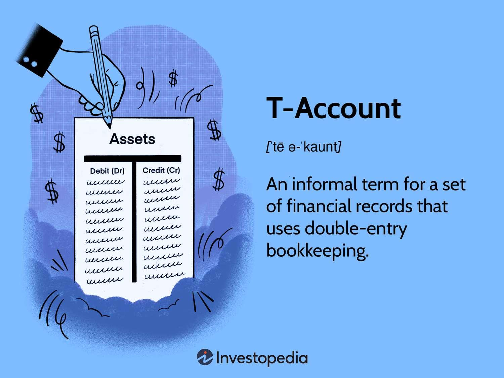

## Table of Contents

## What is a T-account and why is it used in accounting?

A T-account is a visual representation of a company's financial transactions, organized into different accounts. It's called a T-account because it looks like the letter "T". On one side, you write down the money coming in, and on the other side, you write down the money going out. It helps keep track of where the money is coming from and where it's going.

T-accounts are used in accounting because they make it easier to see how transactions affect different accounts. For example, when a business buys something, you can see how it affects both the cash account and the inventory account. By using T-accounts, accountants can make sure all the numbers add up correctly and that the business's financial records are accurate.

## How do you set up a basic T-account?

To set up a basic T-account, start by drawing a large letter "T" on a piece of paper or using accounting software. At the top of the T, write the name of the account you want to track, like "Cash" or "Inventory". The left side of the T is called the debit side, and the right side is called the credit side. 

When you record a transaction, you put the amount on the correct side of the T. For example, if you receive money, you would write that amount on the left side (debit) of the Cash T-account. If you spend money, you would write that amount on the right side (credit) of the Cash T-account. This helps you see at a glance how much money is coming in and going out of each account.

## Can you provide a simple example of recording a transaction in a T-account?

Let's say you own a small business and you just sold a product for $100. To record this in your T-accounts, you would first look at your Cash account. On the left side of the T, which is the debit side, you would write "$100" because you received money. This shows that your cash has increased by $100.

Next, you need to record the sale in your Sales account. On the right side of the T, which is the credit side, you would write "$100". This shows that your sales have increased by $100. By recording the transaction in both the Cash and Sales T-accounts, you can see how the sale affected your business's finances.

## What are the different types of accounts that can be represented by T-accounts?

T-accounts can represent different types of accounts in a business's financial records. The main types of accounts are assets, liabilities, equity, revenue, and expenses. Assets are things the business owns, like cash, inventory, and equipment. Liabilities are what the business owes, like loans and accounts payable. Equity represents the owner's stake in the business.

Revenue accounts track the money coming into the business from sales or services. Expense accounts track the money going out of the business for things like rent, utilities, and salaries. Each of these accounts can be represented by a T-account, with debits on the left side and credits on the right side. By using T-accounts for these different types of accounts, a business can keep a clear record of its financial transactions and see how they affect the overall financial health of the company.

## How do debits and credits work within a T-account?

Debits and credits are the two sides of a T-account. The left side is the debit side, and the right side is the credit side. When you record a transaction, you put the amount on either the debit or credit side, depending on what type of account it is and what the transaction does. For example, if you get money, you put it on the debit side of your Cash account because your cash is going up. If you spend money, you put it on the credit side of your Cash account because your cash is going down.

Different types of accounts work differently with debits and credits. For asset and expense accounts, a debit increases the account and a credit decreases it. So, if you buy something, you debit your Inventory account because your inventory goes up. For liability, equity, and revenue accounts, it's the opposite: a credit increases the account and a debit decreases it. So, if you make a sale, you credit your Sales account because your sales go up. By using debits and credits correctly, you can keep your T-accounts balanced and see how each transaction affects your business.

## What are the benefits of using T-accounts for beginners learning accounting?

T-accounts are really helpful for beginners learning accounting because they make things simple and easy to understand. When you're new to accounting, it can be hard to keep track of all the numbers and how they fit together. T-accounts break things down into two sides, debits and credits, which makes it easier to see how money is coming in and going out. By drawing a big T and putting numbers on each side, you can see at a glance how transactions affect different accounts. This visual way of learning helps beginners get a better grip on the basics of accounting.

Another benefit of using T-accounts is that they help beginners practice and understand the rules of debits and credits. In accounting, it's important to know that debits and credits work differently depending on the type of account. T-accounts give beginners a hands-on way to see these rules in action. For example, if you're learning about asset accounts, you can see that putting money on the debit side increases the account, while putting money on the credit side decreases it. By working with T-accounts, beginners can practice recording transactions and start to understand how everything fits together in the bigger picture of a business's finances.

## How can T-accounts help in understanding the double-entry bookkeeping system?

T-accounts are a great way to understand the double-entry bookkeeping system because they show how every transaction affects two accounts at the same time. In double-entry bookkeeping, every transaction has to be recorded in at least two places to keep everything balanced. When you use T-accounts, you can see this clearly. For example, if you buy something, you can see how it affects both your Cash account and your Inventory account. By putting the money spent on the credit side of the Cash T-account and the same amount on the debit side of the Inventory T-account, you can see how the transaction keeps the [books](/wiki/algo-trading-books) balanced.

Using T-accounts also helps you understand that the total of all the debits must equal the total of all the credits. This is a key part of double-entry bookkeeping. When you record a transaction in T-accounts, you can see how the numbers on the debit side of one account match up with the numbers on the credit side of another account. This visual way of showing transactions makes it easier to see how everything stays in balance. By practicing with T-accounts, you can get a better understanding of how double-entry bookkeeping works and why it's important for keeping accurate financial records.

## Can you explain how to balance a T-account and what it means when it is balanced?

Balancing a T-account means making sure the total amount of money on the debit side equals the total amount of money on the credit side. To do this, you add up all the numbers on the left side of the T, which is the debit side, and then add up all the numbers on the right side, which is the credit side. If the two totals are the same, then the T-account is balanced. If they're not the same, you need to check your work and make sure you recorded everything correctly.

When a T-account is balanced, it means that all the money coming in and going out of that account has been recorded correctly. It shows that the account is in good shape and that the numbers add up right. Balancing T-accounts is important because it helps you keep track of your money and make sure your financial records are accurate. If a T-account doesn't balance, it could mean there's a mistake somewhere, and you need to find it and fix it.

## How do T-accounts assist in preparing financial statements?

T-accounts help a lot when you're getting ready to make financial statements. They show you all the money coming in and going out of different accounts, like cash, sales, and expenses. By looking at the T-accounts, you can see how much money is in each account at the end of the month or year. This helps you fill out the financial statements, like the balance sheet and income statement, with the right numbers. For example, the balance in your Cash T-account goes on the balance sheet, and the totals from your Sales and Expense T-accounts help you figure out your net income on the income statement.

Using T-accounts also makes it easier to check if your financial statements are correct. If all your T-accounts are balanced, it means you've recorded everything right, and your financial statements should be accurate too. If something doesn't add up, you can go back to your T-accounts to find the mistake and fix it before you finish your financial statements. This way, T-accounts help you make sure your financial reports are trustworthy and give a true picture of your business's money situation.

## What are some common mistakes to avoid when using T-accounts?

One common mistake when using T-accounts is mixing up debits and credits. It's important to remember that for asset and expense accounts, a debit increases the account and a credit decreases it. But for liability, equity, and revenue accounts, it's the opposite: a credit increases the account and a debit decreases it. If you get these mixed up, your T-accounts won't balance, and your financial records will be wrong.

Another mistake is forgetting to record a transaction in both accounts. In double-entry bookkeeping, every transaction needs to be recorded in at least two places to keep everything balanced. If you only record it in one T-account, your books will be off. Always make sure you're recording the same amount on the debit side of one account and the credit side of another account. This will help keep your T-accounts balanced and your financial statements accurate.

## How can advanced users utilize T-accounts for complex transactions and adjustments?

Advanced users can use T-accounts to handle complex transactions and adjustments by breaking them down into smaller parts. For example, if a business has a big sale that involves discounts, returns, and different types of payments, you can use T-accounts to keep track of each part of the transaction. You might have a T-account for Sales, another for Sales Discounts, and another for Sales Returns. By recording each part of the transaction in the right T-account, you can see how the whole thing affects your business's finances. This helps you make sure everything is recorded correctly and that your financial statements are accurate.

T-accounts are also useful for making adjustments at the end of an accounting period. For instance, if you need to record depreciation on your equipment, you can use a T-account for Accumulated Depreciation to show how the value of your equipment goes down over time. You can also use T-accounts to make adjusting entries for things like accrued expenses or prepaid expenses. By using T-accounts to record these adjustments, you can see how they affect different accounts and make sure your financial records are up to date. This way, T-accounts help advanced users handle complex transactions and adjustments more easily and accurately.

## What software tools are available that support the use of T-accounts in accounting practices?

There are several software tools that help with T-accounts in accounting. One popular tool is QuickBooks. It lets you set up T-accounts for different parts of your business, like cash, sales, and expenses. You can record transactions easily and see how they affect your accounts. QuickBooks also helps you make financial statements using the information from your T-accounts. Another tool is FreshBooks, which is good for small businesses. It has a simple way to use T-accounts and helps you keep track of your money coming in and going out.

Another useful software is Xero, which is known for being easy to use and good for small to medium-sized businesses. Xero lets you set up T-accounts and record transactions in them. It also has features that help you balance your T-accounts and make sure your financial records are correct. For those who want more advanced features, there's also Sage, which is used by bigger businesses. Sage has a lot of tools for handling complex transactions and adjustments using T-accounts. All these software options make it easier to use T-accounts and keep your accounting organized.

## References & Further Reading

[1]: ["Advances in Financial Machine Learning"](https://www.amazon.com/Advances-Financial-Machine-Learning-Marcos/dp/1119482089) by Marcos Lopez de Prado

[2]: ["Quantitative Trading: How to Build Your Own Algorithmic Trading Business"](https://books.google.com/books/about/Quantitative_Trading.html?id=j70yEAAAQBAJ) by Ernest P. Chan

[3]: ["Machine Learning for Algorithmic Trading"](https://github.com/PacktPublishing/Machine-Learning-for-Algorithmic-Trading-Second-Edition) by Stefan Jansen

[4]: ["Evidence-Based Technical Analysis: Applying the Scientific Method and Statistical Inference to Trading Signals"](https://www.amazon.com/Evidence-Based-Technical-Analysis-Scientific-Statistical/dp/0470008741) by David Aronson

[5]: Petersen, C., & Plenborg, T. (2012). [“Financial Statement Analysis”](https://www.semanticscholar.org/paper/Financial-Statement-Analysis%3A-Valuation%2C-Credit-%26-Petersen-Plenborg/57f0eaf422cf6ff26dfa18a7b26739bcabac8153). Pearson Education.