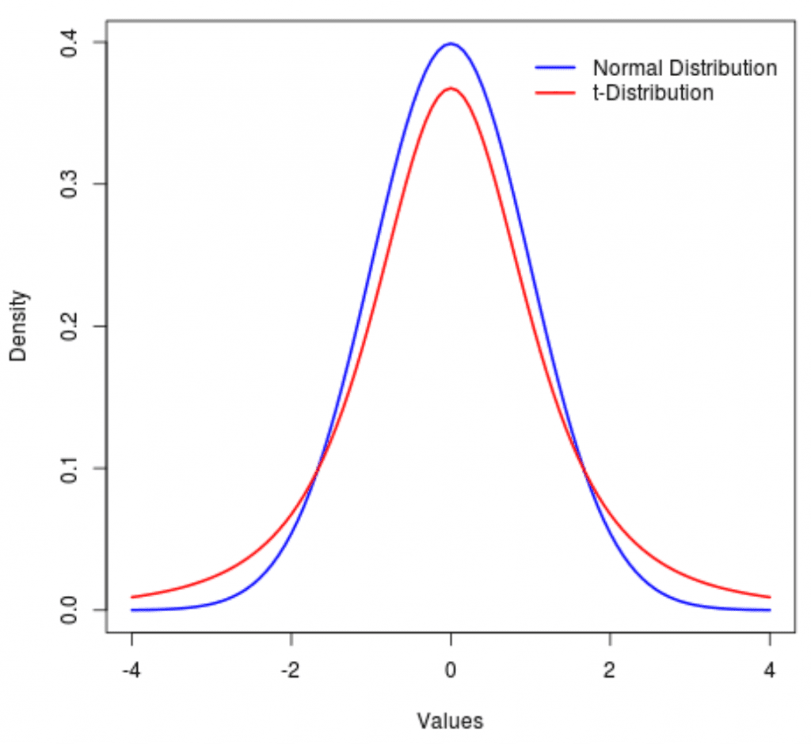

The integration of statistical principles in algorithmic trading has become increasingly important as traders strive for more precise and methodical approaches to decision-making. As financial markets have grown more complex, the need for sophisticated tools to manage and interpret data has intensified. Probability distributions play a pivotal role in this domain, providing the mathematical underpinnings necessary for evaluating potential outcomes and managing risk. Among these distributions, the t-distribution is of particular significance, especially when dealing with smaller data sets that feature unknown variances.

The t-distribution, known for its heavier tails, offers a better representation of extreme outcomes compared to the normal distribution. This characteristic is essential in financial markets, which are often marked by volatility and unpredictability. The application of the t-distribution extends to various facets of trading, assisting traders in thorough evaluations of their strategies, rigorous assessment of potential risks, and the pursuit of optimal portfolio configurations.



By employing the t-distribution, traders can create confidence intervals that provide a range of possible outcomes for a given strategy, thus enabling more informed decision-making. Similarly, hypothesis testing in trading strategies utilizes the t-distribution to determine the statistical significance of observed results, thereby guiding traders in refining their approaches. Ultimately, the relevance of the t-distribution in trading underscores its critical role in modern finance, where data-driven strategies are key to navigating the complexities of today's markets.

## Table of Contents

## Understanding T-Distribution

The t-distribution, or Student's t-distribution, is a fundamental concept in statistics, particularly suited for small sample sizes. It provides a more fitting probability distribution than the normal distribution when dealing with limited data. This feature is crucial in trading scenarios where sample data might be sparse or the variance unknown.

The t-distribution is particularly characterized by its heavier tails compared to the normal distribution. These heavier tails account for the higher likelihood of extreme deviations from the mean, which is essential in environments that are inherently volatile and uncertain, such as financial markets. The ability of the t-distribution to model these potential extremes makes it an invaluable tool for assessing risk and uncertainty in trading decisions.

The origins of the t-distribution date back to William Sealy Gosset, a statistician who worked for the Guinness Brewery in Dublin. Gosset published under the pseudonym 'Student,' which is why the distribution carries its name. His work underscored the statistical importance of the t-distribution in accounting for variability in small samples, a typical scenario in financial analyses where data sets may not always be extensive.

Mathematically, the t-distribution is defined by its degrees of freedom, which influences its shape. The probability density function of the t-distribution is given by:

$$
f(t) = \dfrac{\Gamma\left(\dfrac{\nu + 1}{2}\right)}{\sqrt{\nu \pi} \, \Gamma\left(\dfrac{\nu}{2}\right)} \left(1 + \dfrac{t^2}{\nu}\right)^{-\left(\dfrac{\nu + 1}{2}\right)}
$$

Here, $\nu$ represents the number of degrees of freedom and $\Gamma$ is the gamma function. The t-distribution approaches the normal distribution as the degrees of freedom increase, becoming indistinguishable when the sample size is large.

In practical applications, the t-distribution's capacity to accommodate the potential for extreme values means it is often used to construct confidence intervals and conduct hypothesis tests where standard deviations are uncertain or the sample size is small. In trading, such properties enable traders to make informed predictions and decisions based on the likely occurrence of rare, significant market moves. Understanding this distribution's nuances is crucial for its effective application in trading and other statistical analyses involving small sample sizes or unknown variances.

## T-Distribution vs. Normal Distribution

Both t-distribution and normal distribution are fundamental concepts in [statistics](/wiki/bayesian-statistics), each serving distinct roles depending on the nature of the data being analyzed. Both distributions exhibit a bell-shaped curve, indicative of the normal (Gaussian) family to which they both belong. However, there are critical differences that dictate their application in statistical analysis.

The t-distribution is characterized by its thicker tails, which signify a greater probability of extreme values occurring compared to the normal distribution. This property makes the t-distribution particularly suitable for small or biased data sets, where data variability is higher, and assumptions of normality are uncertain. The thicker tails effectively account for the additional uncertainty inherent in small samples. Mathematically, this is reflected in the formula for the t-distribution:

$$

T = \frac{\bar{X} - \mu}{\frac{S}{\sqrt{n}}} 
$$

Where $\bar{X}$ is the sample mean, $\mu$ the population mean, $S$ the sample standard deviation, and $n$ the sample size. The reliance on the sample standard deviation ($S$) rather than the population standard deviation introduces additional variability, leading to the thicker tails.

On the contrary, the normal distribution is preferred when dealing with large data sets and known variances. It assumes data symmetry around its mean, making it ideal for situations where the sample size is sufficiently large, and the Central Limit Theorem holds. This theorem suggests that, for a large sample size, the sampling distribution of the sample mean will tend towards a normal distribution, regardless of the original data distribution. The normal distribution is defined by its mean ($\mu$) and standard deviation ($\sigma$) in the formula:

$$

Z = \frac{X - \mu}{\sigma} 
$$

This formula allows for precise probability calculations when the sample size is large, and data variance is well-defined.

The choice between t-distribution and normal distribution is contingent upon the sample size and the availability of variance information. For small samples or when the population variance is unknown, the t-distribution is the appropriate choice given its ability to model uncertainty more accurately. Conversely, when working with large samples and known variances, the normal distribution often provides a more streamlined analysis.

Selecting the appropriate distribution is critical for achieving reliable and valid statistical inferences, particularly in fields like finance and trading, where accurate risk assessment and decision-making are crucial. Understanding the underlying assumptions and characteristics of each distribution aids in tailoring statistical analyses to the data at hand.

## Application in Trading

In trading, the t-distribution is instrumental for constructing confidence intervals and performing hypothesis testing, assisting traders in making informed decisions. Specifically, the t-distribution is used when dealing with small sample sizes, where the Central Limit Theorem might not apply, and the normal distribution does not offer an accurate estimate of population parameters. 

Confidence intervals are vital in estimating the range within which a financial parameter, such as a stock's mean return, is likely to fall. When a trader wants to estimate the expected return of a new trading strategy based on a small sample size of historical returns, the t-distribution provides a more reliable estimation compared to the normal distribution. The formula for a confidence interval using the t-distribution is:

$$
\bar{x} \pm t_{\alpha/2, n-1} \left(\frac{s}{\sqrt{n}}\right)
$$

where $\bar{x}$ is the sample mean, $t_{\alpha/2, n-1}$ is the t-value at a chosen confidence level with $n-1$ degrees of freedom, $s$ is the sample standard deviation, and $n$ is the sample size.

Furthermore, hypothesis testing is another critical application in trading. Traders often test hypotheses to validate their strategies or to determine if a particular market behavior is statistically significant. For instance, to determine if a small sample of observed returns significantly differs from the expected market return, traders can use a t-test, which can be implemented in Python as follows:

```python
import scipy.stats as stats

# Sample data
sample_returns = [0.015, 0.020, 0.009, 0.018, 0.014]
population_mean = 0.01

# Conduct a one-sample t-test
t_statistic, p_value = stats.ttest_1samp(sample_returns, population_mean)
```

In addition to conventional statistical tests, the t-distribution plays a key role in calculating the probability of extreme market events. The heavy tails of the t-distribution imply a greater likelihood of outcomes far from the mean, thus it is particularly suited for risk management purposes. By employing the t-distribution, traders can better estimate Value at Risk (VaR) or assess the potential for extreme losses or gains in their portfolios. This is crucial for developing a comprehensive strategy to mitigate risks associated with high market [volatility](/wiki/volatility-trading-strategies) and uncertain conditions. 

In summary, the t-distribution provides valuable tools and methods for statistically analyzing trading strategies, assessing risks, and making data-driven decisions, thereby enhancing the efficacy of trading endeavors.

## Advanced Applications of T-Distribution in Trading

The t-distribution serves as a cornerstone in various advanced trading techniques, integrating seamlessly into processes like risk modeling, [algorithmic trading](/wiki/algorithmic-trading), and portfolio optimization. Its utility in these areas goes beyond the fundamentals, enabling the development of sophisticated strategies that deal with uncertainty and variability inherent in financial markets.

One of the primary applications of the t-distribution in this context is within risk modeling. Financial markets are inherently volatile, with asset prices fluctuating based on a multitude of factors. The t-distribution, with its heavier tails, provides a framework for estimating the likelihood of extreme market movements. By capturing these tail risks more effectively than a normal distribution, traders can design better risk-adjusted strategies. In practice, risk managers might use t-distribution to estimate Value at Risk (VaR) or Conditional Value at Risk (CVaR) under scenarios where the sample size of historical data is limited or where frequent anomalous fluctuations occur.

In algorithmic trading, the t-distribution is integral for developing algorithms that require precise probability computations for decision-making. These algorithms often incorporate statistical measures to determine entry and [exit](/wiki/exit-strategy) points in trades, relying on backtested data. The calculus behind these algorithms can be illustrated with a statistical hypothesis test, where an algorithm evaluates a trading signal by considering if the real-time return data significantly deviates from a hypothesized mean, $\mu$. The test statistic $t$ can be calculated as:

$$

t = \frac{\bar{x} - \mu}{s/\sqrt{n}} 
$$

where $\bar{x}$ is the sample mean, $s$ is the sample standard deviation, and $n$ is the sample size. This calculation helps the trading algorithm decide whether the signal merits a trade action based on its return profile.

Moreover, financial analysts frequently harness the t-distribution in market research and modeling, particularly in situations requiring analysis of small sample sizes. Analyzing behavioral studies or specific market events with limited data necessitates the use of the t-distribution to draw meaningful conclusions. This is crucial when investigating niche markets or conducting segmented market analyses, where large datasets may not be available.

The use of the t-distribution in portfolio optimization is another sophisticated application. Here, the distribution assists in refining estimates of expected returns and variances of small-sample asset classes or emerging markets, altering portfolio weightings to optimize for risk-adjusted returns. Portfolio managers may employ models that use the t-distribution to adjust the allocation of assets dynamically, based on new information or data, often with a focus on minimizing the impact of potential extreme losses.

In summary, as trading strategies become more data-driven and sophisticated, the importance of statistical tools like the t-distribution continues to grow. Its ability to accommodate small data sets while addressing the probability of extreme outcomes makes it indispensable in modern financial market practices.

## Limitations and Considerations of T-Distribution

While robust, the t-distribution is most effective when dealing with small sample sizes. Its advantages diminish as the sample size increases, making the normal distribution a more suitable choice. The normal distribution possesses properties of simplicity and broader applicability when the sample size is large. The central limit theorem assures us that as the number of observations grows, the sampling distribution of the mean approaches normality, regardless of the underlying distribution. This property aligns with the t-distribution converging to the normal distribution as degrees of freedom increase.

A critical assumption of the t-distribution is the normality of the underlying dataset. However, financial data often deviate from normality due to skewness, kurtosis, or the presence of outliers, which can affect the analysis outcomes. If the data distribution is significantly skewed, relying on the t-distribution may yield biased results. In these cases, transformations or alternative robust statistical techniques may be required to achieve more reliable inferences.

Moreover, the misestimation of degrees of freedom can lead to inaccuracies in trading analyses. The degrees of freedom in the t-distribution define the shape of the tail and are calculated as $n - 1$ for a sample size $n$. Incorrectly estimating this parameter can result in either too conservative or too aggressive probability estimates, impacting decision-making processes. Therefore, caution is necessary in applying the t-distribution, ensuring that degrees of freedom are accurately accounted for.

The presence of outliers also poses a challenge, as they can disproportionately influence the results of a t-distribution-based analysis. Traders and analysts need to carefully assess data sets and consider the potential impacts of outliers on their analyses. Employing robust statistical techniques or outlier detection methods can help mitigate these issues, ensuring that conclusions drawn are reflective of true market conditions. 

Code Example: Adjusting for degrees of freedom and checking normality

```python
import numpy as np
import pandas as pd
import scipy.stats as stats

# Sample data for trading returns
data = np.random.randn(15)  # Replace with actual trading return data

# Check normality using Shapiro-Wilk Test
shapiro_result = stats.shapiro(data)
print(f"Shapiro-Wilk Test: W={shapiro_result[0]}, p-value={shapiro_result[1]}")

# Calculate degrees of freedom
n = len(data)
degrees_of_freedom = n - 1
print(f"Degrees of Freedom: {degrees_of_freedom}")

# Use t-distribution if sample size is small and data is approximately normal
if n < 30 and shapiro_result[1] > 0.05:
    t_statistic, p_value = stats.ttest_1samp(data, 0)  # Test against a hypothetical mean
    print(f"T-statistic: {t_statistic}, P-value: {p_value}")
else:
    print("Consider using normal distribution or transforming data.")
```

In essence, while the t-distribution holds a crucial place in statistical evaluation for trading, it requires careful consideration of its assumptions and parameter estimations. Awareness of its limitations ensures that traders can better leverage this tool in crafting accurate and effective trading strategies.

## Conclusion

The t-distribution is an indispensable statistical tool in the context of trading, particularly when dealing with small sample sizes or situations where the standard deviation is not precisely known. Its key contribution lies in providing a framework for constructing more reliable confidence intervals and conducting hypothesis testing under uncertain conditions. This makes it highly relevant for traders who aim to evaluate new strategies and manage risks effectively.

The utility of the t-distribution extends from basic strategy testing to advanced risk assessments. For instance, when a trader analyzes the performance of a new trading strategy using a limited data set, the t-distribution offers a more accurate reflection of expected returns and volatility, compared to the normal distribution. It thus aids in the identification of strategies with potential for high returns while recognizing associated risks.

Moreover, in sophisticated financial analysis, the t-distribution's role in risk management is pronounced. It enables financial analysts to estimate the probability of extreme market events or outliers, which is crucial for crafting resilient portfolios. By incorporating the t-distribution into risk models, analysts can better anticipate how portfolios might behave during periods of market stress.

However, a deep understanding of the t-distribution's nuances and limitations is essential for its effective use in trading strategies. While it serves as a robust tool for small samples, its significance diminishes as sample sizes grow, at which point the normal distribution becomes more appropriate. Furthermore, the accuracy of t-distribution analyses depends on the assumption that the underlying data is approximately normally distributed, an assumption that can sometimes be problematic in the dynamic environment of financial markets. 

In conclusion, the strategic application of the t-distribution allows traders and analysts to refine their decision-making processes. Yet, it is the comprehension of both its strengths and limits that empowers users to leverage its full potential, thereby enriching the accuracy and reliability of trading insights.

## References & Further Reading

[1]: Gosset, W. S. (Student). (1908). "The Probable Error of a Mean." *Biometrika*, 6(1), 1-25. 

[2]: Kennedy, P. (1998). *A Guide to Econometrics.* MIT Press.

[3]: Hull, J. C. (2018). *Options, Futures, and Other Derivatives.* Pearson.

[4]: Lopez de Prado, M. (2018). ["Advances in Financial Machine Learning."](https://www.amazon.com/Advances-Financial-Machine-Learning-Marcos/dp/1119482089) John Wiley & Sons.

[5]: Aronson, D. R. (2007). ["Evidence-Based Technical Analysis: Applying the Scientific Method and Statistical Inference to Trading Signals."](https://onlinelibrary.wiley.com/doi/book/10.1002/9781118268315) Wiley Trading.

[6]: Chan, E. P. (2008). ["Quantitative Trading: How to Build Your Own Algorithmic Trading Business."](https://github.com/ftvision/quant_trading_echan_book) Wiley Trading.