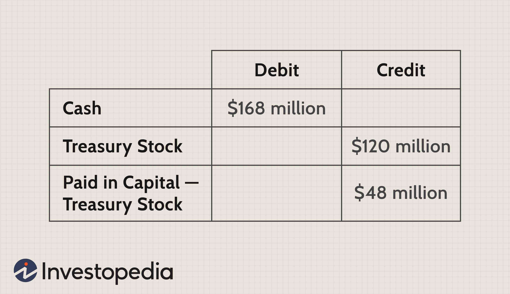

The world of finance is continuously evolving, driven significantly by advancements in technology that reshape traditional investment strategies. Two concepts, T Shares and algorithmic trading, stand out as key drivers in this transformation, influencing both investors and financial markets. This article provides an in-depth exploration of these two facets, aiming to equip investors with the insights needed for more informed decision-making in a dynamic financial environment.

T Shares represent a newer class of mutual fund shares that are pivotal in redefining cost structures and enhancing transparency in fund management. Created to resolve traditional conflicts of interest between financial advisors and clients, T Shares offer a streamlined and transparent pricing model, thereby lowering the maximum sales loads and facilitating more cost-efficient access to fund management for investors.



Algorithmic trading, on the other hand, has revolutionized how trades are executed in financial markets. By using computer programs that follow pre-set criteria, algorithmic trading boasts speed and efficiency far superior to human capabilities. This style of trading relies on structured processes that minimize emotional decision-making, enhancing the precision and timing of trades based on intricate data analyses.

Understanding T Shares and algorithmic trading is essential for investors keen on capitalizing on these innovations. Recognizing their benefits, such as reduced costs and increased efficiency, as well as their potential risks, like technological dependencies and increased market volatility, is crucial for navigating modern finance. Through this exploration, investors can strategically position their portfolios to better align with long-term financial goals.

## Table of Contents

## What are T Shares?

T Shares represent a class of mutual fund shares specifically designed to provide investors with a cost-effective solution for accessing fund management services. Traditional classes of mutual fund shares often come with varying sales loads and fees, which can complicate the investor's decision-making process and might lead to conflicts of interest in financial advising. To address these concerns, T Shares were introduced with the primary goals of enhancing transparency and minimizing such conflicts.

One of the distinguishing features of T Shares is their lower maximum sales loads compared to other classes. Sales loads refer to the fees paid by investors when buying or redeeming shares, which can significantly affect the overall cost of investment. By imposing lower sales loads, T Shares offer investors a more straightforward and affordable way to enter mutual funds.

Moreover, the uniform pricing model characteristic of T Shares further simplifies cost structures. This uniformity makes these shares an appealing option for investors seeking predictable and transparent pricing in fund management. Consequently, T Shares reduce the variability in costs often associated with other share classes, resulting in a more stable investment environment for investors.

The affordability and transparency that T Shares provide can potentially lead to enhanced returns over time. The reduction in costs allows a greater portion of the investor's capital to remain invested, which, over time, can result in compounded growth. Given these benefits, T Shares can be a strategic choice for investors prioritizing cost efficiency in their long-term investment plans.

Overall, the introduction of T Shares is a significant step towards democratizing access to mutual fund investments, offering a model that aligns the interests of investors with the goal of minimizing investment costs while maintaining high levels of transparency.

## Understanding Algorithmic Trading

Algorithmic trading, often referred to as algo-trading, employs sophisticated computer programs to autonomously execute trading orders based on a pre-defined set of conditions or algorithms. This approach harnesses the speed and computational power of modern technology, enabling trades at a pace unmatched by human traders. These algorithms utilize predefined criteria such as timing, price, and [volume](/wiki/volume-trading-strategy) to decide when to buy or sell assets. This process is designed to ensure high levels of precision and efficiency, allowing traders to capitalize on even the smallest market movements quickly.

The primary advantage of [algorithmic trading](/wiki/algorithmic-trading) is its ability to function without the influence of human emotions, which can often lead to irrational trading decisions. By relying on systematic procedures, algorithmic trading reduces the likelihood of errors that can occur due to emotional biases or psychological factors.

Trades executed through algorithms are based on a comprehensive analysis of market data, often incorporating complex mathematical models and statistical methods to assess and predict market trends. The process involves continuous monitoring of the market, with algorithms capable of executing multiple trades simultaneously. This capability allows traders to exploit potentially lucrative market opportunities that would be impractical through manual trading.

For instance, a basic algorithmic trading strategy might involve setting a buy order for a stock when its 50-day moving average surpasses its 200-day moving average, signaling an upward trend. Conversely, the algorithm might sell the stock if the 50-day moving average drops below the 200-day moving average, indicating a potential downtrend. Pseudocode for such a strategy could be written as follows:

```python
def moving_average(prices, n):
    return sum(prices[-n:]) / n

def simple_moving_average_strategy(prices):
    short_term = moving_average(prices, 50)
    long_term = moving_average(prices, 200)

    if short_term > long_term:
        return "Buy"
    elif short_term < long_term:
        return "Sell"
    else:
        return "Hold"
```

This logic can be extended and refined with additional rules and conditions to cater to more complex trading strategies. By leveraging speed, accuracy, and the ability to process vast amounts of data, algorithmic trading represents a transformative approach in the financial markets, providing both institutional and individual traders with powerful tools to potentially enhance investment outcomes.

## Strategies in Algorithmic Trading

Algorithmic trading employs computerized systems to execute trading strategies efficiently and effectively. Key strategies within this domain include trend-following, [arbitrage](/wiki/arbitrage), and mean reversion. Each strategy is built upon distinct market principles and leverages specific analytical tools to identify trading opportunities.

Trend-following is a strategy that seeks to capitalize on persistent market [momentum](/wiki/momentum). This method relies on the identification of trends using technical indicators like moving averages. For instance, a simple moving average crossover strategy might generate buy signals when a short-term moving average surpasses a long-term moving average, indicating an upward trend. Conversely, a sell signal might be triggered when the short-term average dips below the long-term average.

```python
import pandas as pd

# Example of a simple moving average crossover strategy
def moving_average_crossover(data, short_window, long_window):
    data['short_mavg'] = data['Close'].rolling(window=short_window, min_periods=1, center=False).mean()
    data['long_mavg'] = data['Close'].rolling(window=long_window, min_periods=1, center=False).mean()
    data['signal'] = 0.0
    data['signal'][short_window:] = np.where(data['short_mavg'][short_window:] > data['long_mavg'][short_window:], 1.0, 0.0)   
    data['positions'] = data['signal'].diff()
    return data

# Sample usage
#df = pd.read_csv('historical_stock_data.csv') # Load your data
#signals = moving_average_crossover(df, 40, 100) # Apply strategy with specified window lengths
```

Arbitrage opportunities arise from price discrepancies across different markets or instruments. Traders utilize algorithms to simultaneously buy and sell these assets, capturing the difference as profit. This strategy is highly dependent on speed and accuracy to capitalize on fleeting anomalies where the price spread must outweigh transaction costs to be profitable. Classic arbitrage examples include cross-exchange or inter-commodity arbitrage, where efficiency and low latency can significantly impact profitability.

Mean reversion is based on the hypothesis that assets' prices will eventually move back to their mean or average level. Traders employing this strategy aim to identify and take advantage of pricing deviations that suggest a return to the mean is imminent. The Bollinger Bands, statistical measures that plot standard deviations above and below a moving average, often aid in spotting possible reversal points.

Each strategy offers distinct advantages and requires an understanding of specific market conditions and risks. As trends evolve and market dynamics change, traders must adapt their algorithms to maintain efficacy and profitability. Understanding these strategies enables traders to effectively harness the power of algorithmic trading in various financial markets.

## Advantages and Disadvantages of Algorithmic Trading

Algorithmic trading provides numerous advantages that have significantly impacted modern financial markets. A primary benefit is the remarkable speed and precision with which trades are executed. This speed ensures that traders can capture opportunities at optimal prices, crucial in high-frequency trading environments where even milliseconds matter. Moreover, algorithmic trading reduces transaction costs by automating processes that would otherwise require manual intervention. Human errors, such as misjudgments or input mistakes, are also mitigated through automated systems that follow predefined rules.

Despite these advantages, algorithmic trading does pose several disadvantages. The heavy reliance on technology means there is a dependency on systems that can potentially malfunction. Hardware or software failures can lead to significant financial losses and operational disruptions. Furthermore, automated trades can contribute to increased market [volatility](/wiki/volatility-trading-strategies). Algorithms executing large volumes of trades simultaneously might trigger rapid price swings if not carefully managed.

Regulatory challenges in algorithmic trading are another critical aspect. Detailed oversight and strict compliance are necessary to ensure fair market practices and protect against potential misconduct, such as market manipulation or flash crashes. This necessitates continuous monitoring and adaptation to evolving regulatory frameworks, posing a challenge for firms engaged in this mode of trading. 

In summary, while algorithmic trading embodies advancements in trading technology offering enhanced efficiency and reduced costs, it also requires caution to manage the technological dependencies and regulatory intricacies effectively.

## The Role of Technology in Modern Investing

Technology significantly enhances investment strategies by improving both capabilities and reach. In the context of T Shares, digital management platforms offer seamless administrative processes, ensuring cost-effective solutions for investors. These platforms enable efficient fund management, which is crucial for maximizing returns in a competitive financial environment. The ability to manage investments digitally reduces the need for physical documentation and offers a transparent overview of portfolio performance, leading to better-informed decisions.

Real-time analytics is a cornerstone in the functionality of algorithmic trading. By leveraging technology, algorithmic trading systems can analyze vast datasets almost instantaneously, allowing traders to execute decisions with speed and precision that are unattainable manually. This capability is built on the foundation of processing large volumes of market data to identify optimal trading opportunities effectively.

In algorithmic trading, algorithms are designed to monitor market activity, process data inputs (such as price, volume, and timing), and execute trades based on programmed strategies. For instance, the use of Python has become widespread due to its efficiency in handling complex quantitative models and ease of integration with financial data APIs. Here is a simple example of how Python can be used in basic algorithmic trading:

```python
import pandas as pd
import numpy as np

# Assume df is a pandas DataFrame with 'Close' prices
df['SMA'] = df['Close'].rolling(window=50).mean() # Simple Moving Average

# Generate trading signal
df['Signal'] = 0
df['Signal'][50:] = np.where(df['Close'][50:] > df['SMA'][50:], 1, -1)

# Calculate returns
df['Returns'] = df['Signal'].shift(1) * (df['Close'].pct_change())

# Cumulative returns
cumulative_returns = (1 + df['Returns']).cumprod()
```

In this example, a simple moving average crossover algorithm is used to generate buy and sell signals. The technology underpinning such strategies allows investors to automate and backtest their trading rules, providing greater confidence in their investment approaches.

For investors to fully exploit the benefits of technological advancements, it is crucial to remain informed about these integrations. This entails understanding the latest tools and being aware of emerging trends in financial technology. By doing so, investors position themselves to take advantage of the efficiencies and opportunities created by technological progress in the financial markets.

## Conclusion

Understanding T Shares and algorithmic trading equips investors with essential knowledge in the rapidly evolving financial landscape. T Shares, with their transparent pricing model and lower fee structures, make mutual fund investments more accessible and potentially more profitable over time. Algorithmic trading, by leveraging advanced computer algorithms, allows for rapid trade execution and the use of sophisticated trading strategies such as trend-following and arbitrage. Nevertheless, both T Shares and algorithmic trading present challenges that require careful consideration.

For T Shares, while they offer reduced costs and improved transparency, investors must remain aware of the specific terms and conditions of the mutual funds they choose to ensure these benefits are truly realized. Similarly, algorithmic trading's speed and precision come with risks, including potential technological failures and exacerbated market volatility. Moreover, the regulatory environment surrounding algorithmic trading continues to evolve, demanding vigilance from investors to stay compliant.

Thus, being well-informed and remaining vigilant about these instruments and strategies enables investors to harness their advantages while mitigating risks. Such a balanced approach helps optimize investment portfolios and align them with individual long-term financial goals, ensuring they remain robust amidst the dynamic shifts in modern global markets.

## References & Further Reading

[1]: ["T Shares: Transparency and Cost Effectiveness"](https://fastercapital.com/content/Cost-Transparency--Cost-Transparency-Benefits-and-How-to-Achieve-It.html) - FINRA Investor Insights

[2]: Hendershott, T., Jones, C. M., & Menkveld, A. J. (2011). ["Does Algorithmic Trading Improve Liquidity?"](https://onlinelibrary.wiley.com/doi/full/10.1111/j.1540-6261.2010.01624.x) The Review of Financial Studies, 24(8), 2495-2526.

[3]: Aldridge, I. (2013). ["High-Frequency Trading: A Practical Guide to Algorithmic Strategies and Trading Systems"](https://www.amazon.com/High-Frequency-Trading-Practical-Algorithmic-Strategies/dp/1118343506). Wiley Finance.

[4]: Lo, A. W. (2012). ["Adaptive Markets: Financial Evolution at the Speed of Thought"](https://books.google.com/books/about/Adaptive_Markets.html?id=Q4d7DwAAQBAJ)

[5]: Chincarini, L. B., & Kim, D. (2006). ["Quantitative Equity Portfolio Management: An Active Approach to Portfolio Construction and Management"](https://archive.org/details/quantitativeequi0000chin_c9d6). McGraw-Hill Education.