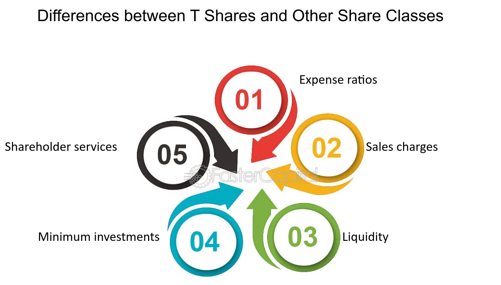

## Table of Contents

## What are T Shares?

T Shares are a type of mutual fund share class that is designed to be low-cost and transparent. They are often used by financial advisors who charge their clients a separate fee for their services, rather than earning a commission from the mutual fund company. This means that T Shares typically have lower expense ratios compared to other share classes, which can save investors money over time.

These shares are also known for their simplicity and ease of understanding. T Shares usually do not have any front-end or back-end sales charges, which makes them more attractive to investors who want to keep their costs down. By focusing on the fund's performance and the advisor's fee, investors can more easily see where their money is going and make better-informed decisions about their investments.

## How do T Shares differ from other types of shares?

T Shares are different from other types of shares because they are designed to be low-cost and easy to understand. Unlike other share classes, T Shares do not have front-end or back-end sales charges. This means you don't pay extra fees when you buy or sell these shares. Instead, T Shares have a simple, low expense ratio, which is the yearly fee you pay to own the fund. This makes them a good choice for people who want to keep their investment costs low.

Another way T Shares differ is that they are often used by financial advisors who charge a separate fee for their services. This is different from other share classes where the advisor might earn a commission from the mutual fund company. With T Shares, the advisor's fee is separate, so you can see exactly what you're paying for advice and what you're paying for the fund itself. This transparency helps you make better decisions about your investments.

Overall, T Shares are a good option if you want a straightforward, cost-effective way to invest in mutual funds. They help you avoid hidden fees and make it easier to understand where your money is going.

## What is the primary function of T Shares?

The main job of T Shares is to give people a simple and cheap way to invest in mutual funds. They don't have extra fees when you buy or sell them, which means you save money. Instead, T Shares have a small yearly fee called an expense ratio. This makes it easier for you to know exactly how much you're paying to own the fund.

T Shares are also used by financial advisors who charge their own fee for giving advice. This is different from other types of shares where the advisor might get paid by the mutual fund company. With T Shares, the advisor's fee is separate, so you can see clearly what you're paying for advice and what you're paying for the fund. This helps you make better choices about your investments because everything is out in the open.

## Who can invest in T Shares?

Anyone can invest in T Shares if they want a simple and low-cost way to put their money into mutual funds. You don't need to be a financial expert to buy T Shares. They are designed for everyday people who want to keep their investment costs down and understand where their money is going.

T Shares are often used by people who work with financial advisors. These advisors charge their own fee for giving advice, which is separate from the small yearly fee you pay to own the T Shares. This makes it easy to see what you're paying for advice and what you're paying for the fund itself. So, if you're looking for a clear and cost-effective way to invest, T Shares could be a good choice for you.

## How are T Shares typically priced?

T Shares are usually priced based on their net asset value (NAV), which is the total value of all the investments in the fund minus any liabilities, divided by the number of shares. This means the price of a T Share changes every day, depending on how the investments in the fund are doing. You won't see any extra fees added to the price when you buy or sell T Shares, which makes them a straightforward choice for investors.

The only regular cost you'll see with T Shares is the expense ratio. This is a small yearly fee that covers the costs of running the fund. Because T Shares don't have front-end or back-end sales charges, the expense ratio is usually lower than other types of shares. This helps keep your investment costs down and makes it easier to understand exactly what you're paying for.

## What are the benefits of investing in T Shares?

Investing in T Shares can save you money because they have low costs. Unlike other types of shares, T Shares don't have extra fees when you buy or sell them. The only fee you pay is a small yearly expense ratio, which is usually lower than other shares. This means more of your money stays invested and can grow over time.

T Shares are also easy to understand. They are simple and transparent, so you can see exactly where your money is going. This is helpful if you work with a financial advisor who charges their own fee for advice. With T Shares, the advisor's fee is separate from the fund's fee, so you know what you're paying for advice and what you're paying to own the fund. This clarity helps you make better choices about your investments.

## What are the risks associated with T Shares?

Investing in T Shares, like any investment, comes with risks. One risk is that the value of the mutual fund can go up and down. This means you could lose money if the investments in the fund don't do well. Since T Shares are tied to the performance of the fund, if the fund's value drops, the value of your T Shares will drop too.

Another risk is that even though T Shares have low costs, you still have to pay the yearly expense ratio. This fee can eat into your returns over time, especially if the fund doesn't perform well. It's important to think about these costs when deciding if T Shares are right for you.

## How do T Shares fit into a diversified investment portfolio?

T Shares can be a good part of a diversified investment portfolio because they help you spread your money across different types of investments. When you diversify, you're not putting all your eggs in one basket. By including T Shares in your portfolio, you're adding another layer of low-cost, easy-to-understand investments. This can help balance out riskier parts of your portfolio, like stocks or other funds that might have higher fees.

Since T Shares are often used with financial advisors who charge their own fee, they can fit well if you're working with an advisor. The advisor can help you figure out how much to invest in T Shares compared to other investments. This way, you can keep your overall costs down while still getting professional advice. T Shares can be a smart choice if you want to keep things simple and save money on fees, all while making sure your investments are spread out in a way that feels right for you.

## What are the tax implications of investing in T Shares?

When you invest in T Shares, you need to think about taxes. If the mutual fund makes money from interest, dividends, or selling investments, you might have to pay taxes on those earnings. The tax you pay depends on how long you hold the T Shares and the type of income the fund earns. For example, if the fund pays out dividends, you might pay taxes on those dividends at a special rate, which can be lower than your regular income tax rate.

Another thing to know is that if you sell your T Shares for more than you paid for them, you might owe capital gains tax. If you hold the shares for more than a year, you'll pay a long-term capital gains tax, which is usually lower than the short-term rate you'd pay if you sold them within a year. It's a good idea to talk to a tax advisor to understand how T Shares fit into your overall tax situation and to plan the best way to manage your investments and taxes.

## How has the performance of T Shares been historically?

T Shares are a newer type of mutual fund share class, so they don't have a long history of performance data like some other types of shares. However, since T Shares are designed to be low-cost and easy to understand, they can help investors keep more of their money working for them. This means that over time, the lower fees of T Shares can lead to better overall returns compared to funds with higher fees, even if the underlying investments perform the same.

The performance of T Shares depends a lot on the specific mutual fund they are part of. If the fund does well, T Shares will do well too. But if the fund doesn't perform well, the value of T Shares will go down. Because T Shares don't have extra fees when you buy or sell them, the main thing that affects their performance is the yearly expense ratio and how the fund's investments do. So, while T Shares can be a good choice for saving on costs, their performance is still tied to the ups and downs of the market and the specific investments in the fund.

## What are the regulatory requirements for T Shares?

T Shares, like all mutual fund share classes, have to follow rules set by the Securities and Exchange Commission (SEC). These rules make sure that investors get clear and honest information about the fund. T Shares must have a prospectus that explains everything about the fund, like its goals, risks, and fees. This helps investors understand what they're buying.

There are also rules about how T Shares can be sold. Since T Shares don't have front-end or back-end sales charges, the focus is on the yearly expense ratio. The SEC makes sure that this fee is clearly shown to investors. This helps keep things fair and open, so investors know exactly what they're paying for.

## How do T Shares compare to similar investment vehicles in terms of liquidity and yield?

T Shares are like other mutual fund share classes in that they can be bought and sold easily. This means they are pretty liquid, just like other mutual funds. You can usually buy or sell T Shares at the end of each trading day based on the fund's net asset value (NAV). This makes them a good choice if you want to be able to get your money out quickly. Compared to other investments like stocks, which you can trade during the day, T Shares are less liquid, but they are still easy to manage.

When it comes to yield, T Shares are tied to the performance of the mutual fund they are part of. This means their yield can be similar to other share classes of the same fund. But because T Shares have lower fees, more of the fund's earnings can go back to you, the investor. This can lead to a higher yield over time compared to other share classes with higher fees. However, the actual yield depends a lot on how well the fund's investments do, so it can go up and down just like any other investment.

## References & Further Reading

[1]: ["T Shares: Transparency and Cost Effectiveness"](https://fastercapital.com/content/Cost-Transparency--Cost-Transparency-Benefits-and-How-to-Achieve-It.html) - FINRA Investor Insights

[2]: Hendershott, T., Jones, C. M., & Menkveld, A. J. (2011). ["Does Algorithmic Trading Improve Liquidity?"](https://onlinelibrary.wiley.com/doi/full/10.1111/j.1540-6261.2010.01624.x) The Review of Financial Studies, 24(8), 2495-2526.

[3]: Aldridge, I. (2013). ["High-Frequency Trading: A Practical Guide to Algorithmic Strategies and Trading Systems"](https://www.amazon.com/High-Frequency-Trading-Practical-Algorithmic-Strategies/dp/1118343506). Wiley Finance.

[4]: Lo, A. W. (2012). ["Adaptive Markets: Financial Evolution at the Speed of Thought"](https://books.google.com/books/about/Adaptive_Markets.html?id=Q4d7DwAAQBAJ)

[5]: Chincarini, L. B., & Kim, D. (2006). ["Quantitative Equity Portfolio Management: An Active Approach to Portfolio Construction and Management"](https://archive.org/details/quantitativeequi0000chin_c9d6). McGraw-Hill Education.