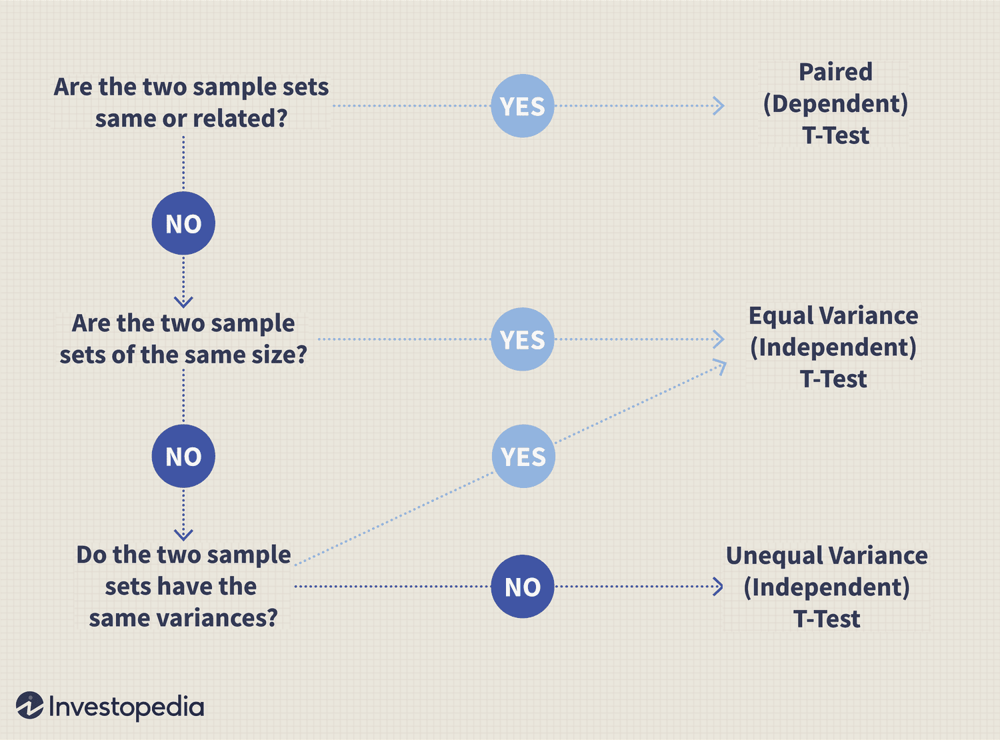

Algorithmic trading has revolutionized the financial markets by allowing trades to be executed with extraordinary speed and precision. In this highly competitive landscape, understanding the statistical underpinnings of trading algorithms can offer traders a substantial advantage. Among the pivotal tools used in statistical analysis for trading is hypothesis testing, with the t-test being a key component. This article examines the significance of hypothesis testing and the t-test in algorithmic trading, shedding light on how these statistical methods can guide traders in making evidence-based decisions.

Hypothesis testing is a structured statistical procedure utilized to evaluate the plausibility of a hypothesis based on sample data. It involves the establishment of a null hypothesis, which represents the default or accepted condition, and an alternative hypothesis, which embodies the condition being tested against the null. The objective of hypothesis testing in the context of trading is to determine if there is sufficient statistical evidence to reject the null hypothesis, thereby validating or disproving a trading strategy before it is implemented in live environments.



The t-test, a specific type of hypothesis test, is employed to assess whether there is a meaningful difference between the means of two datasets. This is particularly relevant in algorithmic trading when comparing the performance of a trading strategy against a financial benchmark or evaluating the effectiveness of multiple trading strategies. By employing the t-test, traders can gain insights into market dynamics and fine-tune their strategies for better performance.

In the fast-evolving domain of finance, where data-driven approaches dominate, mastering statistical tools like hypothesis testing and the t-test is crucial for enhancing algorithmic trading models. By leveraging these techniques, traders can systematically analyze data, refine their strategies, and ultimately aim for more successful trading outcomes.

## Table of Contents

## What is Hypothesis Testing in Statistical Analysis?

Hypothesis testing is a foundational statistical method designed to assess the validity of a hypothesis through the use of sample data. At its core, hypothesis testing involves the formulation of two competing hypotheses: the null hypothesis ($H_0$) and the alternative hypothesis ($H_a$). The null hypothesis typically posits that there is no effect or no difference, whereas the alternative hypothesis suggests the presence of an effect or a difference.

The primary objective of hypothesis testing is to evaluate whether there is sufficient statistical evidence in the sample data to reject the null hypothesis in favor of the alternative. The process typically involves the following steps:

1. **Formulate the Hypotheses**: Define both the null ($H_0$) and alternative ($H_a$) hypotheses based on the research question or trading strategy being evaluated. For instance, in trading, $H_0$ might state that a certain trading strategy does not yield returns better than random chance, while $H_a$ suggests that it does.

2. **Select the Significance Level ($\alpha$)**: Choose a significance level, usually set at 0.05, which represents a 5% risk of rejecting the null hypothesis when it is actually true. This threshold is critical in determining the strength of the evidence needed to reject $H_0$.

3. **Compute the Test Statistic**: Calculate a test statistic based on the sample data. This statistic, which varies depending on the test being conducted, is used to determine the likelihood of observing the sample data if the null hypothesis is true.

4. **Determine the P-Value or Critical Value**: The p-value indicates the probability of obtaining a test statistic at least as extreme as the one observed, assuming the null hypothesis is true. If the p-value is less than the chosen significance level, the null hypothesis is rejected. Alternatively, a critical value can be used as a cutoff; if the test statistic exceeds this value, $H_0$ is rejected.

5. **Make a Decision**: Based on the p-value or critical value, decide whether to reject or fail to reject the null hypothesis. This decision is crucial in determining the validity of the hypothesis being tested.

In finance, hypothesis testing plays a pivotal role in strategy validation before implementation. It allows traders to assess whether a proposed trading strategy offers a genuine advantage, rather than resulting from random market fluctuations. By statistically confirming or denying the efficacy of strategies, traders can mitigate the risks associated with erroneous or unprofitable approaches.

The application of hypothesis testing in statistical analysis extends beyond finance, serving as an essential tool across various scientific disciplines. It provides a structured method for making informed decisions based on empirical data, bolstering the credibility and reliability of conclusions drawn from research and analysis.

## Understanding the T-Test

The t-test is a fundamental statistical tool used to ascertain whether there is a significant difference between the means of two groups. It is particularly useful in [algorithmic trading](/wiki/algorithmic-trading) for examining the performance of trading algorithms against benchmarks or other strategies. The primary forms of t-tests are independent and paired sample t-tests, each serving a different purpose in statistical analysis.

### Types of T-Tests

1. **Independent Sample T-Test**: This test is used when comparing the means of two independent groups. In the context of trading, it might be applied to compare the returns of two different trading strategies or algorithms over the same time period. The formula for the independent t-test is:
$$
   t = \frac{\bar{X}_1 - \bar{X}_2}{\sqrt{\frac{s_1^2}{n_1} + \frac{s_2^2}{n_2}}}

$$

   where $\bar{X}_1$ and $\bar{X}_2$ are the sample means, $s_1^2$ and $s_2^2$ are the variances, and $n_1$ and $n_2$ are the sample sizes of the two groups.

2. **Paired Sample T-Test**: This test is suited for comparing the means of two related groups. In trading, this may involve comparing the performance of a single algorithm before and after a particular market event or adjustment to the algorithm itself. The paired sample t-test formula is:
$$
   t = \frac{\bar{D}}{\frac{s_D}{\sqrt{n}}}

$$

   where $\bar{D}$ is the mean of the differences between paired observations, $s_D$ is the standard deviation of the differences, and $n$ is the number of paired observations.

### Applying the T-Test in Financial Analysis

In financial analysis, it is crucial to apply the appropriate t-test based on the nature of the data and the research question. For example, to test if there is a statistically significant performance difference between two trading algorithms, one might use an independent samples t-test. Here’s a basic example in Python:

```python
import numpy as np
from scipy import stats

# Sample data
algorithm_1_returns = np.array([0.05, 0.10, 0.15, 0.10, 0.12])
algorithm_2_returns = np.array([0.07, 0.09, 0.14, 0.14, 0.11])

# Perform independent t-test
t_stat, p_value = stats.ttest_ind(algorithm_1_returns, algorithm_2_returns)

print(f"T-statistic: {t_stat}, P-value: {p_value}")
```

This code helps determine if there's a statistically significant difference in the means of the two trading algorithms' returns. If the p-value is less than a chosen significance level (commonly 0.05), one can conclude that the difference is statistically significant.

The t-test is a valuable part of financial analysis, helping traders understand market variations and assess strategy effectiveness. It is important, however, to ensure assumptions such as normality and equal variances are met to validate the test results. Proper application of t-tests can enhance the robustness of trading decisions in algorithmic trading.

## Applying Hypothesis Testing and T-Test in Algorithmic Trading

Algorithmic trading relies heavily on data-driven strategies, making statistical testing a fundamental component of model validation and refinement. Hypothesis testing, particularly using the t-test, plays a pivotal role in ensuring trading strategies are both robust and effective before they are deployed in live markets. 

Traders can apply hypothesis testing to evaluate the viability of a trading model. The process typically begins with the establishment of a null hypothesis (H₀), which might assert that a new trade signal does not lead to different returns compared to an existing benchmark strategy. Conversely, the alternative hypothesis (H₁) posits that there is a significant difference in returns when the new signal is implemented.

Once the hypotheses are set, traders can apply the t-test to examine if observed differences in performance metrics, such as the mean returns of two strategies, are statistically significant. The t-test can be particularly useful in comparing the returns of a new algorithm against a predefined benchmark. For instance, the independent samples t-test could be used when comparing the returns of two distinct trading periods or different trading algorithms.

### Step-by-Step Process

#### 1. Data Collection and Preparation
Begin by collecting the historical return data for both the new trading strategy and the benchmark or existing strategy. Ensure that data quality is maintained, as poor data can lead to unreliable results.

```python
import numpy as np
import pandas as pd

# Simulated return data
strategy_returns = np.random.normal(loc=0.01, scale=0.02, size=100)
benchmark_returns = np.random.normal(loc=0.008, scale=0.02, size=100)

# Converting to a DataFrame
returns_data = pd.DataFrame({
    'Strategy': strategy_returns,
    'Benchmark': benchmark_returns
})
```

#### 2. Formulate Hypotheses
- **Null Hypothesis (H₀):** Mean return of the strategy = Mean return of the benchmark
- **Alternative Hypothesis (H₁):** Mean return of the strategy ≠ Mean return of the benchmark

#### 3. Perform the T-Test
Using statistical software or coding libraries like SciPy in Python, conduct the t-test to compare the means of the two sets of returns.

```python
from scipy import stats

t_statistic, p_value = stats.ttest_ind(returns_data['Strategy'], returns_data['Benchmark'])

print(f"T-Statistic: {t_statistic}, P-Value: {p_value}")
```

#### 4. Analyze Results
The results from the t-test yield a t-statistic and a p-value. If the p-value is below a certain threshold (commonly 0.05), it suggests that the differences in performance are statistically significant, leading to a rejection of the null hypothesis.

#### 5. Validate Changes in Strategy
If the hypothesis test shows significant results, it demonstrates that the new trading model adds value. This process can be repeated by introducing new variables or changing parameters within the trading model.

### Examples

Consider applying a t-test to evaluate the impact of a new market indicator. For example, adding a [momentum](/wiki/momentum) indicator to the existing strategy could potentially lead to different results. Another application could involve comparing historical returns of different strategies, such as a trend-following strategy versus a mean-reversion strategy across the same timeframe.

Incorporating hypothesis testing and t-tests into the strategy evaluation process enhances the ability to make informed, data-driven decisions. While these tests are crucial, it is also important to combine them with other quantitative techniques and ensure continuous monitoring and adaptation as market conditions evolve.

## Common Challenges and Limitations

In the context of algorithmic trading, hypothesis testing and t-tests are invaluable yet complex tools that require careful consideration of several challenges and limitations.

Firstly, data quality is paramount. The accuracy and reliability of test results are highly dependent on the quality of the data utilized. Inconsistent or erroneous data can lead to misleading conclusions. Traders must ensure that data is clean, well-organized, and representative of the market conditions they aim to analyze. Implementing robust data preprocessing steps, such as outlier detection and data normalization, can enhance data quality.

Sample size is another critical [factor](/wiki/factor-investing) influencing the reliability of hypothesis testing. A small sample size can lead to underpowered tests, increasing the likelihood of Type II errors (failing to reject a false null hypothesis). Conversely, overly large samples may detect trivial effects with statistical significance. Striking a balance by using a sufficiently large and representative sample is essential to draw meaningful inferences.

Market [volatility](/wiki/volatility-trading-strategies) naturally adds complexity to statistical tests in trading. Volatile markets can introduce noise and extreme values that may skew results. Adjusting models and test parameters to account for volatility, such as using variable volatility-adjusted returns, can help mitigate these effects.

One significant risk in using hypothesis testing within trading is overfitting. Overfitting occurs when a trading strategy is excessively tailored to historical data, capturing noise rather than underlying market patterns. This can result in poor out-of-sample performance. To combat overfitting, traders should incorporate cross-validation techniques and use out-of-sample testing data.

Understanding these challenges is crucial to conducting reliable and effective analyses. To overcome these pitfalls, a trader might utilize the following Python code snippet for splitting data into training and test sets to alleviate overfitting:

```python
from sklearn.model_selection import train_test_split

# Assume 'data' is a pandas DataFrame containing historical market data
# 'target' is the column representing the trading signal

# Splitting the data - 70% training, 30% test
train_data, test_data = train_test_split(data, test_size=0.3, random_state=42)

# Ensure stability by preserving time order for financial data
train_data.sort_index(inplace=True)
test_data.sort_index(inplace=True)
```

This process ensures that trading strategies are tested in a rigorous manner, enhancing their robustness and adaptability.

## Conclusion

Hypothesis testing and the t-test are integral tools for quantitative traders, offering a structured approach to validate trading strategies and make informed, data-driven decisions. By understanding and applying these statistical methods, traders can significantly enhance their algorithmic trading models, gaining insights that facilitate the refinement and optimization of strategies. For example, utilizing a t-test allows traders to compare the effectiveness of different trading models under varying market conditions, ensuring that chosen strategies are robust and reliable.

Continuous learning and adaptation remain critical as financial markets constantly evolve, influenced by a myriad of factors ranging from technological advancements to economic shifts. Traders who consistently update their statistical skill set and remain open to incorporating new data into their trading models are more likely to maintain a competitive edge. This approach not only underscores the importance of robust statistical analysis in trading but also highlights the need for flexibility and responsiveness to emerging market trends.

Through this exploration, it's evident that the application of hypothesis testing and t-tests in algorithmic trading provides a vital framework for evaluating and enhancing trading strategies. As the trading landscape continues to change, the capacity to apply these methods effectively will be increasingly valuable, ensuring that traders are well-equipped to navigate the complexities of modern financial markets.

## References & Further Reading

[1]: Bergstra, J., Bardenet, R., Bengio, Y., & Kégl, B. (2011). ["Algorithms for Hyper-Parameter Optimization."](https://papers.nips.cc/paper/4443-algorithms-for-hyper-parameter-optimization) Advances in Neural Information Processing Systems 24.

[2]: ["Advances in Financial Machine Learning"](https://books.google.com/books/about/Advances_in_Financial_Machine_Learning.html?id=oU9KDwAAQBAJ) by Marcos Lopez de Prado

[3]: ["Evidence-Based Technical Analysis: Applying the Scientific Method and Statistical Inference to Trading Signals"](https://www.amazon.com/Evidence-Based-Technical-Analysis-Scientific-Statistical/dp/0470008741) by David Aronson

[4]: ["Machine Learning for Algorithmic Trading"](https://github.com/PacktPublishing/Machine-Learning-for-Algorithmic-Trading-Second-Edition) by Stefan Jansen

[5]: ["Quantitative Trading: How to Build Your Own Algorithmic Trading Business"](https://books.google.com/books/about/Quantitative_Trading.html?id=j70yEAAAQBAJ) by Ernest P. Chan