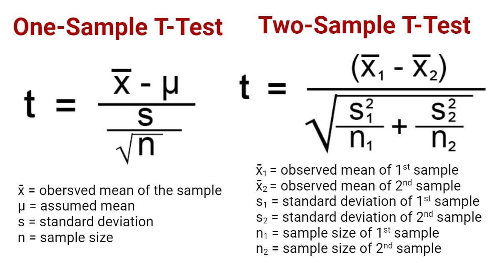

## Table of Contents

## What is a T-Test and why is it used in statistics?

A T-Test is a statistical tool used to determine if there is a significant difference between the means of two groups. It helps researchers understand if the difference they observe in their data is due to a real effect or just random chance. Imagine you want to know if a new teaching method improves test scores. You could use a T-Test to compare the scores of students who used the new method with those who didn't.

T-Tests are popular because they are easy to use and understand. They work well with small sample sizes, which is often the case in research. By calculating a t-value and comparing it to a critical value from a t-distribution table, researchers can decide if their results are statistically significant. This helps them make more reliable conclusions from their data, which is crucial in fields like medicine, psychology, and education.

## What are the different types of T-Tests and when should each be used?

There are three main types of T-Tests: the independent samples T-Test, the paired samples T-Test, and the one-sample T-Test. The independent samples T-Test is used when you want to compare the means of two different groups. For example, if you want to see if boys and girls have different average test scores, you would use this test. It's great for experiments where you have two separate groups and you want to know if there's a real difference between them.

The paired samples T-Test is used when you're comparing the same group of people at two different times or under two different conditions. For instance, if you want to know if a new diet helps people lose weight, you could weigh them before and after the diet and use a paired samples T-Test to see if there's a significant change. This test is useful when you want to see how something changes over time or with a specific intervention.

The one-sample T-Test is used when you want to compare the mean of a single group to a known or hypothesized value. For example, if you want to know if the average height of students in a school is different from the national average, you would use this test. It's handy when you're interested in how one group compares to a standard or expected value.

## How do you calculate the T-Statistic for a one-sample T-Test?

To calculate the T-Statistic for a one-sample T-Test, you need three pieces of information: the sample mean, the known or hypothesized population mean, and the standard deviation of the sample. The formula for the T-Statistic is: T = (sample mean - population mean) / (standard deviation / square root of sample size). This formula helps you figure out how far your sample mean is from the population mean, adjusted for how spread out your data is and how many people you sampled.

Once you have these numbers, you plug them into the formula. For example, if your sample mean is 10, the population mean is 8, the standard deviation is 2, and your sample size is 25, you would calculate the T-Statistic like this: T = (10 - 8) / (2 / square root of 25). That simplifies to T = 2 / (2 / 5), which equals T = 2 * (5 / 2), or T = 5. This T-Statistic tells you how many standard errors away your sample mean is from the population mean, helping you decide if the difference is significant.

## What is the formula for a two-sample T-Test and how does it differ from a one-sample T-Test?

The formula for a two-sample T-Test compares the means of two different groups. It's a bit more complicated than the one-sample T-Test because you have to consider the means and standard deviations of both groups. The formula is: T = (mean of group 1 - mean of group 2) / square root of [ (s1^2 / n1) + (s2^2 / n2) ], where s1 and s2 are the standard deviations of the two groups, and n1 and n2 are the sample sizes of the two groups. This formula helps you figure out if the difference between the two group means is big enough to be significant, considering how spread out the data is in each group and how many people are in each group.

The main difference between a two-sample T-Test and a one-sample T-Test is what they're comparing. A one-sample T-Test compares the mean of one group to a known or expected value. It's like checking if your class's average test score is different from the school's average. On the other hand, a two-sample T-Test compares the means of two different groups. It's like checking if boys and girls have different average test scores. Because of this, the formulas are different: the one-sample T-Test only needs the sample mean, the population mean, and the sample's standard deviation, while the two-sample T-Test needs the means and standard deviations of both groups.

## How do you interpret the results of a T-Test, including p-values and confidence intervals?

When you do a T-Test, you get a T-Statistic and a p-value. The T-Statistic tells you how different the groups are, and the p-value tells you if that difference is likely to happen by chance. If the p-value is small (usually less than 0.05), it means the difference between the groups is probably real and not just a random thing. You can think of the p-value as the chance of being wrong if you say there's a real difference. So, a small p-value means you can be pretty sure there's a real difference.

Confidence intervals are another way to understand T-Test results. A confidence interval gives you a range of values where the true difference between the groups is likely to be. If this range doesn't include zero, it means the difference is probably real. For example, if you're comparing test scores and the confidence interval is from 2 to 6 points, it means you're pretty sure the true difference is between 2 and 6 points. Confidence intervals help you see not just if there's a difference, but also how big that difference might be.

## What are the assumptions that need to be met for a T-Test to be valid?

For a T-Test to be valid, it needs to meet some important assumptions. First, the data should be normally distributed. This means that if you drew a bell curve of your data, it should look like a normal bell shape. This is important because the T-Test uses this shape to calculate how likely your results are. If your data isn't normally distributed, the T-Test might give you wrong answers. Also, the data should be continuous, like height or weight, not categories like colors or types of fruit.

Another assumption is that the variances of the groups you're comparing should be about the same. This is called homogeneity of variance. If one group's data is much more spread out than the other group's, it can mess up the T-Test's results. For a one-sample T-Test, you also need to make sure that each data point is independent, meaning one person's score doesn't affect another's. For a two-sample T-Test, the data in each group should be independent too, and the samples should be randomly selected from their populations. If these assumptions aren't met, you might need to use a different kind of test or transform your data to make it fit the T-Test's requirements.

## How can you check for the assumptions of a T-Test and what to do if they are violated?

To check the assumptions of a T-Test, you can use different methods. For the normality assumption, you can draw a histogram or a Q-Q plot of your data to see if it looks like a bell curve. There are also statistical tests like the Shapiro-Wilk test that can tell you if your data is normal enough. To check if the variances are the same, you can use the Levene's test or the F-test for equality of variances. For independence, you need to think about how you collected your data and make sure one person's data doesn't affect another's.

If the assumptions are violated, you have a few options. If your data isn't normally distributed, you could try transforming it, like taking the log of the values, to make it more normal. Or, you could use a non-parametric test like the Mann-Whitney U test instead of a T-Test. If the variances are not equal, you can use a version of the T-Test that doesn't assume equal variances, called the Welch's T-Test. For independence, if you find that your data isn't independent, you might need to change how you collect your data or use a different kind of analysis that can handle dependent data, like a paired T-Test if it's appropriate.

## What is the difference between a paired and an independent T-Test, and how do their formulas differ?

A paired T-Test and an independent T-Test are used for different situations. A paired T-Test is used when you want to compare the same group of people at two different times or under two different conditions. For example, if you want to see if a new diet helps people lose weight, you could weigh them before and after the diet and use a paired T-Test to see if there's a significant change. On the other hand, an independent T-Test is used when you want to compare the means of two different groups. For instance, if you want to know if boys and girls have different average test scores, you would use an independent T-Test.

The formulas for these two types of T-Tests are different because they are looking at different things. For a paired T-Test, the formula is T = (mean of the differences) / (standard deviation of the differences / square root of the number of pairs). This formula looks at how much each person's score changed and sees if the average change is big enough to be important. The independent T-Test's formula is T = (mean of group 1 - mean of group 2) / square root of [ (s1^2 / n1) + (s2^2 / n2) ], where s1 and s2 are the standard deviations of the two groups, and n1 and n2 are the sample sizes of the two groups. This formula looks at the difference between the two groups' averages and sees if it's big enough to matter, considering how spread out the data is in each group and how many people are in each group.

## How do you determine the degrees of freedom in a T-Test and why is it important?

Degrees of freedom in a T-Test tell you how many values in your calculation are free to vary. For a one-sample T-Test, the degrees of freedom is the number of people in your sample minus one. For an independent T-Test, it's the total number of people in both groups minus two. For a paired T-Test, it's the number of pairs minus one. You need to know the degrees of freedom to use the right T-distribution table, which helps you figure out if your T-Statistic is big enough to be important.

The degrees of freedom are important because they help you understand how reliable your T-Test results are. The more degrees of freedom you have, the closer the T-distribution gets to the normal distribution, which means your results are more trustworthy. If you use the wrong degrees of freedom, you might think a difference is important when it's not, or miss a real difference. So, getting the degrees of freedom right is key to making good decisions based on your T-Test.

## Can you explain the concept of effect size in the context of T-Tests and how it's calculated?

Effect size is a way to measure how big the difference is between the groups you're comparing in a T-Test. It tells you how important the difference is, not just if it's there. Imagine you're comparing test scores between two classes. A T-Test might tell you that one class did better, but the effect size will tell you if the difference is big enough to care about. It's like knowing not just that one class did better, but by how much better they did.

To calculate the effect size for a T-Test, you can use something called Cohen's d. It's pretty simple: you take the difference between the means of the two groups and divide it by the standard deviation of the data. If the difference between the means is big compared to how spread out the data is, you'll get a big effect size. A small effect size might mean the difference isn't that important, even if the T-Test says it's there. So, effect size helps you understand the real-world impact of your findings.

## How do T-Tests fit into the broader context of hypothesis testing and what alternatives exist?

T-Tests are a part of hypothesis testing, which is a way to figure out if what you see in your data is real or just a fluke. In hypothesis testing, you start with a guess, called a null hypothesis, that says there's no real difference between the groups you're looking at. The T-Test helps you decide if you can reject this guess and say there's a real difference. It does this by calculating a T-Statistic and a p-value, which tell you how likely it is that the difference you see happened by chance. If the p-value is small, you can be pretty sure the difference is real, and you reject the null hypothesis.

But T-Tests aren't the only way to do hypothesis testing. If your data doesn't meet the T-Test's assumptions, like being normally distributed or having equal variances, you might need to use something else. One option is non-parametric tests, like the Mann-Whitney U test, which don't need your data to be normal. Another option is the Analysis of Variance (ANOVA) if you want to compare more than two groups at once. And if you're looking at how different factors affect your results, you might use regression analysis. Each of these methods has its own way of helping you figure out if what you see in your data is meaningful.

## What advanced techniques can be used to enhance the power of T-Tests, such as bootstrapping or Bayesian methods?

To make T-Tests more powerful, you can use a technique called bootstrapping. Bootstrapping is like playing a game where you pretend to collect new data many times. You take your real data, mix it up, and make new samples over and over again. Then, you do the T-Test on each of these new samples. By doing this, you get a better idea of how reliable your T-Test results are. It's especially helpful when you don't have a lot of data or if your data isn't perfectly normal. Bootstrapping helps you see if the difference you found is really there, even if your data doesn't fit the T-Test's rules perfectly.

Another advanced technique is using Bayesian methods. Instead of just saying if there's a difference or not, Bayesian methods help you figure out how sure you are about that difference. They use what you already know, called prior knowledge, to update your beliefs based on new data. This can be really useful because it gives you a more complete picture of your results. For example, if you already know a little bit about how a new medicine might work, you can use that information to make your T-Test results more meaningful. Bayesian methods can make your T-Tests more powerful by considering more than just the data you have right now.

## What is the T-Test and how do we understand it?

The t-test is a fundamental statistical tool used to ascertain whether there is a significant difference between the means of two groups. It is particularly useful in [algorithmic trading](/wiki/algorithmic-trading) for examining the performance of trading algorithms against benchmarks or other strategies. The primary forms of t-tests are independent and paired sample t-tests, each serving a different purpose in statistical analysis.

### Types of T-Tests

1. **Independent Sample T-Test**: This test is used when comparing the means of two independent groups. In the context of trading, it might be applied to compare the returns of two different trading strategies or algorithms over the same time period. The formula for the independent t-test is:
$$
   t = \frac{\bar{X}_1 - \bar{X}_2}{\sqrt{\frac{s_1^2}{n_1} + \frac{s_2^2}{n_2}}}

$$

   where $\bar{X}_1$ and $\bar{X}_2$ are the sample means, $s_1^2$ and $s_2^2$ are the variances, and $n_1$ and $n_2$ are the sample sizes of the two groups.

2. **Paired Sample T-Test**: This test is suited for comparing the means of two related groups. In trading, this may involve comparing the performance of a single algorithm before and after a particular market event or adjustment to the algorithm itself. The paired sample t-test formula is:
$$
   t = \frac{\bar{D}}{\frac{s_D}{\sqrt{n}}}

$$

   where $\bar{D}$ is the mean of the differences between paired observations, $s_D$ is the standard deviation of the differences, and $n$ is the number of paired observations.

### Applying the T-Test in Financial Analysis

In financial analysis, it is crucial to apply the appropriate t-test based on the nature of the data and the research question. For example, to test if there is a statistically significant performance difference between two trading algorithms, one might use an independent samples t-test. Here’s a basic example in Python:

```python
import numpy as np
from scipy import stats

# Sample data
algorithm_1_returns = np.array([0.05, 0.10, 0.15, 0.10, 0.12])
algorithm_2_returns = np.array([0.07, 0.09, 0.14, 0.14, 0.11])

# Perform independent t-test
t_stat, p_value = stats.ttest_ind(algorithm_1_returns, algorithm_2_returns)

print(f"T-statistic: {t_stat}, P-value: {p_value}")
```

This code helps determine if there's a statistically significant difference in the means of the two trading algorithms' returns. If the p-value is less than a chosen significance level (commonly 0.05), one can conclude that the difference is statistically significant.

The t-test is a valuable part of financial analysis, helping traders understand market variations and assess strategy effectiveness. It is important, however, to ensure assumptions such as normality and equal variances are met to validate the test results. Proper application of t-tests can enhance the robustness of trading decisions in algorithmic trading.

## References & Further Reading

[1]: Bergstra, J., Bardenet, R., Bengio, Y., & Kégl, B. (2011). ["Algorithms for Hyper-Parameter Optimization."](https://papers.nips.cc/paper/4443-algorithms-for-hyper-parameter-optimization) Advances in Neural Information Processing Systems 24.

[2]: ["Advances in Financial Machine Learning"](https://books.google.com/books/about/Advances_in_Financial_Machine_Learning.html?id=oU9KDwAAQBAJ) by Marcos Lopez de Prado

[3]: ["Evidence-Based Technical Analysis: Applying the Scientific Method and Statistical Inference to Trading Signals"](https://www.amazon.com/Evidence-Based-Technical-Analysis-Scientific-Statistical/dp/0470008741) by David Aronson

[4]: ["Machine Learning for Algorithmic Trading"](https://github.com/PacktPublishing/Machine-Learning-for-Algorithmic-Trading-Second-Edition) by Stefan Jansen

[5]: ["Quantitative Trading: How to Build Your Own Algorithmic Trading Business"](https://books.google.com/books/about/Quantitative_Trading.html?id=j70yEAAAQBAJ) by Ernest P. Chan