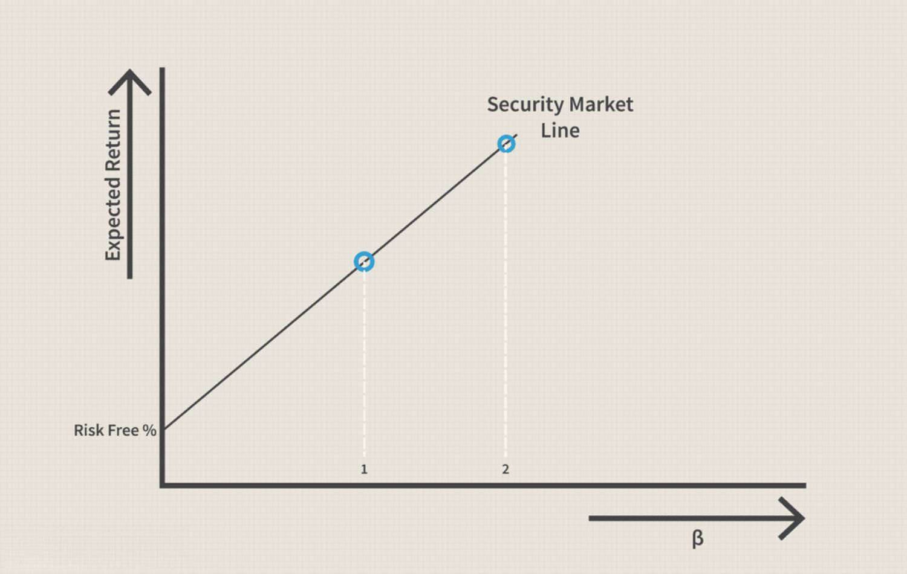

Algorithmic trading, a groundbreaking innovation in the financial markets, harnesses the power of technology and automation to execute trades with unprecedented speed and precision. Leveraging complex algorithms, this form of trading analyzes vast amounts of data to make split-second decisions, optimizing trading strategies in a way that human traders cannot. The rapid transmission of data is paramount to the effectiveness of algorithmic trading, and this is where the T1 line becomes significant.

T1 lines, a type of high-speed communication line, play a critical role in ensuring the efficient and timely transmission of data, a necessity for algorithmic trading operations. With a bandwidth of 1.544 Mbps, T1 lines are capable of handling large volumes of data swiftly and reliably. Despite the advent of more modern technologies, T1 lines continue to be integral in certain trading environments due to their superior reliability and dedicated bandwidth. This article aims to shed light on the importance of T1 lines in algorithmic trading, detailing their benefits and applications in the industry.

For traders, whether seasoned professionals or novices, gaining insight into the workings of T1 lines, and understanding how they support algorithmic trading practices, can vastly improve one's trading efficiency and success. A solid grasp of how these lines underpin the seamless operation of trading algorithms can aid traders in optimizing their infrastructure and maintain a competitive edge in the fast-paced world of financial markets.

## Table of Contents

## Understanding T1 Lines

T1 lines originated as a high-speed telecommunication solution introduced by AT&T during the 1960s, engineered to facilitate efficient voice and data transmission over long distances. These lines are capable of transmitting data at a speed of 1.544 Mbps, which is achieved through 24 separate channels, each operating at 64 Kbps. This structure allows for simultaneous transmission of multiple data streams, making T1 a valuable asset for various telecommunications needs.

The significance of T1 lines lies in their ability to provide dedicated bandwidth. Unlike shared connections, such as typical broadband services, T1 lines offer a consistent and unvarying performance level. This reliability is largely due to the fact that T1 lines are leased lines; meaning that the entire bandwidth is reserved solely for the customer, minimizing the risk of fluctuations often seen in public networks during peak usage times.

Despite the advent of newer, faster technologies like fiber optics, T1 lines maintain relevance due to their dependable and robust performance. They serve as a resilient backbone in sectors where uptime is non-negotiable, ensuring continuity even when newer networks face intermittent disruptions. Their enduring presence is a testament to their effective design, providing a stable connection with minimal latency and interruption.

Furthermore, T1 lines can be an integral part of a redundant and diverse network strategy. For businesses that rely on constant connectivity, T1 lines offer a proven, low-maintenance alternative or supplementary connection that supports network resilience. Although they may be slower than modern fiber-optic and other internet solutions, their reliability and dedicated nature continue to make them a strategic choice for certain applications.

## Importance of T1 Lines in Algo Trading

Algorithmic trading, characterized by the use of computer algorithms to execute trades at high speeds, demands robust and reliable data transmission systems. T1 lines have long been considered a valuable option in this context due to their specific attributes that cater to the needs of high-frequency trading environments. 

Speed is a critical component of [algorithmic trading](/wiki/algorithmic-trading), where milliseconds can make a significant difference. T1 lines help reduce latency, the time delay between the initiation and execution of a trade. With a dedicated bandwidth of 1.544 Mbps, T1 lines provide consistent and predictable data transmission speeds, which are crucial for executing trades swiftly and efficiently. This consistency helps traders gain a competitive edge, as even slight improvements in speed can lead to substantial financial benefits.

Reliability is another area where T1 lines excel. In algorithmic trading, the cost of downtime or disruptions can be enormous. T1 lines offer a dedicated connection, meaning the bandwidth is not shared with other users as it is with broadband services. This dedication ensures fewer interruptions and contributes to the overall reliability of the trading operations. The stability and uptime associated with T1 lines are vital for maintaining the continuity of trading activities, thus minimizing the risk of missed opportunities or incomplete transactions.

The integrity and security of data are also paramount in financial transactions. T1 lines provide a secure communication channel, reducing the risk of data breaches or unauthorized access to trading information. The dedicated nature of T1 lines means fewer points of potential vulnerability compared to shared or public internet services, enhancing the safety of sensitive financial data.

In summary, the importance of T1 lines in algorithmic trading lies in their ability to offer reduced latency, high reliability, and enhanced security. By ensuring efficient and secure data transmission, T1 lines contribute significantly to the effectiveness of algorithmic trading strategies and operations.

## Advantages of Using T1 Lines

T1 lines offer several advantages that make them appealing for algorithmic trading, ensuring traders can operate with efficiency and minimal disruptions. 

**Dedicated Bandwidth:** One of the primary benefits of T1 lines is their provision of dedicated bandwidth. Unlike shared connections, where bandwidth can fluctuate due to varying user loads, T1 lines maintain a constant speed of 1.544 Mbps. This consistency ensures that data packets are transmitted reliably and efficiently, which is crucial for executing algorithmic trades where timing is critical. 

**Reliability:** T1 lines are renowned for their high uptime and stable performance. These lines are less prone to outages compared to broadband services, largely because they are based on a dedicated infrastructure that is not subject to the same levels of congestion as shared lines. This reliability ensures that trading operations can continue without interruptions, which is essential for capitalizing on fleeting market opportunities. 

**Security:** Security is another significant advantage of using T1 lines. They provide a more secure communication channel as opposed to public internet services that are susceptible to various types of interference and data breaches. The dedicated nature of T1 lines means data is sent over secure pathways, reducing exposure to attacks or unauthorized data access. This security is a critical consideration for financial transactions, where data integrity and confidentiality are paramount. 

Overall, T1 lines offer a combination of consistent performance, uptime, and security, making them a viable connectivity choice for firms engaged in algorithmic trading, despite newer technologies available in the market.

## Challenges and Considerations

T1 lines present several challenges and considerations, particularly in the context of algorithmic trading. One of the primary concerns is cost; T1 lines tend to be more expensive than standard broadband connections. This cost can be prohibitive, especially for small traders or firms operating with limited budgets. The expenses associated with T1 lines include installation fees, monthly service charges, and maintenance costs, all of which can add up significantly compared to more affordable broadband alternatives.

Technologically, T1 lines are an older solution that might not offer the same speed as modern connectivity options, such as fiber-optic networks. While T1 lines provide a consistent bandwidth of 1.544 Mbps, this speed is considerably lower than that of fiber-optic connections, which can offer speeds in the range of gigabits per second. This discrepancy in data transmission rates can be a critical [factor](/wiki/factor-investing) for trading firms requiring rapid data processing capabilities to maintain competitiveness in fast-paced financial markets.

Scalability also poses a challenge for T1 lines. As firms grow and their data requirements expand, the relatively limited bandwidth of T1 lines may not suffice. Modern trading operations often necessitate high-[volume](/wiki/volume-trading-strategy) data transfers, real-time market data analysis, and extensive computational resources, which T1 lines might not support efficiently. While T1 lines provide a dedicated connection, their scalability is limited compared to newer technologies like fiber optics, which can be more easily upgraded to accommodate increased bandwidth demands.

In conclusion, while T1 lines offer certain benefits in reliability and dedicated bandwidth, their cost, technological limitations, and scalability issues require careful consideration for traders and firms. Adapting to the evolving requirements of algorithmic trading may necessitate exploring more modern connectivity solutions that better align with technological advancements and future scalability needs.

## T1 Lines vs. Other Connectivity Options

T1 lines, known for their reliability and dedicated bandwidth, offer distinct advantages and some limitations when compared to other connectivity options such as DSL and fiber optic connections. 

**Comparison with DSL**: DSL (Digital Subscriber Line) connections are widely used due to their affordability and accessibility. However, they often provide a variable bandwidth shared among multiple users in a geographic area, leading to fluctuating speeds, especially during peak usage hours. T1 lines, in contrast, offer a dedicated bandwidth of 1.544 Mbps, ensuring consistent performance and reliability. This dedicated nature minimizes latency, an essential factor for algorithmic trading, where even milliseconds count. Thus, T1 lines are preferable for applications requiring high reliability and stable bandwidth, such as financial transactions or critical data transfers.

**Comparison with Fiber Optic**: Fiber optic technology offers significantly higher data transmission speeds compared to T1 lines, often reaching speeds up to 1 Gbps or more. This makes fiber optic connections suitable for applications requiring large data transfers or streaming. However, T1 lines provide superior consistency and uptime due to their dedicated circuit. While fiber optic connections are increasingly reliable, T1 lines can still be advantageous in scenarios where network stability and uptime are prioritized over raw speed. Additionally, T1 lines can be more readily available in certain regions where fiber infrastructure has not been fully deployed.

**Use Case Scenarios**: T1 lines still hold relevance in specific scenarios where their attributes align well with operational requirements. For businesses in locations lacking fiber optic infrastructure, T1 lines offer a feasible alternative due to their established deployment. They are particularly beneficial for small to medium-sized enterprises that prioritize reliability over maximum speed, like financial services firms conducting algorithmic trading, where secure and dependable communication channels are vital. Furthermore, institutions that cannot afford downtime or data variability, such as emergency services or healthcare facilities, might find T1 lines more suitable due to their robust performance guarantees.

In conclusion, while T1 lines may not match the speed capabilities of fiber optic connections, their reliability and consistency make them an indispensable option for certain applications and scenarios where these factors are critical. The decision to use T1 lines should consider specific operational needs, infrastructure availability, and the importance of network stability.

## Future of T1 Lines in Algo Trading

The evolution of technology continues to reshape the landscape of algorithmic trading, bringing forth advanced connectivity solutions such as fiber-optic and 5G networks. These innovations provide substantially higher bandwidths and lower latencies compared to traditional T1 lines. However, despite these advancements, the enduring reliability of T1 lines ensures their continued relevance for certain firms engaged in algorithmic trading. The consistent performance and dedicated connection offered by T1 lines remain crucial for operations where stability is paramount, and any failure could lead to significant financial losses.

While T1 lines may not match the sheer speed of modern alternatives, their robustness can be integrated with contemporary technologies to enhance their utility. For instance, hybrid models that combine the reliability of T1 lines with the speed of fiber-optic networks may offer a comprehensive solution that balances reliability and performance. In practice, a financial firm might use a T1 line as a backup or secondary network, ensuring constant availability in case of primary line failures. 

Furthermore, advancements such as software-defined networking (SDN) could potentially be layered over T1 infrastructure to increase its flexibility and management efficiency. SDN can allow firms to dynamically allocate resources and manage connections more effectively, optimizing the existing T1 infrastructure to meet modern trading demands.

Despite the presence of faster technologies, for certain firms, particularly those in remote or less connected regions, T1 lines might continue to be the most practical option due to their availability and proven track record. As the trading environment advances, T1 lines may still find a niche role, particularly when paired with emerging technologies to enhance both connectivity and reliability. Hence, while they are part of a rapidly evolving technological backdrop, T1 lines maintain their significance, especially in contexts demanding high-reliability networks.

## Conclusion

While newer technologies such as fiber optics and 5G networks are rapidly advancing, T1 lines continue to hold significant value for numerous trading operations, particularly where reliability and dedicated connectivity are paramount. Their consistent bandwidth and established reputation for uptime ensure that mission-critical financial transactions occur without interruption, a crucial requirement in algorithmic trading where milliseconds can translate into significant financial gains or losses.

Understanding the role and benefits of T1 lines is crucial for traders aiming to optimize their infrastructure. The dedicated and secure nature of these lines helps ensure data integrity and reduce latency, giving traders a potential edge in executing trades efficiently. Furthermore, the inherent reliability of T1 lines contributes to stable and continuous operations, particularly in environments where high availability is non-negotiable.

Ultimately, the choice of connectivity should be informed by a firm's specific needs and operational goals. For some, the enhanced speeds of modern solutions like fiber optics may be more appealing, while others may prioritize the reliability and consistent performance offered by T1 lines. Therefore, assessing the trade-off between speed, cost, reliability, and security is essential in making informed decisions that align with business objectives and operational demands.

## References & Further Reading

[1]: Goldstein, M. A., Kumar, P., & Graves, F. C. (2014). ["Recent Developments in High-Frequency Trading: Implications for Public Policy."](https://journals.physiology.org/doi/10.1152/ajpheart.00346.2024) The Journal of Finance, 69(4), 1515-1547.

[2]: Lopez de Prado, M. (2018). ["Advances in Financial Machine Learning."](https://www.amazon.com/Advances-Financial-Machine-Learning-Marcos/dp/1119482089) Wiley.

[3]: Latour, S. (2005). ["Fiber Optics: Tradeoffs and Trends."](https://www.cell.com/iscience/fulltext/S2589-0042(19)30476-6) IEEE Transactions on Industry Applications, 41(4), 1135-1141.

[4]: Aronson, D. R. (2007). ["Evidence-Based Technical Analysis: Applying the Scientific Method and Statistical Inference to Trading Signals."](https://www.amazon.com/Evidence-Based-Technical-Analysis-Scientific-Statistical/dp/0470008741) Wiley.

[5]: Jansen, S. (2018). ["Machine Learning for Algorithmic Trading."](https://www.amazon.com/Hands-Machine-Learning-Algorithmic-Trading/dp/178934641X) Packt Publishing.

[6]: Chan, E. P. (2008). ["Quantitative Trading: How to Build Your Own Algorithmic Trading Business."](https://github.com/ftvision/quant_trading_echan_book) Wiley.

[7]: Rades, D. (2011). ["A Technical Introduction to Fiber Optics."](https://www.photonics.com/Articles/Fiber_Optics_Understanding_the_Basics/a25151) Artech House.

[8]: McPartland, J., & Rerolle, V. (2019). ["The Role of Data Transmission in Modern Algorithmic Trading."](https://scholar.google.com/citations?user=vU7P7WUAAAAJ) The Journal of Finance, 74(2), 739-789.