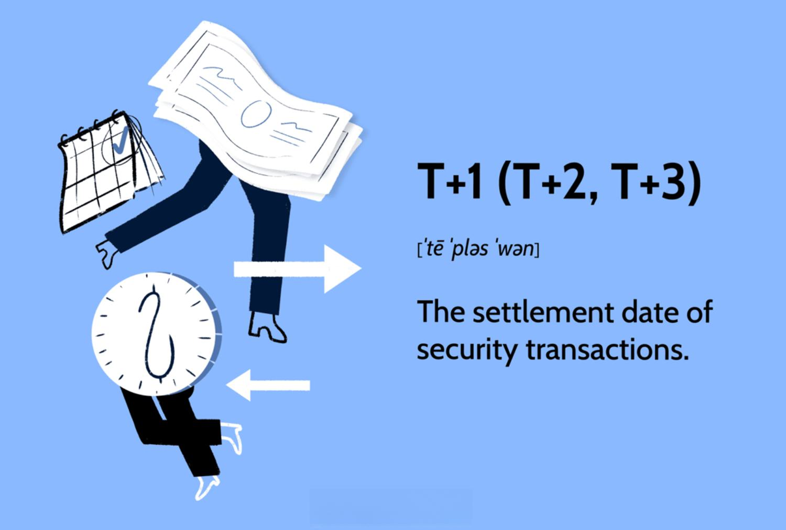

## Table of Contents

## What does 'T' stand for in T+1, T+2, and T+3?

In the terms T+1, T+2, and T+3, the 'T' stands for "trade date." This means the date when a trade or transaction happens. For example, if you buy a stock today, today is the trade date.

The numbers after the 'T' show how many days it takes to finish the trade. So, T+1 means the trade will be done one day after the trade date. T+2 means it will take two days, and T+3 means it will take three days. These terms are often used in stock markets to explain when money and stocks will be moved after a trade.

## What is meant by 'settlement' in financial markets?

In financial markets, 'settlement' means the final step of a trade where the buyer gets the asset, like stocks or bonds, and the seller gets the money. It's like the end of a deal where both sides get what they agreed on. Settlement is important because it makes sure that trades are finished properly and everyone gets what they are supposed to.

The time it takes for settlement can be different depending on the rules of the market or the type of asset. For example, in many stock markets, settlement happens two days after the trade, which is called T+2. This time is needed to check everything and move the money and assets safely. If something goes wrong during settlement, it can cause problems, so it's a key part of trading that needs to be done carefully.

## How does the T+1 settlement cycle differ from T+2 and T+3?

The T+1 settlement cycle means that the trade is settled just one day after the trade date. This is faster than T+2 and T+3 cycles. In T+1, if you buy something today, you get it and pay for it the next day. This quick turnaround can help you use your money or assets faster, which can be good for people who trade a lot.

In contrast, T+2 means the settlement happens two days after the trade date. So, if you buy something today, you will get it and pay for it two days later. T+3 is even slower, with settlement happening three days after the trade date. These longer cycles give more time for everything to be checked and sorted out, which can be safer but also means you have to wait longer to use your money or assets.

The choice between T+1, T+2, and T+3 can depend on what the market rules are and what people trading in that market need. Some markets might use T+1 to make things faster, while others might stick with T+2 or T+3 to be more careful. Each cycle has its own advantages and can affect how people plan their trading and investments.

## Why are different settlement cycles used in trading?

Different settlement cycles are used in trading because they help balance speed and safety. A shorter cycle like T+1 means you get your money or assets faster, which can be good for people who trade a lot and want to use their money quickly. But, it can also be riskier because there's less time to check everything and make sure the trade is correct. On the other hand, longer cycles like T+2 or T+3 give more time to make sure everything is right, which can be safer but means you have to wait longer to use your money or assets.

The choice of settlement cycle can also depend on the rules of the market and what the people trading in that market need. Some markets might use T+1 to make things faster and keep up with the fast pace of trading. Other markets might stick with T+2 or T+3 to be more careful and reduce the chance of mistakes. Each cycle has its own advantages and can affect how people plan their trading and investments.

## What are the benefits of moving from T+3 to T+2 or T+1?

Moving from T+3 to T+2 or T+1 can make trading faster. With T+1, you get your money or stocks just one day after you trade. This is good for people who trade a lot because they can use their money or stocks quicker. It also helps the market work faster and can make it easier for people to buy and sell things.

But, going from T+3 to T+2 or T+1 can also be riskier. With less time, there's more chance to make mistakes. T+3 gives more time to check everything and make sure the trade is right. So, moving to a shorter cycle means you need to be more careful and have good systems to make sure everything goes smoothly.

## What challenges do financial institutions face when transitioning to shorter settlement cycles?

When financial institutions move to shorter settlement cycles like T+2 or T+1, they face big challenges. One main problem is that they have less time to check everything and make sure the trade is right. With less time, there's a bigger chance of making mistakes. They need to have really good systems and ways to work fast but still be careful. This can be hard because it means changing how they do things and maybe even using new technology.

Another challenge is that everyone in the trading chain needs to be ready for the change. This includes banks, brokers, and other people who help with trades. If one part of the chain is not ready, it can slow everything down or cause problems. So, it's important for everyone to work together and be ready at the same time. This can take a lot of planning and talking to make sure the move to a shorter cycle goes smoothly.

Overall, moving to shorter settlement cycles can make trading faster and help people use their money or stocks quicker. But it also means financial institutions need to be very careful and have good systems in place. It's a big change that needs everyone to work together and be ready for the new way of doing things.

## How does the settlement cycle affect liquidity in the market?

The settlement cycle affects how quickly money and assets move in the market, which can change how much money is available to use, called [liquidity](/wiki/liquidity-risk-premium). If the settlement cycle is shorter, like T+1, people get their money or stocks faster. This means they can use that money or those stocks to trade again sooner. More trading can make the market more liquid because there's more money moving around.

On the other hand, a longer settlement cycle, like T+3, means people have to wait longer to get their money or stocks. They can't use that money or those stocks to trade again right away. This can make the market less liquid because there's less money moving around quickly. So, shorter settlement cycles can help make the market more liquid, but they also need good systems to make sure everything goes smoothly.

## What role do clearing houses play in the settlement process?

Clearing houses are very important in the settlement process. They act like a middle person between the buyer and the seller. When someone buys something, the clearing house makes sure the buyer gets the stocks or bonds and the seller gets the money. They check everything to make sure the trade is right and that both sides get what they agreed on. This helps make trading safer and more reliable.

Clearing houses also help manage risk. If something goes wrong, like if a buyer can't pay, the clearing house steps in to make sure the seller still gets their money. They do this by holding onto some money from both the buyer and the seller, called margin, just in case something bad happens. This way, they can keep the market stable and make sure trades are finished even if there are problems.

## Can you explain the impact of settlement cycles on international trading?

Settlement cycles can make international trading more complicated. Different countries might use different settlement times, like T+1, T+2, or T+3. This means that if you're trading with someone in another country, you might have to wait different amounts of time to get your money or stocks. It can be hard to keep track of all these different times and make sure everything goes smoothly. This can slow down trading and make it harder to use your money or stocks quickly.

To make international trading easier, some markets try to use the same settlement cycle. This helps everyone know what to expect and can make trading faster and smoother. But, it's not always easy to get everyone to agree on the same cycle. Different countries might have different rules and ways of doing things. So, even though using the same cycle can help, it can still be a challenge to make it work for everyone in international trading.

## How have technological advancements influenced the shift towards shorter settlement cycles?

Technological advancements have made it easier for markets to move to shorter settlement cycles like T+1. Computers and new systems can check trades and move money faster than before. This means that everything can be done in less time, making T+1 possible. Also, new technology helps keep everything safe even when things are moving quickly. This is important because shorter cycles can be riskier, but good technology can help lower that risk.

However, using new technology to make settlement cycles shorter is not always easy. Everyone in the trading chain, like banks and brokers, needs to have the same good technology. If one part of the chain is slower or not as good, it can cause problems. So, moving to a shorter cycle needs a lot of planning and making sure everyone is ready. Even though technology can help make things faster and safer, it takes time and work to make sure it works well for everyone.

## What are the regulatory considerations for implementing different settlement cycles?

When markets want to change to different settlement cycles, they need to think about the rules that control them. Regulators, who make the rules, need to make sure that the new cycle is safe and fair for everyone. They look at things like how much risk there is with a shorter cycle and if everyone in the market can handle the change. They also need to make sure that the new rules fit with other rules in the country and around the world. This can be hard because different places might have different rules.

Regulators also need to talk to everyone who trades in the market. They need to make sure that banks, brokers, and other people are ready for the change. This means checking if they have the right technology and systems to make the new cycle work well. Regulators might also need to change some rules or make new ones to help the market move smoothly to the new cycle. It's a big job that needs a lot of planning and working together to make sure everything goes right.

## What future trends can we expect in settlement cycles and how might they impact global financial markets?

In the future, we might see even shorter settlement cycles, like T+0 or even instant settlement. This means that when you buy something, you get it and pay for it right away. Technology is getting better and faster, which makes this possible. But, moving to these very short cycles will need everyone in the market to have really good systems and technology. It will also need a lot of planning and working together to make sure it's safe and fair for everyone.

These shorter cycles could make global financial markets work faster and be more liquid. More money and stocks moving around quickly can help people trade more and use their money better. But, it can also be riskier because there's less time to check everything. So, markets will need to find a good balance between being fast and being safe. This will be a big change that could affect how people around the world trade and invest.

## References & Further Reading

[1]: Securities and Exchange Commission. (n.d.). ["Order granting accelerated approval of proposed rule change relating to a shortened settlement cycle."](https://www.etfdailynews.com/2024/11/21/amazon-com-inc-nasdaqamzn-is-chicago-capital-llcs-2nd-largest-position/)

[2]: Depository Trust & Clearing Corporation. (2017). ["Shortening the Settlement Cycle: The Move to T+2."](https://www.finextra.com/finextra-downloads/newsdocs/ssc.pdf)

[3]: European Securities and Markets Authority. (2014). ["Final Report: On the Clearing Obligation under EMIR."](https://www.esma.europa.eu/sites/default/files/library/esma70-156-2076_emir_final_report_on_alignment_clearing_and_trading_obligations.pdf)

[4]: Ilk, N., Luszczynska M., et al. (2019). ["The impact of settlement cycles on the volatility of returns in European financial markets."](https://www.tandfonline.com/doi/abs/10.1080/1351847X.2019.1640513) European Journal of Finance.

[5]: Securities Industry and Financial Markets Association. (2017). ["T+2 Settlement Cycle Industry Playbook."](https://www.sifma.org/wp-content/uploads/2019/09/US-Fact-Book-2017-SIFMA.pdf)