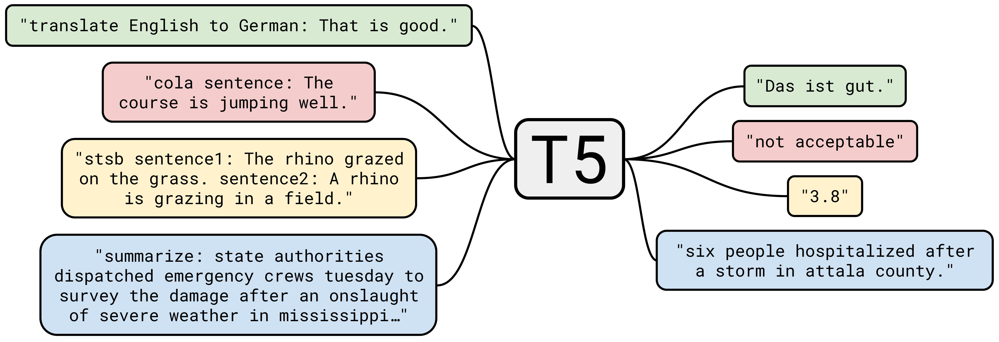

## Table of Contents

## What is T5 in machine learning?

T5, or Text-to-Text Transfer Transformer, is a machine learning model developed by Google. It's special because it can handle many different language tasks using the same model structure. Instead of making separate models for tasks like translating languages, summarizing texts, or answering questions, T5 uses a single model that turns all these tasks into a text-to-text format. This means you give it some text as input, and it gives you text back as output, no matter what the task is.

The way T5 works is by using something called a transformer, which is good at understanding and generating text. T5 is trained on a huge amount of text data, learning to predict what text should come next. When you want to use T5 for a specific task, you just need to add a special instruction at the beginning of your input text. For example, if you want it to translate from English to French, you might start your input with "translate English to French:". This tells T5 what to do with the rest of the text you give it. This approach makes T5 very flexible and useful for a wide range of language-related jobs.

## Who developed the T5 model?

The T5 model was developed by a team of researchers at Google. The team was led by Colin Raffel and Noam Shazeer, along with other contributors. They wanted to create a model that could handle many different language tasks without needing to build separate models for each task. Their goal was to make a model that could turn any language task into a text-to-text problem, making it easier to use and more flexible.

T5 stands for "Text-to-Text Transfer Transformer." It uses a type of [neural network](/wiki/neural-network) called a transformer, which is good at understanding and generating text. The model is trained on a huge amount of text data, learning how to predict what text should come next. When you use T5, you just need to add a special instruction at the start of your input text to tell it what to do. For example, if you want it to translate from English to French, you might start your input with "translate English to French:". This way, T5 can do many different tasks with the same model, making it very useful for all sorts of language-related jobs.

## What does T5 stand for?

T5 stands for "Text-to-Text Transfer Transformer." It's a model made by Google that can do many different language tasks using the same setup. Instead of making a new model for each task, like translating or summarizing, T5 turns all these tasks into a text-to-text problem. This means you give it some text, and it gives you text back, no matter what you want it to do.

The way T5 works is by using a transformer, which is good at understanding and making text. T5 learns from a lot of text data, figuring out how to predict what text should come next. When you use T5, you just need to add a special instruction at the start of your text to tell it what to do. For example, if you want it to translate from English to French, you might start your input with "translate English to French:". This makes T5 very flexible and useful for many language jobs.

## How does T5 differ from other transformer models?

T5, or Text-to-Text Transfer Transformer, stands out from other transformer models because it treats all language tasks as text-to-text problems. This means you can use T5 for many different jobs like translating, summarizing, or answering questions, just by giving it text as input and getting text as output. Other models might need different setups for each task, but T5 uses the same model structure for everything. You just need to add a special instruction at the start of your input text to tell T5 what to do. For example, if you want it to translate from English to French, you might start your input with "translate English to French:".

Another big difference is how T5 is trained. It uses a method called "transfer learning," where it learns from a huge amount of text data to get good at predicting what text should come next. This pre-training helps T5 understand language better before it's fine-tuned for specific tasks. Other transformer models might not use this approach or might use different pre-training methods. T5's way of pre-training and then fine-tuning makes it very flexible and good at many language tasks.

## What are the main components of the T5 architecture?

The T5 model is made up of a few key parts that work together to make it good at understanding and generating text. The main part of T5 is the transformer, which is a type of neural network that's really good at handling text. The transformer in T5 has an encoder and a decoder. The encoder takes the input text and turns it into a set of numbers that the model can understand. The decoder then takes those numbers and turns them back into text. This setup lets T5 do many different language tasks, like translating or summarizing, by treating everything as a text-to-text problem.

Another important part of T5 is how it's trained. T5 uses a method called transfer learning, where it's first trained on a huge amount of text data to get good at predicting what text should come next. This is called pre-training. After pre-training, T5 can be fine-tuned for specific tasks. To fine-tune T5, you give it examples of the task you want it to do, and it learns how to do that task better. This way of training makes T5 very flexible and able to handle many different language jobs.

## How is T5 trained and what datasets are commonly used?

T5 is trained using a two-step process called transfer learning. First, it goes through a pre-training phase where it learns from a huge amount of text data. The goal of this phase is to teach T5 how to predict what text should come next. This is done by showing T5 a lot of text and letting it guess what words should follow. The datasets used for this pre-training are very large and diverse, often including things like [books](/wiki/algo-trading-books), Wikipedia articles, and web pages. A common dataset used is the C4 (Colossal Clean Crawled Corpus), which is a cleaned-up version of text from the internet.

After pre-training, T5 moves to the fine-tuning phase. In this step, T5 is trained on smaller, task-specific datasets to get better at doing specific language tasks like translating or summarizing. For example, if you want T5 to translate from English to French, you would use a dataset with pairs of English and French sentences. Some common datasets for fine-tuning include the WMT (Workshop on Machine Translation) for translation tasks, the CNN/DailyMail dataset for summarization, and the SQuAD (Stanford Question Answering Dataset) for question answering. This fine-tuning helps T5 perform well on the specific tasks it's given.

The training process of T5 involves a lot of math and computer power, but the basic idea is simple: first, learn from a lot of general text to understand language, then learn from specific examples to get good at certain tasks. This way, T5 can be very flexible and useful for many different language jobs.

## What are some common applications of T5?

T5, or Text-to-Text Transfer Transformer, is used for many different language tasks. One common use is translation. For example, if you want to translate from English to French, you can use T5 by starting your input with "translate English to French:". This tells T5 what to do, and it will give you the translated text. Another use is summarizing long texts. If you have a big article and want a short summary, you can start your input with "summarize:" and T5 will give you a shorter version of the text.

Another application of T5 is answering questions. If you have a question about a piece of text, you can use T5 to find the answer. For example, you might ask, "What is the capital of France?" and T5 can give you the answer, "Paris." T5 can also be used for text generation, where it can create new text based on a given prompt. For instance, if you start with "Once upon a time," T5 can continue the story for you. These examples show how T5 can be used for many different language tasks by just changing the instructions you give it.

## How can T5 be fine-tuned for specific tasks?

To fine-tune T5 for specific tasks, you start by taking the pre-trained model and training it further on a smaller dataset that's focused on the task you want it to do. For example, if you want T5 to translate from English to French, you would use a dataset with pairs of English and French sentences. You tell T5 what to do by adding a special instruction at the start of each input, like "translate English to French:". Then, you show T5 many examples of English sentences and their French translations. T5 learns from these examples and gets better at translating.

During fine-tuning, you need to adjust the model's settings to make it work well for your specific task. This might mean changing things like the learning rate or the number of training steps. You keep showing T5 examples and updating its knowledge until it performs well on your task. Once T5 is fine-tuned, you can use it to do the task you trained it for, like translating, summarizing, or answering questions. This way, T5 can be very useful for many different language jobs.

## What are the performance metrics typically used to evaluate T5?

To evaluate how well T5 does its job, people use different performance metrics depending on what task T5 is doing. For tasks like translating or summarizing, a common metric is BLEU (Bilingual Evaluation Understudy) score. This score looks at how similar the text T5 makes is to the correct text. A higher BLEU score means T5 is doing a better job. For tasks like answering questions, people often use metrics like exact match or F1 score. Exact match checks if T5's answer is exactly the same as the right answer. F1 score looks at how much of T5's answer matches the right answer, even if it's not perfect.

Another important metric for evaluating T5 is perplexity, which measures how well T5 predicts the next word in a text. A lower perplexity score means T5 is better at guessing what comes next. For tasks like text classification, people might use accuracy, which measures how often T5 gets the right answer. These metrics help researchers and users understand how well T5 works for different tasks and how it can be improved.

## What are the limitations of T5?

T5 is a powerful model, but it has some limitations. One big problem is that it needs a lot of computer power to work well. Training T5 and using it for tasks takes a lot of time and energy. This can make it hard for people without big computers to use T5. Another issue is that T5 can sometimes make mistakes or give wrong answers. This happens because T5 learns from a lot of text, and not all of that text is correct or good. So, T5 might repeat mistakes or bad information it sees in the data.

Another limitation is that T5 can struggle with understanding very long texts. If you give T5 a really long article to summarize, it might miss important parts or not understand the whole thing well. Also, T5 can have trouble with tasks that need a lot of common sense or understanding of the world. For example, if you ask T5 a question that needs knowing how people usually act, it might not give the right answer because it only knows what it learned from text. These limitations show that while T5 is good at many language tasks, it's not perfect and can still be improved.

## How does T5 handle multilingual tasks?

T5 is really good at handling tasks in different languages because it treats everything as a text-to-text problem. This means you can tell T5 what language task you want it to do by adding a special instruction at the start of your text. For example, if you want T5 to translate from English to French, you start your input with "translate English to French:". This way, T5 can work with many different languages without needing a different model for each one. It just needs to be trained on text from those languages.

To make T5 work well with multiple languages, it's trained on a lot of text from different languages. This helps T5 understand how different languages work and how to switch between them. During training, T5 learns to predict what text should come next, no matter what language it's in. After training, you can fine-tune T5 on specific language tasks, like translating between two languages or summarizing text in another language. This makes T5 very flexible and useful for many language jobs around the world.

## What advancements have been made based on T5?

Since T5 was made, other models have been built that take ideas from it and make them better. One big advancement is the mT5 model, which is made to work even better with many different languages. mT5 is trained on a lot more text from different languages than T5, so it can understand and work with more languages. This makes mT5 really good at tasks like translating between languages that T5 might not be as good at.

Another model that builds on T5 is the FLAN-T5 model. FLAN-T5 is trained not just on predicting the next word in text, but also on following instructions better. This means FLAN-T5 can understand what you want it to do more easily. For example, if you tell FLAN-T5 to summarize a long article, it can do that better than T5 because it's been trained to follow those kinds of instructions more closely. These new models show how the ideas from T5 can be used to make even better language tools.

## References & Further Reading

[1]: Raffel, C., Shazeer, N., Roberts, A., Lee, K., Narang, S., Matena, M., Zhou, Y., Li, W., & Liu, P. J. (2020). ["Exploring the Limits of Transfer Learning with a Unified Text-to-Text Transformer."](https://arxiv.org/abs/1910.10683) Journal of Machine Learning Research.

[2]: Vaswani, A., Shazeer, N., Parmar, N., Uszkoreit, J., Jones, L., Gomez, A. N., Kaiser, Ł., & Polosukhin, I. (2017). ["Attention Is All You Need."](https://arxiv.org/abs/1706.03762) Advances in Neural Information Processing Systems.

[3]: Chen, T., & Guestrin, C. (2016). ["XGBoost: A Scalable Tree Boosting System."](https://arxiv.org/abs/1603.02754) Proceedings of the 22nd ACM SIGKDD International Conference on Knowledge Discovery and Data Mining.

[4]: Devlin, J., Chang, M. W., Lee, K., & Toutanova, K. (2019). ["BERT: Pre-training of Deep Bidirectional Transformers for Language Understanding."](https://aclanthology.org/N19-1423/) NAACL-HLT.

[5]: Lewis, M., Liu, Y., Goyal, N., Ghazvininejad, M., Mohamed, A., Levy, O., Stoyanov, V., & Zettlemoyer, L. (2020). ["BART: Denoising Sequence-to-Sequence Pre-training for Natural Language Generation, Translation, and Comprehension."](https://aclanthology.org/2020.acl-main.703/) Proceedings of the 58th Annual Meeting of the Association for Computational Linguistics.