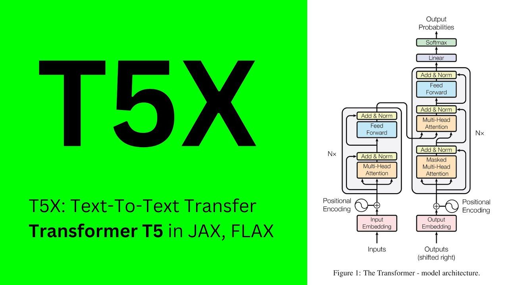

## Table of Contents

## What is T5X and what does it stand for?

T5X is a software framework used for building and training machine learning models, especially those that handle text and language. It is designed to make it easier for researchers and developers to experiment with and improve these models. T5X stands for "Text-to-Text Transfer Transformer eXtensions." This name reflects its focus on the T5 (Text-to-Text Transfer Transformer) model, which is a type of model that can turn any text input into any text output.

The framework is built to be fast and efficient, allowing users to train large models on big datasets without using too much time or computer power. T5X is also flexible, meaning it can be used for many different tasks, like translating languages, answering questions, or summarizing text. By providing a set of tools and extensions, T5X helps users to push the boundaries of what is possible with language models.

## How does T5X differ from the original T5 model?

T5X is not a model like T5, but a framework that helps in building and training models like T5 more efficiently. The original T5 model, or Text-to-Text Transfer Transformer, is a specific type of machine learning model that can handle many language tasks by turning any text input into any text output. T5X, on the other hand, is a set of tools and extensions that make it easier for researchers and developers to work with models like T5. It focuses on making the training process faster and more efficient, allowing for bigger models and larger datasets to be used without taking too much time or computer power.

While T5 is the model that performs the actual language tasks, T5X provides the infrastructure to support and improve that model. T5X is designed to be flexible, meaning it can be used not just with T5 but also with other similar models. This flexibility allows users to experiment with different ways of training and using language models, potentially leading to better performance and new discoveries in the field of natural language processing. In simple terms, if T5 is the car that drives language tasks, T5X is the garage that helps in building, tuning, and maintaining that car to make it run better.

## What are the key features of T5X that make it suitable for machine learning tasks?

T5X is designed to make [machine learning](/wiki/machine-learning) tasks easier and faster. It helps researchers and developers build and train big language models like T5 without using too much time or computer power. T5X is very flexible, which means it can be used for many different tasks, like translating languages, answering questions, or summarizing text. This flexibility comes from its ability to work with different types of models and handle large datasets efficiently.

One of the key features of T5X is its speed. It uses smart ways to process data and train models, which makes everything run faster. This is important because training big models can take a long time, and T5X helps to cut down on that time. Another important feature is its scalability. T5X can handle models of different sizes and datasets of different scales, making it a good choice for both small projects and big research efforts. By providing these tools, T5X helps users to experiment and improve their language models more easily.

## Can you explain the architecture of T5X?

T5X is built to help with machine learning tasks, especially for big language models like T5. It has a special way of working that makes it fast and efficient. T5X uses something called the "XLA" (Accelerated Linear Algebra) compiler, which is like a smart helper that makes calculations faster. This means T5X can handle big models and lots of data without taking too long. It also uses a system called "JAX" to do its math, which is good at working with big numbers and doing things in parallel, which means doing many things at once.

Another important part of T5X is its modular design. This means it's made up of different parts that can be changed or swapped out easily. For example, T5X has parts for handling data, parts for training models, and parts for making predictions. Because of this, T5X can be used for many different tasks, like translating languages or answering questions. It also means that researchers can try out new ideas and improvements without having to change the whole system. This flexibility makes T5X a useful tool for working with language models.

## How does T5X handle different types of data inputs?

T5X is designed to handle different types of data inputs easily. It can work with text data, which is what language models like T5 use. When you give T5X some text, it turns the text into numbers that the model can understand. This process is called tokenization, where each word or part of a word is turned into a number. T5X uses special tools to do this quickly and efficiently, so it can handle big amounts of text without slowing down.

Another important thing about T5X is that it can also deal with other types of data if needed. For example, if you want to mix text with numbers or other information, T5X can handle that too. It uses a flexible system that lets you feed in different kinds of data and process them in a way that works well for the model. This makes T5X a good choice for tasks where you need to work with different kinds of information at the same time.

## What are the typical applications of T5X in machine learning?

T5X is used a lot in machine learning for tasks that involve understanding and working with text. One common use is for translating languages. If you have text in one language, T5X can help train a model to turn that text into another language. Another big use is for answering questions. With T5X, you can train a model to read a question and give a good answer based on what it knows. It's also used for summarizing long pieces of text into shorter, easier-to-read versions. These are just a few examples, but T5X can help with many different text tasks.

Another important application of T5X is in research and development. Researchers use T5X to try out new ideas and improve how language models work. They can experiment with different ways of training models, which can lead to better results. T5X makes it easier to work with big models and lots of data, so it's a great tool for pushing the boundaries of what's possible with language models. By making the process faster and more efficient, T5X helps researchers focus on coming up with new and better ways to understand and use language.

## How can T5X be fine-tuned for specific tasks?

Fine-tuning T5X for specific tasks means training it a bit more to make it really good at one thing, like translating a certain language or answering questions about a specific topic. To do this, you start with a model that's already been trained on a lot of general text. Then, you give it more examples that are just about the task you want it to do. For example, if you want it to translate English to French, you would give it lots of English sentences and their French translations. As the model sees more of these examples, it gets better at the task.

The process of fine-tuning involves adjusting the model's weights, which are like the settings that help the model understand and generate text. You do this by running the model on your specific data and using a method called backpropagation to update the weights. This helps the model learn from its mistakes and get better at the task over time. T5X makes this process easier because it's fast and can handle big amounts of data, so you can fine-tune your model more quickly and effectively.

## What performance improvements does T5X offer over other models?

T5X is designed to make training big language models faster and more efficient. It does this by using smart ways to process data and train models. For example, T5X uses the XLA compiler, which helps with doing calculations faster. This means that T5X can handle big models and lots of data without taking too long. When compared to other models, T5X can train on the same data in less time, which is a big help for researchers and developers who need to experiment with different ideas quickly.

Another way T5X improves performance is through its ability to work with different types of models and handle large datasets. This flexibility means that T5X can be used for many different tasks, like translating languages or answering questions. Because T5X can do these tasks faster and with more data, it often gives better results than other models. This makes T5X a powerful tool for pushing the boundaries of what's possible with language models.

## What are the system requirements for running T5X?

To run T5X, you need a computer with a good amount of memory and a fast processor. T5X works best on machines with lots of RAM, usually at least 32GB, but more is better if you are working with big models and lots of data. You also need a good graphics card, like an NVIDIA GPU, because T5X uses it to do calculations faster. The operating system should be Linux, as T5X is made to work well with it. You might need to use a cloud service if your personal computer does not meet these requirements, as they can provide the power needed to run T5X smoothly.

Setting up T5X also requires you to install some software. You need to have Python installed, usually version 3.7 or newer. T5X uses a tool called JAX, so you need to install that too. You can do this by running a command like ```pip install jax jaxlib```. T5X also needs the XLA compiler, which comes with JAX. Make sure you have enough storage space on your computer because T5X models can be very big. If everything is set up correctly, T5X can help you train language models faster and more efficiently.

## How does T5X integrate with other machine learning frameworks?

T5X is made to work well with other machine learning tools. It uses JAX, which is a library that helps with doing math quickly on computers. Because of this, T5X can easily connect with other tools that also use JAX. For example, if you want to use T5X with a tool like Flax, which is another library for building machine learning models, you can do that because both use JAX. This makes it easy to move data and models between different parts of your project.

T5X also works well with tools that help with handling data and training models. For instance, you can use T5X with TensorFlow datasets to manage your data, and then train your models using T5X's fast training methods. This means you can use the strengths of different tools together. By connecting T5X with other frameworks, you can build a complete system that helps you train and use language models more effectively.

## What are the current limitations or challenges faced by T5X?

T5X is a powerful tool for training language models, but it still has some challenges. One big challenge is that T5X needs a lot of computer power to work well. This means you might need special hardware like strong GPUs, or you might have to use cloud services, which can be expensive. Another challenge is that T5X can be hard to set up and use if you're new to it. You need to make sure you have all the right software installed, like Python and JAX, and this can take some time to get right.

Another limitation is that T5X is mainly focused on working with text. While it can handle other types of data, it's not as good at it as it is with text. This means if you want to work with other kinds of data, like pictures or numbers, you might need to use other tools along with T5X. Also, even though T5X is fast, training big models can still take a long time. You need to be patient and make sure you have enough time and resources to get the best results from your models.

## What future developments are expected for T5X in the field of machine learning?

In the future, T5X is expected to become even better at training language models quickly and efficiently. Researchers are working on making T5X use less computer power while still being able to handle big models and lots of data. They are also looking into ways to make T5X work well with other types of data, like pictures and numbers, so it can be used for more kinds of tasks. This could mean that T5X will be able to help with things like understanding both text and images at the same time, which is a big challenge in machine learning.

Another area where T5X might see improvements is in how easy it is to use. Right now, setting up T5X can be hard if you're new to it. In the future, there might be better tools and guides to help people get started with T5X more easily. This would make it more accessible to more people, not just experts. Also, as more people use T5X, there could be new ways to fine-tune models for very specific tasks, making T5X even more useful for different kinds of projects in machine learning.