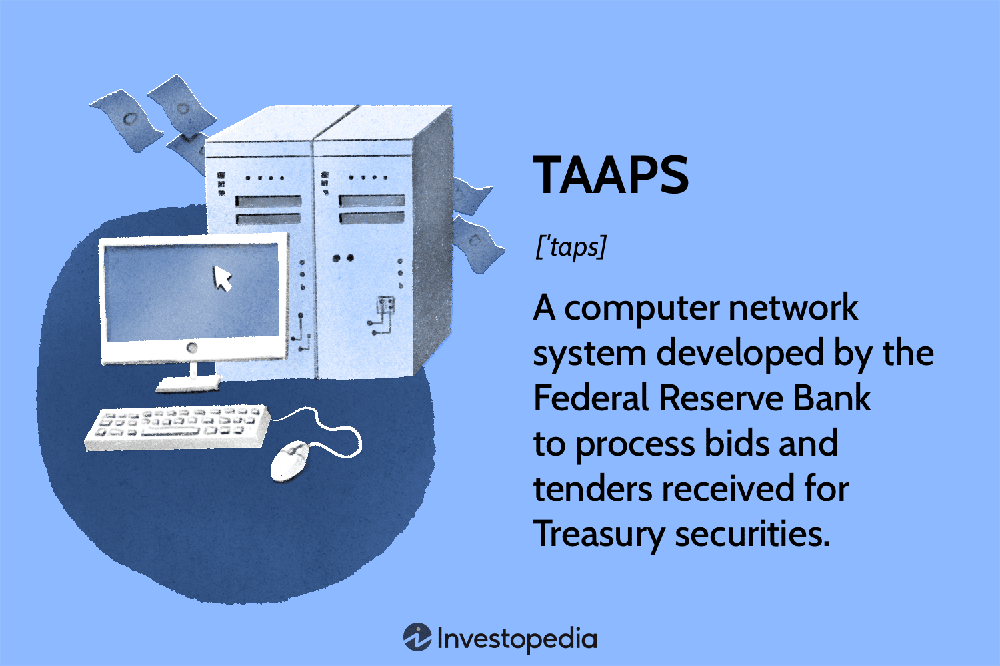

In today's fast-paced financial markets, technology is essential for ensuring trading efficiency and accuracy. At the heart of modern trading is algorithmic trading, or algo-trading, a method that enables traders to execute trades with precision and speed through automated computer programs implementing pre-defined strategies. Algo-trading has transformed the financial landscape by minimizing human intervention and leveraging advanced data analysis in decision-making processes.

One significant technological advancement that complements algo-trading is the Treasury Automated Auction Processing System, known as TAAPS. Developed by the Federal Reserve Bank, TAAPS is a computerized network designed to process bids and tenders for Treasury securities. By enabling institutions to submit bids electronically, TAAPS ensures adherence to regulatory compliance while streamlining the Treasury securities auction process.



The integration of TAAPS with algorithmic trading represents a powerful synergy. Together, they enhance trading operations, offering benefits such as increased execution speed, reduced transaction costs, and improved accuracy. This article explores the intersection of TAAPS technology and algorithmic trading, highlighting their combined potential to revolutionize trading practices in financial markets.

## Table of Contents

## What is TAAPS Technology?

TAAPS stands for Treasury Automated Auction Processing System, a sophisticated computer network system developed by the Federal Reserve Bank. Designed with the primary objective of handling bids and tenders for Treasury securities, TAAPS facilitates a smooth, efficient, and highly accurate auction process. This system represents a critical advancement in the automation of financial transactions, particularly within the domain of government securities. By providing a digital platform for electronic bid submission, TAAPS enables institutions to participate in Treasury auctions directly. This eliminates the necessity for intermediaries, thereby streamlining the process and enhancing compliance with regulatory frameworks.

The introduction of TAAPS into the auction process significantly enhances both speed and efficiency. This improvement is largely due to its capability to handle large volumes of data and transactions with exceptional precision. The conventional manual methods, which were often prone to errors and delays, have been largely superseded by this automated approach. In a typical auction scenario, institutions can electronically submit competitive and non-competitive bids. TAAPS processes these submissions nearly instantaneously, ensuring timely auction closures and the swift allocation of securities.

Furthermore, TAAPS plays a key role in ensuring that the auction mechanism adheres to stringent regulatory standards set forth by financial authorities. By automating and documenting each step of the process, it facilitates thorough auditing and transparency, which are paramount in maintaining the integrity of financial markets. This compliance feature not only bolsters confidence among market participants but also aids in the prevention of fraudulent activities.

In essence, TAAPS represents a pivotal advancement in Treasury securities auctions. Its electronic submission capabilities, coupled with a robust framework for compliance and efficiency, underscore its importance as a core technology within the financial market infrastructure. As such, TAAPS not only enhances the operational speed of Treasury auctions but also significantly contributes to the overarching goal of achieving a more secure and reliable financial trading environment.

## The Intersection of TAAPS and Algorithmic Trading

TAAPS technology serves as a robust infrastructure for the automated execution of large-[volume](/wiki/volume-trading-strategy) trades in the U.S. Treasury securities market. By digitizing the processes associated with Treasury auctions, TAAPS ensures that institutional investors can participate in primary market activities with greater speed and precision. Algorithmic trading, characterized by the use of pre-defined algorithms to execute trades at speeds and frequencies beyond human capabilities, naturally complements TAAPS. 

Through [algorithmic trading](/wiki/algorithmic-trading), traders are able to deploy complex strategies that calculate optimal bidding prices and volumes. These strategies often rely on quantitative models that incorporate a range of market data inputs, such as interest rates, economic indicators, and previous auction results. For instance, an algorithm might use historical [volatility](/wiki/volatility-trading-strategies) as a predictor to adjust bid prices dynamically:

```python
def adjust_bid_based_on_volatility(historical_prices):
    # Simple example using standard deviation as a measure of volatility
    import numpy as np
    volatility = np.std(historical_prices)
    base_bid_price = np.mean(historical_prices)
    adjusted_bid = base_bid_price * (1 + volatility)
    return adjusted_bid

# Example usage
historical_prices = [99.5, 99.6, 99.7, 99.8, 99.9]
adjusted_bid_price = adjust_bid_based_on_volatility(historical_prices)
```

Together, TAAPS and algorithmic trading facilitate high-speed trading and instantaneous market responses, essential for institutional and high-frequency traders. The ability to engage in rapid bidding without the delays associated with traditional, manual methods of trade execution is critical in environments where seconds can determine financial outcomes. 

Moreover, TAAPS enhances the capabilities of algorithmic trading by allowing direct access to the auction process. This direct access minimizes both execution time and costs, as it reduces the reliance on intermediaries who would traditionally perform these trades. By integrating TAAPS into an algorithmic trading framework, institutions can achieve a competitive edge in the primary Treasury securities market, ensuring that they can secure assets at favorable rates and adjust their portfolios in real-time as market conditions evolve.

## Benefits of Using TAAPS in Algo Trading

Direct auction access through the Treasury Automated Auction Processing System (TAAPS) presents significant advantages for institutions engaged in algorithmic trading. By allowing direct participation in Treasury auctions, TAAPS eliminates the need for intermediaries. This not only reduces transaction costs but also speeds up the trading process, contributing to more responsive and nimble trading strategies.

The integration of TAAPS with algorithmic trading is a catalyst for improved efficiency in trading operations. Automation within the TAAPS framework minimizes the likelihood of manual errors, such as incorrect bid submissions or processing delays, thus ensuring a smoother transaction workflow. This high level of automation also contributes to unprecedented speed in trade execution, a critical [factor](/wiki/factor-investing) in markets where timely transactions correlate with trading success.

Cost reduction is another significant benefit associated with combining TAAPS with algorithmic trading. Automating the bid submission and processing phases reduces the labor costs traditionally incurred through manual trading methods. Furthermore, operational expenses, such as those associated with maintaining large trading teams or expensive intermediary services, are minimized. This allows financial institutions to allocate resources more effectively and focus on strategic investment opportunities.

Additionally, the use of TAAPS in algo trading contributes to heightened market [liquidity](/wiki/liquidity-risk-premium). Rapid and reliable execution of trades, facilitated by TAAPS, ensures that Treasury securities are more readily available to market participants. This increased liquidity enhances price stability and can lead to more favorable trading conditions. In highly liquid markets, traders benefit from tight bid-ask spreads, reducing the cost of entering and exiting positions.

Overall, the synergy between TAAPS and algorithmic trading offers numerous benefits—namely, direct auction access, improved operational efficiency, cost reduction, and increased market liquidity. These advantages empower institutional investors with the tools necessary to optimize trading performance in fast-paced financial environments.

## Risks and Challenges

Despite its advantages, the integration of TAAPS and algorithmic trading also presents several risks and challenges. These include technical failures, market volatility, and regulatory scrutiny, all of which require careful consideration and management.

**Technical Failures**: Computer and network systems, including those used in TAAPS and algorithmic trading, are susceptible to technical failures. System outages, software bugs, or network disruptions can lead to missed trading opportunities or result in erroneous trades. For instance, if an algorithm fails to execute orders due to a server crash, it could significantly impact trading performance and operational continuity. Regular maintenance, robust system design, and backup protocols are vital to mitigate such risks.

**Market Volatility**: Algorithmic trading can exacerbate market volatility, especially during high-frequency trading periods. Algorithms are programmed to respond to market conditions, and during periods of rapid market changes, they can intensify price swings. This situation may lead to flash crashes, where the rapid selling of securities causes a sudden, deep drop in prices followed by a swift recovery. Therefore, continuous monitoring and the incorporation of volatility checks within algorithms are necessary to cushion against excessive market movements.

**Regulatory Scrutiny**: Algo trading mandates strict adherence to regulatory frameworks to ensure market integrity and fairness. This requires constant updates to algorithms and compliance checks to comply with evolving regulations. Regulatory bodies like the Securities and Exchange Commission (SEC) and the Commodity Futures Trading Commission (CFTC) often oversee algorithmic trading activities. Non-compliance can lead to severe penalties, impacting financial and reputational standing. Firms must invest in compliance infrastructure and stay informed about regulatory changes to navigate this complex landscape successfully.

## Future Trends and Developments

The future of TAAPS (Treasury Automated Auction Processing System) and algorithmic trading is poised for evolution driven by advances in technology and integration. Central to this progression are AI (Artificial Intelligence) and Machine Learning, which hold significant promise in refining algorithmic trading strategies. These technologies enhance predictive modeling and decision-making capabilities, allowing for more accurate analysis of market trends and behaviors. By employing sophisticated algorithms that learn from historical data, traders can better anticipate market movements, thereby optimizing trade execution and profitability.

In addition to AI advancements, cloud-based solutions are expected to play a transformative role. By migrating to cloud platforms, firms can significantly reduce infrastructure costs, enabling more scalable and flexible trading operations. This shift not only lowers the barriers to entry for smaller firms but also enhances data processing capabilities, ensuring that trades can be executed more efficiently and with greater precision.

Furthermore, as the landscape of algorithmic trading evolves, there is an anticipated need for more comprehensive regulatory frameworks. These regulations would aim to ensure the security and sustainability of algorithmic trading practices. With the potential for increased market volatility introduced by algorithmic strategies, regulatory bodies are likely to focus on developing measures that mitigate associated risks while promoting transparency and fairness.

Overall, the integration of AI, cloud technology, and robust regulatory frameworks promises to bolster the capabilities of both TAAPS and algorithmic trading. This convergence is expected to lead to more sophisticated, cost-effective, and secure trading environments, benefiting institutional investors and contributing to the continued efficiency and innovation within financial markets.

## Conclusion

TAAPS technology significantly enhances algorithmic trading by offering notable benefits such as speed, efficiency, and cost savings. By automating the auction process for Treasury securities, TAAPS reduces the latency and manual errors typically associated with traditional trading methods. This allows institutional investors to strategize and execute trades with precision, potentially increasing their overall trading performance. 

The combination of TAAPS and algorithmic trading serves as a powerful tool, providing institutions with the dual advantages of direct auction access and high-frequency trading capabilities. The efficiency gain from this integration not only reduces operational costs but also enhances market liquidity by ensuring swift and reliable trade execution.

However, it is essential to recognize and manage the inherent risks and challenges, such as technical failures, heightened market volatility, and the stringent regulatory landscape. These risks necessitate continuous monitoring and adaptation, ensuring that technological advances are leveraged responsibly and effectively.

As the financial markets continue to evolve, the synergy between TAAPS and algorithmic trading positions both technologies at the forefront of trading innovation. Future developments, including the integration of AI and [machine learning](/wiki/machine-learning), cloud-based solutions, and evolving regulatory measures, are likely to further solidify their role in advancing trading capabilities for institutional investors.

## References & Further Reading

[1]: Garbade, K. D., & Ingber, J. F. (2005). ["The Treasury Auction Process: Objectives, Structure, and Recent Adaptations."](https://www.semanticscholar.org/paper/The-Treasury-Auction-Process%3A-Objectives%2C-and-Garbade-Ingber/9f227679c9323c781dfe828fa0024854bd4eff44) Federal Reserve Bank of New York Economic Policy Review.

[2]: Almgren, R., & Chriss, N. (2001). ["Optimal execution of portfolio transactions."](https://smallake.kr/wp-content/uploads/2016/03/optliq.pdf) Journal of Risk, 3(2), 5-39.

[3]: Domowitz, I., & Steil, B. (1999). ["Automation, Trading Costs, and the Structure of the Securities Trading Industry."](https://www.nomurafoundation.or.jp/en/wordpress/wp-content/uploads/2014/09/19971011_Ian_Domowitz_-_Benn_Steil.pdf) Oxford Review of Economic Policy, 15(4), 17-32.

[4]: Hendershott, T., Jones, C. M., & Menkveld, A. J. (2011). ["Does Algorithmic Trading Improve Liquidity?"](https://onlinelibrary.wiley.com/doi/full/10.1111/j.1540-6261.2010.01624.x) The Review of Financial Studies, 24(3), 711-743.

[5]: Lopez de Prado, M. (2018). ["Advances in Financial Machine Learning."](https://www.amazon.com/Advances-Financial-Machine-Learning-Marcos/dp/1119482089) Wiley.