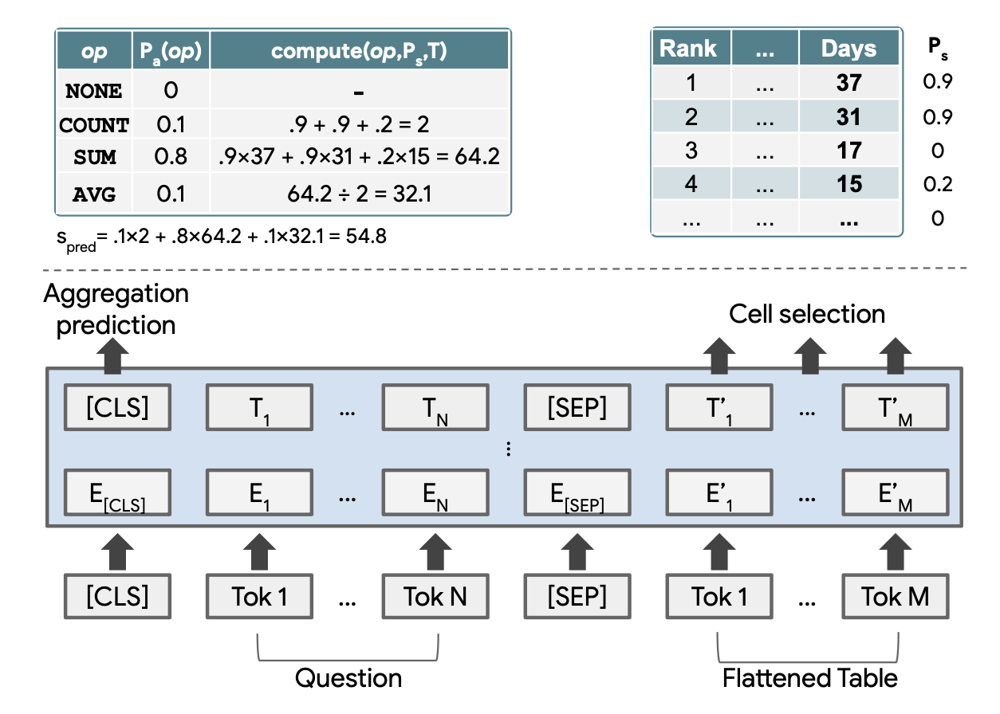

## Table of Contents

## What is table parsing in machine learning?

Table parsing in machine learning is the process of extracting and understanding data from tables, which can be found in documents, websites, or databases. This is important because tables often contain structured information that can be used for various tasks, like data analysis or training machine learning models. The goal of table parsing is to convert the table's visual layout into a format that computers can easily process and analyze, such as a spreadsheet or a database table.

To perform table parsing, machine learning algorithms are used to identify the structure of the table, including rows, columns, and cells. These algorithms can be trained to recognize different table formats and extract the data accurately. For example, they might use techniques like image recognition to detect lines and borders in a table image, or natural language processing to understand the headers and content of the cells. Once the table is parsed, the extracted data can be used for further analysis or as input for other machine learning models.

## Why is table parsing important in data processing?

Table parsing is important in data processing because it helps turn messy table data into neat, organized information that computers can use easily. When you have a lot of data in tables, like in reports or on websites, it can be hard to use that data without first cleaning it up. Table parsing helps by figuring out where the rows, columns, and cells are, and then pulling out the information so it can be used for things like making charts or running calculations.

This process is really helpful for businesses and researchers who need to analyze big sets of data quickly. For example, if a company wants to look at sales numbers from different stores, table parsing can take the data from a bunch of different tables and put it all into one place. This makes it easier to see patterns and make decisions. Without table parsing, people would have to do this work by hand, which would take a lot longer and could lead to mistakes.

## What are the basic components of a table parsing model?

The basic components of a table parsing model include a detection module and an extraction module. The detection module is responsible for identifying the presence and location of tables within a document or image. It uses techniques like image processing or [machine learning](/wiki/machine-learning) algorithms to find the boundaries of the table, including lines, borders, and sometimes even the text within the cells. Once the table is detected, the extraction module comes into play. This module focuses on understanding the structure of the table, such as the rows, columns, and cells, and then pulling out the data from each cell. It might use natural language processing to interpret the headers and content, ensuring that the data is correctly categorized and ready for further use.

Another important component is the post-processing module, which refines the extracted data. This module can handle tasks like data cleaning, where it corrects any errors or inconsistencies in the extracted data, and data normalization, where it standardizes the data into a common format. For example, if the table contains dates in different formats, the post-processing module can convert them all to a single format like YYYY-MM-DD. This ensures that the data is consistent and ready for analysis or to be fed into other systems or models. Together, these components make up a robust table parsing model that can efficiently turn complex table data into usable information.

## How does Cycle-CenterNet approach table parsing?

Cycle-CenterNet is a special way to do table parsing that uses a method called object detection to find tables and their parts. It looks at pictures or documents and finds the center points of tables, rows, columns, and cells. By focusing on these center points, Cycle-CenterNet can figure out where everything is in the table. This method is good because it can handle tables that are not perfectly lined up or have missing lines, making it more flexible than other methods.

After finding the center points, Cycle-CenterNet uses something called a cycle-consistency check to make sure the table structure it finds is correct. This check helps the model understand how the rows, columns, and cells connect with each other. By doing this, Cycle-CenterNet can put the data from the table into a neat format that computers can easily use. This approach helps make table parsing more accurate and useful for turning messy table data into organized information.

## What are the key differences between Cycle-CenterNet and traditional table parsing methods?

Cycle-CenterNet is different from traditional table parsing methods because it uses object detection to find the center points of tables, rows, columns, and cells. Traditional methods might use image processing to detect lines and borders or rely on rule-based systems to understand the table structure. Cycle-CenterNet, on the other hand, focuses on these center points, which makes it better at handling tables that are not perfectly aligned or have missing lines. This flexibility is a big advantage over traditional methods that can struggle with irregular tables.

Another key difference is that Cycle-CenterNet uses a cycle-consistency check to make sure the table structure it finds is correct. Traditional methods might not have this step, and they might use simpler ways to check their results, like comparing the parsed table to a set of rules. The cycle-consistency check helps Cycle-CenterNet understand how rows, columns, and cells connect with each other, leading to more accurate results. This makes Cycle-CenterNet a more reliable choice for turning messy table data into organized information that computers can use easily.

## What datasets are commonly used to train and evaluate table parsing models like Cycle-CenterNet?

Some of the most commonly used datasets for training and evaluating table parsing models like Cycle-CenterNet are ICDAR 2013, ICDAR 2019, and PubTabNet. The ICDAR 2013 dataset includes images of tables from various sources, like [books](/wiki/algo-trading-books) and scientific papers, and is used to test how well models can detect and parse tables. The ICDAR 2019 dataset is a newer version with more variety and is used to see how models handle different types of tables. PubTabNet is a large dataset that has tables from scientific articles, which is great for training models to understand complex tables.

These datasets are important because they help researchers and developers see how well their table parsing models work in real-world situations. For example, ICDAR datasets are used to check if a model can correctly identify tables in different formats and layouts, while PubTabNet helps test the model's ability to extract data from tables that have a lot of information and complex structures. By using these datasets, developers can make sure their models like Cycle-CenterNet are accurate and useful for turning messy table data into organized information.

## How does Cycle-CenterNet handle complex table structures?

Cycle-CenterNet handles complex table structures by focusing on the center points of tables, rows, columns, and cells. Instead of trying to find lines and borders like some other methods, it looks at these key points to understand where everything is. This approach is really good for tables that are not perfectly lined up or have missing parts. For example, if a table has some lines missing or if the cells are not in a straight grid, Cycle-CenterNet can still figure out the structure by using the center points.

To make sure it gets the table structure right, Cycle-CenterNet uses a special check called cycle-consistency. This check helps the model understand how the rows, columns, and cells connect with each other. By doing this, Cycle-CenterNet can put the data from the table into a neat format that computers can easily use. This way, even if the table is really complex with lots of information, Cycle-CenterNet can still turn it into organized data that is ready for further use.

## What are the performance metrics used to evaluate table parsing models?

Table parsing models are evaluated using several key performance metrics. One important metric is the accuracy of table detection, which measures how well the model can find tables in a document or image. Another metric is the precision and recall of cell recognition, which looks at how correctly the model identifies the rows, columns, and cells within the tables. Precision tells us how many of the identified cells are actually correct, while recall tells us how many of the actual cells were correctly identified. These metrics help us understand how good the model is at handling different types of tables and structures.

Another important metric is the F1 score, which is a way to combine precision and recall into one number. The F1 score is calculated using the formula $$F1 = 2 \times \frac{\text{precision} \times \text{recall}}{\text{precision} + \text{recall}}$$. This score gives a balanced view of the model's performance. Additionally, the structural similarity index (SSIM) can be used to evaluate how well the model preserves the original table structure when it converts it into a new format. By looking at these different metrics, researchers and developers can see how well their table parsing models work and where they might need to make improvements.

## How can table parsing models be integrated into larger document analysis systems?

Table parsing models can be integrated into larger document analysis systems by serving as a specialized component that focuses on extracting and understanding data from tables within documents. When a document is processed by the system, the table parsing model can be triggered to identify and extract table data once the document's text and images have been analyzed. This extracted data can then be fed into other parts of the system for further analysis, like data aggregation, report generation, or feeding into machine learning models for tasks like predictive analytics. By integrating the table parsing model, the system can handle a wider range of document types and extract more valuable information, making the overall analysis more comprehensive and effective.

For example, if a company uses a document analysis system to process financial reports, the table parsing model can extract data from tables containing sales figures, expenses, and profits. This data can then be used by other parts of the system to generate summaries, charts, or even predict future trends. The integration of table parsing models enhances the system's ability to turn raw document data into actionable insights, making it a crucial tool for businesses and researchers who need to analyze large volumes of documents efficiently.

## What are the current challenges and limitations of table parsing models like Cycle-CenterNet?

One of the main challenges for table parsing models like Cycle-CenterNet is dealing with very complex or unusual table layouts. Some tables might have merged cells, irregular grids, or no clear lines separating the rows and columns. This can make it hard for the model to understand the structure correctly. Cycle-CenterNet uses center points to figure out the table, which helps with some of these problems, but it can still struggle with tables that are really different from what it was trained on. Another challenge is that the model needs a lot of good data to learn from. If the training data doesn't include enough examples of different types of tables, the model might not work well on new tables it hasn't seen before.

Another limitation is that table parsing models can sometimes make mistakes when they try to understand the content of the cells. For example, if a cell has text that looks like a number but is actually a label, the model might get confused. Also, if the tables have a lot of text or special symbols, the model might have trouble figuring out what's important and what's not. These mistakes can lead to wrong data being extracted, which can mess up the results of any analysis that uses this data. To make table parsing models better, researchers are working on improving how the models learn from data and how they handle different kinds of tables and cell contents.

## What recent advancements have been made in table parsing beyond Cycle-CenterNet?

Recent advancements in table parsing have focused on improving the accuracy and flexibility of models to handle a wider variety of table structures. One notable advancement is the use of [deep learning](/wiki/deep-learning) techniques like Transformer models, which are good at understanding the context and relationships within tables. For example, models like TableFormer use attention mechanisms to better understand how rows and columns relate to each other, making them more effective at parsing complex tables with merged cells or irregular layouts. Another advancement is the integration of multi-modal learning, where models use both visual and textual information to parse tables. This approach helps models better understand tables in documents with mixed content, improving the overall accuracy of the parsing process.

Another significant advancement is the development of models that can handle tables across different languages and formats. For instance, models like TabStruct use a combination of structural and semantic information to parse tables, which is particularly useful for tables in languages with different writing systems or in documents with varying layouts. These models have been trained on diverse datasets, allowing them to perform well on tables from scientific papers, financial reports, and websites. Additionally, advancements in post-processing techniques have improved the quality of the extracted data. Techniques like data normalization and error correction ensure that the parsed data is consistent and ready for further analysis, making table parsing more reliable and useful for real-world applications.

## How can one fine-tune a Cycle-CenterNet model for a specific domain or type of table?

To fine-tune a Cycle-CenterNet model for a specific domain or type of table, you need to gather a dataset that includes examples of the tables you want the model to work with. For example, if you're working with financial reports, you'd collect tables from those reports. Once you have this dataset, you can use it to train the model further. This process involves adjusting the model's parameters so it gets better at recognizing and parsing the specific types of tables in your dataset. You might need to use techniques like transfer learning, where you start with a pre-trained model and then train it more on your specific data. This helps the model learn the unique features of your tables, like special layouts or types of data.

During the fine-tuning process, you'll need to keep an eye on performance metrics like accuracy, precision, recall, and the F1 score, which is calculated using the formula $$F1 = 2 \times \frac{\text{precision} \times \text{recall}}{\text{precision} + \text{recall}}$$. These metrics will help you see how well the model is doing on your specific tables. You might also need to adjust the model's hyperparameters, like the learning rate or the number of training epochs, to get the best results. By carefully fine-tuning the Cycle-CenterNet model with your domain-specific data, you can make it more accurate and useful for your particular needs.