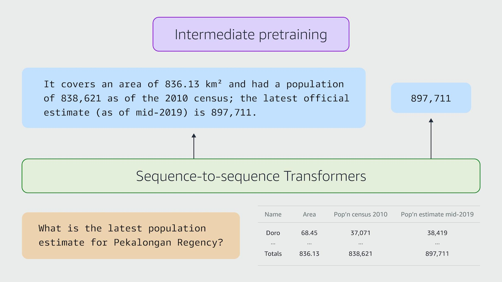

## Table of Contents

## What is a Table Question Answering Model?

A Table Question Answering Model is a type of artificial intelligence system that can understand and answer questions about data presented in tables. These models are designed to read the information in a table, interpret the question asked, and provide an accurate answer based on the data within the table. For example, if you have a table with sales data and you ask the model, "What were the total sales in January?", the model would look at the table, find the sales data for January, and give you the answer.

These models use techniques from natural language processing and machine learning to understand both the structure of the table and the meaning of the question. They need to be trained on lots of examples of tables and questions to get good at answering. The goal is to make it easier for people to get information from large datasets without having to manually search through the data themselves. This can be very useful in many fields, like business, research, and education, where data is often organized in tables.

## How do Table Question Answering Models differ from traditional Question Answering systems?

Table Question Answering Models are specialized to work with data that is organized in tables, while traditional Question Answering systems are designed to handle questions about text. When you ask a question to a Table Question Answering Model, it looks at the rows and columns of a table to find the answer. For example, if you ask about sales in a specific month, the model will search through the table to find the right cell with the answer. On the other hand, a traditional Question Answering system would look through paragraphs of text to find an answer. It might answer questions like "Who wrote the book 'To Kill a Mockingbird'?" by searching through text to find the author's name.

The way these models process information is different too. Table Question Answering Models need to understand the structure of tables, which means they have to learn how to read rows, columns, and headers. They use this knowledge to figure out where to find the answer in the table. Traditional Question Answering systems focus on understanding the language in the text, using techniques like natural language processing to make sense of sentences and paragraphs. Both types of systems use [machine learning](/wiki/machine-learning), but the data they train on is different. Table Question Answering Models train on examples of tables and questions about them, while traditional systems train on text and questions about that text.

## What are some common applications of Table Question Answering Models?

Table Question Answering Models are widely used in business to help people quickly get information from large datasets. For example, in a company, these models can answer questions about sales, inventory, or customer data by looking at tables. If someone needs to know the total sales for a specific product in the last quarter, the model can search through the sales table and provide the answer instantly. This saves time and helps businesses make decisions faster.

In the field of research, Table Question Answering Models are useful for scientists and researchers who need to analyze data from experiments or surveys. These models can answer questions about data in tables, helping researchers find patterns or specific information without having to manually go through the data. For instance, a researcher might ask the model to find the average temperature recorded in a set of experiments, and the model will look at the temperature data in the table and calculate the average. This makes the research process more efficient and less prone to human error.

## Can you explain the basic architecture of a Table Question Answering Model?

The basic architecture of a Table Question Answering Model consists of several main parts that work together to understand and answer questions about tables. First, there's a part called the table encoder, which reads the table and turns it into a format the model can understand. It looks at the rows, columns, and headers of the table and creates a representation of the table's structure and content. Next, there's a question encoder, which takes the question you ask and turns it into a format the model can work with. It breaks down the question into parts to understand what you're asking about. Both the table and question encoders use techniques from natural language processing and machine learning to do their jobs.

Once the table and question are encoded, the model uses a part called the reasoning module to find the answer. This module looks at the encoded table and question and figures out where in the table to find the answer. It might need to do some calculations or combine information from different parts of the table. After the reasoning module does its work, the answer decoder takes the result and turns it into a form you can understand, like a number, a piece of text, or even a formula like $$ \text{Total Sales} = \sum (\text{Sales per Month}) $$. The whole process is designed to be fast and accurate, so you get the information you need from the table quickly and correctly.

## What is MATE and how does it work in the context of table question answering?

MATE, which stands for "Multimodal Attention for Table Extraction," is a model used for answering questions about tables. It works by combining information from both the table and the question to find the right answer. MATE uses something called attention mechanisms, which help the model focus on the important parts of the table and question. For example, if you ask about sales in January, MATE will pay more attention to the row or column labeled "January" and less to other parts of the table.

When you ask MATE a question, it first turns the table and question into numbers that a computer can understand. Then, it uses these numbers to figure out which parts of the table are important for answering the question. MATE looks at how the words in the question relate to the words in the table and uses this information to find the answer. If the question is about calculating something, like total sales, MATE can do the math and give you the result, such as $$ \text{Total Sales} = \sum (\text{Sales per Month}) $$. This makes it easier for people to get information from tables without having to look through them manually.

## How does TAPAS approach table question answering and what makes it unique?

TAPAS, which stands for "Table PArSing," is a model that answers questions about tables by understanding both the table and the question. It uses a technique called weak supervision, where it learns from examples that are not perfectly labeled. This means TAPAS can learn from tables and questions without needing exact answers for every example. Instead of looking at each part of the table separately, TAPAS looks at the whole table at once. It then figures out which cells in the table are important for answering the question. For example, if you ask about sales in January, TAPAS will focus on the cells that have "January" and "sales" in them.

What makes TAPAS unique is its ability to handle questions that need some math to answer. It can do calculations like adding up numbers or finding averages directly from the table. For instance, if you ask for the total sales for the year, TAPAS can look at the sales numbers for each month and add them up to give you the answer, like $$ \text{Total Sales} = \sum (\text{Sales per Month}) $$. This makes TAPAS very useful for tasks where you need to do some quick calculations based on the data in the table.

## What are the key challenges faced when training Table Question Answering Models?

Training Table Question Answering Models can be tricky because tables come in many different shapes and sizes. Each table might have a different way of organizing information, like different headers or rows and columns. The model needs to learn how to read all these different kinds of tables. Also, the questions people ask about tables can be complicated. They might need the model to do some math, like adding up numbers or finding an average. For example, if someone asks for the total sales for the year, the model has to find the right cells in the table and add them up, like $$ \text{Total Sales} = \sum (\text{Sales per Month}) $$. This makes training the model harder because it has to learn how to handle all these different tasks.

Another big challenge is getting enough good examples to train the model. The model needs to see lots of different tables and questions to learn how to answer correctly. But finding and labeling all these examples takes a lot of time and effort. Sometimes, the examples might not be perfect, and the model has to learn from them anyway. This is called weak supervision, and it can make training more difficult. But it's important because it helps the model learn from real-world data, which is often messy and not perfectly organized.

## How do you evaluate the performance of Table Question Answering Models?

To evaluate the performance of Table Question Answering Models, we use different metrics that help us see how well the model is doing. One common metric is accuracy, which checks if the model's answer matches the correct answer. For example, if the model says the total sales in January were $50,000 and that's the right answer, it gets a point for accuracy. Another important metric is the F1 score, which looks at both how many correct answers the model gives (precision) and how many of the correct answers it finds (recall). If the model answers 9 out of 10 questions correctly and misses 1 correct answer, the F1 score will show how well it balances these two things.

Sometimes, we also use more specific metrics for Table Question Answering Models. For example, if the model needs to do calculations, like finding the total sales for the year, we might check if it can do the math right. We could use a formula like $$ \text{Total Sales} = \sum (\text{Sales per Month}) $$ to see if the model adds up the numbers correctly. Also, we might look at how fast the model gives an answer, which is important if people need quick information. By using these different metrics, we can get a good idea of how well the Table Question Answering Model is working and where it might need to improve.

## What datasets are commonly used for training and benchmarking Table Question Answering Models?

Several datasets are commonly used for training and evaluating Table Question Answering Models. One popular dataset is the WikiTableQuestions dataset, which includes questions about Wikipedia tables. This dataset is useful because it has a lot of different types of tables and questions, helping models learn to handle various situations. Another commonly used dataset is the SQA (Sequential Question Answering) dataset, which focuses on answering a series of questions about a single table. This is helpful for training models to keep track of context as they answer multiple questions.

In addition to these, the TabFact dataset is often used for benchmarking. It contains statements about tables that are either true or false, which helps models learn to verify information. The Spider dataset is also used, which includes complex questions that might need calculations like $$ \text{Total Sales} = \sum (\text{Sales per Month}) $$. These datasets provide a wide range of examples that help improve the performance and accuracy of Table Question Answering Models.

## How can transfer learning be applied to improve the performance of Table Question Answering Models?

Transfer learning can help improve Table Question Answering Models by using knowledge from one task to help with another. For example, a model that's good at understanding text can be fine-tuned to work with tables. This means we start with a model that's already learned a lot about language and then teach it a bit more about how to read tables and answer questions about them. This can make the training process faster and the model better at understanding tables because it already knows a lot about language.

One way to do this is to use a pre-trained language model, like BERT, and then train it further on table data. The model learns to recognize patterns in text and then applies that knowledge to understand the structure of tables. For instance, if the model needs to find the total sales for the year, it can use its understanding of language to figure out which cells in the table to add up, like $$ \text{Total Sales} = \sum (\text{Sales per Month}) $$. This approach can lead to better performance because the model starts with a strong base of language understanding and builds on it to handle table-specific tasks.

## What are the latest advancements in Table Question Answering Models beyond MATE and TAPAS?

Recent advancements in Table Question Answering Models include models like TaBERT and TURL. TaBERT, short for "Table BERT," is a model that combines the power of BERT, a well-known language model, with the ability to understand tables. It learns to read tables by looking at lots of examples and figuring out how the words in the table relate to each other. This makes it good at answering questions about tables because it can use its understanding of language to find the right information. For example, if you ask TaBERT about the total sales for a year, it can look at the sales numbers for each month and add them up to give you the answer, like $$ \text{Total Sales} = \sum (\text{Sales per Month}) $$. TURL, or "Table Understanding and Reasoning via Language," is another model that uses a lot of data to learn about tables. It focuses on understanding the structure of tables and how to answer complex questions about them. Both models show how combining language understanding with table-specific knowledge can make Table Question Answering Models better and more useful.

Another important advancement is the use of graph-based models like GraPPa (Graph-based Pre-training for Programmers and Analysts). GraPPa treats tables as graphs, where rows and columns are connected in different ways. This helps the model understand the relationships between different parts of the table more deeply. For instance, if you ask about the average sales of a product across different regions, GraPPa can use its graph understanding to find the right cells and calculate the average, like $$ \text{Average Sales} = \frac{\sum (\text{Sales per Region})}{\text{Number of Regions}} $$. These graph-based approaches can handle more complicated questions and make the model more flexible. By using these new techniques, Table Question Answering Models are becoming better at understanding and answering questions about all kinds of data in tables.

## How can Table Question Answering Models be integrated into existing business intelligence tools?

Table Question Answering Models can be integrated into existing business intelligence tools to make them more powerful and easier to use. These models can be added as a feature that lets users ask questions about their data in a simple way. For example, if someone wants to know the total sales for the last quarter, they can just type in the question, and the model will look at the sales data in the table and give the answer, like $$ \text{Total Sales} = \sum (\text{Sales per Month}) $$. This saves time because users don't have to manually search through the data or create complex queries. The model can be connected to the tool's database, so it can access all the data and answer questions quickly and accurately.

Integrating these models can also help businesses make better decisions faster. By using natural language processing, the models can understand what users are asking and find the right information in the tables. This makes it easier for people who are not experts in data analysis to get the information they need. For example, a manager might ask about the average sales per region, and the model can calculate it like $$ \text{Average Sales} = \frac{\sum (\text{Sales per Region})}{\text{Number of Regions}} $$. By adding Table Question Answering Models to business intelligence tools, companies can improve their data analysis and make their work more efficient.