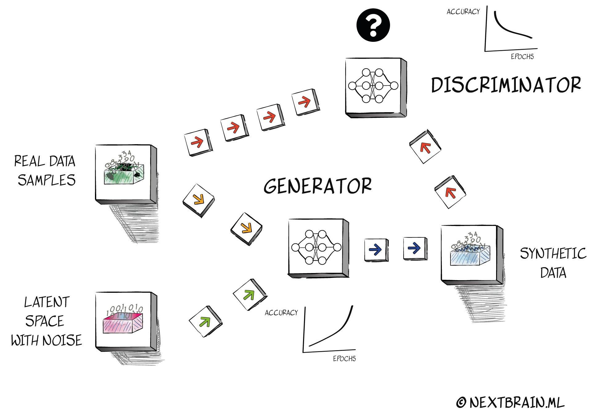

## Table of Contents

## What is tabular data and why is it important in machine learning?

Tabular data is information organized into rows and columns, kind of like a spreadsheet. Each row usually represents a single record or observation, and each column represents a specific feature or attribute of that record. For example, in a dataset about students, each row could be a student, and columns might include things like age, grade, and test scores. This type of data is common in many fields, from business to healthcare, because it's a straightforward way to store and look at information.

In machine learning, tabular data is important because it's often the starting point for building models. Many machine learning algorithms, like decision trees or linear regression, work well with this format. They can easily process the rows and columns to find patterns and make predictions. For instance, a machine learning model could use tabular data about past house sales to predict future house prices. This makes tabular data a key part of many machine learning projects, helping to turn raw data into useful insights.

## What are the challenges associated with generating synthetic tabular data?

Generating synthetic tabular data can be tricky because it needs to look and act like real data. One big challenge is making sure the fake data keeps the same patterns and relationships as the real data. For example, if age and income are related in the real data, the synthetic data should show the same kind of connection. If this isn't done right, the synthetic data won't be useful for training machine learning models or for testing systems.

Another challenge is privacy. When creating synthetic data, it's important not to accidentally reveal information about real people. This means the data has to be changed enough so that no one can figure out who the original data was about, but not so much that it loses its usefulness. Balancing these two needs can be hard and requires careful planning and techniques like differential privacy.

Lastly, there's the issue of quality and variety. Synthetic data should cover a wide range of possible scenarios to be truly helpful. It's not enough to just copy the real data; the synthetic data should include rare events and edge cases that might not show up often in real data. This means the methods used to generate the data need to be smart and flexible, able to create diverse and realistic datasets.

## How does CTAB-GAN work to generate synthetic tabular data?

CTAB-GAN, or Conditional Table GAN, is a type of machine learning model used to create fake but realistic tabular data. It works by learning from real data and then using that knowledge to make new data that looks a lot like the original. CTAB-GAN uses a special kind of neural network called a Generative Adversarial Network (GAN). In a GAN, there are two parts: a generator that makes the fake data and a discriminator that tries to tell if the data is real or fake. They work together, with the generator trying to fool the discriminator and getting better over time.

The cool thing about CTAB-GAN is that it pays attention to both the numbers and the types of data in the table. For example, it knows if a column should have whole numbers, decimal numbers, or words. It also tries to keep the relationships between different columns the same as in the real data. This is important because it makes sure the fake data can be used for things like training other machine learning models or testing systems. By carefully balancing the generator and discriminator, CTAB-GAN can create data that's both useful and safe to use, without giving away any private information from the original dataset.

## What are the key components of the CTAB-GAN model?

The CTAB-GAN model has two main parts: a generator and a discriminator. The generator makes up new data that looks like the real data. It learns from the real data to create fake data that matches the patterns and relationships in the original dataset. The discriminator's job is to check if the data is real or fake. It gets better at spotting fake data over time, which pushes the generator to make better and more realistic data. They work together in a game-like way, where the generator tries to fool the discriminator, and both get better at their tasks.

CTAB-GAN also uses special tricks to make sure the fake data is good. It looks at the types of data in each column, like if they are numbers or words, and keeps the relationships between columns the same as in the real data. This helps make sure the synthetic data is useful for things like training other machine learning models. It also cares about privacy, making sure the fake data doesn't accidentally give away information about real people. By doing all this, CTAB-GAN can create data that's both helpful and safe to use.

## How does CTAB-GAN handle categorical and numerical data differently?

CTAB-GAN handles categorical and numerical data differently to make sure the synthetic data looks as real as possible. For categorical data, like colors or types of fruits, CTAB-GAN uses a special way to turn these into numbers that the model can work with. This is called encoding. It makes sure that the relationships between these categories stay the same in the fake data as they are in the real data. For example, if "red" and "blue" are common colors in the real data, the fake data will also show these colors often and in the right way.

For numerical data, like age or height, CTAB-GAN tries to keep the numbers looking real. It pays attention to things like the average value, how spread out the numbers are, and how they relate to other columns. This helps make sure the fake numbers follow the same patterns as the real ones. For instance, if older people tend to have higher incomes in the real data, CTAB-GAN will make sure this pattern shows up in the fake data too. By doing this, CTAB-GAN makes sure the synthetic data is useful for training other models or testing systems.

## What is Outlier Generation and why is it important in the context of tabular data?

Outlier generation is making fake data that is different from what is usually seen in the real data. These outliers are important because they help test how well systems or models can handle unusual situations. For example, if a machine learning model is used to predict house prices, it should still work well even if it sees a house with a very unusual size or price. By adding outliers to the data, we can make sure the model is ready for anything it might see in the real world.

In the context of tabular data, outlier generation is key because it helps make the data more complete and realistic. Real data often has some unusual cases, and if the fake data doesn't have these, it won't be as useful. Outliers can show up in different ways, like a very high or low number in a column, or a strange mix of values across columns. By including these in the synthetic data, we can train models that are better at dealing with the unexpected, making them more reliable and useful in real-life situations.

## How can Outlier Generation be integrated with methods like CTAB-GAN?

Outlier generation can be added to methods like CTAB-GAN by changing how the generator makes the fake data. In CTAB-GAN, the generator learns from real data to create new data that looks a lot like the original. To include outliers, the generator can be told to sometimes make data that is different from what it usually sees. This can be done by adding a special rule or step in the generator that makes some of the data unusual on purpose. For example, it might make a very high number in a column that usually has smaller numbers, or mix values in a way that is rare in the real data.

Adding outliers this way helps make the fake data more complete and realistic. Real data often has some unusual cases, and if the fake data doesn't have these, it won't be as useful for training machine learning models. By including outliers, the synthetic data can help train models that are better at dealing with the unexpected. This makes the models more reliable and useful in real-life situations, where unusual data can show up at any time.

## What is TabularARGN and how does it differ from CTAB-GAN in generating tabular data?

TabularARGN, or Tabular Autoregressive Generative Network, is a method used to create fake but realistic tabular data. It works by generating data one column at a time, using what it knows from the earlier columns to help make the next ones. This is different from CTAB-GAN, which uses a generator and a discriminator to make and check the data all at once. TabularARGN is good at keeping the order and relationships between columns, which can be important for some kinds of data.

The main difference between TabularARGN and CTAB-GAN is how they handle the data. CTAB-GAN uses a GAN, where the generator tries to make fake data that can fool the discriminator. This helps make sure the fake data looks a lot like the real data. On the other hand, TabularARGN uses an autoregressive approach, which means it builds the data step by step. This can be better for data where the order of the columns matters a lot, like in time series data. Both methods try to make useful and safe fake data, but they do it in different ways.

## How does TabularARGN address the limitations of other generative models for tabular data?

TabularARGN tackles the challenges that other generative models face with tabular data by using an autoregressive method. This means it makes the data one column at a time, using what it knows from the earlier columns to help make the next ones. This is different from models like CTAB-GAN, which make the whole row of data at once. By doing it step by step, TabularARGN can keep the order and relationships between columns better. This is really helpful for data where the order matters a lot, like in time series data where one thing leads to another.

Another way TabularARGN helps is by dealing with the mix of different types of data, like numbers and words, in a smart way. It can handle these different types without messing up the patterns and relationships in the data. This makes the fake data it creates more realistic and useful for training other machine learning models. While other models might struggle to keep everything in the right order or make sure the fake data still makes sense, TabularARGN's step-by-step approach helps it do a better job at these things.

## What are some practical applications of synthetic tabular data generated by these models?

Synthetic tabular data generated by models like CTAB-GAN and TabularARGN can be used in many practical ways. One big use is in training machine learning models. When real data is hard to get or too private to share, fake data can be a good stand-in. For example, if a company wants to build a model to predict customer behavior but can't use real customer data because of privacy rules, they can use synthetic data instead. This helps them build better models without breaking any rules.

Another practical use is in testing and improving systems. Sometimes, real data might not have enough unusual cases or "outliers" to really test how well a system works. Synthetic data can be made to include these unusual cases, helping to make sure the system can handle anything that comes its way. For example, a bank might use synthetic data to test its fraud detection system, making sure it can spot strange transactions that might be missed with just real data. By using synthetic data, companies can make their systems more reliable and ready for real-world challenges.

## How can the quality and utility of synthetic tabular data be evaluated?

The quality and usefulness of synthetic tabular data can be checked by comparing it to real data. One way to do this is by looking at how similar the fake data is to the real data in terms of numbers and patterns. For example, you can see if the average values and how spread out the numbers are in the synthetic data match the real data. You can also check if the relationships between different columns in the synthetic data are the same as in the real data. If the synthetic data looks a lot like the real data in these ways, it's a good sign that it's high quality.

Another way to check the quality of synthetic tabular data is by using it to train machine learning models. If a model trained on the synthetic data works about as well as a model trained on real data, then the synthetic data is probably useful. This can be tested by seeing how well the model predicts things or makes decisions. If the model does well, it means the synthetic data captured the important parts of the real data. This kind of test helps make sure the synthetic data can be used in real-world situations where good data is needed.

## What are the future research directions in the field of tabular data generation?

Future research in the field of tabular data generation is likely to focus on making the fake data even more realistic and useful. One big area is improving how well the models can keep the relationships between different columns in the data. This means making sure that if age and income are related in the real data, they stay related in the fake data too. Researchers might also work on better ways to handle different types of data, like numbers and words, in the same table. They could use new kinds of machine learning models or mix different methods together to get better results. Another important area is privacy. Scientists are looking for ways to make sure the fake data doesn't accidentally give away information about real people, while still being useful for training other models.

Another direction for future research is making the fake data more diverse and complete. This means including more unusual cases or "outliers" in the data, so that machine learning models trained on this data can handle real-world situations better. Researchers might also try to make the process of generating fake data faster and easier to use. This could involve creating tools that people without a lot of technical knowledge can use to make their own synthetic data. By working on these areas, researchers hope to make synthetic tabular data even more helpful for all kinds of uses, from training machine learning models to testing new systems.