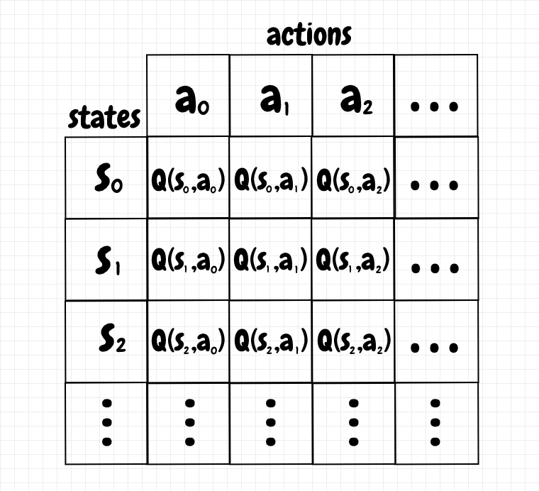

## Table of Contents

## What is Tabular Q-Learning and how does it fit into the field of machine learning?

Tabular Q-Learning is a type of reinforcement learning, which is a branch of machine learning where an agent learns to make decisions by interacting with an environment. In Tabular Q-Learning, the agent uses a table, called a Q-table, to store and update the values of different actions in different states. The Q-table helps the agent understand which action is best to take in a given situation. The agent learns by trying different actions, observing the rewards it gets, and updating the Q-table accordingly. The goal is to maximize the total reward over time by choosing the best actions based on the current Q-values.

In the field of machine learning, Tabular Q-Learning fits into the category of reinforcement learning, which is different from supervised and unsupervised learning. While supervised learning uses labeled data to train models and unsupervised learning finds patterns in unlabeled data, reinforcement learning focuses on learning from trial and error. Tabular Q-Learning is particularly useful for problems with a small number of states and actions, where it's practical to store and update a Q-table. It's a foundational method that has inspired more advanced techniques like Deep Q-Networks, which use neural networks to handle larger, more complex environments.

## How does the Q-Learning algorithm work in a tabular form?

Q-Learning in a tabular form works by using a table, called a Q-table, to keep track of how good different actions are in different situations. Each entry in the Q-table represents a combination of a state and an action, and the value stored there is called the Q-value. The Q-value tells the agent how much reward it can expect by taking a certain action in a certain state. The agent starts with a Q-table filled with zeros or random values and then updates these values as it interacts with the environment. When the agent takes an action and moves to a new state, it receives a reward. The Q-value for the action it just took is then updated using a formula that considers the immediate reward and the best possible future rewards from the new state.

The update formula for the Q-value is $$Q(s, a) \leftarrow Q(s, a) + \alpha \left( r + \gamma \max_{a'} Q(s', a') - Q(s, a) \right)$$, where $$Q(s, a)$$ is the current Q-value for state $$s$$ and action $$a$$, $$\alpha$$ is the learning rate, $$r$$ is the reward received, $$\gamma$$ is the discount [factor](/wiki/factor-investing), and $$\max_{a'} Q(s', a')$$ is the maximum Q-value for the next state $$s'$$. The learning rate $$\alpha$$ determines how much the agent should change its Q-value based on new information, and the discount factor $$\gamma$$ determines how much the agent values future rewards compared to immediate rewards. Over many interactions, the Q-table gets better at predicting the best actions to take in each state, helping the agent learn the best policy for maximizing its total reward.

## What are the key components of the Q-table in Tabular Q-Learning?

The Q-table in Tabular Q-Learning is like a chart that helps the agent decide what to do in different situations. It has rows and columns where each row represents a different state the agent can be in, and each column represents a different action the agent can take. The numbers inside the table, called Q-values, tell the agent how good it is to take a certain action when in a certain state. At the start, the Q-table might be filled with zeros or random numbers, but as the agent explores and learns, these numbers change to reflect better guesses about which actions lead to the best rewards.

The Q-values in the Q-table are updated using a special formula whenever the agent takes an action and sees what happens next. The formula is $$Q(s, a) \leftarrow Q(s, a) + \alpha \left( r + \gamma \max_{a'} Q(s', a') - Q(s, a) \right)$$. Here, $$Q(s, a)$$ is the Q-value for the current state and action, $$\alpha$$ is the learning rate that decides how much to change the Q-value, $$r$$ is the reward the agent gets, $$\gamma$$ is the discount factor that decides how much to care about future rewards, and $$\max_{a'} Q(s', a')$$ is the best Q-value for the next state. By updating the Q-table this way, the agent gets better and better at choosing actions that lead to more rewards over time.

## Can you explain the Q-value update rule in Tabular Q-Learning?

The Q-value update rule in Tabular Q-Learning is like a special recipe that helps the agent learn which actions are best. When the agent takes an action and moves to a new state, it gets a reward. The Q-value for the action it just took is then updated using a formula. This formula looks at the reward the agent got right away and also thinks about the best possible rewards it could get from the new state it's in. By using this update rule over and over, the agent slowly learns to choose actions that lead to more rewards.

The formula for updating the Q-value is $$Q(s, a) \leftarrow Q(s, a) + \alpha \left( r + \gamma \max_{a'} Q(s', a') - Q(s, a) \right)$$. Here, $$Q(s, a)$$ is the current Q-value for the state $$s$$ and action $$a$$ the agent was in before taking the action. The learning rate, $$\alpha$$, decides how much the agent should change its Q-value based on new information. The reward, $$r$$, is what the agent got right after taking the action. The discount factor, $$\gamma$$, helps the agent decide how much it should care about future rewards compared to immediate rewards. Finally, $$\max_{a'} Q(s', a')$$ is the best Q-value the agent can get from the new state $$s'$$ it's in after taking the action. By tweaking the Q-value with this formula, the agent gets better at [picking](/wiki/asset-class-picking) actions that lead to more rewards over time.

## What is the role of the exploration-exploitation trade-off in Tabular Q-Learning?

In Tabular Q-Learning, the exploration-exploitation trade-off is like choosing between trying new things and sticking with what you know works. When the agent explores, it tries different actions to learn more about the environment. This helps it find new ways to get rewards that it might not have known about before. But if the agent only explores, it might miss out on using the best actions it already knows about. On the other hand, when the agent exploits, it uses the actions it thinks are the best based on what it has learned so far. This can help it get more rewards right away, but it might miss out on finding even better actions if it doesn't explore enough.

Balancing exploration and exploitation is important for the agent to learn the best way to act in different situations. If the agent explores too much, it might never settle on the best actions and keep trying new things without getting better. If it exploits too much, it might get stuck using actions that are good but not the best. A common way to balance this is by using something called an epsilon-greedy strategy. In this strategy, the agent usually picks the action it thinks is best (exploiting), but sometimes, with a small chance (epsilon), it picks a random action to try something new (exploring). This way, the agent can keep learning while also using what it knows to get rewards.

## How do you choose the learning rate and discount factor in Tabular Q-Learning?

Choosing the right learning rate, often called alpha ($$ \alpha $$), in Tabular Q-Learning is important because it decides how quickly the agent learns from new experiences. If the learning rate is too high, the agent might change its Q-values too much based on just one experience, which can make it hard to learn the best actions. On the other hand, if the learning rate is too low, the agent might learn very slowly and take a long time to figure out the best actions. A good starting point for the learning rate is usually between 0 and 1, and you might need to try different values to see what works best for your problem. Sometimes, people use a learning rate that gets smaller over time, so the agent can learn quickly at first and then fine-tune its Q-values later.

The discount factor, called gamma ($$ \gamma $$), is also important because it tells the agent how much to care about future rewards compared to immediate rewards. If the discount factor is close to 1, the agent will think a lot about future rewards and might be willing to take actions that don't give a big reward right away but could lead to bigger rewards later. If the discount factor is close to 0, the agent will focus more on getting rewards right away and might not plan as much for the future. Like the learning rate, the discount factor should be between 0 and 1, and you might need to try different values to find the best one for your problem. A common choice for the discount factor is around 0.9 or 0.99, but it can vary depending on what you're trying to achieve.

## What are some common environments or problems where Tabular Q-Learning is applied?

Tabular Q-Learning is often used in small and simple environments where there aren't too many states and actions. A classic example is the "Frozen Lake" problem, where an agent needs to move across a slippery grid to reach a goal while avoiding falling into holes. In this game, the agent can move up, down, left, or right, and the Q-table keeps track of the best moves in each position on the grid. Another common environment is the "Taxi" problem, where the agent drives a taxi to pick up and drop off passengers at different locations. The Q-table helps the agent learn the best routes and actions to maximize its rewards.

These environments are perfect for Tabular Q-Learning because they have a small number of states and actions, making it easy to store and update the Q-table. In the Frozen Lake problem, the Q-table might look like a big grid where each cell represents a state (a position on the ice) and the values inside the cells tell the agent which direction to move to reach the goal safely. In the Taxi problem, the Q-table helps the agent learn which actions (like moving north, south, east, or west, picking up, or dropping off a passenger) lead to the highest rewards in different states (different positions and passenger statuses). By using the Q-value update rule $$Q(s, a) \leftarrow Q(s, a) + \alpha \left( r + \gamma \max_{a'} Q(s', a') - Q(s, a) \right)$$, the agent can learn the best policy for navigating these environments over time.

## How does Tabular Q-Learning handle continuous state and action spaces?

Tabular Q-Learning works well when the states and actions are like a fixed list of choices, but it can have trouble with continuous state and action spaces. Imagine trying to use a Q-table where the states are numbers that can be anything, like the temperature in a room. You can't make a Q-table with rows for every possible temperature because there are too many, and it would be too big to handle. The same goes for actions. If you can choose any speed to move, you can't make columns for every possible speed.

To handle continuous spaces, people often use other methods, like Deep Q-Networks (DQNs). These use a special kind of math called neural networks to guess the Q-values instead of using a big table. The [neural network](/wiki/neural-network) can take any number as an input and give you a Q-value, so it can work with continuous states and actions. The update rule for the neural network is a bit different, but it still uses the idea of rewards and future rewards to learn, just like in Tabular Q-Learning. The formula for updating the neural network is $$Q(s, a) \leftarrow Q(s, a) + \alpha \left( r + \gamma \max_{a'} Q(s', a') - Q(s, a) \right)$$, but instead of changing a number in a table, it changes the weights in the neural network.

## What are the limitations of Tabular Q-Learning compared to other reinforcement learning methods?

Tabular Q-Learning is like a tool that works really well for simple problems where you can list out all the states and actions. But it has trouble when things get more complicated. For example, if you have a lot of states or if the states can be any number (like the temperature in a room), you can't make a Q-table that covers everything. The Q-table would get too big and hard to handle. Also, if the actions you can take are not just a few choices but can be any number (like moving at any speed), Tabular Q-Learning can't keep up because it needs a fixed list of actions to work with.

Other methods, like Deep Q-Networks (DQNs), can handle these bigger and more complex problems better. DQNs use a special kind of math called neural networks to guess the Q-values instead of using a big table. This means they can work with states and actions that are any number, not just a fixed list. The update rule for DQNs is similar to Tabular Q-Learning, using the formula $$Q(s, a) \leftarrow Q(s, a) + \alpha \left( r + \gamma \max_{a'} Q(s', a') - Q(s, a) \right)$$, but instead of changing a number in a table, it changes the weights in the neural network. So, while Tabular Q-Learning is great for simple problems, other methods are better for more complex ones.

## How can Tabular Q-Learning be optimized for faster convergence?

To make Tabular Q-Learning learn faster, you can use a few tricks. One way is to start with a better guess for the Q-values instead of starting with zeros or random numbers. This is called initializing the Q-table with some knowledge about the problem. Another way is to change the learning rate, called alpha ($$ \alpha $$), over time. You can start with a higher alpha to learn quickly at first, and then make it smaller so the agent can fine-tune its Q-values later. Also, you can use something called an epsilon-greedy strategy to balance exploring new actions and using what the agent already knows. With this strategy, the agent usually picks the best action it knows, but sometimes, with a small chance (epsilon), it tries a random action to learn more.

Another trick is to use something called experience replay. This means the agent keeps a memory of its past experiences and sometimes goes back to learn from them again. This helps the agent learn more from each experience and can speed up learning. You can also try to group similar states together to make the Q-table smaller and easier to manage. This is called state aggregation. By using these tricks, you can help Tabular Q-Learning find the best actions faster and get to the best way of acting in different situations more quickly.

## What advanced techniques can be integrated with Tabular Q-Learning to enhance performance?

One advanced technique that can be integrated with Tabular Q-Learning to enhance performance is experience replay. This technique involves the agent keeping a memory of its past experiences and occasionally revisiting them to learn from them again. By doing this, the agent can learn more effectively from each experience, as it gets multiple chances to update its Q-values. The Q-value update rule remains the same, $$Q(s, a) \leftarrow Q(s, a) + \alpha \left( r + \gamma \max_{a'} Q(s', a') - Q(s, a) \right)$$, but the agent can apply it to past experiences, helping it to converge to the optimal policy faster. This method can also help in stabilizing learning by reducing the impact of correlated experiences.

Another technique is state aggregation, where similar states are grouped together to reduce the size of the Q-table. This makes the learning process more manageable, especially in environments with a large number of states. By grouping states, the agent can generalize its learning across similar situations, which can lead to faster learning and better performance. Additionally, techniques like function approximation can be used to estimate Q-values for states not explicitly stored in the Q-table, which is particularly useful when dealing with large or continuous state spaces. By integrating these advanced techniques, Tabular Q-Learning can be significantly enhanced, allowing it to handle more complex problems and converge to optimal policies more quickly.

## Can you discuss a case study where Tabular Q-Learning was successfully implemented?

One successful case study where Tabular Q-Learning was implemented is in the "Frozen Lake" environment. This is a simple grid world where an agent needs to navigate from a starting point to a goal while avoiding holes on a slippery surface. The agent can move in four directions: up, down, left, and right. Each move can lead the agent to slide to an adjacent cell, making the environment challenging. Researchers used Tabular Q-Learning to teach the agent the best actions to take in each position on the grid. The Q-table was updated using the formula $$Q(s, a) \leftarrow Q(s, a) + \alpha \left( r + \gamma \max_{a'} Q(s', a') - Q(s, a) \right)$$, where $$Q(s, a)$$ is the Q-value for the current state and action, $$\alpha$$ is the learning rate, $$r$$ is the reward, $$\gamma$$ is the discount factor, and $$\max_{a'} Q(s', a')$$ is the maximum Q-value for the next state. By experimenting with different learning rates and discount factors, the agent was able to learn a policy that successfully navigated the frozen lake to reach the goal.

Another interesting case study is the "Taxi" environment, where Tabular Q-Learning was used to train an agent to pick up and drop off passengers efficiently. In this environment, the agent drives a taxi on a grid, and its goal is to maximize the total reward by completing passenger requests. The agent can move in four directions, pick up passengers, and drop them off at their destinations. The Q-table in this case helps the agent learn the best actions to take based on the current location of the taxi, the location of the passenger, and the destination. The Q-value update rule $$Q(s, a) \leftarrow Q(s, a) + \alpha \left( r + \gamma \max_{a'} Q(s', a') - Q(s, a) \right)$$ was used to refine the Q-values over time. Through extensive training, the agent was able to develop a strategy that efficiently managed passenger requests, demonstrating the effectiveness of Tabular Q-Learning in solving this type of problem.

## References & Further Reading

[1]: Watkins, C.J.C.H., & Dayan, P. (1992). ["Q-Learning"](https://link.springer.com/article/10.1007/BF00992698). Machine Learning, 8(3), 279-292.

[2]: Sutton, R.S., & Barto, A.G. (2018). ["Reinforcement Learning: An Introduction,"](https://web.stanford.edu/class/psych209/Readings/SuttonBartoIPRLBook2ndEd.pdf) 2nd Edition. MIT Press.

[3]: Mnih, V., Kavukcuoglu, K., Silver, D., Rusu, A.A., et al. (2015). ["Human-level control through deep reinforcement learning."](https://www.nature.com/articles/nature14236) Nature, 518, 529-533.

[4]: Szepesvári, Cs. (2010). ["Algorithms for Reinforcement Learning"](https://www.researchgate.net/publication/220696313_Algorithms_for_Reinforcement_Learning). Synthesis Lectures on Artificial Intelligence and Machine Learning, 4(1), 1-103.

[5]: Dietterich, T.G. (2000). ["Hierarchical Reinforcement Learning with the MAXQ Value Function Decomposition."](https://arxiv.org/abs/cs/9905014) Journal of Artificial Intelligence Research, 13, 227-303.

[6]: OpenAI. (2018). ["OpenAI Gym: A Toolkit for Developing and Comparing Reinforcement Learning Algorithms."](https://github.com/openai/gym) 

[7]: Lillicrap, T.P., Hunt, J.J., Pritzel, A., Heess, N., et al. (2015). ["Continuous control with deep reinforcement learning."](https://arxiv.org/abs/1509.02971)