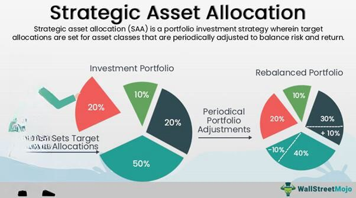

## Table of Contents

## What is tactical asset allocation?

Tactical asset allocation is a way of managing investments where you change the mix of assets in your portfolio based on short-term market conditions. Instead of sticking to a fixed plan, you might decide to put more money into stocks if you think they will do well soon, or move money into bonds if you think the stock market might go down. It's like trying to time the market to get better returns.

This approach can be useful because it lets you take advantage of opportunities as they come up. If you think a certain sector, like technology, is about to grow, you can shift more of your money there. However, it can also be risky because it's hard to predict the market correctly all the time. If you make the wrong move, you might end up with lower returns than if you had just stuck to a steady plan.

## How does tactical asset allocation differ from strategic asset allocation?

Tactical asset allocation and strategic asset allocation are two different ways to manage your investments. Strategic asset allocation is like setting a long-term plan. You decide on a mix of assets, like stocks, bonds, and cash, based on your goals, how much risk you can handle, and how long you plan to invest. Once you set this mix, you usually stick to it, only making small changes now and then to keep it balanced. It's about playing the long game and not worrying too much about what the market is doing day to day.

On the other hand, tactical asset allocation is more about reacting to what's happening in the market right now. You might change your mix of assets more often, trying to take advantage of short-term opportunities or avoid risks. If you think stocks are going to do well soon, you might put more money into them. If you think the market might drop, you might move money into safer investments like bonds. It's a more active approach, but it can be riskier because it's hard to always guess the market right.

## What are the key components of a tactical asset allocation portfolio?

A tactical asset allocation portfolio includes different types of investments like stocks, bonds, and cash. The main idea is to change the mix of these investments based on what's happening in the market right now. For example, if you think the stock market will go up soon, you might put more money into stocks. If you think it might go down, you might move money into bonds or cash. The key is to be flexible and ready to shift your investments to take advantage of short-term opportunities.

Another important part of a tactical asset allocation portfolio is having a good way to predict what the market will do next. This can be tricky because no one can really see the future, but you might use things like economic reports, news, and market trends to make your best guess. It's also helpful to have a plan for when to make changes to your portfolio. This means deciding ahead of time what signs you'll look for to know when to buy or sell certain investments.

Overall, a tactical asset allocation portfolio needs a mix of different investments, a way to predict market changes, and a clear plan for making adjustments. It's about being active and ready to shift your money around to try to get better returns, but it also comes with more risk because you might not always guess the market right.

## Can you explain the process of creating a tactical asset allocation portfolio?

Creating a tactical asset allocation portfolio starts with understanding your investment goals and how much risk you're willing to take. You'll need to decide on a starting mix of different investments like stocks, bonds, and cash. This initial mix should match your long-term goals but also be flexible enough to change based on what's happening in the market. You might begin with a certain percentage in stocks, another in bonds, and some in cash, but be ready to shift these percentages around.

The next step is to keep an eye on the market and use different tools to guess what might happen next. This can include looking at economic reports, news, and market trends. Based on what you see, you'll decide when to make changes to your portfolio. If you think stocks are about to do well, you might put more money into them. If you think the market might drop, you might move money into bonds or cash. It's important to have a clear plan for when to buy or sell, so you're not just making random changes.

Overall, creating a tactical asset allocation portfolio involves setting up a flexible mix of investments, watching the market closely, and being ready to make adjustments based on your predictions. It's a more active way of investing that can help you take advantage of short-term opportunities, but it also comes with more risk because it's hard to always guess the market right.

## What are some common indicators used in tactical asset allocation?

When you're using tactical asset allocation, you need to keep an eye on different signs to help you decide when to change your investments. Some common signs people look at are economic reports, like the unemployment rate or inflation numbers. If these numbers look good, it might mean the economy is doing well, and you might want to put more money into stocks. On the other hand, if these numbers look bad, you might want to move your money into safer investments like bonds. Another sign people watch is the news. If there's big news about a company or an industry, it can affect how well their stocks do, so you might want to adjust your portfolio based on that.

Market trends are also important to watch. If you see that stocks in a certain sector, like technology or healthcare, are doing really well, you might want to put more money into those stocks. You can also look at things like the stock market's overall direction, interest rates, and how much people are buying and selling. All these things can give you clues about what might happen next in the market. By keeping an eye on these signs, you can make better guesses about when to buy or sell your investments, but remember, it's not an exact science, and sometimes you might guess wrong.

## How often should a tactical asset allocation portfolio be rebalanced?

A tactical asset allocation portfolio should be rebalanced as often as needed based on what's happening in the market. This could be every few months, or even more often if you see big changes or new opportunities. The key is to keep watching the market and be ready to make changes when you think it's the right time. 

Rebalancing too often can be risky because it might lead to more trading costs and you might end up selling at the wrong time. On the other hand, if you don't rebalance often enough, you might miss out on chances to do better. It's all about finding a good balance and being flexible with your plan.

## What are the risks associated with tactical asset allocation?

Tactical asset allocation can be risky because it's hard to guess what the market will do next. If you make the wrong move, you might end up with lower returns than if you had just stuck to a steady plan. For example, if you move your money into stocks thinking they will go up, but they go down instead, you could lose money. It's like trying to time the market, which is really tough to do right all the time.

Another risk is that you might end up trading too much. Every time you buy or sell, you have to pay fees, and these can add up. If you're always moving your money around, these costs could eat into your returns. Plus, if you're always making changes, you might get stressed out and make bad decisions based on your feelings instead of thinking things through. It's important to keep a cool head and not let the ups and downs of the market push you into making quick choices you might regret.

## Can you provide a simple example of a tactical asset allocation portfolio?

Let's say you start with a simple portfolio that has 60% in stocks, 30% in bonds, and 10% in cash. You think the economy is going to do well soon, so you decide to put more money into stocks. You change your portfolio to 70% stocks, 25% bonds, and 5% cash. A few months later, you hear news that might make the stock market go down, so you quickly move some money out of stocks and into bonds and cash. Now your portfolio is back to 60% stocks, 35% bonds, and 5% cash.

This example shows how you might change your investments based on what's happening in the market. You're trying to do better by moving your money around, but it's not always easy to guess right. If you had kept your original mix of 60% stocks, 30% bonds, and 10% cash, you might have ended up with different results. It's all about trying to take advantage of short-term opportunities while being ready to make quick changes if things don't go as planned.

## How does market timing play a role in tactical asset allocation?

Market timing is a big part of tactical asset allocation. It's all about trying to guess when the market will go up or down and changing your investments based on those guesses. If you think the stock market is going to do well soon, you might put more money into stocks. If you think it might go down, you might move your money into safer things like bonds or cash. The idea is to buy low and sell high, but it's really hard to get it right all the time.

The problem with market timing is that it's like trying to predict the future, which is tough. If you guess wrong, you could end up losing money instead of making more. For example, if you move your money into stocks thinking they will go up, but they go down instead, you could lose money. That's why tactical asset allocation can be risky. It's all about trying to take advantage of short-term opportunities, but you have to be ready to make quick changes if things don't go as planned.

## What advanced tools or software can be used to manage a tactical asset allocation portfolio?

To manage a tactical asset allocation portfolio, you can use advanced tools like financial software and platforms. One popular tool is Bloomberg Terminal, which gives you real-time data, news, and analysis to help you make quick decisions about your investments. Another useful software is Morningstar Direct, which offers detailed research and tools to analyze different assets and see how they might perform. These platforms can help you keep an eye on the market and make changes to your portfolio based on what's happening.

Another option is to use trading platforms like TradeStation or MetaTrader, which let you set up automatic trading rules. These rules can help you buy or sell investments without having to watch the market all the time. For example, you might set a rule to sell stocks if they drop by a certain amount. These platforms can also give you charts and technical analysis tools to help you predict what the market might do next. By using these advanced tools, you can manage your tactical asset allocation portfolio more effectively and try to take advantage of short-term opportunities.

## How can one measure the performance of a tactical asset allocation portfolio?

Measuring the performance of a tactical asset allocation portfolio involves looking at how well it's doing compared to what you hoped for. You can start by checking the overall return of your portfolio. This means seeing how much your investments have grown or shrunk over time. You can compare this to a benchmark, like the S&P 500 for stocks or a bond index for bonds. If your portfolio is doing better than these benchmarks, that's a good sign. But if it's doing worse, you might need to think about changing your strategy.

Another way to measure performance is by looking at the risk you're taking. Tactical asset allocation can be riskier because you're trying to guess what the market will do next. You can use something called the Sharpe Ratio to see if the extra risk you're taking is worth it. The Sharpe Ratio compares your portfolio's returns to how much it moves up and down. A higher Sharpe Ratio means you're getting good returns for the risk you're taking. By keeping an eye on both your returns and the risk you're taking, you can get a better idea of how well your tactical asset allocation portfolio is doing.

## What are some expert strategies for optimizing a tactical asset allocation portfolio?

One expert strategy for optimizing a tactical asset allocation portfolio is to use a mix of different types of analysis. You can look at the big picture with fundamental analysis, which means checking things like how well companies are doing or what's happening with the economy. At the same time, you can use technical analysis to look at charts and patterns to guess what the market might do next. By combining these two types of analysis, you can make smarter guesses about when to change your investments. Another helpful strategy is to set clear rules for when to buy or sell. This can help you avoid making quick decisions based on feelings and stick to a plan that's based on what you see in the market.

Another strategy is to keep an eye on different parts of the market, not just one. For example, you might look at stocks, bonds, and even things like commodities or real estate. If you see that one part of the market is doing really well, you can shift more of your money there. But if you think another part might go down, you can move money away from it. This way, you can try to take advantage of opportunities in different places. Also, it's important to check how well your portfolio is doing often and be ready to make changes if things aren't going as planned. By staying flexible and keeping a close watch on the market, you can keep your portfolio in good shape and try to do better over time.

## What is Portfolio Management with TAA?

Tactical Asset Allocation (TAA) plays a pivotal role in portfolio management by actively enhancing returns through strategic, short-term adjustments to asset allocations, in response to evolving market conditions. Unlike static strategies, TAA requires continuous assessment of the financial markets to identify and exploit temporary imbalances or opportunities. This dynamic approach aims to leverage market trends to optimize portfolio performance beyond what is achievable through traditional, static asset allocation methods.

The core principle of TAA is to adjust the portfolio's asset mix based on near-term forecasts for asset classes, including equities, bonds, and commodities, to maximize return potential. This requires a robust understanding of market dynamics and trends, necessitating a proficient analysis of economic indicators, market sentiment, and geopolitical events that may impact asset performance. For instance, if TAA analysis suggests a forthcoming rise in bond yields based on economic indicators such as inflation data, an investor might decrease bond exposure in anticipation of falling prices, thereby optimizing the portfolio’s return potential.

In order to maintain a balanced asset mix, TAA strategies often involve reallocating investments within pre-defined bounds to prevent excessive risk-taking. For instance, maintaining a strategic anchor, such as a 60/40 equity-to-bond ratio, ensures that even with adjustments, the overall risk profile of the portfolio remains aligned with the investor's risk tolerance. This balance is crucial, as excessive focus on short-term profits can inadvertently increase portfolio [volatility](/wiki/volatility-trading-strategies).

Mathematically, TAA can be executed by optimizing the portfolio's expected return, $E(R)$, relative to its risk, commonly quantified by the portfolio’s variance, $\sigma^2$. This concept is encapsulated in the modern portfolio theory's objective function:

$$
\max_{\text{Allocation}} E(R) - \frac{\lambda}{2}\sigma^2
$$

where $\lambda$ represents the risk aversion coefficient. Advanced statistical techniques, such as mean-variance optimization, are frequently utilized to reach an optimal allocation that accounts for the forecasted returns and inherent risks of various asset classes.

Additionally, the integration of quantitative models in TAA empowers portfolio managers to keep pace with market shifts. Quantitative signals, drawn from both historical data analysis and real-time market feeds, drive these models. For example, deploying moving averages or [momentum](/wiki/momentum) indicators to detect trends allows for timely rebalancing of asset allocations to maximize the portfolio’s return while adhering to its risk constraints.

Through these mechanisms, TAA contributes to a more responsive and adaptive portfolio management strategy. By continuously monitoring and adjusting to market dynamics, TAA not only aims to enhance returns but also offers a disciplined approach to navigating the uncertainties inherent in financial markets. This systematic adjustment, when executed with precision, can significantly improve a portfolio’s long-term growth trajectory, catering to both conservative and aggressive investment styles.

## References & Further Reading

[1]: Bergstra, J., Bardenet, R., Bengio, Y., & Kégl, B. (2011). ["Algorithms for Hyper-Parameter Optimization."](https://dl.acm.org/doi/10.5555/2986459.2986743) Advances in Neural Information Processing Systems 24.

[2]: ["Advances in Financial Machine Learning"](https://www.amazon.com/Advances-Financial-Machine-Learning-Marcos/dp/1119482089) by Marcos Lopez de Prado

[3]: ["Evidence-Based Technical Analysis: Applying the Scientific Method and Statistical Inference to Trading Signals"](https://www.amazon.com/Evidence-Based-Technical-Analysis-Scientific-Statistical/dp/0470008741) by David Aronson

[4]: ["Machine Learning for Algorithmic Trading"](https://github.com/stefan-jansen/machine-learning-for-trading) by Stefan Jansen

[5]: ["Quantitative Trading: How to Build Your Own Algorithmic Trading Business"](https://www.amazon.com/Quantitative-Trading-Build-Algorithmic-Business/dp/1119800064) by Ernest P. Chan