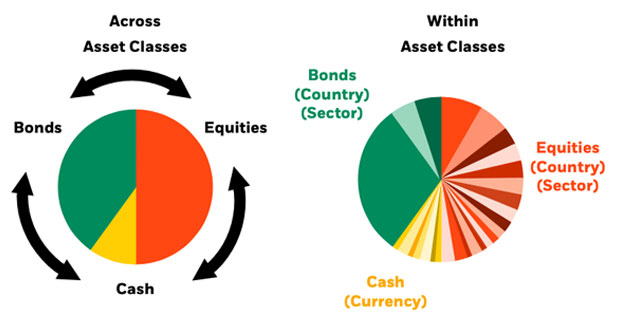
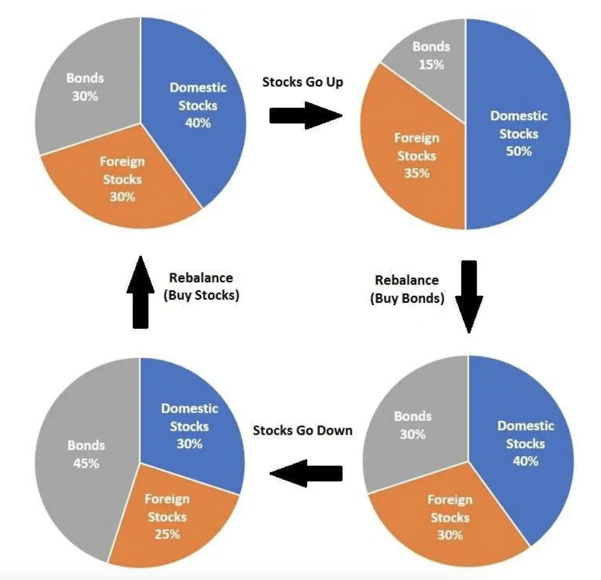

Tactical Asset Allocation (TAA) is a dynamic investment strategy designed to capitalize on short-term opportunities in the market. Unlike the set-and-forget philosophy of Strategic Asset Allocation (SAA), which maintains a consistent asset mix over the long term, TAA is more nimble, allowing investors to shift their portfolio’s weightings in response to changing market conditions. The purpose of TAA is to seize these short-term market inefficiencies to potentially enhance a portfolio's return while also managing risk.

Whereas SAA might be likened to a steady, long-term course set for a ship, TAA is akin to making calculated navigational changes to take advantage of favorable winds and currents. The core objective of TAA is to overperform passive benchmarks by systematically identifying and acting on economic and market indicators. This may involve shifting from equities to fixed income, changing sectoral exposures, or adjusting geographic weightings. The agility of TAA can be particularly advantageous during periods of market volatility, as it offers a mechanism to potentially reduce losses and even improve gains by exploiting price movements.

## Table of Contents

## The Principles of TAA

The essence of TAA is its ability to adjust a portfolio’s asset allocation to not only improve returns but also optimize them for risk — a concept known as improving the risk-adjusted returns. This dynamic adjustment is what sets TAA apart from passive management investing, which typically adheres to a static allocation strategy. By actively monitoring and responding to market conditions, TAA allows for the flexibility to shift investment weightings towards asset classes that are expected to outperform and away from those that are expected to underperform. For example, during a market downturn, TAA might increase the weight of fixed-income assets in a portfolio, and conversely, during an equity bull market, it might lean more heavily towards stocks.

In practice, this means that a TAA strategy might overweight equities in a bullish economic climate and underweight them when recessionary pressures build. This active management approach can potentially capture gains that would not be possible in a purely passive strategy while still aiming to maintain an overall balanced and diversified portfolio that aligns with the investor's long-term objectives and risk tolerance.

Tactical Asset Allocation (TAA) embodies a multi-asset investment approach, where diversification is not just across different securities, but also across various asset classes, sectors, and geographies. This approach is crucial as it mitigates idiosyncratic risks and enhances the potential for capitalizing on broader economic trends. At the heart of TAA lies the use of top-down macro investment strategies. These strategies focus on the big-picture economic and financial indicators, such as GDP growth rates, [interest rate](/wiki/interest-rate-trading-strategies) trends, inflation forecasts, and geopolitical events, to make informed decisions about asset distribution.

For a deeper exploration of the principles and practical applications of TAA, interested readers may consult the Financial Analysts Journal, which frequently features peer-reviewed research and analysis on the topic of asset allocation[1].

## TAA Strategies: Discretionary vs. Systematic

Tactical Asset Allocation (TAA) strategies come in two primary forms: discretionary and systematic. Discretionary TAA strategies are characterized by decision-making that relies on the judgment and expertise of portfolio managers or investors. These managers use their understanding of market conditions, economic indicators, and potential trends to make informed decisions about adjusting asset allocations. The discretionary approach is highly personalized and requires a deep understanding of market dynamics to be executed successfully.

In contrast, systematic TAA strategies depend on predefined rules and quantitative models to dictate portfolio adjustments. These rules are based on historical data, statistical analysis, and mathematical models that aim to identify profitable investment opportunities. The systematic approach reduces the potential for emotional decision-making and biases that can affect discretionary strategies. It also allows for a more consistent application of the TAA approach across different scenarios, often using algorithms and automated trading systems to execute trades.

While discretionary strategies offer the flexibility to capitalize on the insights of experienced professionals, systematic strategies benefit from the discipline and speed of model-based decision-making. Both strategies seek to optimize portfolio performance by adjusting to market conditions, yet they each [carry](/wiki/carry-trading) unique risks and potential for returns.

For further insights into the nuanced application of these strategies, "Active Portfolio Management: A Quantitative Approach for Producing Superior Returns and Controlling Risk" by Richard C. Grinold and Ronald N. Kahn offers an in-depth examination of the techniques and considerations involved in both discretionary and systematic tactical asset allocation[2].

## Benefits of TAA

The benefits of Tactical Asset Allocation (TAA) are manifold, serving as a robust approach to navigating the compl[exit](/wiki/exit-strategy)ies of market trends and optimizing investment portfolios. By employing TAA, investors are better equipped to keep pace with the rapid shifts in market dynamics and to capitalize on sectors and stocks that demonstrate strong performance. This active management technique allows for a nimble response to market trends, rather than the passive approach of 'buy and hold', which may not exploit emerging opportunities or mitigate impending risks.

Furthermore, TAA offers a structured method to balance risk and return in a portfolio by dynamically adjusting the distribution of assets. By considering a diverse range of [factor](/wiki/factor-investing)s — from asset class characteristics to sectoral changes, and from geographic considerations to macroeconomic indicators — TAA strategies enable investors to alter their investment mix in anticipation of potential market movements. This adaptability is crucial in managing overall portfolio [volatility](/wiki/volatility-trading-strategies) and in striving to achieve superior risk-adjusted returns.

The strategic adjustment of asset allocations in response to market conditions can also serve to protect portfolios against downside risks while positioning them to benefit from upside potential. For instance, reducing exposure to equities in favor of more stable fixed-income securities during a market downturn can preserve capital, and increasing equity exposure during a market upswing can enhance returns.

## Challenges and Considerations

Despite the strategic advantages of Tactical Asset Allocation (TAA), it does not come without its challenges and risks. A significant drawback of TAA is its reliance on accurate market forecasts and timing. Incorrect predictions can lead to underperformance compared to a passive investment strategy. Additionally, the active nature of TAA often results in higher transaction costs due to frequent buying and selling of assets, which can erode returns. There's also the risk of overtrading, where the pursuit of short-term gains can overshadow the long-term investment objectives and lead to increased volatility in the portfolio.

Critics of TAA argue that the strategy may not consistently outperform a well-diversified, long-term strategic asset allocation due to the difficulties in accurately predicting market movements. They also point out that market efficiency makes it challenging for TAA strategies to identify and exploit temporary mispricings before they correct themselves. Moreover, the effectiveness of TAA is often debated in the context of its [backtesting](/wiki/backtesting) and historical data, which may not necessarily predict future performance, especially in unprecedented market conditions.

These criticisms highlight the importance of a nuanced approach to TAA, where it is not seen as a guaranteed method for outperformance but rather as one tool among many in an investor's arsenal. Investors considering TAA must weigh these challenges and exercise due diligence in the execution of their strategies.

## How to Implement TAA

Implementing Tactical Asset Allocation (TAA) into a portfolio involves several deliberate and strategic steps. Firstly, an investor must establish a baseline asset allocation that reflects their risk tolerance, investment horizon, and financial goals. This strategic allocation serves as a home base from which the TAA deviations will occur.

The next step is to develop a **set of indicators** or signals that will guide the tactical shifts. These could be macroeconomic data, market trend analysis, valuation metrics, or technical indicators. Investors should select indicators that have historically proven to be reliable predictors of market direction and that align with their investment philosophy.

Once the indicators are in place, the investor must **decide on the rules or thresholds** that will trigger a reallocation of assets. This could involve moving a certain percentage of the portfolio into cash when a market downturn is anticipated, or into specific sectors or asset classes expected to outperform in the near term.

It’s also crucial to **determine the frequency of portfolio reviews** and adjustments. TAA isn't about daily trading but rather about making thoughtful adjustments at the right time. Some investors may review their portfolios quarterly, while others may do so monthly or on an as-needed basis when significant market events occur.

**Risk management** must be a key part of a TAA strategy. This involves setting stop-loss orders or maximum loss thresholds to protect the portfolio from significant downturns. Diversification is also a critical factor, as it helps to spread risk across various assets and market sectors.

Finally, investors should monitor the performance of their TAA strategy over time and be willing to refine their approach as markets evolve and new information becomes available. This might involve backtesting strategies with historical data or paper trading before implementing them with actual capital.

For a detailed guide on the practical implementation of TAA, the book "Asset Allocation: Balancing Financial Risk" by Roger Gibson provides a framework for incorporating TAA into an investment strategy, including case studies and examples of how TAA can be applied to real-world portfolios[3].

## Conclusion

Tactical Asset Allocation (TAA) stands as a critical component in the toolkit of modern portfolio management. Its significance lies in its dynamic approach, allowing investors to adjust their asset allocations in response to real-time market conditions, thereby targeting superior risk-adjusted returns compared to those of a static strategy. TAA's adaptability is particularly valuable in today’s market, where volatility and rapid changes have become the norm, making it imperative for investors to remain agile and responsive.

The application of TAA requires a disciplined, well-informed strategy, often benefiting from a blend of both art and science—art in the form of human judgment and experience, and science through the use of quantitative models. By focusing on macroeconomic indicators and incorporating qualitative assessments, investors can pivot their strategies to address market anomalies or trends as they emerge.

Given the ever-evolving nature of financial markets, continuous education in TAA methodologies is essential. Markets will not remain static, and neither should the strategies employed to navigate them. Investors should persistently seek out new knowledge, stay informed about the latest research, and keep abreast of technological advancements that may impact asset allocation techniques.

## References & Further Reading

[1]: [Financial Analysts Journal](https://www.tandfonline.com/toc/ufaj20/current)

[2]: ["Active Portfolio Management: A Quantitative Approach for Producing Superior Returns and Controlling Risk"](https://www.amazon.com/Active-Portfolio-Management-Quantitative-Controlling/dp/0070248826) by Richard C. Grinold and Ronald N. Kahn

[3]: ["Asset Allocation: Balancing Financial Risk"](https://www.amazon.com/Asset-Allocation-Balancing-Financial-Fifth/dp/0071804188) by Roger Gibson